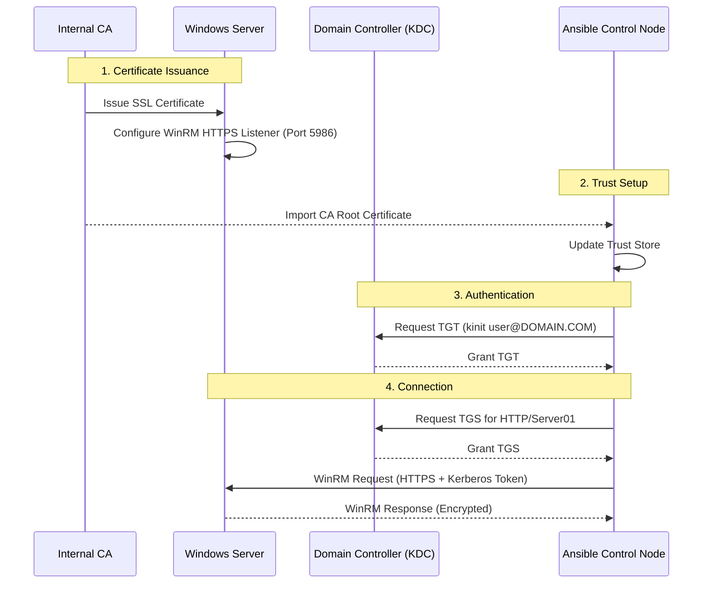

# Ansible Playbooks for Windows Management

This directory contains Ansible playbooks and roles for managing Windows servers.

## Directory Structure

```bash
ansible/
├── ansible.cfg
├── windows_service_account_rights.yml
├── inventory/
│   ├── development/
│   │   ├── hosts.ini
│   │   ├── group_vars/
│   │   │   └── all.yml
│   │   └── host_vars/
│   ├── test/
│   │   ├── hosts.ini
│   │   ├── group_vars/
│   │   │   └── all.yml
│   │   └── host_vars/
│   ├── staging/
│   │   ├── hosts.ini
│   │   ├── group_vars/
│   │   │   └── all.yml
│   │   └── host_vars/
│   ├── production/
│   │   ├── hosts.ini
│   │   ├── group_vars/
│   │   │   └── all.yml
│   │   └── host_vars/
│   └── README.md
└── roles/
    └── windows_service_account_rights/
        ├── tasks/
        │   └── main.yml
        ├── defaults/
        │   └── main.yml
        ├── meta/
        │   └── main.yml
        └── README.md
```

## Prerequisites

### 1. Install Ansible and Required Collections

```bash
# Install Ansible and pywinrm
pip install ansible pywinrm

# Install Windows collection
ansible-galaxy collection install ansible.windows
```

### 2. Configure Windows Hosts

Ensure your Windows hosts have WinRM configured. You can use the `Enable-GDSWindowsRemoting` function from the `GDS.WindowsOS` module, or the `ConfigureRemotingForAnsible.ps1` script from the Ansible documentation:

```powershell
# Option 1: Using GDS.WindowsOS module (Recommended)
Import-Module GDS.WindowsOS

# A. Use an existing certificate (Recommended for Production)
# 1. Get the thumbprint of your CA-issued certificate
$thumbprint = (Get-ChildItem Cert:\LocalMachine\My | Where-Object { $_.Subject -like "*$env:COMPUTERNAME*" }).Thumbprint

# 2. Enable Remoting using that certificate (Secure Defaults: HTTPS only, No Basic Auth)
Enable-GDSWindowsRemoting -CertificateThumbprint $thumbprint

# B. Generate a self-signed certificate (Dev/Test only)
Enable-GDSWindowsRemoting -ForceNewSSLCert

# C. Enable Legacy/Insecure Features (If absolutely necessary)
# -EnableBasicAuth: Enables Basic Authentication (Clear text if not HTTPS)
# -EnableLocalAccountTokenFilter: Enables remote access for Local Admin accounts
Enable-GDSWindowsRemoting -ForceNewSSLCert -EnableBasicAuth -EnableLocalAccountTokenFilter
```

### 3. Security Best Practices

The `Enable-GDSWindowsRemoting` function is designed with **Secure Defaults**:

1. **HTTPS Enforced**: The function only configures WinRM over HTTPS (Port 5986). It does **not** open the HTTP port (5985).
2. **Basic Auth Disabled**: Basic Authentication is disabled by default to prevent credential theft. Use Kerberos (Domain) or Certificate authentication.
3. **Local Admin Restricted**: Remote access for local administrator accounts (via `LocalAccountTokenFilterPolicy`) is disabled by default. This reduces the attack surface for Pass-the-Hash attacks.

### 4. Understanding Certificate Thumbprints

A **Certificate Thumbprint** is a unique hexadecimal string that identifies a specific certificate. `Enable-GDSWindowsRemoting` requires this to bind the correct SSL certificate to the WinRM listener.

**How to find a thumbprint:**

1. Open PowerShell as Administrator.
2. Run the following command to list certificates in the Local Computer Personal store:

    ```powershell
    Get-ChildItem Cert:\LocalMachine\My
    ```

3. Copy the `Thumbprint` property of the desired certificate (e.g., `A1B2C3D4...`).

> **Note:** For production environments, it is best practice to use a certificate issued by a trusted Internal Certificate Authority (CA) rather than a self-signed certificate.

### 5. Managing WinRM Configuration with Ansible

Once you have initial connectivity, you can use Ansible to maintain the WinRM configuration using the `GDS.WindowsOS` module.

**Example Playbook:**

```yaml
---
- name: Configure WinRM
  hosts: windows
  tasks:
    - name: Ensure GDS.WindowsOS module is present
      ansible.windows.win_copy:
        src: ../PowerShell/Modules/GDS.WindowsOS
        dest: C:\Program Files\WindowsPowerShell\Modules\
        remote_src: no

    - name: Enable Windows Remoting with SSL
      ansible.windows.win_shell: |
        Import-Module GDS.WindowsOS -Force
        Enable-GDSWindowsRemoting -ForceNewSSLCert -SkipNetworkProfileCheck
      register: winrm_config
      changed_when: "'PS Remoting has been successfully configured' in winrm_config.verbose_stream"
```

### 6. Configure Kerberos Authentication (Recommended)

To securely connect to Windows hosts using WinRM over HTTPS with a domain account, you must configure Kerberos on your Ansible control node.

#### Workflow Diagram



#### Configuration Steps

1. **Install Kerberos Packages**:

    ```bash
    sudo apt-get install python3-dev libkrb5-dev krb5-user
    pip install pywinrm[kerberos]
    ```

2. **Configure Kerberos (`/etc/krb5.conf`)**:
    Ensure your domain is defined in `[realms]` and `[domain_realm]`.

3. **Trust the Internal CA**:
    * Export your Internal CA's Root Certificate (Base64 X.509).
    * Copy it to the Ansible control node: `/usr/local/share/ca-certificates/internal-ca.crt`
    * Update the trust store: `sudo update-ca-certificates`

4. **Obtain a Ticket**:

    ```bash
    kinit user@DOMAIN.COM
    ```

5. **Ansible Inventory Variables**:
    Configure your `group_vars/windows.yml` (or `all.yml`) with the following settings:

    ```yaml
    ansible_connection: winrm
    ansible_port: 5986
    ansible_winrm_scheme: https
    ansible_winrm_transport: kerberos
    ansible_winrm_server_cert_validation: validate
    ```

## Quick Start

### 1. Update Inventory

The inventory is organized by environment directory. Each environment is completely isolated:

* `inventory/development/` - Development
* `inventory/test/` - Test
* `inventory/staging/` - Staging
* `inventory/production/` - Production

Edit the appropriate environment's `hosts.ini` file:

```ini
# inventory/production/hosts.ini
[windows]
sql-prd-01 ansible_host=192.168.1.100
sql-prd-02 ansible_host=192.168.1.101

[linux]
app-prd-01 ansible_host=192.168.1.110

[production:children]
windows
linux
```

Connection settings are in each environment's `group_vars/all.yml`.

### 2. Run the Playbook

```bash
# Test connectivity (Windows hosts)
ansible -i inventory/production windows -m win_ping

# Run against production Windows hosts
ansible-playbook windows_service_account_rights.yml -i inventory/production -e "target_hosts=windows"

# Run against staging Windows hosts
ansible-playbook windows_service_account_rights.yml -i inventory/staging -e "target_hosts=windows"

# Run against development Windows hosts
ansible-playbook windows_service_account_rights.yml -i inventory/development -e "target_hosts=windows"

# Run against test Windows hosts
ansible-playbook windows_service_account_rights.yml -i inventory/test -e "target_hosts=windows"
```

### 3. Verify Results

On the Windows server, check the Local Security Policy:

1. Open `secpol.msc`
2. Navigate to Local Policies → User Rights Assignment
3. Verify the service account appears in:
   * Log on as a service
   * Perform volume maintenance tasks
   * Lock pages in memory

## Available Roles

### windows_service_account_rights

Retrieves the service account for a Windows service and grants it specific user rights assignments.

**Key Features:**

* Auto-detects service account from service configuration
* Grants Log on as a service, Perform volume maintenance tasks, and Lock pages in memory rights
* Configurable for any Windows service
* Includes validation and error handling

See [roles/windows_service_account_rights/README.md](roles/windows_service_account_rights/README.md) for detailed documentation.

## Common Use Cases

### SQL Server Default Instance (Production)

```bash
ansible-playbook windows_service_account_rights.yml -i inventory/production -e "target_hosts=windows"
```

### SQL Server Named Instance (Staging)

```bash
ansible-playbook windows_service_account_rights.yml -i inventory/staging -e "target_hosts=windows" -e "service_name=MSSQL\$INSTANCENAME"
```

### Remove User Rights (Production)

```bash
ansible-playbook windows_service_account_rights.yml -i inventory/production -e "target_hosts=windows" -e "user_rights_action=remove"
```

### Grant Specific Rights Only (Development)

```bash
ansible-playbook windows_service_account_rights.yml -i inventory/development -e "target_hosts=windows" -e '{"user_rights_to_grant": ["SeManageVolumePrivilege", "SeLockMemoryPrivilege"]}'
```

## Troubleshooting

### Connection Issues

```bash
# Test WinRM connectivity
ansible windows -m win_ping -vvv

# Check Kerberos ticket
klist
```

### Permission Issues

Ensure your Ansible user has administrative privileges on the target Windows hosts.

### Service Not Found

Verify the service name:

```bash
# List all services on Windows host
ansible windows -m ansible.windows.win_service_info
```

## Security Considerations

* Use Kerberos authentication for domain environments
* Store passwords in Ansible Vault, not plain text
* Use HTTPS (port 5986) for WinRM connections
* Enable certificate validation in production environments
* Follow the principle of least privilege for service accounts

## Additional Resources

* [Ansible Windows Documentation](https://docs.ansible.com/ansible/latest/os_guide/windows.html)
* [SQL Server User Rights Requirements](https://learn.microsoft.com/en-us/sql/database-engine/configure-windows/configure-windows-service-accounts-and-permissions)
* [Windows User Rights Assignment](https://learn.microsoft.com/en-us/windows/security/threat-protection/security-policy-settings/user-rights-assignment)
* [Ansible Lint](https://ansible.readthedocs.io/projects/lint/)
