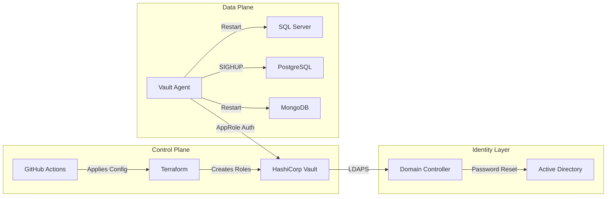
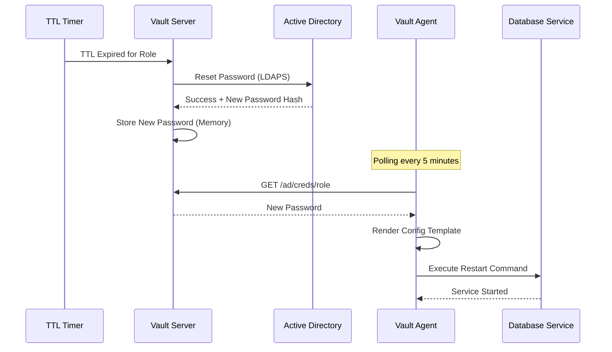
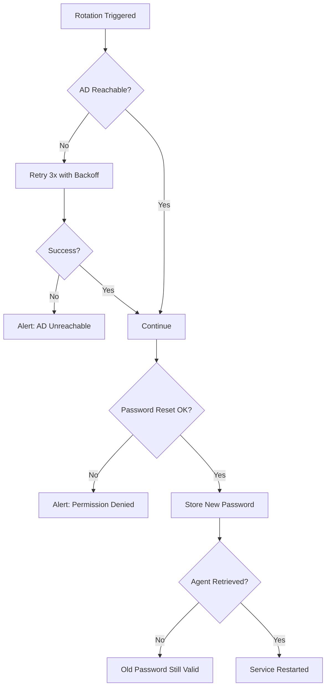

# Detailed Design: AD Password Rotation

## 1. Overview

This document provides the detailed technical design for the AD Password Rotation system, including data flows, configuration schemas, error handling, and rollback procedures.

## 2. System Components

### 2.1 Component Diagram



## 3. Data Flows

### 3.1 Password Rotation Flow



### 3.2 Error Handling Flow



## 4. Configuration Schemas

### 4.1 Vault AD Engine Configuration

```hcl
# vault_ad_config.hcl
resource "vault_ad_secret_backend" "ad" {
  backend       = "ad"
  binddn        = "CN=svc_vault,OU=ServiceAccounts,DC=example,DC=com"
  bindpass      = var.vault_bind_password  # From Vault or env
  url           = "ldaps://dc01.example.com"
  insecure_tls  = false
  certificate   = file("${path.module}/certs/ad-ca.pem")

  # Password Policy
  length        = 64
  formatter     = "{{.RandomPassword}}"
}
```

### 4.2 Vault Role Configuration

```hcl
# vault_ad_role.hcl
resource "vault_ad_secret_role" "mssql_svc" {
  backend              = vault_ad_secret_backend.ad.backend
  role                 = "mssql-prod-svc"
  service_account_name = "svc_mssql_prod"
  ttl                  = 86400  # 24 hours
}
```

### 4.3 Vault Agent Configuration

```hcl
# vault-agent.hcl (on DB Server)
auto_auth {
  method "approle" {
    mount_path = "auth/approle"
    config = {
      role_id_file_path   = "/etc/vault.d/role_id"
      secret_id_file_path = "/etc/vault.d/secret_id"
    }
  }

  sink "file" {
    config = {
      path = "/etc/vault.d/token"
    }
  }
}

template {
  source      = "/etc/vault.d/templates/db_creds.tpl"
  destination = "/etc/mssql/creds.json"
  command     = "/opt/scripts/rotate-mssql.sh"
}
```

### 4.4 Credential Template

```hcl
# db_creds.tpl
{{ with secret "ad/creds/mssql-prod-svc" }}
{
  "username": "{{ .Data.username }}",
  "password": "{{ .Data.current_password }}",
  "last_rotated": "{{ .Data.last_vault_rotation }}"
}
{{ end }}
```

## 5. Error Handling Matrix

| Error | Detection | Response | Alert |
|-------|-----------|----------|-------|
| AD Unreachable | LDAP timeout | Retry 3x, 30s backoff | PagerDuty after 3 failures |
| Permission Denied | LDAP error 50 | Log, do not retry | Email to AD Team |
| Service Restart Failed | Exit code != 0 | Rollback to old password | PagerDuty immediately |
| Agent Token Expired | 403 Forbidden | Re-authenticate via AppRole | Log only |
| Vault Sealed | 503 Error | Wait for unseal | PagerDuty immediately |

## 6. Rollback Procedures

### 6.1 Automatic Rollback (Agent Failure)

If the service restart fails, the Vault Agent **does not** automatically rollback (AD password is already changed). Manual intervention is required:

1. Retrieve current password: `vault read ad/creds/mssql-prod-svc`
2. Manually update service: `sc.exe config MSSQLSERVER password= <new_password>`
3. Start service: `Start-Service MSSQLSERVER`

### 6.2 Emergency Rollback (Vault Unavailable)

If Vault is completely unavailable:

1. **Break Glass**: Retrieve password from last-known backup (if enabled in Vault Enterprise).
2. **AD Reset**: Manually reset password in AD (via ADUC or PowerShell).
3. **Update Service**: Manually configure service with new password.

> [!CAUTION]
> Manual AD password changes bypass Vault. After Vault is restored, the role must be re-synced or the account removed from Vault management.

## 7. Security Considerations

### 7.1 Secrets in Transit

| Path | Encryption | Notes |
|------|------------|-------|
| Vault ↔ AD | TLS 1.2+ (LDAPS) | Certificate pinning recommended |
| Agent ↔ Vault | TLS 1.2+ (HTTPS) | mTLS optional |
| Agent → File | N/A | File permissions: 0600 |

### 7.2 Secrets at Rest

| Location | Protection | Notes |
|----------|------------|-------|
| Vault Storage | AES-256-GCM | Encrypted with Transit key |
| Agent Token File | File permissions 0600 | Not encrypted |
| Rendered Creds File | File permissions 0600 | **Deleted after use** recommended |
