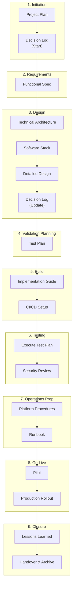
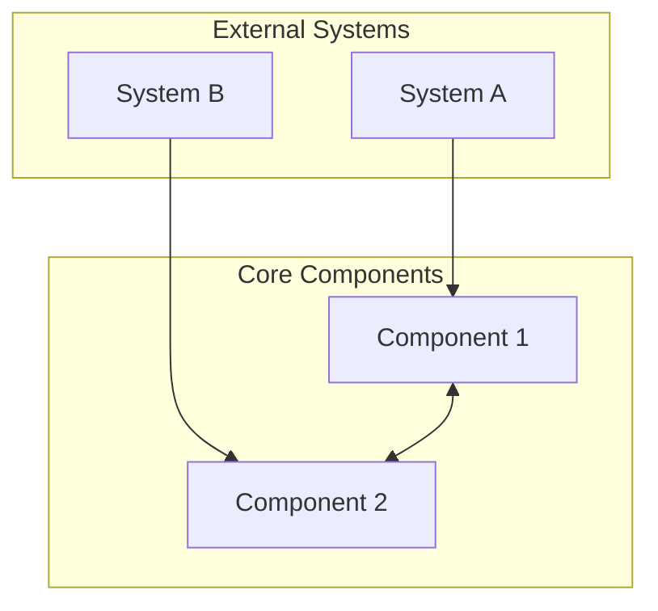
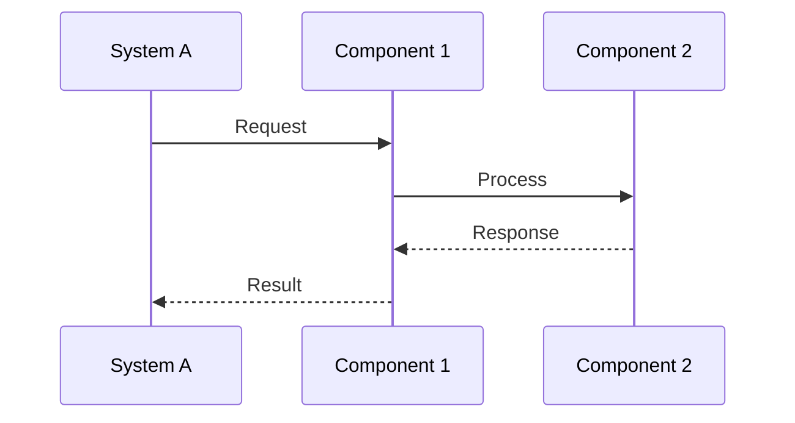

# Best Practice: Technical Project Management Template

This document provides a comprehensive framework for starting and completing technical projects. It defines documentation standards, project phases, approval workflows, and templates to ensure consistent, high-quality project delivery.

---

## Quick Start Guide

### Starting a New Project

1. **Create project directory**: `docs/projects/<project-name>/`
2. **Copy directory structure** from the [template](#directory-structure-template)
3. **Begin with Project Plan** - define scope, timeline, and resources
4. **Start Decision Log** on Day 1 - record all architectural decisions
5. **Follow the phase sequence** - documents build upon each other

### Finishing a Project

1. **Complete all Exit Criteria** in Test Plan
2. **Obtain formal sign-offs** per the Approval Matrix
3. **Finalize operations documentation** (Runbook, Procedures)
4. **Conduct handover meeting** with Operations team
5. **Update project status** to Approved/Completed

---

## Documentation Framework

Documents should be created in the recommended order. Each phase builds upon the previous:

| # | Phase | Document | Purpose | Template |
|---|-------|----------|---------|----------|
| 1 | **Initiation** | Project Plan | Timeline, effort, resources, risks | [Template](#project-plan-template) |
| 2 | **Initiation** | Decision Log | ADRs - start at Day 1, update throughout | [Template](#decision-log-template) |
| 3 | **Requirements** | Functional Spec | User stories, acceptance criteria, NFRs | [Template](#functional-specification-template) |
| 4 | **Design** | Technical Architecture | High-level design, component interactions | [Template](#technical-architecture-template) |
| 5 | **Design** | Software Stack | Technology choices, CI/CD approach | [Template](#software-stack-template) |
| 6 | **Design** | Detailed Design | Data flows, error handling, schemas | [Template](#detailed-design-template) |
| 7 | **Validation** | Test Plan | Test cases - write BEFORE implementation | [Template](#test-plan-template) |
| 8 | **Build** | Implementation Guide | Step-by-step build instructions | [Template](#implementation-guide-template) |
| 9 | **Operations** | Platform Procedures | Platform-specific operational steps | [Template](#platform-procedures-template) |
| 10 | **Operations** | Runbook | Incident response, troubleshooting | [Template](#runbook-template) |
| 11 | **Closure** | Project Closure Report | Lessons learned, handover, archival | [Template](#project-closure-template) |

> [!TIP]
> **Key Insight:** Write the Test Plan *before* implementation to define acceptance criteria. This ensures the team knows what "done" looks like before coding begins.

---

## Project Lifecycle



> [!IMPORTANT]
> **Test Plan before Implementation:** Write the Test Plan during/after Design to define acceptance criteria *before* coding. This prevents "we'll figure out testing later" anti-patterns.

---

## Status Tracking

### Status Definitions

Use consistent status indicators across all project phases:

| Status | Icon | Definition | Next Action |
|--------|------|------------|-------------|
| **Not Started** | ⬜ | Work has not begun | Assign owner, schedule kickoff |
| **In Progress** | 🟡 | Actively being worked on | Continue work |
| **Drafted** | 📝 | Initial draft complete, pending review | Submit for review |
| **In Review** | 🔍 | Under formal review by stakeholders | Address feedback |
| **Approved** | ✅ | Formally reviewed and approved | Proceed to next phase |
| **Blocked** | 🚫 | Cannot proceed due to dependency | Resolve blocker |
| **On Hold** | ⏸️ | Paused, may resume later | Await decision |

> [!NOTE]
> **Formal Approval Required:** A phase is only considered **Approved** (✅) after formal review and sign-off by designated approvers. Draft completion does not equal approval.

### Approval Matrix

| Phase | Approver(s) | Approval Method |
|-------|-------------|-----------------|
| 1. Initiation | Project Sponsor | Meeting sign-off |
| 2. Requirements | Product Owner, Stakeholders | Document review + sign-off |
| 3. Design | Technical Lead, Security Team | Architecture review meeting |
| 4. Validation Planning | QA Lead, DBA Team | Test plan walkthrough |
| 5. Build | Technical Lead | Code review + PR approval |
| 6. Testing | QA Lead, Security Team | Test results sign-off |
| 7. Operations Prep | Operations Lead, DBA Team | Runbook walkthrough |
| 8. Go-Live | Project Sponsor, Change Advisory Board | Go/No-Go meeting |
| 9. Closure | Project Sponsor, Stakeholders | Closure meeting + sign-off |

### RACI Matrix Guidelines

Use RACI (Responsible, Accountable, Consulted, Informed) to clarify roles for each deliverable:

| Role | Definition | Guidelines |
|------|------------|------------|
| **R** - Responsible | Does the work to complete the task | Can have multiple Rs, but avoid overloading |
| **A** - Accountable | Ultimate decision-maker; signs off on work | **Exactly ONE per task** (golden rule) |
| **C** - Consulted | Provides input; two-way communication | Limit to avoid conflicting opinions |
| **I** - Informed | Kept updated; one-way communication | Include stakeholders who need visibility |

**Best Practices:**
- Each task must have exactly **one Accountable** party
- Avoid assigning too many Responsible roles to prevent confusion
- Review RACI assignments during weekly check-ins
- Keep the matrix accessible so team members can reference it
- Update when roles or scope change

**Example RACI for Documentation:**

| Document | Dev Lead | Tech Writer | Security | Product Owner |
|----------|----------|-------------|----------|---------------|
| Functional Spec | C | R | C | A |
| Technical Architecture | A | I | C | I |
| Test Plan | R | I | C | A |
| Runbook | R | R | C | A |

> [!TIP]
> See the [RACI Matrix template](../templates/raci-matrix.md) for a full project RACI example.

---

## Jira Integration

Use Jira to track and manage project work alongside this documentation framework. The documents provide the *what* and *why*; Jira tracks the *who*, *when*, and *status*.

### Project Setup in Jira

1. **Create a Jira Project** using the "Scrum" or "Kanban" template
2. **Set project key** to match project folder name (e.g., `ADPWD` for ad-password-rotation)
3. **Configure components** to match project phases:

| Component | Description | Maps To |
|-----------|-------------|---------|
| `initiation` | Project planning and setup | Phase 1 |
| `requirements` | Functional specifications | Phase 2 |
| `design` | Architecture and detailed design | Phase 3 |
| `validation` | Test planning | Phase 4 |
| `build` | Implementation work | Phase 5 |
| `testing` | Test execution | Phase 6 |
| `operations` | Runbooks and procedures | Phase 7 |
| `go-live` | Deployment and rollout | Phase 8 |

### Issue Types

Use these issue types to organize work:

| Issue Type | Purpose | Example |
|------------|---------|---------|
| **Epic** | Major project phase or deliverable | "Phase 3: Design" |
| **Story** | User-facing requirement from Functional Spec | US-001: Automated Password Rotation |
| **Task** | Technical work item | "Configure Vault AD Secrets Engine" |
| **Sub-task** | Breakdown of a Task | "Write Terraform for AD config" |
| **Bug** | Defect found during testing | "Agent fails to restart service on Windows" |

### Epic Structure

Create one Epic per project phase:

```
ADPWD-1: [Epic] Phase 1 - Initiation
├── ADPWD-10: [Task] Draft Project Plan
├── ADPWD-11: [Task] Create Decision Log
└── ADPWD-12: [Task] Stakeholder kickoff meeting

ADPWD-2: [Epic] Phase 2 - Requirements
├── ADPWD-20: [Story] US-001: Automated Password Rotation
├── ADPWD-21: [Story] US-002: Zero-Downtime Rotation
└── ADPWD-22: [Task] Document NFRs

ADPWD-3: [Epic] Phase 3 - Design
├── ADPWD-30: [Task] Draft Technical Architecture
├── ADPWD-31: [Task] Define Software Stack
├── ADPWD-32: [Task] Create Detailed Design
└── ADPWD-33: [Task] ADR-001: Vault vs Azure Key Vault
```

### Linking Documentation to Jira

#### In Jira Issues

Add links to documentation in issue descriptions:

```markdown
## Documentation
- [Functional Spec](https://github.com/org/repo/docs/projects/ad-password-rotation/specs/functional-spec.md)
- [Technical Architecture](https://github.com/org/repo/docs/projects/ad-password-rotation/architecture/technical-architecture.md)

## Acceptance Criteria
See US-001 in [Functional Spec](link) for full criteria.
```

#### In Documentation

Reference Jira issues in project documents:

```markdown
## Related Jira Issues
- [ADPWD-30](https://jira.example.com/browse/ADPWD-30) - Technical Architecture design task
- [ADPWD-50](https://jira.example.com/browse/ADPWD-50) - Implementation Epic
```

### Workflow Mapping

Map Jira workflow statuses to document statuses:

| Jira Status | Document Status | Meaning |
|-------------|-----------------|---------|
| `To Do` | ⬜ Not Started | Work not begun |
| `In Progress` | 🟡 In Progress | Actively working |
| `In Review` | 🔍 In Review | PR or document review |
| `Done` | 📝 Drafted | Initial work complete |
| `Approved` | ✅ Approved | Formal sign-off received |
| `Blocked` | 🚫 Blocked | Waiting on dependency |

### Sprint Planning

#### Sprint Goals by Phase

| Phase | Sprint Focus | Key Deliverables |
|-------|--------------|------------------|
| Discovery (Sprint 1) | Requirements gathering | Project Plan, Functional Spec drafted |
| Design (Sprint 2) | Architecture decisions | Technical Architecture, ADRs, Test Plan |
| Build (Sprint 3-4) | Implementation | Working code, Implementation Guide |
| Test (Sprint 5) | Validation | Test execution, Defect resolution |
| Deploy (Sprint 6) | Go-Live | Pilot, Production rollout |

#### Story Points for Documentation

| Document Type | Suggested Points | Rationale |
|---------------|------------------|-----------|
| Project Plan | 3 | Moderate effort, stakeholder input needed |
| Functional Spec | 5 | Requires gathering requirements |
| Technical Architecture | 5 | Design decisions, diagrams |
| Decision Log (per ADR) | 1-2 | Per decision record |
| Test Plan | 3 | List test cases, define criteria |
| Implementation Guide | 8 | Detailed step-by-step |
| Runbook | 3 | Operational procedures |

### Labels and Filters

#### Recommended Labels

| Label | Purpose |
|-------|---------|
| `documentation` | Issue involves doc updates |
| `adr` | Architecture Decision Record |
| `security-review` | Requires security team review |
| `pilot` | Part of pilot phase |
| `production` | Production rollout work |
| `blocked-external` | Blocked on external team |

#### Useful JQL Filters

```sql
-- All documentation tasks
project = ADPWD AND labels = documentation

-- Open items blocking go-live
project = ADPWD AND component = go-live AND status != Done

-- ADRs pending decision
project = ADPWD AND labels = adr AND status = "In Review"

-- This sprint's work
project = ADPWD AND sprint in openSprints()

-- Items by phase
project = ADPWD AND component = design AND status != Done
```

### Jira-Documentation Sync Checklist

Keep Jira and documentation in sync:

- [ ] **Epic created** for each project phase
- [ ] **Stories created** from Functional Spec user stories
- [ ] **Tasks created** for each document to draft
- [ ] **Links added** from Jira issues to GitHub docs
- [ ] **Status updated** in both README and Jira when phase completes
- [ ] **Sprint reviews** reference documentation deliverables

> [!TIP]
> **Single Source of Truth:** Use Jira for *task tracking* and *assignments*. Use documentation for *requirements*, *designs*, and *procedures*. Don't duplicate content — link between them.

---

## Best Practices Checklist

Use this checklist to ensure project quality:

### ✅ Requirements & Planning

- [ ] **Clear scope definition** - In/Out of scope documented in specs and project plan
- [ ] **User stories with acceptance criteria** - Functional spec includes testable criteria
- [ ] **Non-functional requirements** - Performance, security, availability targets defined
- [ ] **Risk assessment** - Risks identified with mitigations in project plan
- [ ] **Effort estimation** - Hours by role documented
- [ ] **Phased delivery** - Discovery → Infrastructure → Pilot → Production rollout

### ✅ Architecture & Design

- [ ] **High-level architecture diagram** - Mermaid diagrams showing component interactions
- [ ] **Technology stack documentation** - Tools, versions, and rationale documented
- [ ] **Detailed data flows** - Sequence diagrams for key workflows
- [ ] **Configuration schemas** - Examples for all components
- [ ] **Error handling matrix** - Errors, detection, response, and alerting defined
- [ ] **Security controls** - Least privilege, encryption, audit logging documented

### ✅ Implementation & Operations

- [ ] **Step-by-step implementation guide** - Phased instructions with code examples
- [ ] **Rollback procedures** - Manual and emergency rollback documented
- [ ] **CI/CD workflows** - Automated build and deployment pipelines
- [ ] **Troubleshooting guide** - Common issues with causes and solutions

### ✅ Governance & Quality

- [ ] **Test Plan** - Formal test cases for validation
- [ ] **Runbook** - Day-2 operations and incident response
- [ ] **Decision Log** - Architecture Decision Records (ADRs)
- [ ] **Security Review** - Threat model and security sign-off

### ✅ Definition of Done (per Phase)

Use this checklist to verify phase completion before moving forward:

**For Documentation Phases (1-4, 7):**
- [ ] Document drafted and reviewed by peers
- [ ] All sections complete (no TBD placeholders)
- [ ] Stakeholder feedback incorporated
- [ ] Formal approval obtained per Approval Matrix
- [ ] Version history updated

**For Build Phase (5):**
- [ ] All acceptance criteria from user stories met
- [ ] Code reviewed and approved via PR
- [ ] Unit tests passing with adequate coverage
- [ ] No critical or high-severity defects open
- [ ] Implementation guide updated with actual steps

**For Testing Phase (6):**
- [ ] All test cases executed
- [ ] Exit criteria met (per Test Plan)
- [ ] Defects triaged and critical issues resolved
- [ ] Test summary report completed
- [ ] Security review sign-off obtained

**For Operations Phase (7):**
- [ ] Runbook reviewed by Operations team
- [ ] Procedures validated through dry-run
- [ ] Monitoring and alerting configured
- [ ] On-call team trained

**For Go-Live Phase (8):**
- [ ] CAB approval obtained
- [ ] Rollback plan tested
- [ ] Pilot completed successfully
- [ ] Production deployment verified
- [ ] Post-deployment monitoring active

**For Closure Phase (9):**
- [ ] Lessons learned documented
- [ ] Knowledge transfer completed
- [ ] Documentation archived
- [ ] Project formally closed with sign-off

---

## Directory Structure Template

Create this structure for new projects:

```
docs/projects/<project-name>/
├── README.md                    # Project overview & best practices adherence
├── architecture/
│   ├── technical-architecture.md    # High-level architecture diagram
│   └── software-stack.md            # Technology stack and CI/CD
├── design/
│   └── design.md                    # Detailed technical design
├── implementation/
│   └── implementation-guide.md      # Step-by-step implementation
├── management/
│   ├── project-plan.md              # Project plan and timeline
│   └── decision-log.md              # Architecture Decision Records
├── operations/
│   ├── procedures.md                # Operational procedures
│   └── runbook.md                   # Day-2 operations & incident response
├── specs/
│   └── functional-spec.md           # Functional requirements
└── testing/
    └── test-plan.md                 # Test cases & validation criteria
```

---

## Document Templates

### Project Plan Template {#project-plan-template}

```markdown
# Project Plan: [Project Name]

| Version | Date | Author | Changes |
|---------|------|--------|---------|
| 1.0 | YYYY-MM-DD | [Name] | Initial draft |

## 1. Executive Summary

[Brief description of the project and its business value]

## 2. Objectives

- **Primary:** [Main goal]
- **Secondary:** [Supporting goals]
- **Success Metrics:** [How will success be measured?]

## 3. Scope

### In Scope
- [Item 1]
- [Item 2]

### Out of Scope
- [Item 1]
- [Item 2]

## 4. Phases and Timeline

### Phase 1: Discovery & Design
**Effort:** [X Days]
- [ ] [Task 1]
- [ ] [Task 2]
**Deliverables:** [List]

### Phase 2: Infrastructure Configuration
**Effort:** [X Days]
- [ ] [Task 1]
- [ ] [Task 2]
**Deliverables:** [List]

### Phase 3: Pilot Implementation (Non-Prod)
**Effort:** [X Days]
- [ ] [Task 1]
- [ ] [Task 2]
**Deliverables:** [List]

### Phase 4: Production Rollout
**Effort:** [X-Y Days (depending on scale)]
- [ ] [Task 1]
- [ ] [Task 2]
**Deliverables:** [List]

### Phase 5: Handover & Closure
**Effort:** [X Days]
- [ ] [Task 1]
- [ ] [Task 2]
**Deliverables:** [List]

## 5. Effort Estimation

| Role | Phase | Est. Hours |
|------|-------|------------|
| [Role 1] | [Phase] | [Hours] |
| [Role 2] | [Phase] | [Hours] |
| **Total** | | **[Total] Hours** |

## 6. Risks and Mitigation

| Risk | Probability | Impact | Mitigation |
|------|-------------|--------|------------|
| [Risk 1] | Low/Medium/High | Low/Medium/High | [Mitigation strategy] |

## 7. Resources Required

- **[Resource Type]**: [Specific requirements]
```

---

### Additional Templates

- [Project Charter](../templates/project-charter.md)
- [RACI Matrix](../templates/raci-matrix.md)
- [Communications Plan](../templates/communications-plan.md)
- [RAID Log](../templates/raid-log.md)
- [Decision Log](../templates/decision-log.md)
- [Status Report](../templates/status-report.md)
- [Change Request](../templates/change-request.md)
- [Release Readiness Checklist](../templates/release-readiness-checklist.md)

### Decision Log Template {#decision-log-template}

```markdown
# Decision Log: [Project Name]

| Version | Date | Author | Changes |
|---------|------|--------|---------|
| 1.0 | YYYY-MM-DD | [Name] | Initial decision log |

This document records key architectural and design decisions using the Architecture Decision Record (ADR) format.

---

## ADR-001: [Decision Title]

**Date:** YYYY-MM-DD
**Status:** Proposed | Accepted | Deprecated | Superseded
**Deciders:** [Team/Individuals]

### Context

[What is the issue that we're seeing that is motivating this decision?]

### Decision

[What is the change that we're proposing and/or doing?]

### Alternatives Considered

| Option | Pros | Cons |
|--------|------|------|
| Option 1 | [Pros] | [Cons] |
| Option 2 | [Pros] | [Cons] |

### Rationale

[Why is this the best choice?]

### Consequences

- **Positive:** [What becomes easier?]
- **Negative:** [What becomes harder?]
- **Risks:** [What could go wrong?]

---

## Decision Template

Copy this template for new decisions:

## ADR-XXX: [Title]

**Date:** YYYY-MM-DD
**Status:** Proposed | Accepted | Deprecated | Superseded
**Deciders:** [Team/Individuals]

### Context
[What is the issue that we're seeing that is motivating this decision?]

### Decision
[What is the change that we're proposing and/or doing?]

### Rationale
[Why is this the best choice? What alternatives were considered?]

### Consequences
- **Positive:** [What becomes easier?]
- **Negative:** [What becomes harder?]
- **Risks:** [What could go wrong?]
```

---

### Functional Specification Template {#functional-specification-template}

```markdown
# Functional Specification: [Feature/Project Name]

| Version | Date | Author | Changes |
|---------|------|--------|---------|
| 1.0 | YYYY-MM-DD | [Name] | Initial draft |

## 1. Overview

[Brief description of what this feature/project does]

## 2. Scope

### 2.1 In Scope
- [Item 1]
- [Item 2]

### 2.2 Out of Scope
- [Item 1]
- [Item 2]

### 2.3 Requirement ID Conventions

Use consistent ID prefixes for traceability across documents:

| Prefix | Type | Example |
|--------|------|---------|
| US-XXX | User Story | US-001: Automated Password Rotation |
| NFR-XXX | Non-Functional Requirement | NFR-001: Response time < 200ms |
| SEC-XXX | Security Requirement | SEC-001: Encrypt data at rest |
| CON-XXX | Constraint | CON-001: Must use existing AD infrastructure |
| DEP-XXX | Dependency | DEP-001: Vault cluster availability |
| TC-XXX | Test Case | TC-001: Verify password rotation |

> [!TIP]
> Maintain a requirements traceability matrix linking US → Design → TC → Defects.

## 3. User Stories

### US-001: [Story Title]

> **As a** [role],
> **I want** [capability],
> **So that** [benefit].

**Acceptance Criteria:**
- [ ] [Criterion 1]
- [ ] [Criterion 2]
- [ ] [Criterion 3]

### US-002: [Story Title]

> **As a** [role],
> **I want** [capability],
> **So that** [benefit].

**Acceptance Criteria:**
- [ ] [Criterion 1]
- [ ] [Criterion 2]

## 4. Non-Functional Requirements

| ID | Requirement | Target |
|----|-------------|--------|
| NFR-001 | [Performance requirement] | [Specific target] |
| NFR-002 | [Availability requirement] | [Specific target] |
| NFR-003 | [Scalability requirement] | [Specific target] |

## 5. Security Requirements

| ID | Requirement |
|----|-------------|
| SEC-001 | [Security requirement 1] |
| SEC-002 | [Security requirement 2] |

## 6. Constraints

1. **[Constraint Type]**: [Description]
2. **[Constraint Type]**: [Description]

## 7. Dependencies

| Dependency | Owner | Status |
|------------|-------|--------|
| [Dependency 1] | [Team] | ⬜ Not Started / 🟡 In Progress / ✅ Available |
```

---

### Technical Architecture Template {#technical-architecture-template}

```markdown
# Technical Architecture: [Project Name]

| Version | Date | Author | Changes |
|---------|------|--------|---------|
| 1.0 | YYYY-MM-DD | [Name] | Initial architecture |

## 1. Overview

[High-level description of the system architecture]

## 2. Architecture Diagram



## 3. Component Descriptions

### Component 1

- **Purpose:** [What it does]
- **Technology:** [Stack/tools used]
- **Interfaces:** [APIs, protocols]

### Component 2

- **Purpose:** [What it does]
- **Technology:** [Stack/tools used]
- **Interfaces:** [APIs, protocols]

## 4. Data Flow



## 5. Security Architecture

- **Authentication:** [Method]
- **Authorization:** [Model]
- **Encryption:** [In transit/at rest]
- **Audit Logging:** [Approach]

## 6. High Availability

- **Redundancy:** [Approach]
- **Failover:** [Mechanism]
- **Recovery:** [RTO/RPO targets]

```

---

### Test Plan Template {#test-plan-template}

```markdown
# Test Plan: [Project Name]

| Version | Date | Author | Changes |
|---------|------|--------|---------|
| 1.0 | YYYY-MM-DD | [Name] | Initial test plan |

## 1. Overview

[Purpose of this test plan]

## 2. Test Objectives

- [Objective 1]
- [Objective 2]
- [Objective 3]

## 3. Test Environment

| Environment | Purpose | Configuration |
|-------------|---------|---------------|
| **Dev** | Unit testing | [Details] |
| **Non-Prod** | Integration testing | [Details] |
| **Prod** | Production validation | [Details] |

## 4. Test Cases

### 4.1 [Category Name] Tests

| ID | Test Case | Steps | Expected Result | Pass/Fail |
|----|-----------|-------|-----------------|-----------|
| TC-001 | [Test name] | [Steps] | [Expected result] | ⬜ |
| TC-002 | [Test name] | [Steps] | [Expected result] | ⬜ |

### 4.2 [Category Name] Tests

| ID | Test Case | Steps | Expected Result | Pass/Fail |
|----|-----------|-------|-----------------|-----------|
| TC-010 | [Test name] | [Steps] | [Expected result] | ⬜ |

## 5. Test Execution Schedule

| Phase | Tests | Environment | Duration | Owner |
|-------|-------|-------------|----------|-------|
| Unit | TC-001 to TC-00X | Dev | [X] hours | [Owner] |
| Integration | TC-010 to TC-0XX | Non-Prod | [X] hours | [Owner] |
| **Total** | [Count] test cases | | **[X] hours** | |

## 6. Entry/Exit Criteria

### Entry Criteria
- [ ] [Prerequisite 1]
- [ ] [Prerequisite 2]

### Exit Criteria
- [ ] All critical test cases pass
- [ ] No high-severity defects open
- [ ] [Additional criteria]

## 7. Suspension and Resumption Criteria

### Suspension Criteria
Testing will be suspended if:
- [ ] Critical defect blocks further testing
- [ ] Test environment becomes unavailable
- [ ] [Additional suspension criteria]

### Resumption Requirements
Testing may resume when:
- [ ] Blocking defect is resolved and verified
- [ ] Environment is restored and validated
- [ ] [Additional resumption criteria]

## 8. Test Deliverables

| Deliverable | Description | Owner |
|-------------|-------------|-------|
| Test Plan | This document | [Owner] |
| Test Cases | Detailed test case specifications | [Owner] |
| Test Data | Sample data for test execution | [Owner] |
| Test Results | Execution logs and evidence | [Owner] |
| Defect Reports | Documented issues found | [Owner] |
| Test Summary Report | Final summary and recommendations | [Owner] |

## 9. Test Risks and Contingencies

| Risk | Probability | Impact | Mitigation |
|------|-------------|--------|------------|
| [Test environment unavailable] | Medium | High | [Identify backup environment] |
| [Insufficient test data] | Low | Medium | [Prepare synthetic data in advance] |
| [Resource constraints] | Medium | Medium | [Cross-train team members] |

## 10. Defect Management

| Severity | Definition | Resolution SLA |
|----------|------------|----------------|
| **Critical** | [Definition] | [SLA] |
| **High** | [Definition] | [SLA] |
| **Medium** | [Definition] | [SLA] |
| **Low** | [Definition] | [SLA] |
```

---

### Runbook Template {#runbook-template}

```markdown
# Runbook: [System/Project Name]

| Version | Date | Author | Changes |
|---------|------|--------|---------|
| 1.0 | YYYY-MM-DD | [Name] | Initial runbook |

## 1. System Overview

[Brief description of the system]

## 2. Contacts

| Role | Name | Contact |
|------|------|---------|
| Primary On-Call | [Name] | [Email/Phone] |
| Backup On-Call | [Name] | [Email/Phone] |
| Escalation | [Name] | [Email/Phone] |

## 3. Common Procedures

### 3.1 [Procedure Name]

**When to use:** [Trigger condition]

**Steps:**
1. [Step 1]
2. [Step 2]
3. [Step 3]

**Verification:**
- [ ] [Verification step]

### 3.2 [Procedure Name]

**When to use:** [Trigger condition]

**Steps:**
1. [Step 1]
2. [Step 2]

## 4. Troubleshooting

### Issue: [Problem Description]

**Symptoms:**
- [Symptom 1]
- [Symptom 2]

**Possible Causes:**
1. [Cause 1]
2. [Cause 2]

**Resolution:**
1. [Resolution step 1]
2. [Resolution step 2]

## 5. Emergency Procedures

### 5.1 Emergency Rollback

**When to use:** [Critical failure condition]

> [!CAUTION]
> Only use this procedure if [condition]. This will [impact].

**Steps:**
1. [Step 1]
2. [Step 2]

## 6. Monitoring & Alerts

| Alert | Threshold | Action |
|-------|-----------|--------|
| [Alert name] | [Threshold] | [Action to take] |

## 7. Automation Integration

### Automated Procedures

| Procedure | Automation Tool | Trigger | Human Approval Required |
|-----------|-----------------|---------|-------------------------|
| [Service restart] | Ansible/AWX | Alert threshold | No |
| [Log collection] | Rundeck | On-demand | No |
| [Failover initiation] | AWX | Critical alert | **Yes** |
| [Resource scaling] | Terraform | Capacity alert | Yes |

### Automation Tools

- **Ansible/AWX:** Configuration management and remediation playbooks
- **Rundeck:** Self-service operations and scheduled jobs
- **Terraform:** Infrastructure provisioning and scaling
- **PowerShell DSC:** Windows configuration enforcement

### Human-in-the-Loop Gates

> [!CAUTION]
> The following actions **require human approval** before execution:

- [ ] Production database changes
- [ ] Failover to disaster recovery site
- [ ] Security incident response escalation
- [ ] Data deletion or purge operations
- [ ] Infrastructure decommissioning

### Runbook Maintenance

- **Review cadence:** Quarterly or after each incident
- **Test frequency:** Conduct drills at least once per quarter
- **Version control:** Store runbooks in Git; track all changes
- **Ownership:** Assign a primary owner responsible for updates
```

---

### Project Closure Template {#project-closure-template}

```markdown
# Project Closure Report: [Project Name]

| Version | Date | Author | Changes |
|---------|------|--------|---------|
| 1.0 | YYYY-MM-DD | [Name] | Initial closure report |

## 1. Executive Summary

[Brief summary of project outcomes, whether objectives were met, and key achievements]

## 2. Project Objectives Review

| Objective | Target | Actual | Status |
|-----------|--------|--------|--------|
| [Objective 1] | [Target metric] | [Actual result] | ✅ Met / ⚠️ Partial / ❌ Not Met |
| [Objective 2] | [Target metric] | [Actual result] | ✅ Met / ⚠️ Partial / ❌ Not Met |

## 3. Deliverables Checklist

| Deliverable | Status | Location/Reference |
|-------------|--------|-------------------|
| Functional Specification | ✅ Complete | [Link] |
| Technical Architecture | ✅ Complete | [Link] |
| Implementation Code | ✅ Complete | [Repository link] |
| Test Plan & Results | ✅ Complete | [Link] |
| Runbook | ✅ Complete | [Link] |
| User Documentation | ✅ Complete | [Link] |

## 4. Lessons Learned

### 4.1 What Went Well

- [Success 1: Description and why it worked]
- [Success 2: Description and why it worked]

### 4.2 What Could Be Improved

- [Challenge 1: Description and recommendation for future projects]
- [Challenge 2: Description and recommendation for future projects]

### 4.3 Recommendations for Future Projects

| Area | Recommendation | Priority |
|------|----------------|----------|
| [Process] | [Specific recommendation] | High/Medium/Low |
| [Technical] | [Specific recommendation] | High/Medium/Low |
| [Communication] | [Specific recommendation] | High/Medium/Low |

## 5. Knowledge Transfer

### 5.1 Training Completed

| Training Topic | Audience | Date | Materials |
|----------------|----------|------|-----------|
| [Topic 1] | [Team/Role] | [Date] | [Link to materials] |

### 5.2 Documentation Handover

| Document | Owner | Handover To | Date |
|----------|-------|-------------|------|
| Runbook | [Name] | Operations Team | [Date] |
| Code Repository | [Name] | Development Team | [Date] |

## 6. Outstanding Items

| Item | Owner | Target Date | Notes |
|------|-------|-------------|-------|
| [Item 1] | [Name] | [Date] | [Notes] |

> [!NOTE]
> If there are outstanding items, ensure they are tracked in Jira/GitHub Issues with clear ownership.

## 7. Resource Release

- [ ] Project team members released to other work
- [ ] Temporary infrastructure decommissioned
- [ ] Project budget closed
- [ ] Vendor contracts concluded or transitioned

## 8. Archival

- [ ] All project documentation archived to [location]
- [ ] Decision log finalized
- [ ] Project repository marked as maintained/archived
- [ ] Access permissions updated for long-term maintenance

## 9. Sign-Off

| Role | Name | Signature | Date |
|------|------|-----------|------|
| Project Sponsor | [Name] | | |
| Technical Lead | [Name] | | |
| Operations Lead | [Name] | | |
| Product Owner | [Name] | | |

---

**Project Closure Date:** YYYY-MM-DD

**Next Review Date (if applicable):** YYYY-MM-DD (for post-implementation review)
```

---

## Project README Template

Use this template for the project's main README:

```markdown
# [Project Name]

This directory contains all documentation for the [Project Name] project.

## Project Management Best Practices

This project follows industry-standard documentation practices to ensure successful delivery.

### Documentation Framework

| # | Phase | Document | Purpose | Status |
|---|-------|----------|---------|--------|
| 1 | Initiation | [Project Plan](management/project-plan.md) | Timeline, effort, resources | ⬜ |
| 2 | Initiation | [Decision Log](management/decision-log.md) | ADRs | ⬜ |
| 3 | Requirements | [Functional Spec](specs/functional-spec.md) | User stories, acceptance criteria | ⬜ |
| 4 | Design | [Technical Architecture](architecture/technical-architecture.md) | High-level design | ⬜ |
| 5 | Design | [Software Stack](architecture/software-stack.md) | Technology choices | ⬜ |
| 6 | Design | [Detailed Design](design/design.md) | Data flows, schemas | ⬜ |
| 7 | Validation | [Test Plan](testing/test-plan.md) | Test cases | ⬜ |
| 8 | Build | [Implementation Guide](implementation/implementation-guide.md) | Build instructions | ⬜ |
| 9 | Operations | [Procedures](operations/procedures.md) | Operational steps | ⬜ |
| 10 | Operations | [Runbook](operations/runbook.md) | Incident response | ⬜ |

### Current Status

| Phase | Status | Documents | Approver | Date |
|-------|--------|-----------|----------|------|
| 1. Initiation | ⬜ Not Started | - | - | - |
| 2. Requirements | ⬜ Not Started | - | - | - |
| 3. Design | ⬜ Not Started | - | - | - |
| 4. Validation | ⬜ Not Started | - | - | - |
| 5. Build | ⬜ Not Started | - | - | - |
| 6. Testing | ⬜ Not Started | - | - | - |
| 7. Operations | ⬜ Not Started | - | - | - |
| 8. Go-Live | ⬜ Not Started | - | - | - |

## Getting Started

1. **New to the project?** Start with the [Functional Specification](specs/functional-spec.md)
2. **Ready to implement?** Follow the [Implementation Guide](implementation/implementation-guide.md)
3. **Troubleshooting?** Check the [Runbook](operations/runbook.md)
```

---

## Reference Implementation

See [AD Password Rotation Project](../projects/ad-password-rotation/README.md) for a complete example of this framework in practice.

---

## Related Resources

- [Project Management Institute (PMI) Standards](https://www.pmi.org/)
- [Architecture Decision Records](https://adr.github.io/)
- [Markdown Guide](https://www.markdownguide.org/)

---

## Delivery Models

Choose a delivery model that matches team size, release cadence, and compliance needs. Use the guidance below to decide and tailor ceremonies and artifacts accordingly.

### Scrum (Iterations)

- **Best for:** Feature delivery with regular increments, cross-functional teams.
- **Cadence:** Fixed-length sprints (1–2 weeks), Sprint Planning/Review/Retro, Daily Standups.
- **Artifacts:** Product Backlog, Sprint Backlog, Definition of Done, Increment.
- **Pros:** Predictable cadence, clear goals, built-in inspection/adaptation.
- **Cons:** Timeboxing overhead; can feel heavy for ops/maintenance work.

### Kanban (Flow)

- **Best for:** Ops/maintenance, platform teams, continuous flow work.
- **Cadence:** Continuous; pull-based; WIP limits; service classes.
- **Artifacts:** Board, WIP policies, service-level expectations (SLEs).
- **Pros:** Low overhead, great for unplanned work and variability.
- **Cons:** Less emphasis on timeboxed planning/milestones unless added explicitly.

### Hybrid (ScrumBan / SDLC + Agile)

- **Best for:** Projects with formal gates (security, change advisory) but iterative build.
- **Cadence:** Sprints for build/test; stage gates for design, security, and go-live.
- **Artifacts:** ADRs, gated reviews (security/design), test plan before build, release checklist.
- **Pros:** Balances governance and agility; fits infra-heavy or regulated environments.
- **Cons:** More process to manage; requires clear accountability for gates.

### Selection Guidance

- **Greenfield feature work:** Prefer Scrum; add Kanban lane for interrupts.
- **Platform/ops and Ansible/Powershell automation:** Prefer Kanban; add monthly planning/milestones.
- **Regulated changes (DB, security, vault, AWX):** Prefer Hybrid with formal gates and change control.
- **Small team or solo:** Kanban with lightweight weekly goals; avoid ceremony overhead.

> Decision tip: Document the chosen model in the Project Plan and reference the cadence, ceremonies, and required artifacts. If Hybrid, list the required gates and approvers.

---

## Tooling Alignment

Standardize on a single source of truth for work tracking and documentation.

### Preferred Setup for This Repo

- **Work tracking:** GitHub Issues/Projects as default.
- **Documentation:** This repository under `docs/projects/<project>/`.
- **Version control & approvals:** Git + Pull Requests with required reviewers.
- **CI/CD & automation:** GitHub Actions (where applicable), Ansible/AWX for infra.

### Jira vs GitHub Comparison

| Area | Jira (Cloud/Data Center) | GitHub (Issues/Projects/PRs) |
|------|---------------------------|------------------------------|
| **Workflow** | Highly customizable workflows, states, transitions, validators | Simple states; automation via actions/bots; fewer workflow guards |
| **Hierarchy** | Projects → Epics → Stories/Tasks → Sub-tasks | Projects/Iterations → Issues (labels for Epics) → Checklist/sub-issues |
| **Planning** | Agile boards, advanced roadmaps (portfolio), story points | Projects v2 boards, iterations, custom fields; lightweight roadmaps |
| **Reporting** | Burndown/up, velocity, SLA, custom reports | Basic charts; custom via queries/Insights; PR-based metrics |
| **Governance** | Fine-grained approvals, change control plugins | Use PR reviews, CODEOWNERS, branch protection, change manifests |
| **Integrations** | Enterprise plugins (CMDB, ITSM, compliance) | Native dev-centric integrations; Actions/Apps for extensibility |
| **Best Fit** | Large programs, formal workflows, ITSM/enterprise governance | Developer-first teams, infra-as-code, code-centric collaboration |

### Recommendation

- Use **GitHub** by default for most dbtools projects to keep work tracking close to code, improve PR-driven governance, and simplify automation.
- Use **Jira** where organizational mandates require enterprise workflows, ITSM alignment, or portfolio rollups. If Jira is used, link issues to GitHub PRs and documents, and keep requirements/design content in GitHub docs to avoid duplication.

### Minimum Tooling Practices

- Maintain a single authoritative backlog (GitHub Issues or Jira).
- Link PRs to issues; require reviews via `CODEOWNERS` and branch protection.
- Track ADRs in `docs/projects/<project>/management/decision-log.md` and reference issue IDs.
- Keep statuses consistent: map tool states to the Status Definitions in this document.

---

## Security & Compliance

Embed security and compliance gates throughout the lifecycle.

### Controls and Reviews

- **Least privilege and secrets handling:** Use Vault; do not store secrets in code or config. Rotate regularly; audit usage.
- **Threat modeling:** Perform during design; record in `technical-architecture.md` under Security Architecture.
- **Secure build and deploy:** Use signed artifacts; restrict runner permissions; review Actions/AWX job scopes.
- **Change control:** For production-impacting changes, record change requests and approvals; link to PRs.
- **Audit logging:** Enable and document logs for access, changes, and deployments.

### Required Artifacts

- Security requirements in Functional Spec (SEC-XXX items).
- Security review sign-off recorded in Project Plan and Test Plan results.
- Release Readiness Checklist including backups, rollback plan, monitoring alerts.

### Gates in Hybrid Delivery

- Design Review (Tech + Security), Test Plan approval before build, Pre-Go-Live CAB approval, Post-deploy verification.

### Windows/PowerShell/Ansible Notes

- Use signed PowerShell scripts where feasible; document execution policies.
- Parameterize Ansible playbooks; store secrets in Vault; validate with `ansible-lint`.
- Document Windows service accounts rights and rotation processes in runbooks.

> Compliance tip: Keep an auditable trail by referencing issue IDs and PRs in ADRs, Test Plan results, and Runbooks.
