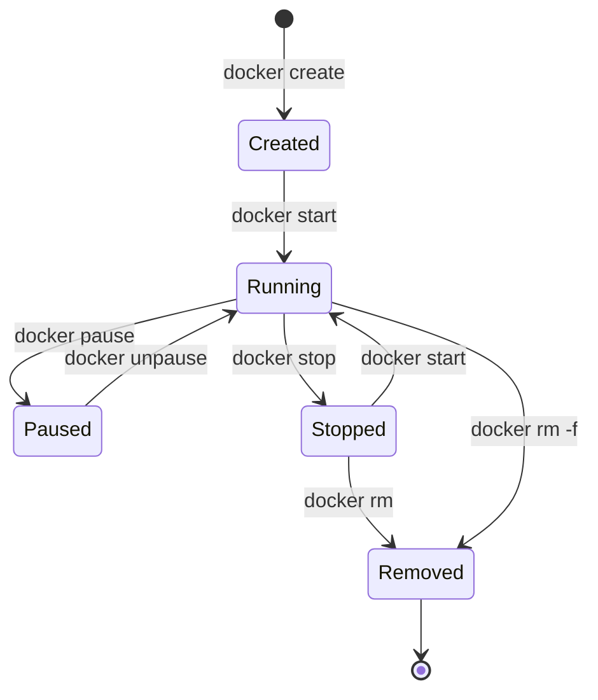
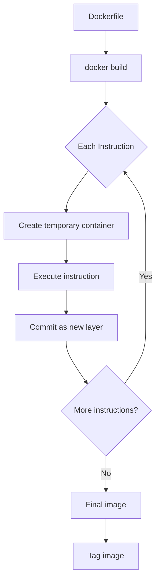
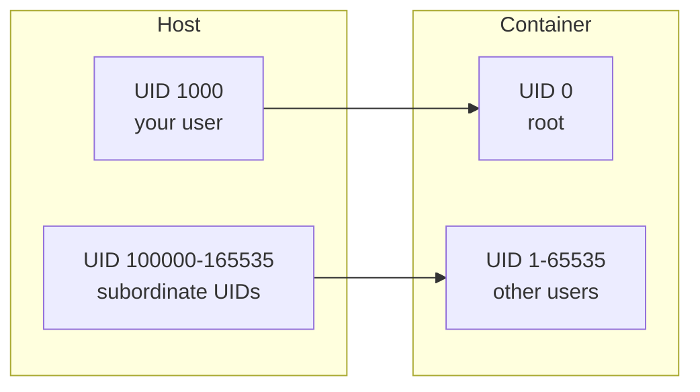
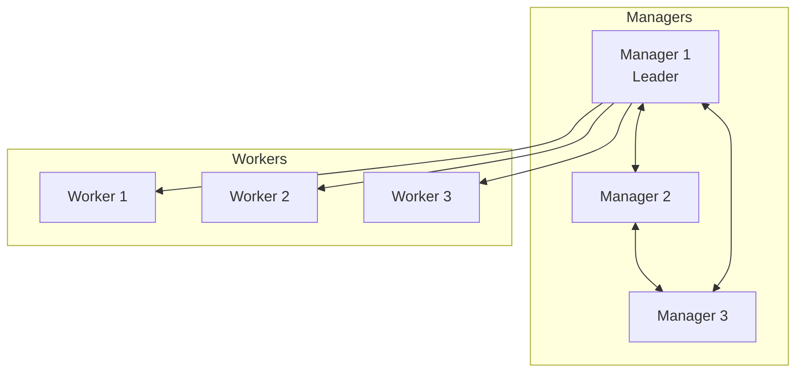
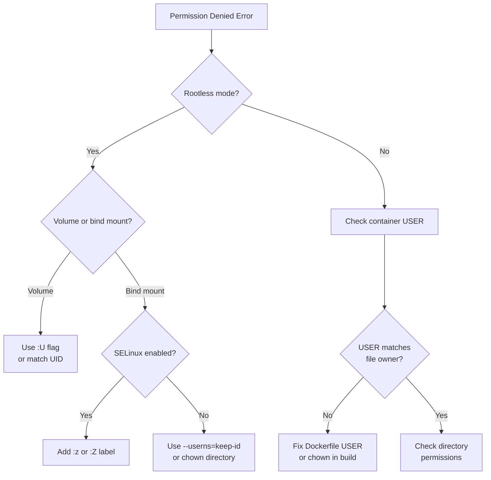

# Containers Course Design Document

> **Version:** 1.0
> **Status:** Draft
> **Last Updated:** January 2026

## Overview

A comprehensive, beginner-to-advanced course on container technology covering both Docker and Podman. Designed for learners with zero container knowledge, progressing through practical skills to certification readiness.

### Target Audience

- Complete beginners with no container experience
- Developers wanting to containerize applications
- System administrators managing container infrastructure
- DevOps engineers building CI/CD pipelines
- Professionals preparing for Docker Certified Associate (DCA) exam

### Learning Outcomes

By completing this course, learners will be able to:

1. Understand container fundamentals (namespaces, cgroups, OCI standards)
2. Build, manage, and distribute container images
3. Configure networking, storage, and volumes
4. Run containers in rootless mode with proper permissions
5. Orchestrate multi-container applications with Compose and Swarm
6. Implement security best practices aligned with NIST SP 800-190 and CIS Benchmarks
7. Pass the Docker Certified Associate (DCA) certification exam
8. Apply emerging practices (WebAssembly containers, supply chain security, AI workloads)

### What Makes This Course Best-in-Class

| Feature | Description |
|---------|-------------|
| **Dual Runtime Coverage** | Complete Docker AND Podman instruction - not just Docker with Podman mentions |
| **Zero Assumptions** | Starts from absolute zero - no prior container knowledge required |
| **DCA Aligned** | Maps directly to all 6 certification domains with practice questions |
| **Visual Learning** | Mermaid diagrams, flowcharts, and architecture visuals for every concept |
| **Hands-on Labs** | 9 comprehensive labs with validation scripts |
| **195 Quiz Questions** | Covering all topics in DCA exam format (MCQ + DOMC) |
| **Rootless Deep Dive** | Dedicated module for the #1 pain point: file permissions |
| **Security Standards** | NIST SP 800-190 and CIS Benchmark aligned content |
| **Emerging Topics** | WebAssembly, AI/LLM containers, supply chain security |
| **Multiple Learning Paths** | 2-week quick start to 8-week comprehensive options |
| **Curated Resources** | Links to best free courses, books, and practice tests |

---

## DCA Certification Alignment

### Exam Overview

| Aspect | Details |
|--------|---------|
| **Provider** | [Mirantis](https://training.mirantis.com/certification/dca-certification-exam/) |
| **Format** | 55 questions (13 MCQ + 42 DOMC) in 90 minutes |
| **Cost** | $195 USD |
| **Passing Score** | 55% |
| **Validity** | 2 years |
| **Registration** | [https://training.mirantis.com/certification/dca-certification-exam/](https://training.mirantis.com/certification/dca-certification-exam/) |

### Exam Domains Mapped to Course

| Domain | Weight | Course Modules |
|--------|--------|----------------|
| Orchestration | 25% | `part3-advanced/`, `kubernetes-essentials/` |
| Image Creation, Management, Registry | 20% | `part1-beginner/`, `part2-intermediate/` |
| Installation & Configuration | 15% | `part1-beginner/`, `operations/` |
| Networking | 15% | `networking/` |
| Security | 15% | `security/`, `rootless/` |
| Storage & Volumes | 10% | `storage/` |

---

## Course Structure

```
docs/courses/containers/
│
├── README.md                        # Course hub with learning paths
├── COURSE_DESIGN.md                 # This document
├── course_overview.md               # Objectives, prerequisites, time estimates
├── glossary.md                      # Container terminology (50+ terms)
├── quick_reference.md               # Commands cheat sheet (Docker + Podman)
│
├── concepts/                        # FOUNDATIONAL THEORY (tool-agnostic)
│   ├── 01-what-are-containers.md        # VMs vs containers, use cases, history
│   ├── 02-how-containers-work.md        # Namespaces, cgroups, union filesystems
│   ├── 03-oci-standards.md              # OCI image/runtime specs, interoperability
│   ├── 04-container-runtimes.md         # containerd, runc, CRI-O architecture
│   ├── 05-rootless-architecture.md      # User namespaces, UID mapping theory
│   ├── 06-file-permissions.md           # UIDs inside vs outside, ownership model
│   └── 07-docker-vs-podman.md           # Architecture comparison, when to use each
│
├── learning-paths/
│   │
│   ├── part1-beginner/              # BEGINNER (Weeks 1-2)
│   │   ├── 01-introduction.md           # Course overview, how to use
│   │   ├── 02-setup-docker.md           # Installing Docker (Linux/Mac/Windows)
│   │   ├── 03-setup-podman.md           # Installing Podman (Linux/Mac/Windows)
│   │   ├── 04-first-container.md        # Hello world, basic run commands
│   │   ├── 05-cli-essentials.md         # run, ps, logs, exec, stop, rm
│   │   ├── 06-working-with-images.md    # pull, images, inspect, rmi
│   │   ├── 07-dockerfile-basics.md      # FROM, RUN, COPY, CMD, EXPOSE
│   │   ├── 08-building-images.md        # build, tag, push basics
│   │   ├── 09-basic-volumes.md          # -v flag, named volumes intro
│   │   ├── exercises/
│   │   │   ├── ex01-first-container.md
│   │   │   ├── ex02-image-management.md
│   │   │   └── ex03-basic-dockerfile.md
│   │   └── quiz-part1.md                # 25 questions covering Part 1
│   │
│   ├── part2-intermediate/          # INTERMEDIATE (Weeks 3-4)
│   │   ├── 01-dockerfile-advanced.md        # Multi-stage, ARG, cache optimization
│   │   ├── 02-image-management.md           # Layers, history, prune, save/load
│   │   ├── 03-container-lifecycle.md        # Restart policies, health checks, limits
│   │   ├── 04-networking-basics.md          # Bridge, port mapping, container links
│   │   ├── 05-networking-advanced.md        # Custom networks, DNS, multi-host
│   │   ├── 06-volumes-deep-dive.md          # Named vs bind, drivers, backup/restore
│   │   ├── 07-bind-mounts.md                # Host directories, dev workflows
│   │   ├── 08-compose-introduction.md       # Multi-container apps, services
│   │   ├── 09-compose-advanced.md           # Profiles, overrides, env files
│   │   ├── 10-pods.md                       # Podman pods, shared namespaces
│   │   ├── exercises/
│   │   │   ├── ex01-multi-stage-build.md
│   │   │   ├── ex02-networking-lab.md
│   │   │   ├── ex03-compose-app.md
│   │   │   └── ex04-volume-management.md
│   │   └── quiz-part2.md                    # 30 questions covering Part 2
│   │
│   ├── part3-advanced/              # ADVANCED (Weeks 5-6)
│   │   ├── 01-rootless-setup.md             # Enabling rootless Docker/Podman
│   │   ├── 02-rootless-uid-mapping.md       # subuid/subgid, newuidmap, keep-id
│   │   ├── 03-rootless-volumes.md           # Permission issues, :U flag, unshare
│   │   ├── 04-rootless-networking.md        # slirp4netns, pasta, unprivileged ports
│   │   ├── 05-security-hardening.md         # Non-root USER, capabilities, read-only
│   │   ├── 06-swarm-introduction.md         # Cluster setup, managers, workers
│   │   ├── 07-swarm-services.md             # Services, replicas, rolling updates
│   │   ├── 08-swarm-stacks.md               # Stack files, YAML compose deployment
│   │   ├── 09-swarm-security.md             # MTLS, secrets, node certificates
│   │   ├── 10-registry-fundamentals.md      # Docker Hub, GHCR, private registries
│   │   ├── 11-enterprise-registry.md        # Artifactory, Harbor, MKE/MSR
│   │   ├── 12-cicd-pipelines.md             # Building in CI, caching, scanning
│   │   ├── 13-troubleshooting.md            # Logs, events, debugging techniques
│   │   ├── 14-ecosystem-tools.md            # Buildx, Buildah, Skopeo, cosign
│   │   ├── exercises/
│   │   │   ├── ex01-rootless-permissions.md
│   │   │   ├── ex02-swarm-cluster.md
│   │   │   ├── ex03-security-audit.md
│   │   │   └── ex04-cicd-pipeline.md
│   │   └── quiz-part3.md                    # 35 questions covering Part 3
│   │
│   ├── kubernetes-essentials/       # KUBERNETES FOR DCA (Week 7)
│   │   ├── 01-kubernetes-overview.md        # Architecture, components
│   │   ├── 02-pods-deployments.md           # Pod specs, deployment strategies
│   │   ├── 03-services.md                   # ClusterIP, NodePort, LoadBalancer
│   │   ├── 04-configmaps-secrets.md         # Configuration management
│   │   ├── 05-persistent-storage.md         # PV, PVC, storageClass, CSI
│   │   ├── 06-kubernetes-networking.md      # CNI model, network policies
│   │   ├── exercises/
│   │   │   ├── ex01-deploy-app.md
│   │   │   └── ex02-storage-config.md
│   │   └── quiz-kubernetes.md               # 20 questions
│   │
│   └── reference/                   # QUICK LOOKUP (non-sequential)
│       ├── command-comparison.md            # Docker ↔ Podman command table
│       ├── dockerfile-reference.md          # All Dockerfile instructions
│       ├── compose-reference.md             # Compose file syntax
│       └── configuration-reference.md       # daemon.json, containers.conf, storage.conf
│
├── storage/                         # STORAGE MODULE
│   ├── overview.md                      # Where images/containers/volumes are stored
│   ├── docker-storage-locations.md      # /var/lib/docker breakdown
│   ├── podman-storage-locations.md      # Rootful vs rootless locations
│   ├── storage-drivers.md               # overlay2, btrfs, zfs, devicemapper
│   ├── moving-docker-root.md            # Change Docker data-root directory
│   ├── moving-podman-storage.md         # Configure graphroot in storage.conf
│   ├── storage-on-mounted-drive.md      # External/network storage setup
│   ├── storage-in-home-directory.md     # Rootless home dir considerations
│   ├── disk-space-management.md         # Prune strategies, monitoring
│   ├── exercises/
│   │   ├── ex01-change-storage-location.md
│   │   └── ex02-cleanup-strategy.md
│   └── quiz-storage.md                  # 15 questions
│
├── networking/                      # NETWORKING MODULE
│   ├── overview.md                      # Container networking fundamentals
│   ├── network-drivers.md               # bridge, host, none, macvlan, ipvlan
│   ├── docker-networking.md             # docker0, docker network commands
│   ├── podman-networking.md             # CNI vs netavark, rootless differences
│   ├── port-mapping.md                  # -p flag, exposing services, binding IPs
│   ├── container-dns.md                 # Name resolution, embedded DNS
│   ├── overlay-networks.md              # Multi-host networking, Swarm overlay
│   ├── load-balancing.md                # HTTP/HTTPS load balancing concepts
│   ├── troubleshooting-network.md       # Connectivity debugging
│   ├── exercises/
│   │   ├── ex01-custom-bridge.md
│   │   ├── ex02-multi-container-network.md
│   │   └── ex03-troubleshoot-connectivity.md
│   └── quiz-networking.md               # 20 questions
│
├── rootless/                        # ROOTLESS MODULE
│   ├── overview.md                      # Why rootless matters, security benefits
│   ├── prerequisites.md                 # Kernel requirements, user config
│   ├── docker-rootless-install.md       # dockerd-rootless-setuptool.sh
│   ├── podman-rootless-config.md        # Default rootless, tuning options
│   ├── understanding-uid-mapping.md     # /etc/subuid, /etc/subgid explained
│   ├── volume-permissions.md            # The #1 pain point, solutions
│   ├── bind-mount-ownership.md          # Why host files have wrong owner
│   ├── fixing-permission-denied.md      # Troubleshooting decision tree
│   ├── rootless-networking.md           # Port restrictions, slirp4netns, pasta
│   ├── rootless-in-production.md        # When to use, limitations
│   ├── exercises/
│   │   ├── ex01-enable-rootless.md
│   │   ├── ex02-fix-permissions.md
│   │   └── ex03-rootless-compose.md
│   └── quiz-rootless.md                 # 15 questions
│
├── security/                        # SECURITY MODULE
│   ├── overview.md                      # Container security model
│   ├── default-engine-security.md       # Docker/Podman default protections
│   ├── namespaces-cgroups.md            # Isolation mechanisms explained
│   ├── docker-content-trust.md          # Image signing and verification
│   ├── image-signing.md                 # cosign, Notary, DCT workflow
│   ├── security-scanning.md             # Trivy, Snyk, Clair, Grype
│   ├── swarm-mtls.md                    # Mutual TLS in Swarm clusters
│   ├── secrets-management.md            # Docker secrets, external vaults
│   ├── certificate-authentication.md    # Client-server TLS setup
│   ├── rbac-concepts.md                 # Role-based access (MKE/enterprise)
│   ├── exercises/
│   │   ├── ex01-enable-content-trust.md
│   │   ├── ex02-scan-images.md
│   │   └── ex03-secrets-in-swarm.md
│   └── quiz-security.md                 # 20 questions
│
├── operations/                      # OPERATIONS MODULE
│   ├── logging-drivers.md               # splunk, journald, syslog, json-file
│   ├── backup-restore.md                # Volumes, images, Swarm state
│   ├── high-availability.md             # Multi-manager Swarm, quorum
│   ├── sizing-requirements.md           # Resource planning guidelines
│   ├── daemon-configuration.md          # daemon.json options
│   ├── troubleshooting-installation.md  # Common install issues
│   ├── exercises/
│   │   ├── ex01-configure-logging.md
│   │   └── ex02-backup-restore.md
│   └── quiz-operations.md               # 15 questions
│
├── comparison/                      # DOCKER VS PODMAN
│   ├── architecture.md                  # Daemon vs daemonless
│   ├── default-behaviors.md             # Out-of-box differences
│   ├── configuration-files.md           # daemon.json vs containers.conf
│   ├── compose-implementations.md       # docker compose vs podman-compose vs quadlet
│   ├── systemd-integration.md           # Running containers as services
│   ├── choosing-a-tool.md               # Decision guide
│   └── quiz-comparison.md               # 10 questions
│
├── certification/                   # DCA EXAM PREP
│   ├── dca-overview.md                  # Exam details, registration link
│   ├── dca-domain-checklist.md          # Self-assessment by domain
│   ├── dca-study-plan.md                # 6-8 week study schedule
│   └── practice-resources.md            # Links to practice tests
│
├── emerging/                        # CUTTING-EDGE TOPICS (Bonus)
│   ├── wasm-containers.md               # WebAssembly containers (runwasi)
│   ├── ai-llm-containers.md             # Running LLMs locally (Ollama, Docker Model Runner)
│   ├── dev-containers.md                # VS Code devcontainers, Codespaces
│   ├── testcontainers.md                # Integration testing with containers
│   ├── distroless-images.md             # Minimal secure images (Google distroless)
│   ├── supply-chain-security.md         # SBOM, SLSA, provenance attestations
│   └── gitops-containers.md             # ArgoCD, Flux for container deployments
│
├── labs/                            # HANDS-ON LABS
│   ├── README.md                        # Lab environment setup
│   ├── lab01-container-basics/
│   │   ├── instructions.md
│   │   ├── solution.md
│   │   └── validation.sh
│   ├── lab02-building-images/
│   │   ├── instructions.md
│   │   ├── Dockerfile
│   │   ├── solution.md
│   │   └── validation.sh
│   ├── lab03-networking/
│   │   ├── instructions.md
│   │   ├── docker-compose.yml
│   │   ├── solution.md
│   │   └── validation.sh
│   ├── lab04-volumes-storage/
│   │   ├── instructions.md
│   │   ├── solution.md
│   │   └── validation.sh
│   ├── lab05-compose-application/
│   │   ├── instructions.md
│   │   ├── app/
│   │   ├── docker-compose.yml
│   │   ├── solution.md
│   │   └── validation.sh
│   ├── lab06-rootless-permissions/
│   │   ├── instructions.md
│   │   ├── solution.md
│   │   └── validation.sh
│   ├── lab07-swarm-cluster/
│   │   ├── instructions.md
│   │   ├── stack.yml
│   │   ├── solution.md
│   │   └── validation.sh
│   ├── lab08-security-hardening/
│   │   ├── instructions.md
│   │   ├── solution.md
│   │   └── validation.sh
│   └── lab09-troubleshooting/
│       ├── instructions.md
│       ├── broken-setup/
│       ├── solution.md
│       └── validation.sh
│
├── examples/                        # CODE EXAMPLES
│   ├── beginner/
│   │   ├── hello-world/
│   │   ├── simple-web-server/
│   │   └── first-dockerfile/
│   ├── intermediate/
│   │   ├── multi-stage-build/
│   │   ├── compose-webapp/
│   │   ├── networking/
│   │   └── volumes/
│   ├── advanced/
│   │   ├── rootless/
│   │   ├── swarm-stack/
│   │   ├── buildx-multiarch/
│   │   └── security/
│   └── storage/
│       ├── custom-storage-location/
│       └── volume-backup-restore/
│
└── scripts/                         # VALIDATION & HELPER SCRIPTS
    ├── README.md
    ├── setup-lab-environment.sh
    ├── validate-docker-install.sh
    ├── validate-podman-install.sh
    └── quiz-runner.py               # Interactive quiz CLI
```

---

## Exercises, Quizzes, and Labs

### Exercise Types

Each learning path section includes exercises with increasing complexity:

| Type | Format | Purpose |
|------|--------|---------|
| **Quick Exercise** | 5-10 min, in-chapter | Reinforce single concept |
| **Section Exercise** | 15-30 min, end of chapter | Apply multiple concepts |
| **Module Lab** | 45-90 min, standalone | Real-world scenario |

### Quiz Structure

Quizzes follow the DCA exam format:

| Question Type | Description | Example |
|---------------|-------------|---------|
| **MCQ** | Single correct answer | "Which command lists running containers?" |
| **DOMC** | Multiple correct answers | "Select all valid Dockerfile instructions" |
| **Scenario** | Context-based question | "Given this Dockerfile, what is the issue?" |

### Quiz Distribution

| Module | Questions | DCA Domain Coverage |
|--------|-----------|---------------------|
| Part 1 Quiz | 25 | Installation, Images |
| Part 2 Quiz | 30 | Images, Networking, Storage |
| Part 3 Quiz | 35 | Orchestration, Security |
| Kubernetes Quiz | 20 | Orchestration |
| Storage Quiz | 15 | Storage |
| Networking Quiz | 20 | Networking |
| Rootless Quiz | 15 | Security |
| Security Quiz | 20 | Security |
| Operations Quiz | 15 | Installation |
| Comparison Quiz | 10 | All (Docker vs Podman) |
| **Total** | **205** | All 6 domains |

### Lab Environment Options

#### Option 1: Play with Docker (Free, Browser-based)
- URL: [https://labs.play-with-docker.com/](https://labs.play-with-docker.com/)
- No installation required
- 4-hour session limit
- Best for: Quick exercises, beginners

#### Option 2: LabEx (Free tier available)
- URL: [https://labex.io/tutorials/docker-online-docker-playground-372912](https://labex.io/tutorials/docker-online-docker-playground-372912)
- VS Code interface
- Persistent environment
- Best for: Extended labs

#### Option 3: iximiuz Labs (Free tier available)
- URL: [https://labs.iximiuz.com](https://labs.iximiuz.com)
- Auto-graded challenges
- Multi-node clusters
- Best for: Advanced scenarios, Kubernetes

#### Option 4: Local Environment
- Docker Desktop or Podman Desktop
- Full control
- Best for: Production-like testing

---

## External Practice Test Resources

### Free Resources

| Resource | Questions | Format | Link |
|----------|-----------|--------|------|
| DCA-Practice-Questions (GitHub) | 333 | By domain | [GitHub](https://github.com/lucian-12/DCA-Practice-Questions) |
| ExamTopics | 300+ | Actual exam style | [ExamTopics](https://www.examtopics.com/exams/mirantis/dca/view/) |
| Whizlabs Free | 25 | Sample questions | [Whizlabs](https://www.whizlabs.com/blog/docker-certified-associate-exam-questions/) |
| Evalle/DCA Guide | Study guide | With links | [GitHub](https://github.com/Evalle/DCA) |

### Paid Resources

| Resource | Questions | Price | Link |
|----------|-----------|-------|------|
| KodeKloud DCA Course | Full course + mock exams | ~$15/mo | [KodeKloud](https://kodekloud.com/courses/docker-certified-associate-exam-course) |
| Udemy Practice Exams | 200+ per course | ~$15-20 | [Udemy](https://www.udemy.com/course/docker-certified-associate-practice-exams-2025-dca/) |
| Simplilearn | Practice test | Free | [Simplilearn](https://www.simplilearn.com/docker-certification-questions-free-practice-test) |

### Question Distribution in DCA-Practice-Questions

| Domain | Questions |
|--------|-----------|
| Orchestration | 84 |
| Image Creation, Management, Registry | 69 |
| Networking | 50 |
| Installation and Configuration | 49 |
| Security | 48 |
| Storage and Volumes | 33 |
| **Total** | **333** |

---

## Learning Paths

### Path A: Complete Course (10 weeks)

```
Week 1:  concepts/ + part1-beginner/ (01-05)
Week 2:  part1-beginner/ (06-09) + Lab 1-2 + Quiz
Week 3:  part2-intermediate/ (01-05) + Lab 3
Week 4:  part2-intermediate/ (06-10) + Lab 4-5 + Quiz
Week 5:  storage/ + networking/ + Labs + Quizzes
Week 6:  rootless/ + security/ + Labs + Quizzes
Week 7:  part3-advanced/ (01-07) + Lab 6-7
Week 8:  part3-advanced/ (08-14) + Lab 8-9 + Quiz
Week 9:  kubernetes-essentials/ + operations/ + Quizzes
Week 10: certification/ + Practice exams + emerging/ (bonus)
```

### Path B: Quick Start (2 weeks)

```
Week 1: concepts/01-02 + part1-beginner/ + Quiz
Week 2: part2-intermediate/01-09 + Lab 5 + Quiz
→ Continue with specific modules as needed
```

### Path C: DCA Exam Focus (6 weeks)

```
Week 1: concepts/ + part1-beginner/
Week 2: part2-intermediate/
Week 3: storage/ + networking/
Week 4: security/ + rootless/
Week 5: part3-advanced/ (orchestration focus)
Week 6: kubernetes-essentials/ + operations/ + practice exams
```

### Path D: Security Deep Dive (3 weeks)

```
Week 1: concepts/05-06 (rootless architecture, permissions) + rootless/
Week 2: security/ (all) + CIS Benchmark review
Week 3: emerging/supply-chain-security.md + emerging/distroless-images.md + Lab 8
```

### Path E: Modern Practices (2 weeks - after completing Part 2)

```
Week 1: emerging/dev-containers.md + emerging/testcontainers.md
Week 2: emerging/wasm-containers.md + emerging/ai-llm-containers.md
```

---

## Visual Aids

Visual learning accelerates comprehension. The course includes diagrams, flowcharts, and illustrations throughout.

### Diagram Types

| Type | Tool | Use Case |
|------|------|----------|
| Architecture diagrams | Mermaid | System overviews, data flow |
| Flowcharts | Mermaid | Decision trees, processes |
| Sequence diagrams | Mermaid | API calls, container lifecycle |
| Comparison tables | Markdown | Docker vs Podman, options |
| Terminal screenshots | Asciinema/PNG | Command output examples |
| Network diagrams | Mermaid/Draw.io | Container networking |

### Required Diagrams by Module

#### concepts/

```
- Container vs VM architecture comparison
- Linux namespace isolation diagram
- Cgroup resource control visualization
- Union filesystem layer diagram
- OCI image specification structure
- User namespace UID mapping visualization
- Docker vs Podman architecture comparison
```

#### learning-paths/part1-beginner/

```
- Container lifecycle flowchart (create → start → stop → remove)
- Image pull process diagram
- Dockerfile build process (layers)
- Port mapping visualization (host:container)
- Volume mount diagram (named vs bind)
```

#### learning-paths/part2-intermediate/

```
- Multi-stage build flow diagram
- Image layer caching decision tree
- Container restart policy flowchart
- Bridge network architecture
- DNS resolution in custom networks
- Volume driver architecture
- Compose service dependency graph
```

#### learning-paths/part3-advanced/

```
- Rootless container architecture
- UID mapping in user namespaces
- Swarm cluster topology (managers + workers)
- Swarm service mesh (routing mesh)
- MTLS certificate flow in Swarm
- CI/CD pipeline with container builds
- Image signing workflow
```

#### storage/

```
- Docker storage directory structure (/var/lib/docker/)
- Podman storage locations (rootful vs rootless)
- Storage driver comparison matrix
- Volume backup/restore process flow
```

#### networking/

```
- Container Network Model (CNM) architecture
- Bridge network packet flow
- Overlay network encapsulation
- Host vs ingress port publishing
- DNS resolution sequence diagram
- Multi-host networking topology
```

#### rootless/

```
- Rootless vs rootful architecture comparison
- User namespace UID mapping table
- Permission denied troubleshooting flowchart
- slirp4netns vs pasta network diagram
```

#### security/

```
- Docker Content Trust signing flow
- Image scanning pipeline
- Swarm MTLS handshake sequence
- Secrets distribution in Swarm
- RBAC hierarchy diagram
```

#### kubernetes-essentials/

```
- Kubernetes architecture overview
- Pod networking model
- Service types comparison (ClusterIP, NodePort, LoadBalancer)
- PersistentVolume lifecycle
- ConfigMap/Secret injection flow
```

### Mermaid Diagram Examples

#### Container Lifecycle



#### Image Build Process



#### Rootless UID Mapping



#### Swarm Cluster Topology



#### Permission Denied Troubleshooting



### Visual Aid Guidelines

1. **Every concept gets a diagram** - If explaining architecture, include a visual
2. **Flowcharts for decisions** - Permission issues, troubleshooting, choosing options
3. **Before/after comparisons** - Show state changes
4. **Color coding** - Consistent colors for Docker (blue), Podman (purple), host (green), container (orange)
5. **Annotated screenshots** - For CLI output, highlight important parts
6. **Progressive complexity** - Simple diagrams first, detailed versions later

### Asciinema Recordings

Record terminal sessions for:

- First container run experience
- Building an image step-by-step
- Docker vs Podman command comparison
- Troubleshooting common errors
- Swarm cluster setup

### Interactive Elements

Where supported, include:

- Collapsible sections for detailed explanations
- Tabbed code examples (Docker | Podman)
- Copy buttons for commands
- Links to Play with Docker for hands-on practice

---

## Assessment Strategy

### Self-Assessment Checkpoints

After each module, learners should be able to:

**Part 1 (Beginner)**
- [ ] Run containers from images
- [ ] Build images from Dockerfiles
- [ ] Manage container lifecycle
- [ ] Use basic volumes

**Part 2 (Intermediate)**
- [ ] Create multi-stage builds
- [ ] Configure custom networks
- [ ] Use Compose for multi-container apps
- [ ] Manage persistent storage

**Part 3 (Advanced)**
- [ ] Run containers rootless
- [ ] Set up Swarm clusters
- [ ] Implement security best practices
- [ ] Configure CI/CD pipelines

### Certification Readiness Checklist

- [ ] Score 80%+ on all module quizzes
- [ ] Complete all 9 labs
- [ ] Score 70%+ on practice exams (3 attempts)
- [ ] Review all DCA domain checklists

---

## Emerging Topics Module (Bonus)

Beyond certification, the course includes cutting-edge content for staying current with container technology evolution.

### WebAssembly (Wasm) Containers

```
Topics:
- What is WebAssembly and why it matters for containers
- runwasi and containerd integration
- Building Wasm workloads
- Docker + Wasm workflow
- Performance characteristics vs traditional containers
- Use cases: edge computing, serverless, plugins
```

### AI/LLM Containers

```
Topics:
- Running local LLMs with Docker (Ollama)
- Docker Model Runner (DMR) - 2025 release
- GPU passthrough for containers
- Multi-container AI chatbot deployment
- Resource management for AI workloads
```

### Dev Containers

```
Topics:
- VS Code devcontainers specification
- devcontainer.json configuration
- GitHub Codespaces integration
- Team development standardization
- Podman support for devcontainers
```

### Testcontainers

```
Topics:
- Integration testing with real dependencies
- Language support (Java, Python, Go, Node.js)
- Database testing patterns
- CI/CD integration
- Resource cleanup strategies
```

### Distroless Images

```
Topics:
- Google distroless philosophy
- Building distroless images
- Debugging distroless containers
- Security benefits
- When to use vs Alpine
```

### Supply Chain Security

```
Topics:
- Software Bill of Materials (SBOM) generation
- SLSA framework levels
- Provenance attestations
- cosign and Sigstore
- Image verification in CI/CD
- Docker Scout and vulnerability scanning
```

### GitOps for Containers

```
Topics:
- GitOps principles
- ArgoCD basics
- Flux CD basics
- Container image automation
- Progressive delivery with containers
```

---

## Version History

| Version | Date | Changes |
|---------|------|---------|
| 1.0 | Jan 2026 | Initial draft |

---

## Best-in-Class Source Materials

This course draws from the highest-quality resources available to ensure comprehensive, accurate, and industry-aligned content.

### Official Documentation

| Resource | Use In Course | Link |
|----------|---------------|------|
| Docker Official Docs | Primary reference for Docker commands, concepts | [docs.docker.com](https://docs.docker.com/) |
| Podman Documentation | Primary reference for Podman | [docs.podman.io](https://docs.podman.io/) |
| Red Hat Container Guide (RHEL 9) | Enterprise Podman, Buildah, Skopeo | [Red Hat Docs](https://docs.redhat.com/en-us/documentation/red_hat_enterprise_linux/9/pdf/building_running_and_managing_containers/Red_Hat_Enterprise_Linux-9-Building_running_and_managing_containers-en-US.pdf) |
| OCI Image Specification | Container standards foundation | [opencontainers.org](https://opencontainers.org/) |
| OCI Runtime Specification | Runtime standards | [GitHub](https://github.com/opencontainers/runtime-spec) |

### Books & Comprehensive Guides

| Resource | Topics Covered | Link |
|----------|----------------|------|
| **Docker Deep Dive** (Nigel Poulton, 2025) | Complete Docker mastery, Wasm, AI/LLM, BuildKit | [Amazon](https://www.amazon.com/Docker-Deep-Dive-Nigel-Poulton/dp/1916585256) |
| **DCA Exam Guide** (Packt) | Certification prep, all domains | [O'Reilly](https://www.oreilly.com/library/view/docker-certified-associate/9781839211898/) |
| DCA Study Guide v1.5 | Domain-by-domain study links | [Evalle GitHub](https://evalle.github.io/DCA/) |

### Free Courses & Tutorials

| Resource | Level | Topics | Link |
|----------|-------|--------|------|
| **DevOps with Docker** (U. Helsinki + Eficode) | Beginner-Intermediate | Docker, Compose, nginx, MongoDB | [mooc.fi](https://devopswithdocker.com/) |
| **Docker Tutorial** (TechWorld with Nana) | Beginner | Hands-on, animated explanations | [YouTube](https://www.youtube.com/watch?v=3c-iBn73dDE) |
| **Play with Docker Classroom** | All levels | Browser-based labs | [training.play-with-docker.com](https://training.play-with-docker.com/) |
| Docker Labs (Official) | Intermediate | Scenario-based learning | [Docker Blog](https://www.docker.com/blog/learn-docker-hands-labs/) |
| **KodeKloud DCA Course** | Certification | Full curriculum + mock exams | [KodeKloud](https://kodekloud.com/courses/docker-certified-associate-exam-course) |

### Security Standards & Compliance

| Framework | Coverage | Link |
|-----------|----------|------|
| **NIST SP 800-190** | Container security guide, threats, mitigations | [NIST](https://csrc.nist.gov/publications/detail/sp/800-190/final) |
| **CIS Docker Benchmark** | Configuration security baseline | [CIS](https://www.cisecurity.org/benchmark/docker) |
| **CIS Kubernetes Benchmark** | K8s security configuration | [CIS](https://www.cisecurity.org/benchmark/kubernetes) |
| OWASP Container Security | Top 10 container risks | [OWASP](https://owasp.org/www-project-docker-security/) |

### Debugging & Troubleshooting Resources

| Resource | Focus | Link |
|----------|-------|------|
| Docker Debugging Fundamentals | Logs, exec, inspect techniques | [owais.io](https://www.owais.io/blog/2025-10-15_docker-debugging-logs-exec-inspect-part1/) |
| Mastering Docker Inspect | Advanced inspection techniques | [moldstud.com](https://moldstud.com/articles/p-mastering-docker-inspect-advanced-techniques-for-effective-container-debugging) |
| K8s Troubleshooting (CNCF) | Ephemeral containers, advanced debugging | [CNCF Blog](https://www.cncf.io/blog/2025/09/19/top-kubernetes-k8s-troubleshooting-techniques-part-2/) |

### Container Ecosystem Deep Dives

| Topic | Resource | Link |
|-------|----------|------|
| OCI Specifications Explained | Build, Runtime, Image specs | [mkdev.me](https://mkdev.me/posts/what-is-open-container-initiative-oci-build-spec-runtime-spec-image-spec-and-more) |
| OCI Image Spec Deep Dive | Technical analysis | [Quarkslab](https://blog.quarkslab.com/digging-into-the-oci-image-specification.html) |
| Containerd Architecture | Low-level runtime | [containerd.io](https://containerd.io/docs/) |

### Practice Tests & Exam Prep

| Resource | Questions | Format | Link |
|----------|-----------|--------|------|
| DCA Practice Questions | 333 | Domain-organized | [GitHub](https://github.com/lucian-12/DCA-Practice-Questions) |
| ExamTopics DCA | 300+ | Actual exam style | [ExamTopics](https://www.examtopics.com/exams/mirantis/dca/view/) |
| Whizlabs Free Sample | 25 | With explanations | [Whizlabs](https://www.whizlabs.com/blog/docker-certified-associate-exam-questions/) |
| Udemy DCA Practice | 200+ | 5 practice sets | [Udemy](https://www.udemy.com/course/docker-certified-associate-practice-exams-2025-dca/) |

### Interactive Lab Platforms

| Platform | Features | Best For | Link |
|----------|----------|----------|------|
| **Play with Docker** | Free, browser-based, 4hr sessions | Quick exercises | [labs.play-with-docker.com](https://labs.play-with-docker.com/) |
| **LabEx** | VS Code interface, persistent | Extended labs | [labex.io](https://labex.io/tutorials/docker-online-docker-playground-372912) |
| **iximiuz Labs** | Auto-graded, multi-node | Advanced scenarios | [labs.iximiuz.com](https://labs.iximiuz.com) |
| **KodeKloud Playground** | Integrated with courses | DCA prep | [kodekloud.com](https://kodekloud.com/playgrounds/) |

### Community & Updates

| Resource | Type | Link |
|----------|------|------|
| Docker Blog | Official announcements | [docker.com/blog](https://www.docker.com/blog/) |
| Podman Blog | Official announcements | [podman.io/blogs](https://podman.io/blogs/) |
| r/docker | Community discussions | [reddit.com/r/docker](https://reddit.com/r/docker) |
| Docker Community Forums | Q&A, troubleshooting | [forums.docker.com](https://forums.docker.com/) |
| CNCF Blog | Cloud native ecosystem | [cncf.io/blog](https://www.cncf.io/blog/) |

---

## Content Attribution

This course incorporates concepts, best practices, and examples from the above resources with proper attribution. Original content is created for:

- Podman-specific variations of Docker concepts
- Rootless container permission troubleshooting
- Side-by-side Docker/Podman command comparisons
- Custom lab exercises and validation scripts
- Integrated quiz questions covering all DCA domains

---

## References

- [Mirantis DCA Certification](https://training.mirantis.com/certification/dca-certification-exam/)
- [DCA Study Guide v1.5](https://evalle.github.io/DCA/)
- [Play with Docker](https://labs.play-with-docker.com/)
- [Docker Official Documentation](https://docs.docker.com/)
- [Podman Documentation](https://docs.podman.io/)
- [NIST SP 800-190](https://csrc.nist.gov/publications/detail/sp/800-190/final)
- [CIS Docker Benchmark](https://www.cisecurity.org/benchmark/docker)
- [OCI Specifications](https://opencontainers.org/)
- [Red Hat Container Documentation](https://docs.redhat.com/en-us/documentation/red_hat_enterprise_linux/9/html/building_running_and_managing_containers/index)
