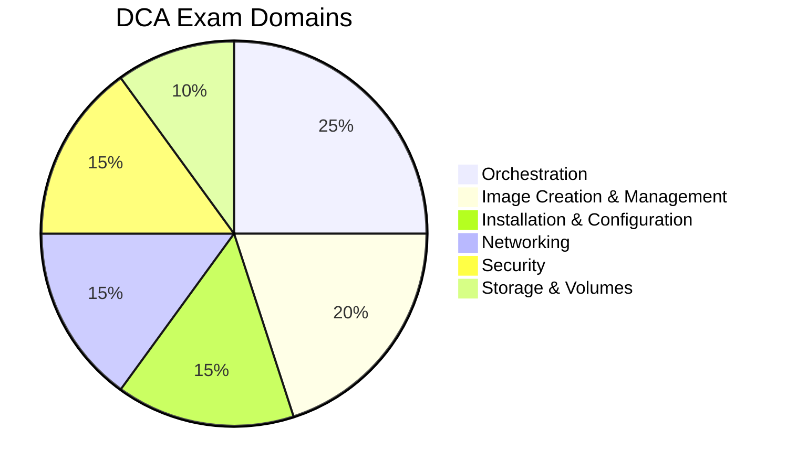

# Docker Certified Associate (DCA) Overview

> **Module:** Certification Preparation | **Level:** All | **Time:** 20 minutes

## About the DCA Certification

The Docker Certified Associate (DCA) certification validates your skills in deploying and managing containerized applications at scale. It's the industry-standard credential for Docker professionals.

---

## Exam Details

| Aspect | Detail |
|--------|--------|
| **Exam Name** | Docker Certified Associate (DCA) |
| **Duration** | 90 minutes |
| **Questions** | 55 questions |
| **Format** | Multiple choice and multiple select |
| **Passing Score** | ~65-70% (not officially published) |
| **Cost** | $195 USD |
| **Validity** | 2 years |
| **Delivery** | Proctored online or test center |
| **Prerequisites** | None (6+ months experience recommended) |

---

## Registration

**Register at:** [training.mirantis.com/dca-certification-exam](https://training.mirantis.com/dca-certification-exam)

### Registration Steps

1. Create an account at Mirantis Learning Portal
2. Purchase the exam voucher ($195)
3. Schedule your exam through the portal
4. Choose online proctoring or test center
5. Complete the exam and receive results immediately

---

## Exam Domains and Weights



### Domain Breakdown

| Domain | Weight | Topics |
|--------|--------|--------|
| **Orchestration** | 25% | Swarm, services, stacks, node management |
| **Image Creation** | 20% | Dockerfiles, multi-stage builds, registries |
| **Installation** | 15% | Docker Engine setup, upgrades, sizing |
| **Networking** | 15% | Bridge, overlay, ports, DNS |
| **Security** | 15% | TLS, secrets, image signing, namespaces |
| **Storage** | 10% | Volumes, bind mounts, storage drivers |

---

## Detailed Topic Coverage

### Domain 1: Orchestration (25%)

**Topics:**
- Docker Swarm mode architecture
- Creating and managing services
- Service scaling and updates
- Rolling updates and rollbacks
- Stack deployments
- Node management (managers, workers)
- Service placement constraints
- Drain and label nodes
- Raft consensus and quorum
- Swarm networking (overlay, ingress)

**Key Commands:**
```bash
docker swarm init
docker service create
docker service scale
docker stack deploy
docker node update
```

### Domain 2: Image Creation, Management, Registry (20%)

**Topics:**
- Dockerfile instructions
- Multi-stage builds
- Image layers and caching
- Tagging strategies
- Pushing/pulling images
- Registry deployment
- Docker Hub and private registries
- Image inspection
- Dockerfile best practices

**Key Commands:**
```bash
docker build
docker push/pull
docker tag
docker image inspect
docker history
```

### Domain 3: Installation and Configuration (15%)

**Topics:**
- Installation methods (script, package manager)
- Docker Engine components
- Selecting storage drivers
- Configuring daemon options
- Logging drivers
- Namespaces and cgroups
- Certificate management
- Sizing requirements
- Backup and restore

**Key Files:**
```
/etc/docker/daemon.json
/var/lib/docker/
~/.docker/config.json
```

### Domain 4: Networking (15%)

**Topics:**
- Network types (bridge, host, overlay, macvlan)
- Container DNS
- Port publishing
- Network troubleshooting
- Overlay networks in Swarm
- Network plugins
- Ingress routing mesh
- Service discovery

**Key Commands:**
```bash
docker network create
docker network inspect
docker port
docker network connect/disconnect
```

### Domain 5: Security (15%)

**Topics:**
- Namespaces and cgroups
- Docker Content Trust
- Security scanning
- Secrets management
- Rootless mode
- User namespaces
- Seccomp profiles
- AppArmor/SELinux
- TLS authentication
- MTLS for Swarm

**Key Commands:**
```bash
docker secret create
docker trust sign
docker scan
docker --userns-remap
```

### Domain 6: Storage and Volumes (10%)

**Topics:**
- Volume types (named, anonymous, bind mount)
- Storage drivers
- Volume lifecycle
- Volume plugins
- Backup and restore
- tmpfs mounts
- Sharing data between containers

**Key Commands:**
```bash
docker volume create
docker volume inspect
docker run -v
docker run --mount
```

---

## Course Mapping to DCA Domains

| DCA Domain | Course Module |
|------------|---------------|
| Orchestration | Part 3: Docker Swarm |
| Image Creation | Part 1: Building Images, Part 2: Multi-stage Builds |
| Installation | Part 1: Installation, Storage Module |
| Networking | Networking Module |
| Security | Security Module |
| Storage | Storage Module, Part 1: Volumes |

---

## Study Resources

### Official Resources

- [Docker Documentation](https://docs.docker.com/)
- [Docker Samples on GitHub](https://github.com/docker/awesome-compose)
- [Mirantis Training Portal](https://training.mirantis.com/)

### This Course Coverage

| Topic | Coverage |
|-------|----------|
| Container Basics | Part 1 |
| Dockerfiles | Part 1, Part 2 |
| Networking | Networking Module |
| Volumes/Storage | Storage Module |
| Security | Security Module |
| Docker Swarm | Part 3 |
| Troubleshooting | Operations Module |

### Practice Labs

Complete the following labs to prepare:

1. [Lab 01: Container Basics](../labs/lab01-container-basics/)
2. [Lab 02: Building Images](../labs/lab02-building-images/)
3. [Lab 03: Networking](../labs/lab03-networking/)
4. [Lab 04: Volumes and Storage](../labs/lab04-volumes-storage/)
5. [Lab 07: Swarm Cluster](../labs/lab07-swarm-cluster/)
6. [Lab 08: Security Hardening](../labs/lab08-security-hardening/)

---

## Exam Tips

### Before the Exam

1. **Read the documentation** - Many questions come directly from docs
2. **Practice with real Docker** - Hands-on experience is essential
3. **Understand Swarm deeply** - 25% of the exam
4. **Know Dockerfile best practices** - Common question source
5. **Review network types** - Know when to use each

### During the Exam

1. **Manage your time** - 90 minutes for 55 questions (~1.6 min/question)
2. **Flag difficult questions** - Return to them later
3. **Read carefully** - Look for keywords like "MOST," "BEST," "ALWAYS"
4. **Eliminate wrong answers** - Narrow down choices
5. **Trust your preparation** - Don't second-guess too much

### Common Question Types

| Type | Tip |
|------|-----|
| Command syntax | Know exact flags and options |
| Best practice | Choose the most secure/efficient option |
| Troubleshooting | Identify the root cause |
| Architecture | Understand component relationships |
| Scenario-based | Apply knowledge to real situations |

---

## Sample Questions

### Sample Question 1

Which Dockerfile instruction should you use to specify the default command for a container?

- A. `RUN`
- B. `ENTRYPOINT`
- C. `CMD`
- D. `EXEC`

**Answer:** C. `CMD` sets the default command (can be overridden). `ENTRYPOINT` sets the executable (harder to override).

### Sample Question 2

In Docker Swarm, how many manager nodes should you have for fault tolerance?

- A. 1
- B. 2
- C. 3
- D. 4

**Answer:** C. 3 managers allow one failure while maintaining quorum. Even numbers can cause split-brain.

### Sample Question 3

Which network type allows containers on different Docker hosts to communicate?

- A. bridge
- B. host
- C. overlay
- D. none

**Answer:** C. `overlay` networks span multiple Docker hosts in a Swarm.

---

## After the Exam

### If You Pass

- Download your certificate from Mirantis portal
- Add credential to LinkedIn
- Share your achievement
- Certificate valid for 2 years
- Recertification available before expiry

### If You Need More Preparation

- Review weak areas from score report
- Complete more hands-on labs
- Re-read documentation
- Wait minimum period before retaking

---

## Key Takeaways

1. **25% is Orchestration (Swarm)** - Largest domain, must master
2. **Hands-on practice is essential** - Can't pass on theory alone
3. **Know the documentation** - Many questions reference it directly
4. **Understand best practices** - Not just what works, but what's optimal
5. **Time management** - Don't spend too long on any question

---

## What's next

Review the study guide and exam preparation.

---

## Navigation

| Previous | Up | Next |
|----------|-----|------|
| [Migration Guide](../comparison/03-migration-guide.md) | [Course Overview](../course_overview.md) | [Exam Preparation](02-exam-preparation.md) |
