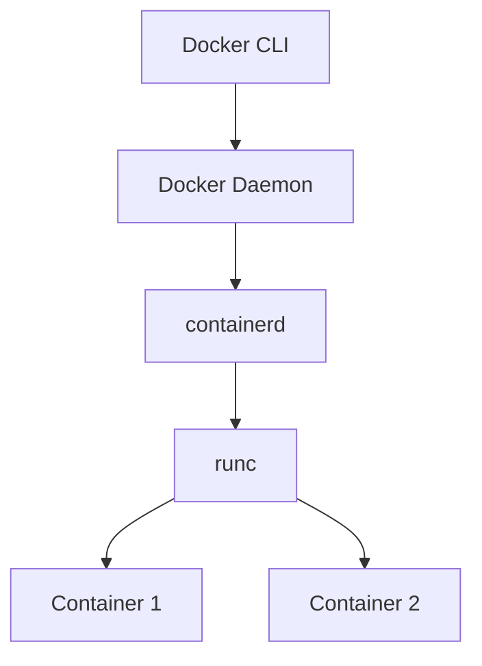
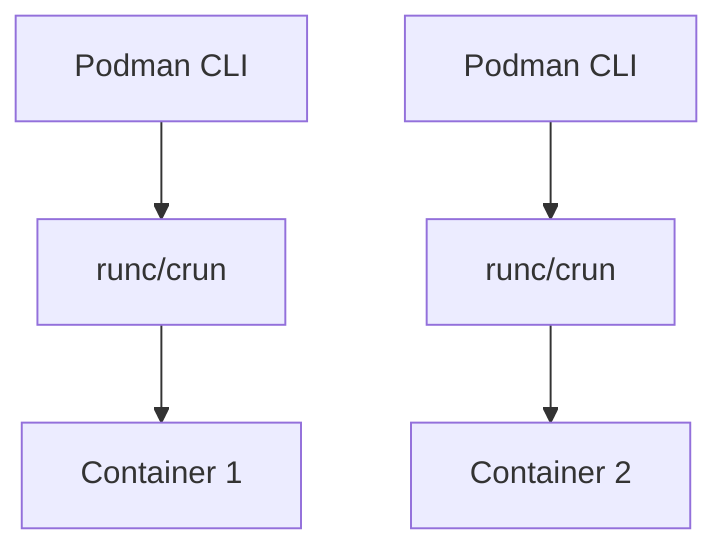

# Docker vs Podman comparison

> **Module:** Comparison | **Level:** All Levels | **Time:** 25 minutes

## Learning objectives

By the end of this section, you will be able to:

- Understand architectural differences
- Choose the right tool for your use case
- Migrate between Docker and Podman
- Use both tools effectively

---

## Architecture comparison

### Docker architecture



- **Daemon-based**: Requires `dockerd` running as root
- **Client-server**: CLI talks to daemon via socket
- **Centralized**: Single daemon manages all containers

### Podman architecture



- **Daemonless**: Direct fork-exec model
- **Rootless by default**: Runs in user namespace
- **Distributed**: Each container is a child process

---

## Feature comparison

| Feature | Docker | Podman |
|---------|--------|--------|
| Daemon | Required | None |
| Root access | Required (daemon) | Optional (rootless) |
| Compose | Native | podman-compose / docker-compose |
| Swarm | Yes | No |
| Kubernetes | Limited | Native pod support |
| CLI compatibility | Original | Docker-compatible |
| Windows/macOS | Docker Desktop | Podman Desktop / Machine |
| SystemD integration | Via daemon | Native (generate systemd) |
| Default runtime | runc | crun (faster) |

---

## Command comparison

### Basic commands

| Task | Docker | Podman |
|------|--------|--------|
| Run container | `docker run nginx` | `podman run nginx` |
| List containers | `docker ps` | `podman ps` |
| Build image | `docker build -t myapp .` | `podman build -t myapp .` |
| Pull image | `docker pull nginx` | `podman pull nginx` |
| Push image | `docker push myapp` | `podman push myapp` |
| View logs | `docker logs mycontainer` | `podman logs mycontainer` |
| Exec into | `docker exec -it mycontainer sh` | `podman exec -it mycontainer sh` |
| Stop | `docker stop mycontainer` | `podman stop mycontainer` |
| Remove | `docker rm mycontainer` | `podman rm mycontainer` |

### Podman-specific commands

```bash
# Generate systemd unit file
podman generate systemd --name mycontainer

# Create pod (like k8s pod)
podman pod create --name mypod -p 8080:80

# Run container in pod
podman run -d --pod mypod nginx

# Generate Kubernetes YAML
podman generate kube mypod > mypod.yaml

# Play Kubernetes YAML
podman play kube mypod.yaml
```

---

## Rootless containers

### Docker rootless

```bash
# Install rootless Docker
dockerd-rootless-setuptool.sh install

# Use rootless Docker
export DOCKER_HOST=unix://$XDG_RUNTIME_DIR/docker.sock
docker run nginx
```

### Podman rootless (default)

```bash
# Just run as regular user
podman run nginx

# Check running as non-root
podman run --rm alpine id
# uid=0(root) gid=0(root)  # Root inside container only
```

---

## Networking differences

### Docker networking

```bash
# Uses docker0 bridge
# Requires daemon configuration
docker network create mynet
docker run --network mynet nginx
```

### Podman networking

```bash
# Uses CNI plugins (rootful) or slirp4netns (rootless)
podman network create mynet
podman run --network mynet nginx

# Rootless uses slirp4netns by default
# Limited port binding (ports > 1024 without root)
```

---

## Compose compatibility

### Docker Compose

```bash
# Native integration
docker compose up -d
docker compose logs
docker compose down
```

### Podman with Compose

```bash
# Option 1: podman-compose (Python)
pip install podman-compose
podman-compose up -d

# Option 2: docker-compose with Podman socket
systemctl --user start podman.socket
export DOCKER_HOST=unix://$XDG_RUNTIME_DIR/podman/podman.sock
docker-compose up -d
```

---

## Migration guide

### Docker to Podman

```bash
# 1. Install Podman
# Fedora/RHEL
sudo dnf install podman

# Ubuntu
sudo apt install podman

# 2. Create alias (optional)
alias docker=podman

# 3. Migrate images
docker save myimage:latest | podman load

# 4. Update scripts
# Most scripts work as-is with alias
# Check for Docker-specific features
```

### Compose migration

```bash
# Docker Compose v2 → Podman
# Most compose.yaml files work directly

# Key changes:
# - Use podman-compose or docker-compose with socket
# - Check volume permissions (rootless)
# - Port binding restrictions (rootless)
```

---

## Use case recommendations

### Use Docker when

- Running Docker Swarm
- Windows containers needed
- Using Docker Desktop features
- Team already standardized on Docker
- Need specific Docker ecosystem tools

### Use Podman when

- Security is priority (rootless)
- Kubernetes integration needed
- SystemD service generation
- No daemon overhead preferred
- RHEL/Fedora environment
- Compliance requirements

---

## Working with both

### Environment setup

```bash
# ~/.bashrc or ~/.zshrc

# Docker
export DOCKER_HOST=unix:///var/run/docker.sock

# Podman socket (for docker-compose compatibility)
# systemctl --user enable --now podman.socket
export DOCKER_HOST=unix://$XDG_RUNTIME_DIR/podman/podman.sock

# Function to switch
use-docker() {
    export DOCKER_HOST=unix:///var/run/docker.sock
    echo "Using Docker"
}

use-podman() {
    export DOCKER_HOST=unix://$XDG_RUNTIME_DIR/podman/podman.sock
    echo "Using Podman"
}
```

### CI/CD compatibility

```yaml
# GitHub Actions - works with both
jobs:
  build:
    runs-on: ubuntu-latest
    steps:
      - uses: actions/checkout@v4

      # Docker (default)
      - name: Build with Docker
        run: docker build -t myapp .

      # Podman
      - name: Build with Podman
        run: |
          sudo apt-get install -y podman
          podman build -t myapp .
```

---

## Key takeaways

1. **Podman is Docker-compatible** for most use cases
2. **Rootless is Podman's strength** for security
3. **Docker Swarm** only available with Docker
4. **Kubernetes integration** better with Podman
5. **Both are valid choices** depending on requirements

---

## What's next

Explore detailed feature comparisons.

---

## Navigation

| Previous | Up | Next |
|----------|-----|------|
| [Troubleshooting](../operations/02-troubleshooting.md) | [Course Overview](../course_overview.md) | [Detailed Comparison](02-detailed-comparison.md) |
