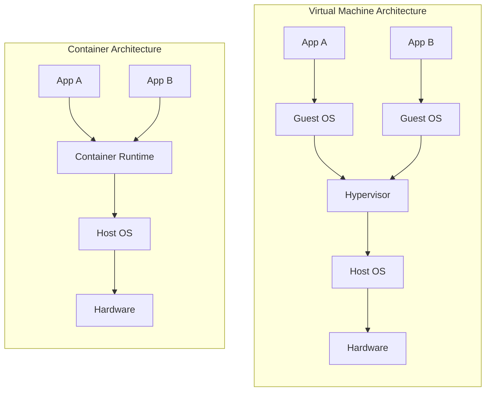
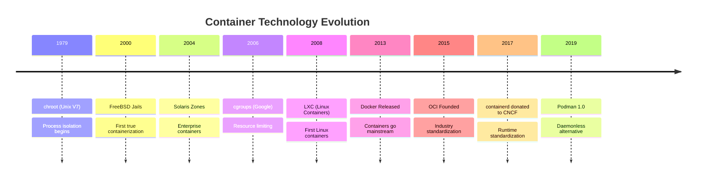

# What Are Containers?

> **Module:** concepts | **Level:** Foundation | **Time:** 25 minutes

## Learning Objectives

By the end of this section, you will be able to:

- Explain what containers are and why they matter
- Compare containers to virtual machines
- Identify common container use cases
- Understand the brief history of container technology

---

## The Problem Containers Solve

### The "Works on My Machine" Problem

Every developer has experienced it:

```
Developer: "It works on my machine!"
Operations: "Well, it doesn't work in production."
```

The root cause? **Environmental differences**:

- Different operating system versions
- Different library versions
- Different configurations
- Missing dependencies
- Different file paths

### Traditional Solutions (and Their Limitations)

| Solution | Limitation |
|----------|------------|
| Documentation | Gets outdated, humans make mistakes |
| Scripts | Environment-specific, fragile |
| Virtual Machines | Heavy, slow to start, resource-intensive |
| Configuration Management | Complex, drift over time |

---

## What Is a Container?

A container is a **lightweight, isolated environment** that packages:

- Your application code
- All dependencies (libraries, binaries)
- Configuration files
- Environment variables

Into a **single, portable unit** that runs consistently anywhere.

```
┌─────────────────────────────────────────────┐
│              Container                       │
│  ┌─────────────────────────────────────┐    │
│  │         Your Application             │    │
│  ├─────────────────────────────────────┤    │
│  │    Libraries & Dependencies          │    │
│  ├─────────────────────────────────────┤    │
│  │       Configuration                  │    │
│  └─────────────────────────────────────┘    │
└─────────────────────────────────────────────┘
```

### Key Characteristics

| Characteristic | Description |
|----------------|-------------|
| **Isolated** | Containers don't interfere with each other |
| **Portable** | Run the same on laptop, server, or cloud |
| **Lightweight** | Share the host OS kernel (no full OS needed) |
| **Fast** | Start in seconds (not minutes like VMs) |
| **Immutable** | Same image produces identical container |

---

## Containers vs Virtual Machines



### Comparison

| Aspect | Virtual Machine | Container |
|--------|-----------------|-----------|
| **Isolation** | Complete (separate OS) | Process-level |
| **Size** | GBs (full OS) | MBs (app + deps only) |
| **Startup** | Minutes | Seconds |
| **Resource Usage** | High (dedicated resources) | Low (shared kernel) |
| **Density** | 10s per host | 100s per host |
| **Portability** | Hypervisor-dependent | Highly portable |

### When to Use Each

**Use Containers when:**
- Running multiple instances of the same application
- Deploying microservices
- Need fast scaling
- Want consistent dev/test/prod environments

**Use VMs when:**
- Need complete OS isolation (security requirements)
- Running different operating systems
- Legacy applications requiring specific OS features
- Compliance requirements mandate full isolation

---

## Container Use Cases

### 1. Microservices Architecture

Break monolithic applications into small, independent services:

```
┌────────┐  ┌────────┐  ┌────────┐  ┌────────┐
│  API   │  │  Auth  │  │ Payment│  │Database│
│Gateway │  │Service │  │Service │  │Service │
└────────┘  └────────┘  └────────┘  └────────┘
    │           │           │           │
    └───────────┴───────────┴───────────┘
              Network Communication
```

### 2. CI/CD Pipelines

Consistent build and test environments:

```
Code → Build Container → Test Container → Deploy Container
```

### 3. Development Environments

"Works on my machine" becomes "Works in this container":

```bash
# Everyone gets the same environment
docker run -it myapp-dev-environment
```

### 4. Application Isolation

Run multiple applications on the same host without conflicts:

```
┌──────────────────────────────────────────┐
│                Host Server                │
│  ┌─────────┐  ┌─────────┐  ┌─────────┐  │
│  │ Node 18 │  │ Python  │  │  Java   │  │
│  │   App   │  │  3.11   │  │   17    │  │
│  └─────────┘  └─────────┘  └─────────┘  │
└──────────────────────────────────────────┘
```

### 5. Cloud Deployment

Same container runs on any cloud provider:

- AWS (ECS, EKS, Fargate)
- Azure (ACI, AKS)
- Google Cloud (Cloud Run, GKE)
- On-premises

---

## Brief History of Containers



### Key Milestones

| Year | Event | Significance |
|------|-------|--------------|
| 1979 | chroot | First process isolation |
| 2006 | cgroups | Resource limiting added to Linux |
| 2008 | namespaces | Process isolation in Linux kernel |
| 2013 | Docker | Made containers accessible to everyone |
| 2015 | OCI | Industry-standard specifications |
| 2019 | Podman | Rootless, daemonless alternative |

---

## Core Container Concepts

### Images

A container **image** is a read-only template containing:

- A base operating system (or minimal filesystem)
- Application code
- Dependencies
- Configuration

```bash
# Images are like blueprints
docker pull nginx        # Download an image
docker images           # List local images
```

### Containers

A **container** is a running instance of an image:

```bash
# Containers are running instances
docker run nginx        # Start a container from the nginx image
docker ps              # List running containers
```

### Registries

A **registry** stores and distributes images:

- **Docker Hub** - Public registry (hub.docker.com)
- **GitHub Container Registry** - GitHub's registry (ghcr.io)
- **Private Registries** - Self-hosted or cloud-provided

```bash
# Pull from registry
docker pull docker.io/library/nginx:latest
#          ^^^^^^^^^ ^^^^^^^ ^^^^^ ^^^^^^
#          registry  account image  tag
```

---

## Your First Container

Let's run a container to see these concepts in action:

```bash
# Docker
docker run hello-world

# Podman
podman run hello-world
```

What happens:

1. Docker/Podman checks for `hello-world` image locally
2. If not found, pulls from Docker Hub
3. Creates a container from the image
4. Runs the container
5. Container outputs a message and exits

Expected output:
```
Hello from Docker!
This message shows that your installation appears to be working correctly.
...
```

---

## Key Takeaways

1. **Containers package applications** with all dependencies for consistent deployment
2. **Containers are lightweight** - they share the host OS kernel
3. **Containers start fast** - seconds vs minutes for VMs
4. **Containers are portable** - same image runs anywhere
5. **Images are templates**, containers are running instances
6. **Registries distribute images** across environments

---

## What's Next

In the next section, we'll explore **how containers work** at a technical level, including:

- Linux namespaces (isolation)
- Control groups (resource limits)
- Union filesystems (layered storage)

Continue to: [02-how-containers-work.md](02-how-containers-work.md)

---

## Quick Quiz

1. What problem do containers primarily solve?
   - [ ] Making applications run faster
   - [x] Environmental consistency across development and production
   - [ ] Reducing code complexity
   - [ ] Eliminating the need for testing

2. How do containers differ from VMs in terms of resource usage?
   - [ ] Containers use more resources because they're more isolated
   - [x] Containers share the host OS kernel and use fewer resources
   - [ ] Both use the same amount of resources
   - [ ] VMs share resources while containers don't

3. What is a container image?
   - [ ] A screenshot of a running container
   - [ ] A backup of container data
   - [x] A read-only template used to create containers
   - [ ] A type of virtual machine

4. Where are container images typically stored and distributed?
   - [ ] Local hard drives only
   - [ ] Email attachments
   - [x] Registries like Docker Hub
   - [ ] Git repositories
