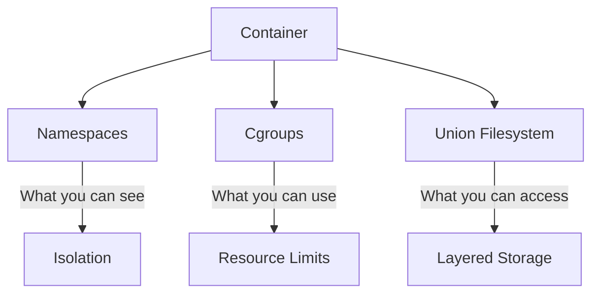
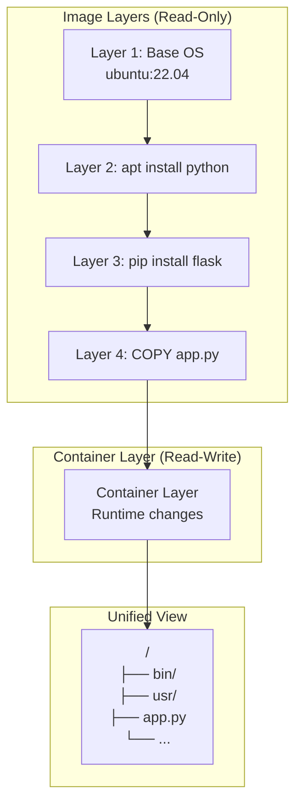
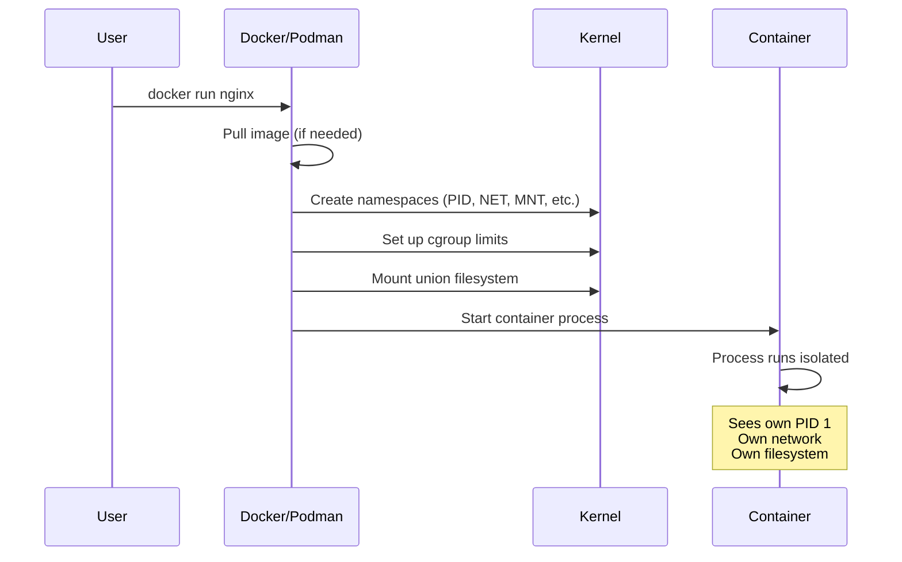

# How Containers Work

> **Module:** concepts | **Level:** Foundation | **Time:** 30 minutes

## Learning Objectives

By the end of this section, you will be able to:

- Explain how Linux namespaces provide isolation
- Describe how cgroups limit resources
- Understand how union filesystems enable layered images
- Visualize the relationship between these technologies

---

## The Three Pillars of Container Technology

Containers are not a single technology but a combination of three Linux kernel features:



| Pillar | Purpose | Question Answered |
|--------|---------|-------------------|
| **Namespaces** | Isolation | What can this process see? |
| **Cgroups** | Resource limits | How much can this process use? |
| **Union Filesystem** | Layered storage | What files can this process access? |

---

## Namespaces: Process Isolation

Namespaces make processes think they have their own instance of global system resources.

### Types of Linux Namespaces

| Namespace | Isolates | Example |
|-----------|----------|---------|
| **PID** | Process IDs | Container sees PID 1 as its init |
| **NET** | Network interfaces | Container has its own IP address |
| **MNT** | Mount points | Container has its own filesystem |
| **UTS** | Hostname | Container has its own hostname |
| **IPC** | Inter-process communication | Container has isolated shared memory |
| **USER** | User and group IDs | Container UID 0 ≠ Host UID 0 |
| **CGROUP** | Cgroup root directory | Container sees only its own cgroups |

### Visualization: PID Namespace

```
┌─────────────────────────────────────────────────────────────┐
│                        Host System                           │
│                                                              │
│  PID 1 (systemd)                                            │
│    └── PID 1234 (containerd)                                │
│          └── PID 5678 (container process)                   │
│                                                              │
│  ┌─────────────────────────────────────────────────────┐    │
│  │              Container's View (PID Namespace)        │    │
│  │                                                      │    │
│  │  PID 1 (app) ← Same process, but sees itself as 1   │    │
│  │    └── PID 2 (worker)                               │    │
│  │                                                      │    │
│  └─────────────────────────────────────────────────────┘    │
└─────────────────────────────────────────────────────────────┘
```

### Visualization: Network Namespace

```
┌─────────────────────────────────────────────────────────────┐
│                        Host System                           │
│  eth0: 192.168.1.100                                        │
│  docker0: 172.17.0.1 (bridge)                               │
│                                                              │
│  ┌─────────────────┐  ┌─────────────────┐                   │
│  │   Container A   │  │   Container B   │                   │
│  │  eth0: 172.17.  │  │  eth0: 172.17.  │                   │
│  │       0.2       │  │       0.3       │                   │
│  └────────┬────────┘  └────────┬────────┘                   │
│           │                    │                             │
│           └──────────┬─────────┘                             │
│                      │                                       │
│              ┌───────┴───────┐                               │
│              │   docker0     │                               │
│              │   (bridge)    │                               │
│              └───────────────┘                               │
└─────────────────────────────────────────────────────────────┘
```

### Demonstrating Namespaces

```bash
# View namespaces of a process
ls -la /proc/self/ns/

# Output:
# lrwxrwxrwx 1 user user 0 Jan 1 00:00 cgroup -> 'cgroup:[...]'
# lrwxrwxrwx 1 user user 0 Jan 1 00:00 ipc -> 'ipc:[...]'
# lrwxrwxrwx 1 user user 0 Jan 1 00:00 mnt -> 'mnt:[...]'
# lrwxrwxrwx 1 user user 0 Jan 1 00:00 net -> 'net:[...]'
# lrwxrwxrwx 1 user user 0 Jan 1 00:00 pid -> 'pid:[...]'
# lrwxrwxrwx 1 user user 0 Jan 1 00:00 user -> 'user:[...]'
# lrwxrwxrwx 1 user user 0 Jan 1 00:00 uts -> 'uts:[...]'

# Compare host and container namespaces
docker run --rm alpine cat /proc/1/ns/pid
# Different from host's /proc/1/ns/pid
```

---

## Cgroups: Resource Limits

Control Groups (cgroups) limit and account for resource usage.

### Resources Controlled by Cgroups

| Resource | Cgroup Controller | Example Limit |
|----------|-------------------|---------------|
| **CPU** | cpu, cpuset | 50% of one core |
| **Memory** | memory | 512MB maximum |
| **I/O** | blkio | 100MB/s read |
| **PIDs** | pids | Maximum 100 processes |
| **Network** | net_cls, net_prio | Bandwidth limits |

### Visualization: Resource Allocation

```
┌─────────────────────────────────────────────────────────────┐
│                    Host Resources                            │
│  CPU: 4 cores    Memory: 16GB    Disk I/O: 500MB/s          │
│                                                              │
│  ┌─────────────────────────────────────────────────────┐    │
│  │                    Cgroup Limits                     │    │
│  │                                                      │    │
│  │  Container A          Container B          Host      │    │
│  │  ┌──────────┐        ┌──────────┐        Processes  │    │
│  │  │CPU: 1    │        │CPU: 0.5  │        (unlimited)│    │
│  │  │Mem: 2GB  │        │Mem: 512MB│                   │    │
│  │  │I/O: 100MB│        │I/O: 50MB │                   │    │
│  │  └──────────┘        └──────────┘                   │    │
│  │                                                      │    │
│  └─────────────────────────────────────────────────────┘    │
└─────────────────────────────────────────────────────────────┘
```

### Demonstrating Cgroups

```bash
# Run container with resource limits
docker run -d --name limited \
    --memory=256m \
    --cpus=0.5 \
    nginx

# View cgroup limits (cgroups v2)
cat /sys/fs/cgroup/docker/<container-id>/memory.max
# 268435456 (256MB in bytes)

cat /sys/fs/cgroup/docker/<container-id>/cpu.max
# 50000 100000 (50% of CPU)
```

### What Happens When Limits Are Exceeded?

| Resource | Behavior When Exceeded |
|----------|------------------------|
| **Memory** | Container killed (OOM) |
| **CPU** | Container throttled (slowed) |
| **PIDs** | Cannot create new processes |
| **I/O** | Operations queued/delayed |

```bash
# Memory limit exceeded - container killed
docker run --memory=10m alpine dd if=/dev/zero of=/dev/null bs=100m
# Killed (OOM)

# CPU limit - container throttled
docker run --cpus=0.1 alpine dd if=/dev/zero of=/dev/null &
# Runs slowly but doesn't get killed
```

---

## Union Filesystems: Layered Storage

Union filesystems combine multiple directories into a single view.

### How Layers Work



### Layer Visualization

```
┌─────────────────────────────────────────────────────────────┐
│                    Container View                            │
│  /app/app.py  /usr/bin/python  /bin/sh  /etc/passwd        │
└─────────────────────────────────────────────────────────────┘
                            ▲
                            │ Union Mount
┌─────────────────────────────────────────────────────────────┐
│  Container Layer (RW)  │ Modified: /app/data.txt           │
├─────────────────────────────────────────────────────────────┤
│  Layer 4 (RO)         │ Added: /app/app.py                 │
├─────────────────────────────────────────────────────────────┤
│  Layer 3 (RO)         │ Added: /usr/lib/python3/...        │
├─────────────────────────────────────────────────────────────┤
│  Layer 2 (RO)         │ Added: /usr/bin/python             │
├─────────────────────────────────────────────────────────────┤
│  Layer 1 (RO)         │ Base: /bin, /etc, /usr, /var       │
└─────────────────────────────────────────────────────────────┘
```

### Copy-on-Write (CoW)

When a container modifies a file from a lower layer:

1. File is copied to the container's writable layer
2. Modification happens on the copy
3. Original layer remains unchanged

```
Before modification:
┌──────────────┐
│ Container RW │  (empty)
├──────────────┤
│ Image Layer  │  /etc/config.txt = "original"
└──────────────┘

After modification:
┌──────────────┐
│ Container RW │  /etc/config.txt = "modified" (copy)
├──────────────┤
│ Image Layer  │  /etc/config.txt = "original" (unchanged)
└──────────────┘
```

### Benefits of Layered Storage

| Benefit | Explanation |
|---------|-------------|
| **Space Efficiency** | Shared layers aren't duplicated |
| **Fast Startup** | No need to copy entire filesystem |
| **Caching** | Unchanged layers reused during builds |
| **Immutability** | Base layers never modified |

### Common Storage Drivers

| Driver | Description | Best For |
|--------|-------------|----------|
| **overlay2** | Default for Linux | Most use cases |
| **fuse-overlayfs** | Rootless containers | Podman rootless |
| **btrfs** | Copy-on-write filesystem | btrfs hosts |
| **zfs** | Copy-on-write filesystem | ZFS hosts |

---

## Putting It All Together

When you run `docker run nginx`:



### Step-by-Step Process

1. **Image Resolution**: Docker finds/pulls the nginx image
2. **Namespace Creation**: Kernel creates isolated namespaces
3. **Cgroup Setup**: Resource limits applied
4. **Filesystem Mount**: Union filesystem assembled from layers
5. **Process Start**: Container's main process launched
6. **Isolation Active**: Process runs in isolated environment

---

## Demonstrating the Technology

```bash
# See container's isolated view
docker run --rm alpine hostname
# Random hostname (UTS namespace)

docker run --rm alpine cat /etc/hosts
# Container's own /etc/hosts (MNT namespace)

docker run --rm alpine ps aux
# Only container processes (PID namespace)

# See resource limits in action
docker run --rm --memory=32m alpine free -m
# Shows limited memory

# See union filesystem
docker run --rm alpine mount | grep overlay
# overlay filesystem mounted
```

---

## Key Takeaways

1. **Namespaces isolate** what processes can see (PIDs, network, filesystems)
2. **Cgroups limit** what resources processes can use (CPU, memory, I/O)
3. **Union filesystems enable** efficient, layered image storage
4. **These are kernel features**, not virtualization - containers share the host kernel
5. **Copy-on-write** makes containers space-efficient and fast to start

---

## What's Next

Now that you understand the underlying technology, we'll explore:

- **OCI Standards**: The specifications that ensure container interoperability
- **Container Runtimes**: The software that implements these kernel features

Continue to: [03-oci-standards.md](03-oci-standards.md)

---

## Quick Quiz

1. Which Linux feature provides process isolation in containers?
   - [ ] Cgroups
   - [x] Namespaces
   - [ ] Union filesystem
   - [ ] Virtualization

2. What happens when a container exceeds its memory limit?
   - [ ] The container slows down
   - [ ] The limit is automatically increased
   - [x] The container is killed (OOM)
   - [ ] Nothing, limits are advisory

3. In a union filesystem, what happens when a container modifies a file from a base layer?
   - [ ] The base layer is modified directly
   - [ ] An error occurs
   - [x] The file is copied to the container's writable layer
   - [ ] The entire image is duplicated

4. Which namespace gives containers their own hostname?
   - [ ] PID
   - [ ] NET
   - [x] UTS
   - [ ] MNT

---

## Navigation

| Previous | Up | Next |
|----------|-----|------|
| [What Are Containers?](01-what-are-containers.md) | [Course Overview](../course_overview.md) | [OCI Standards](03-oci-standards.md) |
