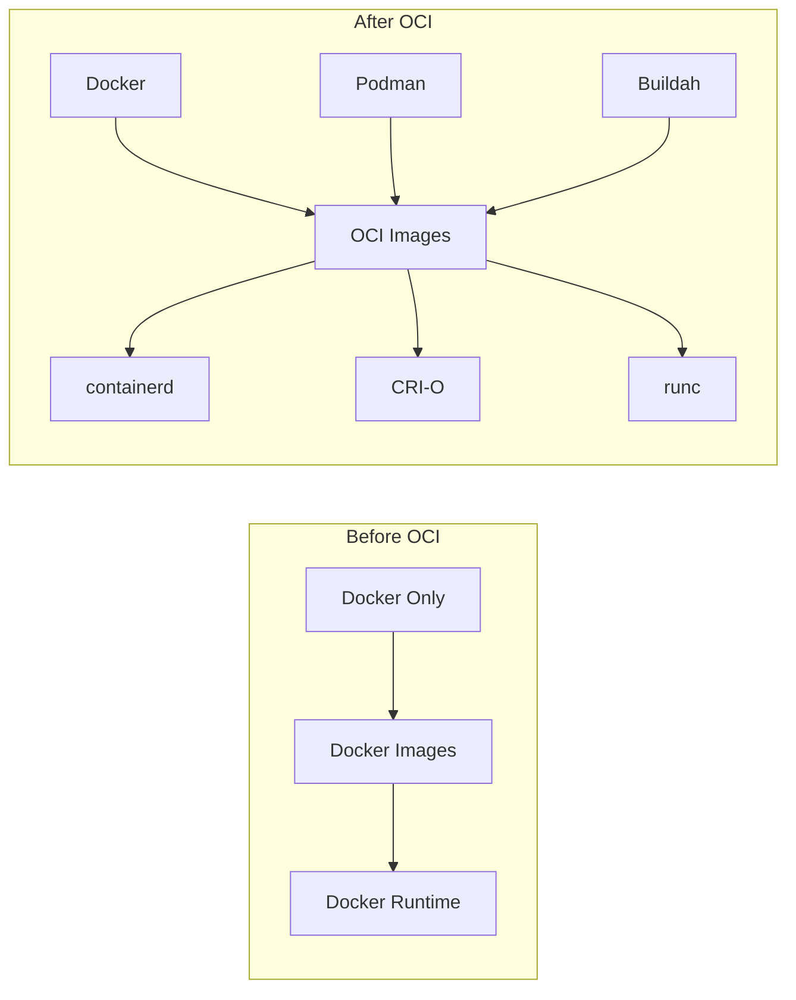
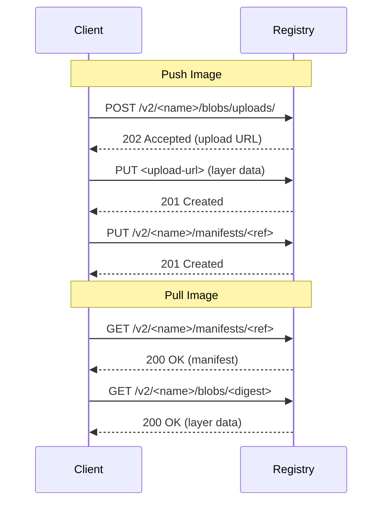
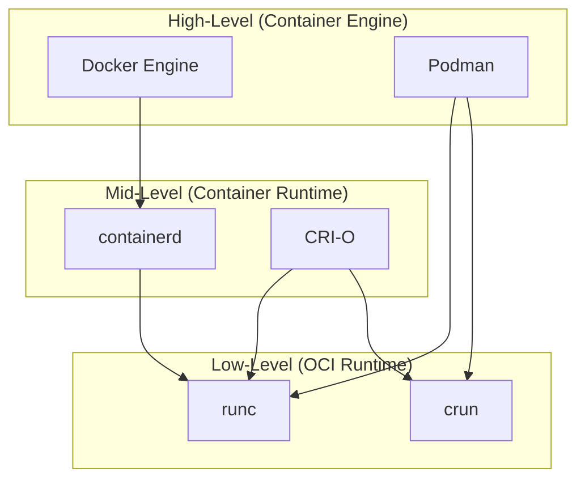

# OCI Standards

> **Module:** concepts | **Level:** Foundation | **Time:** 20 minutes

## Learning Objectives

By the end of this section, you will be able to:

- Explain what the Open Container Initiative (OCI) is
- Describe the three OCI specifications
- Understand why standardization matters for containers
- Recognize OCI-compliant tools and runtimes

---

## What Is the Open Container Initiative?

The **Open Container Initiative (OCI)** is a Linux Foundation project that creates open industry standards for container formats and runtimes.

### Why OCI Matters

Before OCI (2015), Docker's format was the de facto standard, but it was controlled by one company. OCI ensures:

| Benefit | Description |
|---------|-------------|
| **Interoperability** | Images work across different tools |
| **Portability** | Move containers between platforms |
| **Competition** | Multiple tools can implement the same specs |
| **Longevity** | Standards outlive individual companies |



---

## The Three OCI Specifications

### 1. Image Specification (image-spec)

Defines how container images are structured and distributed.

```
OCI Image Structure
├── index.json          # Image index (multi-platform)
├── manifest.json       # Image manifest
├── config.json         # Image configuration
└── blobs/
    ├── sha256:abc...   # Layer 1 (compressed tar)
    ├── sha256:def...   # Layer 2 (compressed tar)
    └── sha256:ghi...   # Layer 3 (compressed tar)
```

**Key Components:**

| Component | Purpose |
|-----------|---------|
| **Image Index** | Lists manifests for different platforms |
| **Image Manifest** | Lists layers and config for one platform |
| **Image Config** | Environment, entrypoint, labels, etc. |
| **Layers** | Filesystem changes (compressed tarballs) |

**Image Manifest Example:**

```json
{
  "schemaVersion": 2,
  "mediaType": "application/vnd.oci.image.manifest.v1+json",
  "config": {
    "mediaType": "application/vnd.oci.image.config.v1+json",
    "digest": "sha256:abc123...",
    "size": 1234
  },
  "layers": [
    {
      "mediaType": "application/vnd.oci.image.layer.v1.tar+gzip",
      "digest": "sha256:def456...",
      "size": 12345678
    }
  ]
}
```

### 2. Runtime Specification (runtime-spec)

Defines how to run a container from an unpacked filesystem.

```
OCI Runtime Bundle
├── config.json    # Runtime configuration
└── rootfs/        # Container filesystem
    ├── bin/
    ├── etc/
    ├── usr/
    └── ...
```

**Runtime Config Example:**

```json
{
  "ociVersion": "1.0.0",
  "process": {
    "terminal": true,
    "user": {"uid": 0, "gid": 0},
    "args": ["sh"],
    "env": ["PATH=/usr/bin:/bin"],
    "cwd": "/"
  },
  "root": {
    "path": "rootfs",
    "readonly": false
  },
  "hostname": "container",
  "linux": {
    "namespaces": [
      {"type": "pid"},
      {"type": "network"},
      {"type": "mount"}
    ]
  }
}
```

### 3. Distribution Specification (distribution-spec)

Defines how images are pushed and pulled from registries.



**Registry API Endpoints:**

| Endpoint | Method | Purpose |
|----------|--------|---------|
| `/v2/` | GET | Check API version |
| `/v2/<name>/manifests/<ref>` | GET/PUT/DELETE | Manage manifests |
| `/v2/<name>/blobs/<digest>` | GET | Download layer |
| `/v2/<name>/blobs/uploads/` | POST | Start upload |
| `/v2/<name>/tags/list` | GET | List tags |

---

## OCI-Compliant Tools

### Image Builders

| Tool | Description |
|------|-------------|
| **Docker** | Original container platform |
| **Podman** | Daemonless Docker alternative |
| **Buildah** | Specialized image builder |
| **BuildKit** | Modern Docker build backend |
| **kaniko** | Build images in Kubernetes |

### Container Runtimes

| Runtime | Level | Used By |
|---------|-------|---------|
| **runc** | Low-level | Docker, Podman, containerd |
| **crun** | Low-level | Podman (optional, faster) |
| **containerd** | High-level | Docker, Kubernetes |
| **CRI-O** | High-level | Kubernetes |

### Registries

| Registry | Type |
|----------|------|
| **Docker Hub** | Public cloud |
| **GitHub Container Registry** | Public cloud |
| **Amazon ECR** | Cloud provider |
| **Azure ACR** | Cloud provider |
| **Google Artifact Registry** | Cloud provider |
| **Harbor** | Self-hosted |
| **JFrog Artifactory** | Enterprise |

---

## How OCI Enables Interoperability

### Example: Build with Buildah, Run with Docker

```bash
# Build image with Buildah
buildah from alpine
buildah run alpine-working-container -- apk add nginx
buildah commit alpine-working-container my-nginx

# Push to registry (OCI format)
buildah push my-nginx docker://registry.example.com/my-nginx:latest

# Pull and run with Docker
docker pull registry.example.com/my-nginx:latest
docker run registry.example.com/my-nginx:latest
```

### Example: Build with Docker, Run with Podman

```bash
# Build with Docker
docker build -t myapp .
docker push registry.example.com/myapp:latest

# Run with Podman
podman pull registry.example.com/myapp:latest
podman run registry.example.com/myapp:latest
```

This interoperability is possible because both tools use OCI-compliant image formats.

---

## Image Format Compatibility

### Docker vs OCI Image Format

| Aspect | Docker Format | OCI Format |
|--------|---------------|------------|
| **Manifest** | `application/vnd.docker.distribution.manifest.v2+json` | `application/vnd.oci.image.manifest.v1+json` |
| **Config** | `application/vnd.docker.container.image.v1+json` | `application/vnd.oci.image.config.v1+json` |
| **Layer** | `application/vnd.docker.image.rootfs.diff.tar.gzip` | `application/vnd.oci.image.layer.v1.tar+gzip` |

**In Practice:** Most tools support both formats and convert automatically.

```bash
# Check image format
docker manifest inspect nginx --verbose | grep mediaType
# or
skopeo inspect docker://nginx | grep -i mediatype
```

---

## The Runtime Hierarchy



### Runtime Responsibilities

| Level | Responsibilities |
|-------|------------------|
| **High-Level** | CLI, API, image management, networking |
| **Mid-Level** | Image lifecycle, container supervision |
| **Low-Level** | Create namespaces, set cgroups, exec process |

---

## Verifying OCI Compliance

### Check Image Manifest

```bash
# Using skopeo
skopeo inspect docker://nginx:latest

# Using crane
crane manifest nginx:latest

# Using docker
docker manifest inspect nginx:latest
```

### Check Runtime

```bash
# Docker uses containerd + runc
docker info | grep -i runtime
# Default Runtime: runc

# Podman can use runc or crun
podman info | grep -i runtime
# OCIRuntime: crun
```

---

## Key Takeaways

1. **OCI ensures interoperability** - images work across different tools
2. **Three specifications** cover images, runtimes, and distribution
3. **Content-addressable storage** - digests uniquely identify content
4. **Multiple tools, one format** - build with any tool, run with any runtime
5. **Docker format and OCI format** are largely compatible

---

## What's Next

Now that you understand OCI standards, we'll explore the container runtimes that implement them.

Continue to: [04-container-runtimes.md](04-container-runtimes.md)

---

## Quick Quiz

1. What is the primary purpose of the OCI?
   - [ ] To make Docker the only container platform
   - [x] To create open industry standards for containers
   - [ ] To replace virtual machines
   - [ ] To manage Kubernetes clusters

2. Which OCI specification defines how images are stored and structured?
   - [x] Image Specification (image-spec)
   - [ ] Runtime Specification (runtime-spec)
   - [ ] Distribution Specification (distribution-spec)
   - [ ] Container Specification

3. What enables an image built with Buildah to run with Docker?
   - [ ] They use the same codebase
   - [ ] Docker can convert any format
   - [x] Both tools use OCI-compliant image formats
   - [ ] Buildah is part of Docker

4. What is runc?
   - [ ] A container orchestration tool
   - [ ] A container registry
   - [x] A low-level OCI runtime that creates containers
   - [ ] A container image format
