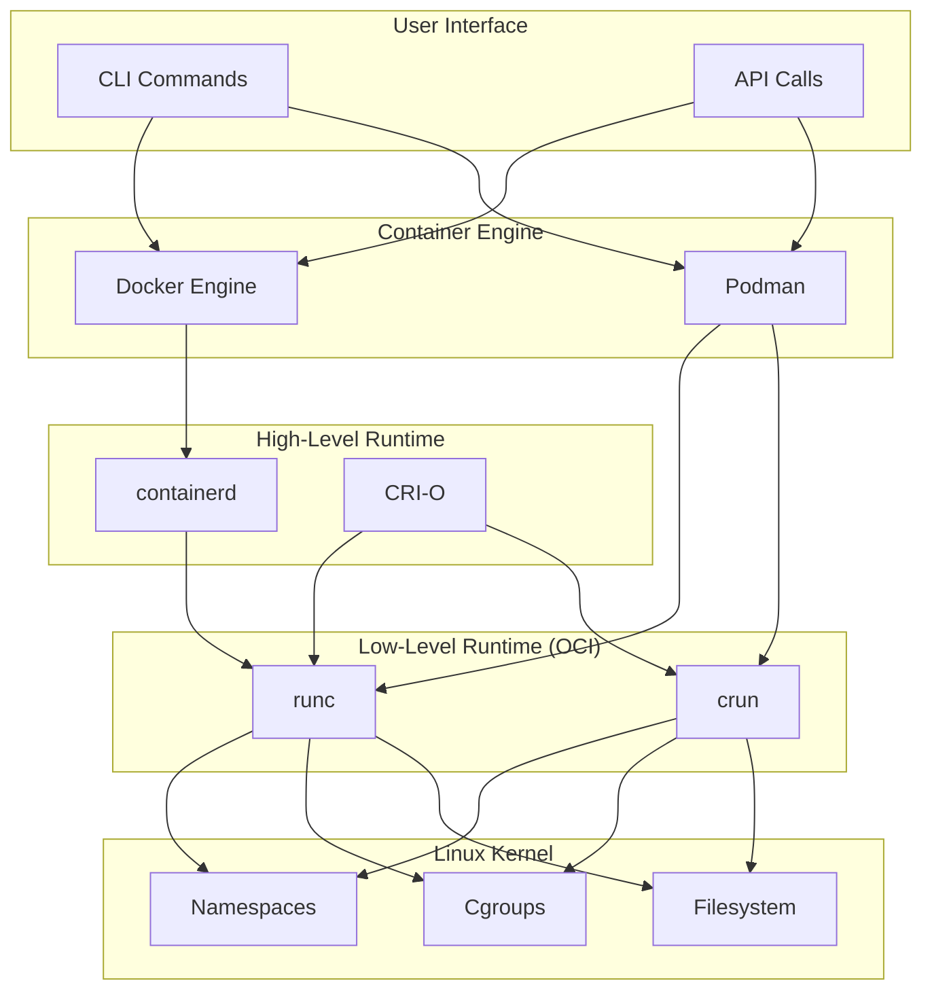
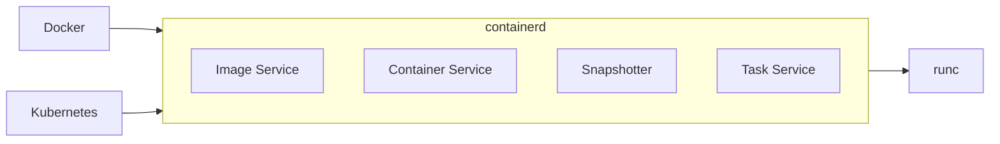
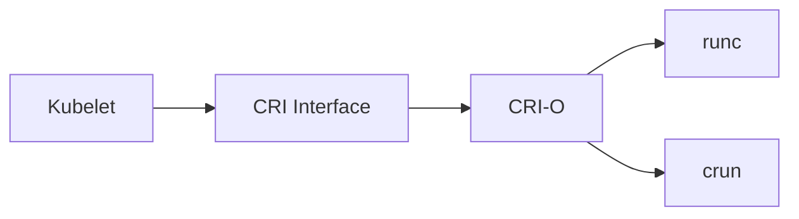
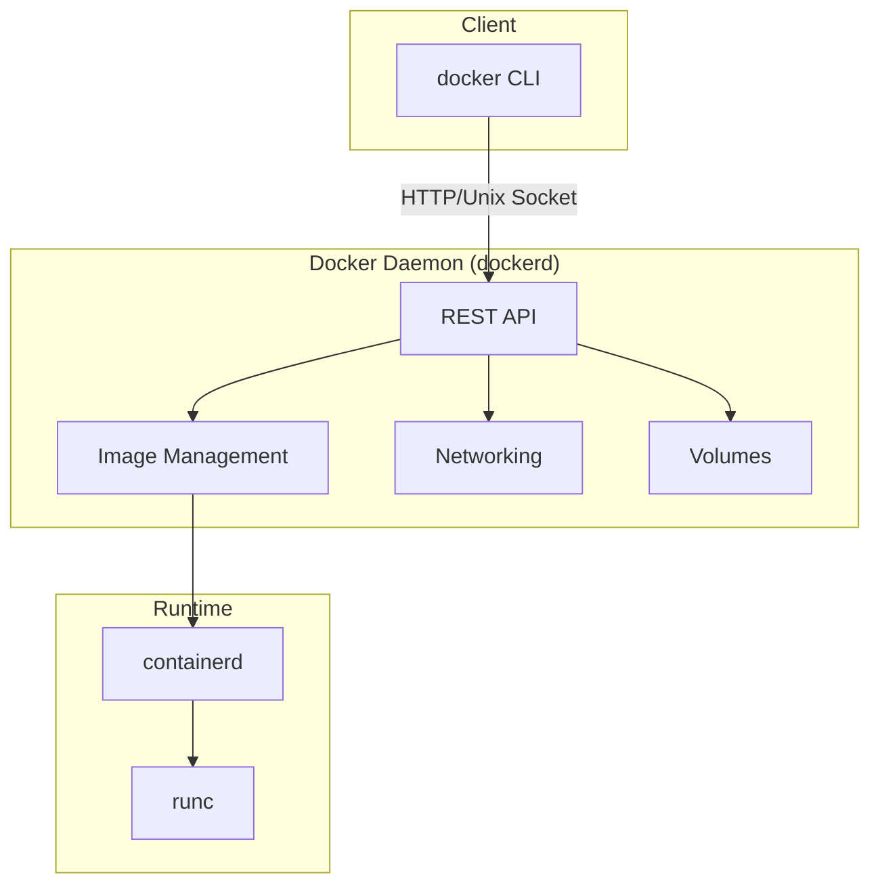
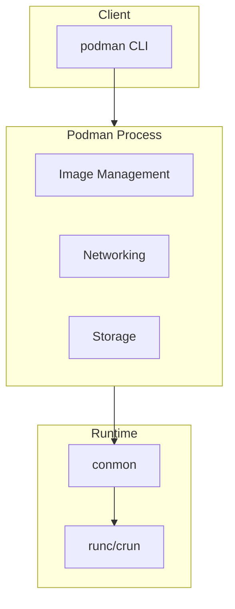
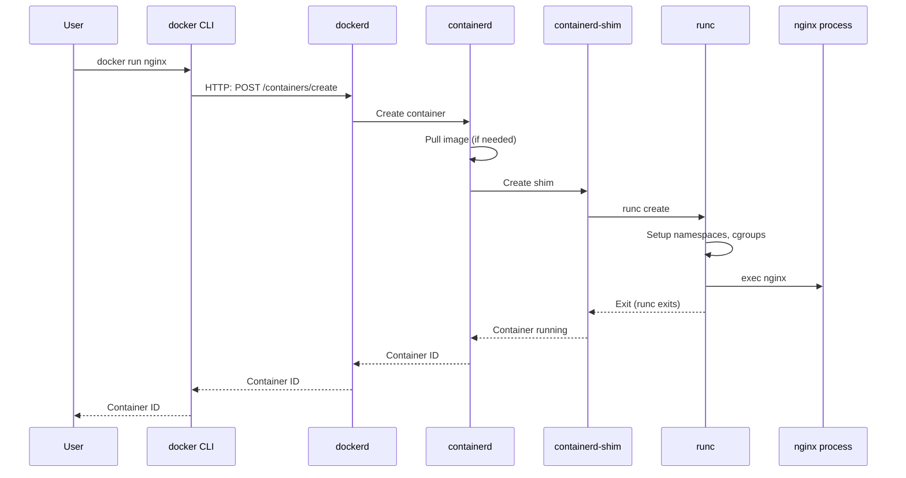
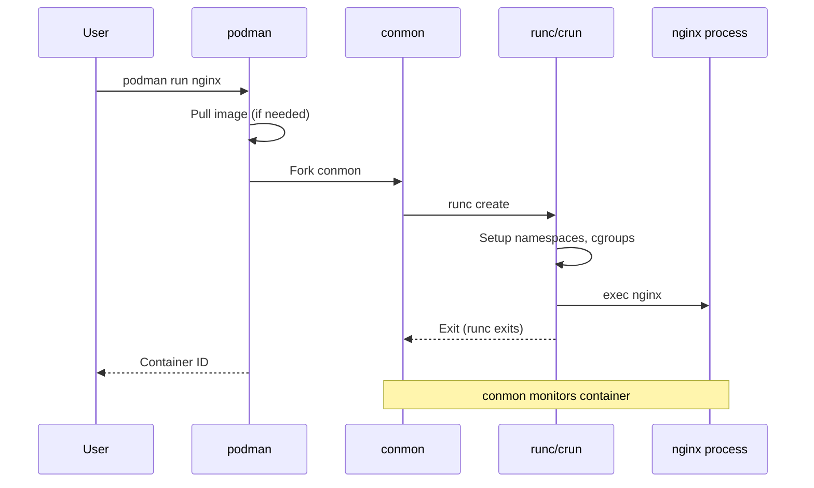

# Container Runtimes

> **Module:** concepts | **Level:** Foundation | **Time:** 25 minutes

## Learning Objectives

By the end of this section, you will be able to:

- Distinguish between high-level and low-level runtimes
- Explain the role of containerd, CRI-O, and runc
- Understand how Docker and Podman use these runtimes
- Describe the container creation process

---

## Runtime Architecture

Container runtimes operate at different levels:



---

## Low-Level Runtimes

Low-level runtimes directly interact with the Linux kernel to create containers.

### runc

The reference implementation of the OCI runtime specification.

| Aspect | Description |
|--------|-------------|
| **Maintainer** | Open Container Initiative |
| **Language** | Go |
| **Used By** | Docker, containerd, CRI-O, Podman |
| **Purpose** | Create and run containers |

**What runc does:**

1. Reads OCI runtime config (`config.json`)
2. Creates Linux namespaces
3. Sets up cgroups
4. Mounts filesystem
5. Executes container process

```bash
# Direct runc usage (rarely done manually)
mkdir -p rootfs
docker export $(docker create alpine) | tar -C rootfs -xf -
runc spec  # Generate config.json
runc run mycontainer
```

### crun

A faster, lightweight alternative to runc written in C.

| Aspect | Description |
|--------|-------------|
| **Maintainer** | Red Hat |
| **Language** | C |
| **Used By** | Podman (default on Fedora/RHEL) |
| **Advantage** | Faster startup, lower memory |

```bash
# Check which runtime Podman uses
podman info | grep -i ociruntime
# ociRuntime: crun

# Compare startup time
time runc run test-container
time crun run test-container
```

### Comparison

| Feature | runc | crun |
|---------|------|------|
| **Language** | Go | C |
| **Startup Time** | ~100ms | ~50ms |
| **Memory Usage** | ~10MB | ~2MB |
| **Compatibility** | Reference impl | Fully compatible |
| **cgroup v2** | Supported | Optimized |

---

## High-Level Runtimes

High-level runtimes manage images, containers, networking, and storage.

### containerd

Industry-standard container runtime, donated to CNCF by Docker.



**Responsibilities:**

| Component | Purpose |
|-----------|---------|
| **Image Service** | Pull, push, store images |
| **Container Service** | Container lifecycle |
| **Snapshotter** | Filesystem snapshots (layers) |
| **Task Service** | Process management |

```bash
# containerd CLI (ctr)
ctr images pull docker.io/library/alpine:latest
ctr run docker.io/library/alpine:latest mycontainer sh

# Check containerd status
systemctl status containerd
```

### CRI-O

Lightweight runtime designed specifically for Kubernetes.

| Aspect | Description |
|--------|-------------|
| **Purpose** | Kubernetes-only runtime |
| **CRI** | Implements Container Runtime Interface |
| **Minimal** | Only what Kubernetes needs |



---

## Docker Architecture

Docker uses a client-server architecture with containerd.



**Process hierarchy:**

```
systemd
└── dockerd (Docker daemon)
    └── containerd
        └── containerd-shim
            └── runc
                └── container process
```

### Docker Components

| Component | Purpose |
|-----------|---------|
| **docker CLI** | User interface |
| **dockerd** | Daemon managing containers |
| **containerd** | Container lifecycle |
| **containerd-shim** | Keeps container running if containerd restarts |
| **runc** | Creates containers |

---

## Podman Architecture

Podman uses a daemonless, fork-exec architecture.



**Process hierarchy:**

```
user shell
└── podman run
    └── conmon (container monitor)
        └── runc/crun
            └── container process
```

### Podman Components

| Component | Purpose |
|-----------|---------|
| **podman CLI** | User interface (no daemon) |
| **conmon** | Container monitor (handles stdio, exit codes) |
| **runc/crun** | Creates containers |

### Daemonless Advantages

| Advantage | Description |
|-----------|-------------|
| **No single point of failure** | No daemon to crash |
| **Rootless by default** | Runs as regular user |
| **Systemd integration** | Containers as systemd services |
| **Resource efficiency** | No always-running daemon |

---

## Container Creation Process

### Docker: `docker run nginx`



### Podman: `podman run nginx`



---

## Runtime Selection

### For Docker

Docker always uses containerd + runc (not configurable).

```bash
# Verify Docker runtime
docker info | grep -A5 "Runtimes"
# Runtimes: io.containerd.runc.v2 runc
# Default Runtime: runc
```

### For Podman

Podman can use runc or crun (configurable).

```bash
# Check current runtime
podman info | grep -i ociruntime
# ociRuntime: crun

# Configure in containers.conf
# ~/.config/containers/containers.conf
[engine]
runtime = "crun"  # or "runc"
```

### For Kubernetes

Kubernetes uses CRI (Container Runtime Interface).

| Runtime | CRI Implementation |
|---------|-------------------|
| containerd | Built-in CRI plugin |
| CRI-O | Native CRI |
| Docker | Removed in K8s 1.24 |

---

## Shim Process Explained

The shim keeps containers running independently of the runtime.

```
Without shim:
containerd dies → all containers die

With shim:
containerd dies → shim keeps containers running
                → containerd restarts
                → containerd reconnects to shims
```

### containerd-shim

```
containerd
├── containerd-shim (container A)
│   └── container A process
├── containerd-shim (container B)
│   └── container B process
└── containerd-shim (container C)
    └── container C process
```

### conmon (Podman)

```
user session
├── conmon (container A)
│   └── container A process
├── conmon (container B)
│   └── container B process
└── conmon (container C)
    └── container C process
```

---

## Key Takeaways

1. **Low-level runtimes** (runc, crun) create containers using kernel features
2. **High-level runtimes** (containerd, CRI-O) manage images and container lifecycle
3. **Docker uses containerd** under the hood
4. **Podman is daemonless** - no central daemon, fork-exec model
5. **Shim processes** keep containers running independently
6. **OCI compliance** ensures runtimes are interchangeable

---

## What's Next

Now that you understand container runtimes, we'll explore rootless container architecture and how user namespaces enable containers without root privileges.

Continue to: [05-rootless-architecture.md](05-rootless-architecture.md)

---

## Quick Quiz

1. What is the primary responsibility of runc?
   - [ ] Managing container images
   - [ ] Providing a CLI interface
   - [x] Creating containers using kernel features
   - [ ] Orchestrating multiple containers

2. How does Podman differ from Docker architecturally?
   - [ ] Podman uses a different image format
   - [x] Podman is daemonless (no central daemon)
   - [ ] Podman doesn't use namespaces
   - [ ] Podman only runs on Windows

3. What is the purpose of containerd-shim?
   - [ ] To make containers faster
   - [ ] To provide network isolation
   - [x] To keep containers running if containerd restarts
   - [ ] To manage container images

4. Which runtime is specifically designed for Kubernetes?
   - [ ] runc
   - [ ] containerd
   - [x] CRI-O
   - [ ] Docker

---

## Navigation

| Previous | Up | Next |
|----------|-----|------|
| [OCI Standards](03-oci-standards.md) | [Course Overview](../course_overview.md) | [Rootless Architecture](05-rootless-architecture.md) |
