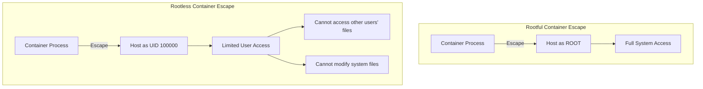
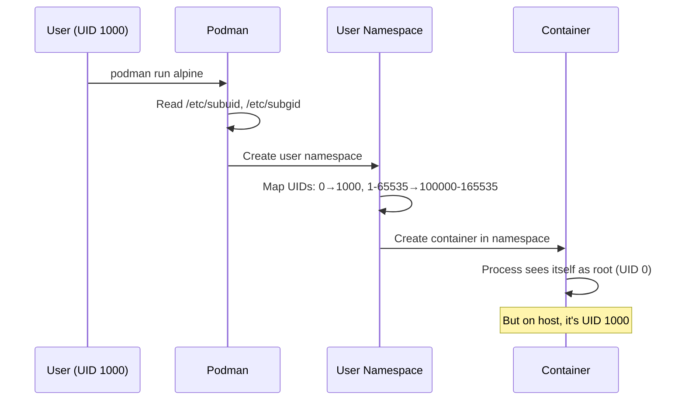
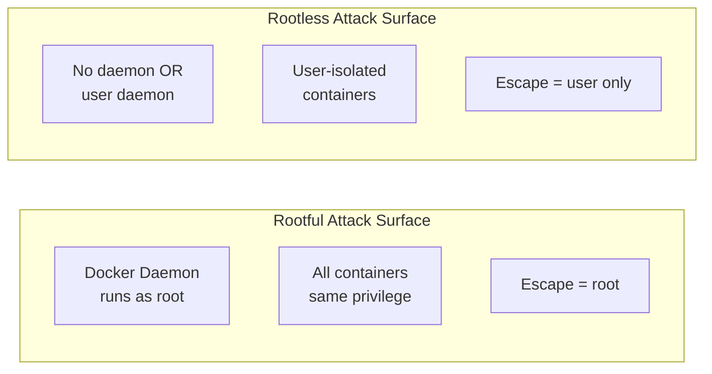

# Rootless Architecture

> **Module:** concepts | **Level:** Foundation | **Time:** 25 minutes

## Learning Objectives

By the end of this section, you will be able to:

- Explain what rootless containers are and why they matter
- Understand how user namespaces enable rootless operation
- Describe UID/GID mapping between host and container
- Identify the security benefits of rootless containers

---

## What Are Rootless Containers?

Rootless containers run without requiring root (administrator) privileges on the host system.

### Traditional (Rootful) Containers

```
┌─────────────────────────────────────────────────────────────┐
│                    Host System                               │
│                                                              │
│  root (UID 0) runs docker daemon                            │
│       │                                                      │
│       └── Container (process runs as root by default)       │
│           └── If container escapes, attacker has root!      │
│                                                              │
└─────────────────────────────────────────────────────────────┘
```

### Rootless Containers

```
┌─────────────────────────────────────────────────────────────┐
│                    Host System                               │
│                                                              │
│  user (UID 1000) runs podman                                │
│       │                                                      │
│       └── Container (root inside = UID 100000 outside)      │
│           └── If container escapes, attacker is unprivileged│
│                                                              │
└─────────────────────────────────────────────────────────────┘
```

---

## Why Rootless Matters

### Security Benefits

| Risk | Rootful | Rootless |
|------|---------|----------|
| **Container escape** | Attacker gets root | Attacker gets unprivileged user |
| **Daemon compromise** | Root access to host | User-level access only |
| **Privilege escalation** | Common attack vector | Much harder |
| **Multi-tenant isolation** | Weak (shared root) | Strong (separate users) |

### Real-World Implications



---

## User Namespaces Explained

User namespaces allow a process to have different user/group IDs inside vs outside the namespace.

### UID Mapping Visualization

```
┌─────────────────────────────────────────────────────────────┐
│                      Host System                             │
│                                                              │
│  Your user: UID 1000, GID 1000                              │
│  Subordinate UIDs: 100000-165535 (65536 UIDs)               │
│  Subordinate GIDs: 100000-165535 (65536 GIDs)               │
│                                                              │
│  ┌─────────────────────────────────────────────────────┐    │
│  │              Container (User Namespace)              │    │
│  │                                                      │    │
│  │  Container UID 0 (root)    →  Host UID 1000         │    │
│  │  Container UID 1           →  Host UID 100000       │    │
│  │  Container UID 2           →  Host UID 100001       │    │
│  │  Container UID 1000        →  Host UID 101000       │    │
│  │  ...                       →  ...                    │    │
│  │  Container UID 65535       →  Host UID 165535       │    │
│  │                                                      │    │
│  └─────────────────────────────────────────────────────┘    │
└─────────────────────────────────────────────────────────────┘
```

### Mapping Table

| Container UID | Host UID | Notes |
|---------------|----------|-------|
| 0 (root) | 1000 | Your user |
| 1 | 100000 | First subordinate UID |
| 1000 | 101000 | Typical app user |
| 65535 | 165535 | Last mapped UID |

---

## Subordinate UID/GID Configuration

Subordinate IDs are configured in `/etc/subuid` and `/etc/subgid`.

### Configuration Files

```bash
# /etc/subuid
# username:start_uid:count
dpham:100000:65536
alice:200000:65536
bob:300000:65536

# /etc/subgid
# username:start_gid:count
dpham:100000:65536
alice:200000:65536
bob:300000:65536
```

### Viewing Your Configuration

```bash
# View your subordinate UID range
cat /etc/subuid | grep $(whoami)
# dpham:100000:65536

# View your subordinate GID range
cat /etc/subgid | grep $(whoami)
# dpham:100000:65536

# Using getsubids (if available)
getsubids $(whoami)
```

### Modifying Configuration

```bash
# Add subordinate IDs for a user (requires root)
sudo usermod --add-subuids 100000-165535 --add-subgids 100000-165535 username

# Or edit files directly
sudo vi /etc/subuid
sudo vi /etc/subgid
```

---

## How Rootless Containers Work

### Process Flow



### Namespace Isolation

```bash
# Outside container (host)
$ id
uid=1000(dpham) gid=1000(dpham)

# Inside rootless container
$ podman run --rm alpine id
uid=0(root) gid=0(root)

# But the process on host is NOT root
$ ps aux | grep "alpine"
dpham    12345  ... /pause  # Running as dpham, not root
```

---

## Rootless in Docker vs Podman

### Docker Rootless

Docker requires explicit setup for rootless mode.

```bash
# Install rootless Docker
dockerd-rootless-setuptool.sh install

# Set environment variables
export PATH=/home/user/bin:$PATH
export DOCKER_HOST=unix:///run/user/1000/docker.sock

# Run Docker rootless
docker run hello-world
```

**Docker Rootless Characteristics:**
- Daemon runs as user (not root)
- Socket in user's runtime directory
- Requires setup script
- Some features limited (e.g., certain network modes)

### Podman Rootless

Podman is rootless by default.

```bash
# Just works - no special setup needed
podman run hello-world

# Socket location (if API enabled)
# $XDG_RUNTIME_DIR/podman/podman.sock
```

**Podman Rootless Characteristics:**
- Default mode
- No daemon required
- Full feature support
- Native systemd integration

---

## The keep-id Option

By default, UID 0 in the container maps to your UID on the host. But sometimes you want your host UID to appear as the same UID inside the container.

### Without keep-id

```
Host UID 1000 → Container UID 0 (root)
Files created in container owned by UID 0 inside, UID 1000 on host
```

### With keep-id

```bash
podman run --userns=keep-id -v $PWD:/data alpine touch /data/file
ls -la file
# -rw-r--r-- 1 dpham dpham 0 Jan 1 00:00 file
```

```
Host UID 1000 → Container UID 1000
Files created in container owned by UID 1000 everywhere
```

### Mapping Comparison

| Option | Container root (0) | Container 1000 | Your host UID |
|--------|-------------------|----------------|---------------|
| Default | → Host 1000 | → Host 101000 | 1000 |
| keep-id | → Host 100000 | → Host 1000 | 1000 |

---

## Limitations of Rootless Containers

| Limitation | Reason | Workaround |
|------------|--------|------------|
| **Ports < 1024** | Unprivileged users can't bind | Use port > 1024 or sysctl |
| **Some network modes** | Host networking limited | Use default bridge |
| **Ping** | Requires CAP_NET_RAW | sysctl net.ipv4.ping_group_range |
| **NFS mounts** | Permission issues | Use different storage |
| **File ownership** | UID mapping confusion | Use keep-id or :U flag |

### Enabling Low Ports (Example)

```bash
# Allow unprivileged users to bind to ports 80+
sudo sysctl net.ipv4.ip_unprivileged_port_start=80

# Or use a high port
podman run -p 8080:80 nginx  # Instead of -p 80:80
```

---

## Security Comparison

### Attack Surface



### Defense in Depth

| Layer | Rootful | Rootless |
|-------|---------|----------|
| **Namespace isolation** | Yes | Yes |
| **Cgroup limits** | Yes | Yes |
| **Seccomp filters** | Yes | Yes |
| **User namespace** | Optional | Required |
| **No root daemon** | No | Yes (Podman) |

---

## Practical Implications

### File Permissions

When you mount a host directory into a rootless container:

```bash
# Create directory with your permissions
mkdir mydata

# Mount into container
podman run -v ./mydata:/data alpine touch /data/file

# File owned by root inside, but mapped UID on host
ls -la mydata/
# -rw-r--r-- 1 100000 100000 0 file  # Owned by subordinate UID!
```

**Solutions:**

1. Use `--userns=keep-id`
2. Use `:U` volume option (Podman)
3. Match container user to expected UID

### Networking

```bash
# This fails (port 80 < 1024)
podman run -p 80:80 nginx
# Error: rootlessport cannot expose privileged port 80

# This works
podman run -p 8080:80 nginx

# Or allow low ports system-wide
sudo sysctl -w net.ipv4.ip_unprivileged_port_start=80
```

---

## Key Takeaways

1. **Rootless containers don't need root** on the host system
2. **User namespaces** map container UIDs to unprivileged host UIDs
3. **Subordinate UIDs** (`/etc/subuid`) define the mapping range
4. **Container root ≠ host root** in rootless mode
5. **Podman is rootless by default**, Docker requires setup
6. **Some limitations exist** (low ports, certain network modes)

---

## What's Next

Understanding rootless architecture is crucial for the file permission challenges we'll explore in the next section.

Continue to: [06-file-permissions.md](06-file-permissions.md)

---

## Quick Quiz

1. What makes rootless containers more secure than rootful?
   - [ ] They use encryption
   - [ ] They run faster
   - [x] Container escape gives unprivileged access, not root
   - [ ] They don't use namespaces

2. Where are subordinate UIDs configured?
   - [ ] /etc/passwd
   - [x] /etc/subuid
   - [ ] /etc/shadow
   - [ ] /etc/containers/uid.conf

3. In a rootless container, what host UID typically maps to container UID 0?
   - [ ] Host UID 0 (root)
   - [x] The user's UID who started the container
   - [ ] Nobody (65534)
   - [ ] Container UID 0 has no host mapping

4. What is the `--userns=keep-id` option used for?
   - [ ] To run as root
   - [ ] To disable user namespaces
   - [x] To map your host UID to the same UID inside the container
   - [ ] To use a specific username
