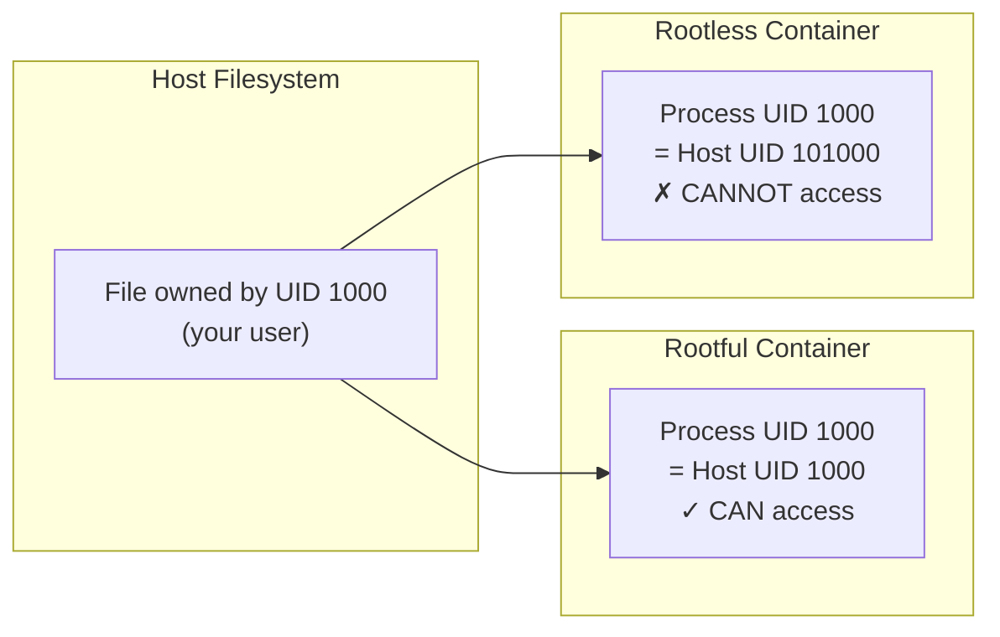
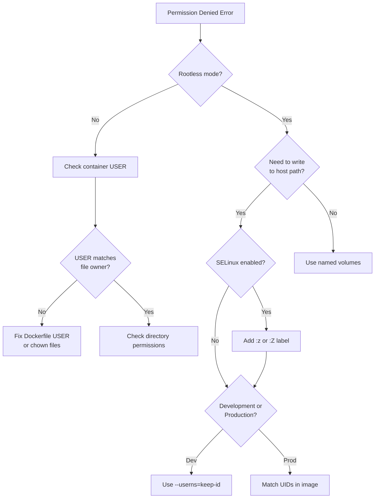

# File Permissions in Containers

> **Module:** concepts | **Level:** Foundation | **Time:** 25 minutes

## Learning Objectives

By the end of this section, you will be able to:

- Explain how file ownership works inside and outside containers
- Understand why permission denied errors occur
- Describe the relationship between container UIDs and host UIDs
- Apply strategies to resolve permission issues

---

## The Permission Problem

One of the most common issues with containers:

```bash
$ podman run -v ./data:/data alpine touch /data/file
touch: /data/file: Permission denied
```

**Why does this happen?** Understanding requires knowing how UIDs work across container boundaries.

---

## UIDs: Inside vs Outside

### Rootful Containers

```
┌─────────────────────────────────────────────────────────────┐
│                    Rootful Container                         │
│                                                              │
│  Container UID 0 (root) = Host UID 0 (root)                 │
│  Container UID 1000     = Host UID 1000                     │
│                                                              │
│  → Simple mapping, but security risk                        │
└─────────────────────────────────────────────────────────────┘
```

### Rootless Containers

```
┌─────────────────────────────────────────────────────────────┐
│                    Rootless Container                        │
│                                                              │
│  Container UID 0 (root) = Host UID 1000 (your user)         │
│  Container UID 1000     = Host UID 101000 (subordinate)     │
│                                                              │
│  → Complex mapping, permission mismatches common            │
└─────────────────────────────────────────────────────────────┘
```

---

## Common Scenarios

### Scenario 1: Writing to Bind Mount

```bash
# Host directory owned by you
$ ls -la data/
drwxr-xr-x 2 dpham dpham 4096 Jan 1 00:00 .

# Container runs as root (UID 0)
$ podman run -v ./data:/data alpine touch /data/file

# Rootful: Works (UID 0 = root, has permissions)
# Rootless: Container UID 0 = Host UID 1000, should work!
#           But wait...
```

**The Twist:** If the container process runs as a non-root user:

```dockerfile
FROM alpine
USER 1000  # Run as UID 1000
```

```bash
# Container UID 1000 = Host UID 101000 (rootless)
# Host directory owned by UID 1000
# Permission denied! (101000 ≠ 1000)
```

### Scenario 2: Files Created in Container

```bash
# Run container that creates a file
$ podman run -v ./data:/data alpine touch /data/newfile

# Check ownership on host (rootless)
$ ls -la data/
-rw-r--r-- 1 100000 100000 0 Jan 1 00:00 newfile

# File owned by UID 100000, not your user!
```

### Scenario 3: Reading Host Files

```bash
# Create file as your user
$ echo "secret" > data/config.txt

# Container user can't read it (rootless, non-root in container)
$ podman run -v ./data:/data --user 1000 alpine cat /data/config.txt
cat: can't open '/data/config.txt': Permission denied
```

---

## UID Mapping Visualization



---

## Solutions

### Solution 1: Use `--userns=keep-id` (Podman)

Maps your host UID to the same UID inside the container.

```bash
# Without keep-id
podman run --user 1000 -v ./data:/data alpine id
# uid=1000 gid=1000 (but maps to 101000 on host)

# With keep-id
podman run --userns=keep-id -v ./data:/data alpine id
# uid=1000 gid=1000 (maps to 1000 on host - your actual UID)

# Now file access works
podman run --userns=keep-id -v ./data:/data alpine touch /data/file
ls -la data/file
# -rw-r--r-- 1 dpham dpham 0 Jan 1 00:00 file
```

### Solution 2: Use `:U` Volume Option (Podman)

Automatically adjusts ownership using `chown` in the user namespace.

```bash
# The :U flag changes ownership to match container user
podman run -v ./data:/data:U alpine touch /data/file

# File is accessible
ls -la data/
# Note: Host sees subordinate UID, but container has access
```

### Solution 3: Match Container User to Expected UID

Build images with a user that matches your host UID.

```dockerfile
FROM alpine
ARG UID=1000
ARG GID=1000
RUN addgroup -g $GID appgroup && \
    adduser -u $UID -G appgroup -D appuser
USER appuser
```

```bash
docker build --build-arg UID=$(id -u) --build-arg GID=$(id -g) -t myapp .
```

### Solution 4: Run as Root in Container (Rootless)

In rootless mode, container root = your user on host.

```bash
# Don't specify --user, run as container root
podman run -v ./data:/data alpine touch /data/file
# Works because container UID 0 = Host UID 1000 (your user)
```

### Solution 5: Use Named Volumes

Named volumes are managed by Docker/Podman with correct permissions.

```bash
# Create named volume
podman volume create mydata

# Use named volume (permissions handled automatically)
podman run -v mydata:/data alpine touch /data/file

# Check volume location
podman volume inspect mydata
```

### Solution 6: Fix Permissions with `podman unshare`

Enter the user namespace to change ownership.

```bash
# Enter user namespace
podman unshare chown 1000:1000 ./data

# Now UID 1000 inside container can access
podman run --user 1000 -v ./data:/data alpine touch /data/file
```

---

## Solution Comparison

| Solution | Use Case | Pros | Cons |
|----------|----------|------|------|
| `--userns=keep-id` | Dev environments | Simple, intuitive | Podman only |
| `:U` flag | Quick fix | Automatic | May be slow for large dirs |
| Match UID in image | Production | Portable | Requires custom build |
| Run as root | Simple scripts | Just works | Less secure |
| Named volumes | Persistent data | Best practice | Data not on host path |
| `podman unshare` | One-time fix | Precise control | Manual process |

---

## Decision Flowchart



---

## SELinux Considerations (RHEL/Fedora)

SELinux adds another layer of access control.

```bash
# Permission denied even with correct UIDs?
# Check for SELinux denial
ausearch -m avc -ts recent

# Solution: Add volume labels
podman run -v ./data:/data:z alpine touch /data/file  # Shared
podman run -v ./data:/data:Z alpine touch /data/file  # Private
```

| Label | Meaning | Use Case |
|-------|---------|----------|
| `:z` | Shared label | Multiple containers access same volume |
| `:Z` | Private label | Only this container accesses volume |

---

## The 1000:1000 Convention

Many container images create a user with UID/GID 1000:

```dockerfile
# Common pattern
RUN useradd -u 1000 -g 1000 appuser
USER appuser
```

**Why 1000?** It's typically the first non-system user on Linux.

```bash
# Check your UID
id
# uid=1000(dpham) gid=1000(dpham)

# If your UID is 1000, images using UID 1000 work well
# If your UID is different (e.g., 501 on Mac), you may have issues
```

---

## Debugging Permission Issues

### Step 1: Identify the UIDs

```bash
# Your host UID
id

# Container process UID
podman run --rm alpine id

# File ownership on host
ls -ln ./data/

# File ownership inside container
podman run -v ./data:/data alpine ls -ln /data/
```

### Step 2: Check Mapping

```bash
# View UID mapping for running container
podman top <container> user huser

# View subordinate UID range
cat /etc/subuid | grep $(whoami)
```

### Step 3: Test Access

```bash
# Can container user read?
podman run -v ./data:/data:ro alpine cat /data/file

# Can container user write?
podman run -v ./data:/data alpine touch /data/test
```

---

## Key Takeaways

1. **Container UIDs map to host UIDs** differently in rootless mode
2. **Permission denied** usually means UID mismatch
3. **`--userns=keep-id`** is the simplest fix for development
4. **Named volumes** avoid permission issues for persistent data
5. **SELinux** may require `:z` or `:Z` labels
6. **Match UIDs** in production images for predictable behavior

---

## What's Next

Now that you understand the foundations of containers, we'll compare Docker and Podman architectures in detail.

Continue to: [07-docker-vs-podman.md](07-docker-vs-podman.md)

---

## Quick Quiz

1. In a rootless container, container UID 1000 maps to which host UID?
   - [ ] Host UID 1000
   - [ ] Host UID 0
   - [x] A subordinate UID (e.g., 101000)
   - [ ] It doesn't map to any host UID

2. What does the `--userns=keep-id` option do?
   - [ ] Keeps the container ID the same across restarts
   - [x] Maps your host UID to the same UID inside the container
   - [ ] Preserves file permissions when copying
   - [ ] Enables user namespace isolation

3. What is the `:U` volume flag used for in Podman?
   - [ ] Unmounting the volume
   - [ ] Using UDP instead of TCP
   - [x] Adjusting volume ownership to match container user
   - [ ] Enabling universal access

4. Why do many container images use UID 1000?
   - [ ] It's required by OCI specification
   - [ ] It provides better security
   - [x] It's typically the first non-system user on Linux
   - [ ] It's the only UID containers can use
