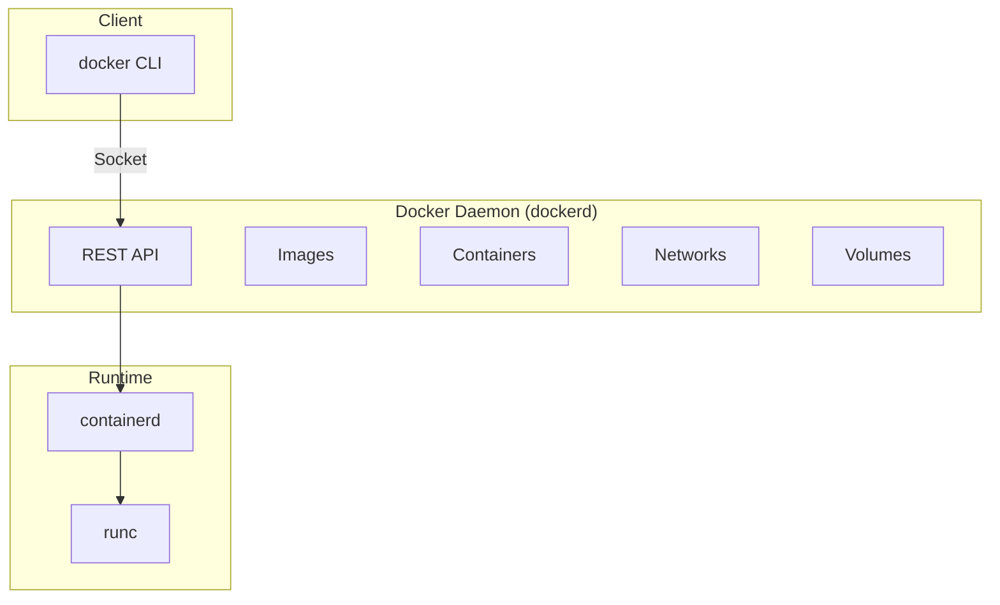
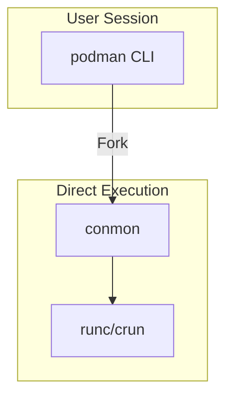
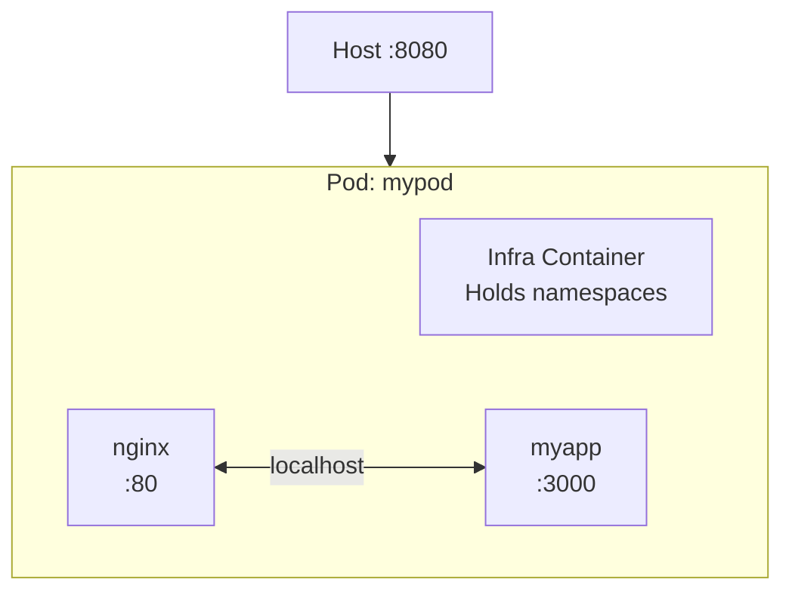

# Docker vs Podman

> **Module:** concepts | **Level:** Foundation | **Time:** 20 minutes

## Learning Objectives

By the end of this section, you will be able to:

- Compare Docker and Podman architectures
- Identify key differences in default behavior
- Understand when to choose each tool
- Recognize command compatibility between tools

---

## Architecture Comparison

### Docker: Client-Server (Daemon)



**Key Characteristics:**
- Central daemon (`dockerd`) runs as root
- CLI communicates via Unix socket
- Daemon manages all container operations
- Containers are children of the daemon

### Podman: Daemonless (Fork-Exec)



**Key Characteristics:**
- No daemon required
- CLI directly manages containers
- Containers are children of the user's session
- Each `podman` command is independent

---

## Feature Comparison

| Feature | Docker | Podman |
|---------|--------|--------|
| **Architecture** | Daemon-based | Daemonless |
| **Default Mode** | Rootful | Rootless |
| **Init System** | Requires daemon | Native systemd integration |
| **Swarm** | Supported | Not supported |
| **Compose** | `docker compose` | `podman-compose` or `podman compose` |
| **Pods** | Not native | Native support |
| **Kubernetes YAML** | Not supported | `podman generate kube` |
| **Build Tool** | BuildKit | Buildah (integrated) |
| **Socket** | `/var/run/docker.sock` | User-specific or system |
| **Desktop App** | Docker Desktop | Podman Desktop |

---

## Default Behavior Differences

### Rootful vs Rootless

```bash
# Docker - defaults to rootful
docker run alpine id
# uid=0(root) gid=0(root)
# Daemon runs as root, container as root

# Podman - defaults to rootless
podman run alpine id
# uid=0(root) gid=0(root)
# But process on host runs as your user, not system root
```

### Socket Location

```bash
# Docker
/var/run/docker.sock           # System-wide (root)
/run/user/1000/docker.sock     # Rootless Docker

# Podman
/run/podman/podman.sock        # System-wide (root)
/run/user/1000/podman/podman.sock  # Rootless (per-user)
```

### Image Storage

```bash
# Docker (rootful)
/var/lib/docker/

# Podman (rootful)
/var/lib/containers/

# Podman (rootless)
~/.local/share/containers/
```

---

## Command Compatibility

Most commands are identical:

```bash
# These work the same in both
docker run -d --name web -p 8080:80 nginx
podman run -d --name web -p 8080:80 nginx

docker ps
podman ps

docker images
podman images

docker build -t myapp .
podman build -t myapp .

docker logs web
podman logs web

docker exec -it web sh
podman exec -it web sh
```

### Creating an Alias

```bash
# Use Podman as Docker drop-in replacement
alias docker=podman

# Or install podman-docker package (creates symlink)
sudo dnf install podman-docker  # Fedora/RHEL
```

---

## Compose Comparison

### Docker Compose

```bash
# Built into Docker CLI
docker compose up -d
docker compose down
docker compose logs
```

### Podman Compose Options

**Option 1: podman-compose (Python)**
```bash
pip install podman-compose
podman-compose up -d
```

**Option 2: podman compose (Podman 4.1+)**
```bash
# Uses docker-compose or podman-compose as backend
podman compose up -d
```

**Option 3: Quadlet (Podman 4.4+)**
```bash
# Native systemd integration
# Place files in ~/.config/containers/systemd/
# myapp.container file
```

---

## Pods: Podman's Unique Feature

Podman natively supports pods (like Kubernetes):

```bash
# Create a pod
podman pod create --name mypod -p 8080:80

# Run containers in the pod
podman run -d --pod mypod --name web nginx
podman run -d --pod mypod --name app myapp

# Containers share network namespace (localhost)
# Web can reach app at localhost:port
```



### Docker Equivalent

Docker uses Compose for multi-container apps:

```yaml
# docker-compose.yml
services:
  web:
    image: nginx
    ports:
      - "8080:80"
  app:
    image: myapp
# Containers communicate via service names, not localhost
```

---

## Kubernetes Integration

### Podman

```bash
# Generate Kubernetes YAML from container
podman generate kube mycontainer > pod.yaml

# Generate from pod
podman generate kube mypod > pod.yaml

# Run Kubernetes YAML
podman play kube pod.yaml

# Stop and remove
podman play kube --down pod.yaml
```

### Docker

Docker doesn't have native Kubernetes YAML support. Use:
- `kompose` to convert docker-compose.yml
- Write Kubernetes manifests manually

---

## Systemd Integration

### Podman (Native)

```bash
# Generate systemd unit file
podman generate systemd --new --name mycontainer > ~/.config/systemd/user/mycontainer.service

# Enable and start
systemctl --user enable --now mycontainer.service

# Or use Quadlet (Podman 4.4+)
# Create ~/.config/containers/systemd/myapp.container
```

**Quadlet Example:**
```ini
# ~/.config/containers/systemd/webapp.container
[Container]
Image=nginx
PublishPort=8080:80
Volume=./html:/usr/share/nginx/html:ro

[Service]
Restart=always

[Install]
WantedBy=default.target
```

### Docker

```bash
# Restart policies (not true systemd integration)
docker run -d --restart=always mycontainer

# Or create systemd unit manually
# Requires daemon to be running
```

---

## When to Use Each

### Choose Docker When

| Scenario | Reason |
|----------|--------|
| **Docker Swarm needed** | Podman doesn't support Swarm |
| **Docker Desktop preferred** | Better Windows/Mac integration (historically) |
| **Team uses Docker** | Consistency with existing workflows |
| **Third-party tooling** | Some tools only support Docker socket |
| **Docker-specific features** | BuildKit advanced features |

### Choose Podman When

| Scenario | Reason |
|----------|--------|
| **Security priority** | Rootless by default |
| **RHEL/Fedora environment** | Native integration |
| **No daemon wanted** | Daemonless architecture |
| **Kubernetes workflows** | Native pod and YAML support |
| **systemd integration** | Quadlet and generate systemd |
| **Multi-user systems** | Better isolation between users |

---

## Migration Path

### Docker to Podman

```bash
# 1. Install Podman
sudo dnf install podman  # Fedora/RHEL
sudo apt install podman  # Ubuntu/Debian

# 2. Create alias (optional)
alias docker=podman

# 3. Move images (optional)
podman pull docker-daemon:myimage:latest
# Or re-pull from registry

# 4. Update scripts
# Replace 'docker' with 'podman' or use alias

# 5. Handle compose files
pip install podman-compose
# Or use podman compose
```

### Podman to Docker

```bash
# 1. Install Docker
# Follow docs.docker.com instructions

# 2. Push images to registry
podman push myimage registry.example.com/myimage

# 3. Pull with Docker
docker pull registry.example.com/myimage

# 4. Convert pods to Compose
# Manual process - pods don't have direct equivalent
```

---

## Summary Table

| Aspect | Docker | Podman |
|--------|--------|--------|
| **Philosophy** | Integrated platform | Unix-style tools |
| **Daemon** | Required | None |
| **Root** | Default | Optional |
| **Containers** | Children of daemon | Children of user |
| **Compose** | Native | podman-compose/Quadlet |
| **Pods** | Via Compose | Native |
| **K8s YAML** | Not supported | Supported |
| **Swarm** | Supported | Not supported |
| **systemd** | Limited | Native |
| **Socket API** | Standard | Compatible |

---

## Key Takeaways

1. **Docker uses a daemon**, Podman is daemonless
2. **Commands are nearly identical** - easy to switch
3. **Podman is rootless by default**, Docker requires setup
4. **Podman has native pod support**, Docker uses Compose
5. **Both produce OCI-compliant images** - full interoperability
6. **Choose based on your environment** and security requirements

---

## What's Next

You've completed the concepts module! You now understand:
- What containers are and why they matter
- How containers work (namespaces, cgroups, union fs)
- OCI standards and container runtimes
- Rootless architecture and file permissions
- Docker vs Podman differences

Continue to the learning path: [../learning-paths/part1-beginner/01-introduction.md](../learning-paths/part1-beginner/01-introduction.md)

---

## Quick Quiz

1. What is the main architectural difference between Docker and Podman?
   - [ ] Docker uses OCI images, Podman doesn't
   - [x] Docker requires a daemon, Podman is daemonless
   - [ ] Podman only works on Windows
   - [ ] Docker is faster than Podman

2. Which feature is unique to Podman?
   - [ ] Container networking
   - [ ] Image building
   - [x] Native pod support
   - [ ] Volume management

3. How can you use Podman as a drop-in replacement for Docker?
   - [ ] Install a compatibility layer
   - [x] Create an alias: `alias docker=podman`
   - [ ] Modify the kernel
   - [ ] It's not possible

4. Which tool should you choose if you need Docker Swarm?
   - [x] Docker
   - [ ] Podman
   - [ ] Either works
   - [ ] Neither supports Swarm
