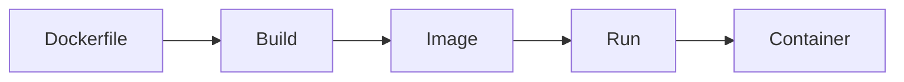

# Course Overview

> **Containers: From Zero to Certification**

## Course Description

A comprehensive course on container technology covering both Docker and Podman. Designed for learners with zero container knowledge, progressing through practical skills to Docker Certified Associate (DCA) certification readiness.

---

## Target Audience

- Complete beginners with no container experience
- Developers wanting to containerize applications
- System administrators managing container infrastructure
- DevOps engineers building CI/CD pipelines
- Professionals preparing for Docker Certified Associate (DCA) exam

---

## Prerequisites

### Required

- Basic command-line/terminal experience
- Familiarity with any programming or scripting language
- Computer with internet access

### Recommended

- Basic Linux knowledge (file permissions, processes)
- Understanding of client-server architecture
- Familiarity with YAML syntax

### Not Required

- Prior container experience
- Cloud platform experience
- Kubernetes knowledge (covered in course)

---

## Learning Outcomes

By completing this course, you will be able to:

1. **Explain** container fundamentals including namespaces, cgroups, and OCI standards
2. **Build** efficient container images using Dockerfiles and multi-stage builds
3. **Configure** container networking, storage, and volumes for various scenarios
4. **Run** containers in rootless mode and troubleshoot permission issues
5. **Orchestrate** multi-container applications with Docker Compose and Swarm
6. **Implement** security best practices aligned with NIST SP 800-190 and CIS Benchmarks
7. **Pass** the Docker Certified Associate (DCA) certification exam
8. **Apply** emerging practices including WebAssembly containers and supply chain security

---

## Time Estimates

### By Learning Path

| Path | Duration | Commitment |
|------|----------|------------|
| Complete Course | 10 weeks | 8-10 hrs/week |
| Quick Start | 2 weeks | 10-12 hrs/week |
| DCA Exam Focus | 6 weeks | 10-12 hrs/week |
| Security Deep Dive | 3 weeks | 8-10 hrs/week |

### By Module

| Module | Reading | Labs | Total |
|--------|---------|------|-------|
| concepts/ | 3 hrs | - | 3 hrs |
| part1-beginner/ | 4 hrs | 2 hrs | 6 hrs |
| part2-intermediate/ | 5 hrs | 4 hrs | 9 hrs |
| part3-advanced/ | 6 hrs | 4 hrs | 10 hrs |
| kubernetes-essentials/ | 3 hrs | 2 hrs | 5 hrs |
| storage/ | 2 hrs | 1 hr | 3 hrs |
| networking/ | 3 hrs | 2 hrs | 5 hrs |
| rootless/ | 3 hrs | 2 hrs | 5 hrs |
| security/ | 3 hrs | 2 hrs | 5 hrs |
| operations/ | 2 hrs | 1 hr | 3 hrs |
| comparison/ | 2 hrs | - | 2 hrs |
| certification/ | 2 hrs | - | 2 hrs |
| emerging/ | 3 hrs | - | 3 hrs |
| **Total** | **41 hrs** | **20 hrs** | **61 hrs** |

---

## Course Features

### Dual Runtime Coverage

Learn both Docker and Podman side-by-side. Every command example shows both tools.

```bash
# Docker
docker run -d --name web nginx

# Podman
podman run -d --name web nginx
```

### Visual Learning

Mermaid diagrams, flowcharts, and architecture visuals for every major concept.



### Hands-on Labs

9 comprehensive labs with:
- Step-by-step instructions
- Validation scripts
- Complete solutions

### DCA Exam Alignment

Content maps directly to all 6 certification domains:

| Domain | Weight | Modules |
|--------|--------|---------|
| Orchestration | 25% | part3-advanced/, kubernetes-essentials/ |
| Image Creation | 20% | part1-beginner/, part2-intermediate/ |
| Installation | 15% | part1-beginner/, operations/ |
| Networking | 15% | networking/ |
| Security | 15% | security/, rootless/ |
| Storage | 10% | storage/ |

### Security Standards

Content aligned with industry security frameworks:
- NIST SP 800-190 (Application Container Security Guide)
- CIS Docker Benchmark
- CIS Kubernetes Benchmark

---

## Assessment Strategy

### Quizzes

- 205 total questions across all modules
- DCA exam format (MCQ + DOMC)
- Immediate feedback with explanations

### Labs

- 9 hands-on labs (45-90 minutes each)
- Validation scripts verify completion
- Solutions provided for reference

### Self-Assessment Checkpoints

Each module includes skill verification checklists.

### Certification Readiness

- Score 80%+ on all quizzes
- Complete all labs
- Pass 3 practice exams at 70%+

---

## Tools Covered

### Container Runtimes

- Docker Engine
- Podman
- containerd (conceptual)

### Build Tools

- Dockerfile
- Buildah
- BuildKit / Buildx

### Orchestration

- Docker Compose
- Docker Swarm
- Kubernetes (basics)

### Security Tools

- Docker Content Trust
- Trivy
- Docker Scout
- cosign

### Supporting Tools

- Skopeo (image transfer)
- dive (image analysis)
- ctop (container monitoring)

---

## Environment Setup

### Option 1: Play with Docker (Recommended for beginners)

Browser-based, no installation required.
- URL: [labs.play-with-docker.com](https://labs.play-with-docker.com/)
- Limitation: 4-hour sessions

### Option 2: Docker Desktop

Full-featured local environment.
- Windows: [Docker Desktop for Windows](https://docs.docker.com/desktop/install/windows-install/)
- Mac: [Docker Desktop for Mac](https://docs.docker.com/desktop/install/mac-install/)
- Linux: [Docker Engine](https://docs.docker.com/engine/install/)

### Option 3: Podman Desktop

Docker-compatible, daemonless.
- All platforms: [Podman Desktop](https://podman-desktop.io/)

### Option 4: Linux VM/WSL

For rootless container practice.
- Recommended: Ubuntu 22.04+ or Fedora 38+
- WSL2 on Windows works well

---

## Getting Help

### During the Course

- Review the [glossary](glossary.md) for terminology
- Check [troubleshooting sections](learning-paths/part3-advanced/13-troubleshooting.md) in each module
- Use the [quick reference](quick_reference.md) for commands

### External Resources

- [Docker Community Forums](https://forums.docker.com/)
- [Stack Overflow - docker tag](https://stackoverflow.com/questions/tagged/docker)
- [Reddit r/docker](https://reddit.com/r/docker)

---

## Version Information

| Item | Version |
|------|---------|
| Course Version | 1.0 |
| Docker Coverage | 24.x / 25.x |
| Podman Coverage | 4.x / 5.x |
| DCA Exam Guide | v1.5 (January 2025) |
| Last Updated | January 2026 |

---

## Next Steps

1. Review the [glossary](glossary.md) for key terminology
2. Set up your [lab environment](#environment-setup)
3. Choose your [learning path](README.md#learning-paths)
4. Start with [concepts/01-what-are-containers.md](concepts/01-what-are-containers.md)
