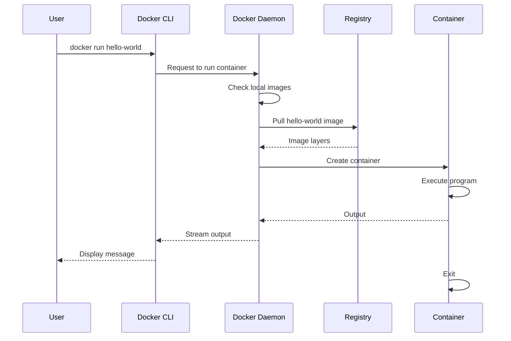

# Hello World Example

> **Level:** Beginner | **Time:** 5 minutes

## Overview

This example demonstrates running your first container and understanding the basic Docker workflow.

## What You'll Learn

- How to pull an image
- How to run a container
- What happens during container execution

## Steps

### 1. Run Hello World

```bash
# Docker
docker run hello-world

# Podman
podman run hello-world
```

### 2. Observe the Output

```
Unable to find image 'hello-world:latest' locally
latest: Pulling from library/hello-world
c1ec31eb5944: Pull complete
Digest: sha256:d211f485f2dd1dee407a80973c8f129f00d54604d2c90732e8e320e5038a0348
Status: Downloaded newer image for hello-world:latest

Hello from Docker!
This message shows that your installation appears to be working correctly.

To generate this message, Docker took the following steps:
 1. The Docker client contacted the Docker daemon.
 2. The Docker daemon pulled the "hello-world" image from the Docker Hub.
 3. The Docker daemon created a new container from that image.
 4. The Docker daemon streamed that output to the Docker client.
...
```

### 3. Understand What Happened



### 4. Check Image Was Downloaded

```bash
docker images hello-world
```

Output:
```
REPOSITORY    TAG       IMAGE ID       CREATED        SIZE
hello-world   latest    d2c94e258dcb   7 months ago   13.3kB
```

### 5. Check Container Exists

```bash
docker ps -a
```

Output:
```
CONTAINER ID   IMAGE         COMMAND    CREATED          STATUS                      NAMES
abc123         hello-world   "/hello"   2 minutes ago    Exited (0) 2 minutes ago    peaceful_morse
```

## Cleanup

```bash
# Remove the container
docker rm $(docker ps -a -q --filter ancestor=hello-world)

# Remove the image (optional)
docker rmi hello-world
```

## Key Points

1. **Images are pulled automatically** if not found locally
2. **Containers exit** when their main process completes
3. **Exited containers remain** until explicitly removed
4. **The hello-world image** is tiny (13KB) - just prints a message

## Next Steps

- [Run an interactive container](../first-dockerfile/)
- [Create your first Dockerfile](../simple-web-server/)
