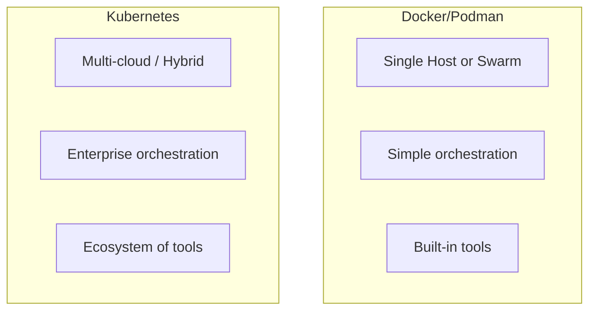
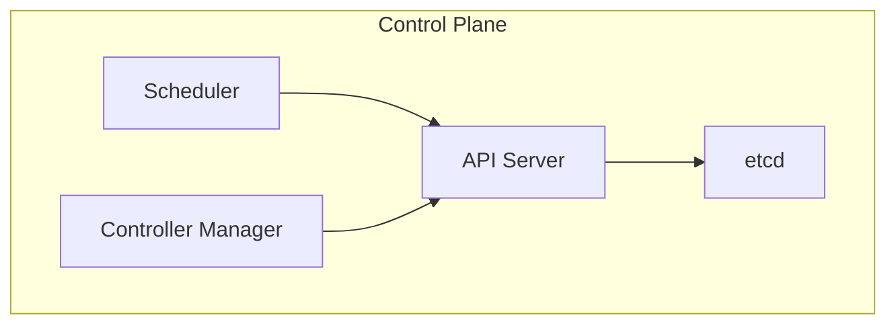
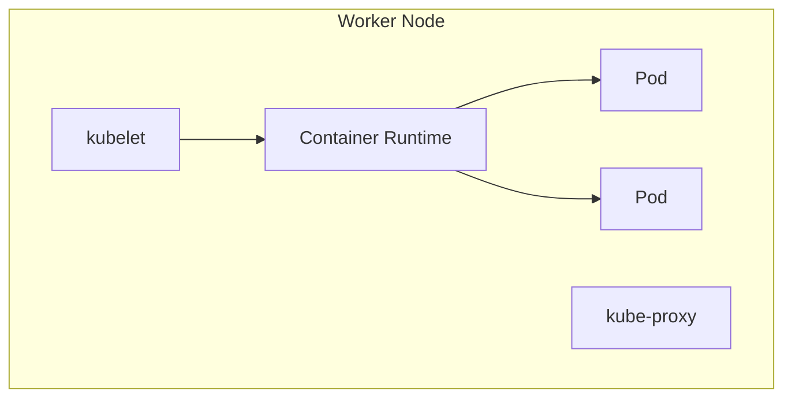

# Introduction to Kubernetes

> **Module:** Kubernetes Essentials | **Level:** Advanced | **Time:** 30 minutes

## Learning objectives

By the end of this section, you will be able to:

- Understand Kubernetes architecture
- Explain the relationship between Docker/Podman and Kubernetes
- Identify when to use Kubernetes vs Docker Swarm
- Navigate the Kubernetes ecosystem

---

## What is Kubernetes?

Kubernetes (K8s) is an open-source container orchestration platform originally developed by Google. It automates deployment, scaling, and management of containerized applications.

### The name

**Kubernetes** (Greek: κυβερνήτης) means "helmsman" or "pilot"

**K8s** is shorthand: K + 8 letters + s

---

## Docker/Podman to Kubernetes

### What you know already

| Docker/Podman | Kubernetes Equivalent |
|---------------|----------------------|
| Container | Container (in a Pod) |
| Image | Image |
| docker run | kubectl run / Deployment |
| Compose service | Deployment + Service |
| Compose network | Service / NetworkPolicy |
| Volume | PersistentVolume |
| Swarm service | Deployment |
| Stack | Helm chart |

### Key differences



---

## When to use what

### Docker Compose / Podman Compose

- Development environments
- Single-host applications
- Simple multi-container apps
- Quick prototyping

### Docker Swarm

- Small to medium production deployments
- Teams familiar with Docker
- Simpler orchestration needs
- When you want built-in Docker tools

### Kubernetes

- Large-scale production
- Multi-cloud or hybrid deployments
- Complex microservices architectures
- Need for advanced features (auto-scaling, rolling updates)
- Enterprise requirements (RBAC, audit logging)

---

## Kubernetes architecture

### Control plane (masters)



| Component | Function |
|-----------|----------|
| **API Server** | Frontend for control plane, REST API |
| **etcd** | Distributed key-value store for cluster state |
| **Scheduler** | Assigns pods to nodes |
| **Controller Manager** | Runs controller processes |

### Worker nodes



| Component | Function |
|-----------|----------|
| **kubelet** | Agent that runs on each node |
| **kube-proxy** | Network proxy, implements Services |
| **Container Runtime** | Docker, containerd, or CRI-O |

---

## Core concepts

### Pods

The smallest deployable unit in Kubernetes:

```yaml
apiVersion: v1
kind: Pod
metadata:
  name: my-pod
spec:
  containers:
    - name: my-container
      image: nginx:alpine
      ports:
        - containerPort: 80
```

### Deployments

Manage replicated applications:

```yaml
apiVersion: apps/v1
kind: Deployment
metadata:
  name: my-deployment
spec:
  replicas: 3
  selector:
    matchLabels:
      app: myapp
  template:
    metadata:
      labels:
        app: myapp
    spec:
      containers:
        - name: myapp
          image: myapp:v1
```

### Services

Network abstraction for accessing pods:

```yaml
apiVersion: v1
kind: Service
metadata:
  name: my-service
spec:
  selector:
    app: myapp
  ports:
    - port: 80
      targetPort: 8080
  type: ClusterIP
```

---

## Kubernetes distributions

### Managed Kubernetes

| Provider | Service |
|----------|---------|
| Google Cloud | GKE (Google Kubernetes Engine) |
| AWS | EKS (Elastic Kubernetes Service) |
| Azure | AKS (Azure Kubernetes Service) |
| DigitalOcean | DOKS |

### Self-managed

| Distribution | Use Case |
|--------------|----------|
| kubeadm | Official installer |
| k3s | Lightweight, edge computing |
| kind | Local development |
| minikube | Local development |
| OpenShift | Enterprise (Red Hat) |
| Rancher | Multi-cluster management |

---

## Local development options

### minikube

```bash
# Install minikube
brew install minikube  # macOS
# or download from https://minikube.sigs.k8s.io/

# Start cluster
minikube start

# Access dashboard
minikube dashboard
```

### kind (Kubernetes in Docker)

```bash
# Install kind
brew install kind  # macOS
# or go install sigs.k8s.io/kind@latest

# Create cluster
kind create cluster

# Create multi-node cluster
kind create cluster --config kind-config.yaml
```

```yaml
# kind-config.yaml
kind: Cluster
apiVersion: kind.x-k8s.io/v1alpha4
nodes:
  - role: control-plane
  - role: worker
  - role: worker
```

### k3s

```bash
# Install k3s (single command!)
curl -sfL https://get.k3s.io | sh -

# Check nodes
sudo k3s kubectl get nodes
```

---

## kubectl basics

### Configuration

```bash
# View current config
kubectl config view

# List contexts
kubectl config get-contexts

# Switch context
kubectl config use-context my-cluster
```

### Essential commands

```bash
# Get resources
kubectl get pods
kubectl get services
kubectl get deployments
kubectl get all

# Describe resource
kubectl describe pod my-pod

# Logs
kubectl logs my-pod
kubectl logs -f my-pod  # Follow

# Execute in container
kubectl exec -it my-pod -- /bin/sh

# Apply configuration
kubectl apply -f deployment.yaml

# Delete
kubectl delete -f deployment.yaml
kubectl delete pod my-pod
```

---

## Kubernetes vs Docker Swarm

| Feature | Docker Swarm | Kubernetes |
|---------|--------------|------------|
| Setup | Simple | Complex |
| Learning curve | Low | Steep |
| Scalability | Hundreds of nodes | Thousands of nodes |
| Auto-scaling | Manual | Built-in HPA |
| Load balancing | Built-in | Requires Ingress |
| Storage | Volume plugins | CSI, many options |
| Networking | Overlay | CNI plugins |
| Community | Smaller | Massive |
| Cloud support | Limited | All major clouds |

---

## When transitioning from Docker

### What stays the same

- Container images (same format)
- Image registries
- Container runtime concepts
- Basic troubleshooting skills

### What changes

- Declarative YAML everywhere
- Everything is an API resource
- More networking concepts
- New terminology

### Translation guide

```bash
# Docker                          # Kubernetes
docker run nginx                  kubectl run nginx --image=nginx
docker ps                         kubectl get pods
docker logs container             kubectl logs pod
docker exec -it container sh      kubectl exec -it pod -- sh
docker-compose up                 kubectl apply -f manifests/
```

---

## Key takeaways

1. **Kubernetes is the industry standard** for production orchestration
2. **Your container skills transfer** - images and concepts remain
3. **Start local** with minikube or kind
4. **Learn incrementally** - Pods → Deployments → Services → more
5. **Use Docker/Compose for development**, Kubernetes for production

---

## What's next

Learn about Kubernetes core objects in detail.

---

## Navigation

| Previous | Up | Next |
|----------|-----|------|
| [Part 3 Quiz](../learning-paths/part3-advanced/quiz.md) | [Course Overview](../course_overview.md) | [Kubernetes Objects](02-kubernetes-objects.md) |
