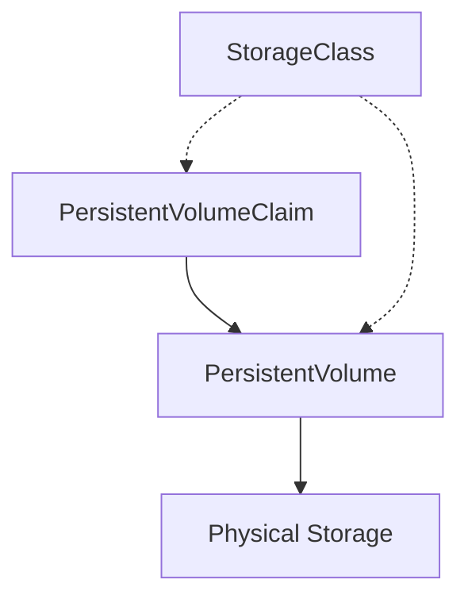

# Kubernetes storage

> **Module:** Kubernetes Essentials | **Level:** Advanced | **Time:** 25 minutes

## Learning objectives

By the end of this section, you will be able to:

- Understand Kubernetes storage concepts
- Create and use PersistentVolumes
- Deploy stateful applications
- Compare storage options

---

## Storage concepts

### From Docker to Kubernetes

| Docker | Kubernetes |
|--------|------------|
| Named volume | PersistentVolumeClaim (PVC) |
| Volume driver | StorageClass |
| Bind mount | hostPath (not recommended) |
| tmpfs | emptyDir (memory) |

### Storage architecture



---

## Volume types

### emptyDir

Temporary storage that lasts as long as the pod:

```yaml
apiVersion: v1
kind: Pod
metadata:
  name: shared-storage
spec:
  containers:
    - name: writer
      image: busybox
      command: ['sh', '-c', 'echo "Hello" > /data/message; sleep 3600']
      volumeMounts:
        - name: shared
          mountPath: /data
    - name: reader
      image: busybox
      command: ['sh', '-c', 'cat /data/message; sleep 3600']
      volumeMounts:
        - name: shared
          mountPath: /data
  volumes:
    - name: shared
      emptyDir: {}
```

### hostPath (not for production)

```yaml
volumes:
  - name: host-data
    hostPath:
      path: /data/app
      type: DirectoryOrCreate
```

**Warning:** hostPath ties pods to specific nodes and has security implications.

---

## PersistentVolumes and claims

### PersistentVolume (PV)

Administrator-provisioned storage:

```yaml
apiVersion: v1
kind: PersistentVolume
metadata:
  name: pv-database
spec:
  capacity:
    storage: 10Gi
  accessModes:
    - ReadWriteOnce
  persistentVolumeReclaimPolicy: Retain
  storageClassName: standard
  hostPath:  # For demo only
    path: /mnt/data/database
```

### PersistentVolumeClaim (PVC)

User request for storage:

```yaml
apiVersion: v1
kind: PersistentVolumeClaim
metadata:
  name: postgres-pvc
spec:
  accessModes:
    - ReadWriteOnce
  resources:
    requests:
      storage: 5Gi
  storageClassName: standard
```

### Using PVC in a Pod

```yaml
apiVersion: v1
kind: Pod
metadata:
  name: postgres
spec:
  containers:
    - name: postgres
      image: postgres:15-alpine
      volumeMounts:
        - name: data
          mountPath: /var/lib/postgresql/data
  volumes:
    - name: data
      persistentVolumeClaim:
        claimName: postgres-pvc
```

---

## Access modes

| Mode | Abbreviation | Description |
|------|--------------|-------------|
| ReadWriteOnce | RWO | Single node read-write |
| ReadOnlyMany | ROX | Multiple nodes read-only |
| ReadWriteMany | RWX | Multiple nodes read-write |
| ReadWriteOncePod | RWOP | Single pod read-write |

---

## StorageClasses

### Default StorageClass

```yaml
apiVersion: storage.k8s.io/v1
kind: StorageClass
metadata:
  name: standard
  annotations:
    storageclass.kubernetes.io/is-default-class: "true"
provisioner: kubernetes.io/gce-pd  # GKE
parameters:
  type: pd-standard
reclaimPolicy: Delete
volumeBindingMode: WaitForFirstConsumer
```

### Cloud provider examples

**AWS EBS:**
```yaml
apiVersion: storage.k8s.io/v1
kind: StorageClass
metadata:
  name: fast
provisioner: kubernetes.io/aws-ebs
parameters:
  type: gp3
  iopsPerGB: "10"
```

**Azure Disk:**
```yaml
apiVersion: storage.k8s.io/v1
kind: StorageClass
metadata:
  name: managed-premium
provisioner: kubernetes.io/azure-disk
parameters:
  storageaccounttype: Premium_LRS
  kind: Managed
```

### Dynamic provisioning

```yaml
# Just create the PVC - PV is auto-created
apiVersion: v1
kind: PersistentVolumeClaim
metadata:
  name: dynamic-pvc
spec:
  accessModes:
    - ReadWriteOnce
  storageClassName: fast  # Uses StorageClass
  resources:
    requests:
      storage: 20Gi
```

---

## StatefulSets

For stateful applications requiring stable identities:

```yaml
apiVersion: apps/v1
kind: StatefulSet
metadata:
  name: postgres
spec:
  serviceName: postgres
  replicas: 3
  selector:
    matchLabels:
      app: postgres
  template:
    metadata:
      labels:
        app: postgres
    spec:
      containers:
        - name: postgres
          image: postgres:15-alpine
          ports:
            - containerPort: 5432
          volumeMounts:
            - name: data
              mountPath: /var/lib/postgresql/data
          env:
            - name: POSTGRES_PASSWORD
              valueFrom:
                secretKeyRef:
                  name: postgres-secret
                  key: password
  volumeClaimTemplates:
    - metadata:
        name: data
      spec:
        accessModes: ["ReadWriteOnce"]
        storageClassName: fast
        resources:
          requests:
            storage: 10Gi
```

### StatefulSet features

- **Stable pod names:** postgres-0, postgres-1, postgres-2
- **Ordered deployment:** Pods created in order
- **Stable storage:** Each pod gets its own PVC
- **Headless service:** DNS for each pod

```yaml
# Headless service for StatefulSet
apiVersion: v1
kind: Service
metadata:
  name: postgres
spec:
  clusterIP: None
  selector:
    app: postgres
  ports:
    - port: 5432
```

DNS names:
- `postgres-0.postgres.default.svc.cluster.local`
- `postgres-1.postgres.default.svc.cluster.local`

---

## Practical example: Database deployment

```yaml
# secret.yaml
apiVersion: v1
kind: Secret
metadata:
  name: postgres-secret
type: Opaque
stringData:
  password: mysecretpassword
---
# statefulset.yaml
apiVersion: apps/v1
kind: StatefulSet
metadata:
  name: postgres
spec:
  serviceName: postgres
  replicas: 1
  selector:
    matchLabels:
      app: postgres
  template:
    metadata:
      labels:
        app: postgres
    spec:
      containers:
        - name: postgres
          image: postgres:15-alpine
          ports:
            - containerPort: 5432
              name: postgres
          volumeMounts:
            - name: data
              mountPath: /var/lib/postgresql/data
          env:
            - name: POSTGRES_PASSWORD
              valueFrom:
                secretKeyRef:
                  name: postgres-secret
                  key: password
            - name: PGDATA
              value: /var/lib/postgresql/data/pgdata
          resources:
            requests:
              memory: "256Mi"
              cpu: "250m"
            limits:
              memory: "512Mi"
              cpu: "500m"
          readinessProbe:
            exec:
              command:
                - pg_isready
                - -U
                - postgres
            initialDelaySeconds: 5
            periodSeconds: 10
          livenessProbe:
            exec:
              command:
                - pg_isready
                - -U
                - postgres
            initialDelaySeconds: 30
            periodSeconds: 10
  volumeClaimTemplates:
    - metadata:
        name: data
      spec:
        accessModes: ["ReadWriteOnce"]
        resources:
          requests:
            storage: 10Gi
---
# service.yaml
apiVersion: v1
kind: Service
metadata:
  name: postgres
spec:
  clusterIP: None
  selector:
    app: postgres
  ports:
    - port: 5432
      targetPort: 5432
```

---

## Volume snapshots

```yaml
# Create snapshot
apiVersion: snapshot.storage.k8s.io/v1
kind: VolumeSnapshot
metadata:
  name: postgres-snapshot
spec:
  volumeSnapshotClassName: csi-snapclass
  source:
    persistentVolumeClaimName: data-postgres-0
---
# Restore from snapshot
apiVersion: v1
kind: PersistentVolumeClaim
metadata:
  name: restored-pvc
spec:
  accessModes:
    - ReadWriteOnce
  resources:
    requests:
      storage: 10Gi
  dataSource:
    name: postgres-snapshot
    kind: VolumeSnapshot
    apiGroup: snapshot.storage.k8s.io
```

---

## Key takeaways

1. **PVCs** request storage, **PVs** provide it
2. **StorageClasses** enable dynamic provisioning
3. **StatefulSets** for stateful applications
4. **Access modes** control read/write behavior
5. **Volume snapshots** for backup/restore

---

## What's next

Learn about Kubernetes networking and Ingress.

Continue to: [04-kubernetes-networking.md](04-kubernetes-networking.md)
