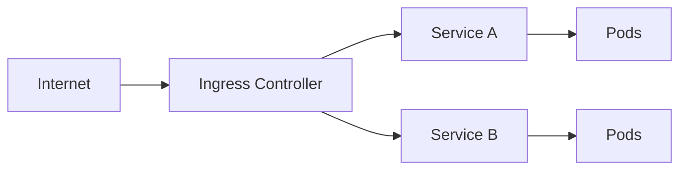

# Kubernetes networking

> **Module:** Kubernetes Essentials | **Level:** Advanced | **Time:** 30 minutes

## Learning objectives

By the end of this section, you will be able to:

- Understand Kubernetes networking model
- Configure Ingress for HTTP routing
- Implement NetworkPolicies
- Debug network issues

---

## Networking model

### Key principles

1. Every Pod gets its own IP address
2. Pods can communicate without NAT
3. Nodes can communicate with Pods without NAT
4. Services provide stable endpoints

### From Docker to Kubernetes

| Docker | Kubernetes |
|--------|------------|
| Bridge network | Pod network (CNI) |
| Published ports | Service + Ingress |
| Network aliases | Service DNS |
| docker network | NetworkPolicy |

---

## Service networking

### ClusterIP (default)

Internal cluster access only:

```yaml
apiVersion: v1
kind: Service
metadata:
  name: api
spec:
  selector:
    app: api
  ports:
    - port: 80        # Service port
      targetPort: 5000  # Container port
  type: ClusterIP
```

### NodePort

External access via node IP:

```yaml
apiVersion: v1
kind: Service
metadata:
  name: api-nodeport
spec:
  type: NodePort
  selector:
    app: api
  ports:
    - port: 80
      targetPort: 5000
      nodePort: 30080  # 30000-32767
```

Access: `http://<node-ip>:30080`

### LoadBalancer

Cloud provider load balancer:

```yaml
apiVersion: v1
kind: Service
metadata:
  name: api-lb
spec:
  type: LoadBalancer
  selector:
    app: api
  ports:
    - port: 80
      targetPort: 5000
```

---

## DNS in Kubernetes

### Service DNS

```
<service>.<namespace>.svc.cluster.local
```

Examples:
- `api.default.svc.cluster.local`
- `postgres.database.svc.cluster.local`

Short forms (within same namespace):
- `api`
- `api.default`

### Pod DNS (headless service)

```
<pod-name>.<service>.<namespace>.svc.cluster.local
```

Example: `postgres-0.postgres.default.svc.cluster.local`

---

## Ingress

### What is Ingress?

Ingress manages external HTTP/HTTPS access to services:



### Ingress controllers

| Controller | Provider |
|------------|----------|
| nginx-ingress | Community/nginx |
| Traefik | Traefik Labs |
| HAProxy | HAProxy |
| Contour | VMware |
| Ambassador | Datawire |
| AWS ALB | AWS |
| GCE | Google |

### Basic Ingress

```yaml
apiVersion: networking.k8s.io/v1
kind: Ingress
metadata:
  name: app-ingress
spec:
  ingressClassName: nginx
  rules:
    - host: myapp.example.com
      http:
        paths:
          - path: /
            pathType: Prefix
            backend:
              service:
                name: frontend
                port:
                  number: 80
```

### Path-based routing

```yaml
apiVersion: networking.k8s.io/v1
kind: Ingress
metadata:
  name: api-ingress
spec:
  ingressClassName: nginx
  rules:
    - host: api.example.com
      http:
        paths:
          - path: /v1
            pathType: Prefix
            backend:
              service:
                name: api-v1
                port:
                  number: 80
          - path: /v2
            pathType: Prefix
            backend:
              service:
                name: api-v2
                port:
                  number: 80
```

### Host-based routing

```yaml
apiVersion: networking.k8s.io/v1
kind: Ingress
metadata:
  name: multi-host-ingress
spec:
  ingressClassName: nginx
  rules:
    - host: app.example.com
      http:
        paths:
          - path: /
            pathType: Prefix
            backend:
              service:
                name: frontend
                port:
                  number: 80
    - host: api.example.com
      http:
        paths:
          - path: /
            pathType: Prefix
            backend:
              service:
                name: api
                port:
                  number: 80
```

### TLS termination

```yaml
apiVersion: networking.k8s.io/v1
kind: Ingress
metadata:
  name: tls-ingress
spec:
  ingressClassName: nginx
  tls:
    - hosts:
        - myapp.example.com
      secretName: myapp-tls
  rules:
    - host: myapp.example.com
      http:
        paths:
          - path: /
            pathType: Prefix
            backend:
              service:
                name: frontend
                port:
                  number: 80
```

Create TLS secret:
```bash
kubectl create secret tls myapp-tls \
    --cert=tls.crt \
    --key=tls.key
```

---

## NetworkPolicies

### Default behavior

By default, all pods can communicate with all other pods.

### Deny all ingress

```yaml
apiVersion: networking.k8s.io/v1
kind: NetworkPolicy
metadata:
  name: deny-all
  namespace: production
spec:
  podSelector: {}  # All pods
  policyTypes:
    - Ingress
```

### Allow specific traffic

```yaml
apiVersion: networking.k8s.io/v1
kind: NetworkPolicy
metadata:
  name: api-policy
spec:
  podSelector:
    matchLabels:
      app: api
  policyTypes:
    - Ingress
    - Egress
  ingress:
    - from:
        - podSelector:
            matchLabels:
              app: frontend
      ports:
        - protocol: TCP
          port: 5000
  egress:
    - to:
        - podSelector:
            matchLabels:
              app: postgres
      ports:
        - protocol: TCP
          port: 5432
```

### Namespace isolation

```yaml
apiVersion: networking.k8s.io/v1
kind: NetworkPolicy
metadata:
  name: namespace-isolation
  namespace: production
spec:
  podSelector: {}
  policyTypes:
    - Ingress
  ingress:
    - from:
        - namespaceSelector:
            matchLabels:
              name: production
```

---

## Network debugging

### Check service endpoints

```bash
# List endpoints
kubectl get endpoints api

# Describe service
kubectl describe service api
```

### DNS debugging

```bash
# Run DNS tools pod
kubectl run dnsutils --image=tutum/dnsutils --rm -it -- /bin/bash

# Inside pod
nslookup api
nslookup api.default.svc.cluster.local
```

### Connectivity testing

```bash
# Test from pod
kubectl exec -it my-pod -- curl http://api:5000/health

# Run netshoot for debugging
kubectl run netshoot --image=nicolaka/netshoot --rm -it -- /bin/bash

# Inside netshoot
curl http://api:5000/health
ping api
traceroute api
tcpdump -i any port 5000
```

### Check network policies

```bash
# List policies
kubectl get networkpolicies

# Describe policy
kubectl describe networkpolicy api-policy
```

---

## Practical example: Secure application

```yaml
# frontend-deployment.yaml
apiVersion: apps/v1
kind: Deployment
metadata:
  name: frontend
spec:
  replicas: 2
  selector:
    matchLabels:
      app: frontend
  template:
    metadata:
      labels:
        app: frontend
    spec:
      containers:
        - name: frontend
          image: nginx:alpine
          ports:
            - containerPort: 80
---
# api-deployment.yaml
apiVersion: apps/v1
kind: Deployment
metadata:
  name: api
spec:
  replicas: 3
  selector:
    matchLabels:
      app: api
  template:
    metadata:
      labels:
        app: api
    spec:
      containers:
        - name: api
          image: myapi:v1
          ports:
            - containerPort: 5000
---
# services.yaml
apiVersion: v1
kind: Service
metadata:
  name: frontend
spec:
  selector:
    app: frontend
  ports:
    - port: 80
---
apiVersion: v1
kind: Service
metadata:
  name: api
spec:
  selector:
    app: api
  ports:
    - port: 80
      targetPort: 5000
---
# ingress.yaml
apiVersion: networking.k8s.io/v1
kind: Ingress
metadata:
  name: app-ingress
  annotations:
    nginx.ingress.kubernetes.io/ssl-redirect: "true"
spec:
  ingressClassName: nginx
  tls:
    - hosts:
        - myapp.example.com
      secretName: myapp-tls
  rules:
    - host: myapp.example.com
      http:
        paths:
          - path: /api
            pathType: Prefix
            backend:
              service:
                name: api
                port:
                  number: 80
          - path: /
            pathType: Prefix
            backend:
              service:
                name: frontend
                port:
                  number: 80
---
# network-policy.yaml
apiVersion: networking.k8s.io/v1
kind: NetworkPolicy
metadata:
  name: frontend-policy
spec:
  podSelector:
    matchLabels:
      app: frontend
  policyTypes:
    - Egress
  egress:
    - to:
        - podSelector:
            matchLabels:
              app: api
      ports:
        - port: 5000
---
apiVersion: networking.k8s.io/v1
kind: NetworkPolicy
metadata:
  name: api-policy
spec:
  podSelector:
    matchLabels:
      app: api
  policyTypes:
    - Ingress
  ingress:
    - from:
        - podSelector:
            matchLabels:
              app: frontend
      ports:
        - port: 5000
```

---

## Key takeaways

1. **Services** provide stable networking for pods
2. **Ingress** routes external HTTP traffic
3. **NetworkPolicies** control pod-to-pod communication
4. **DNS** enables service discovery
5. **CNI plugins** implement the network layer

---

## What's next

Learn about Helm for package management.

---

## Navigation

| Previous | Up | Next |
|----------|-----|------|
| [Kubernetes Storage](03-kubernetes-storage.md) | [Course Overview](../course_overview.md) | [Helm Basics](05-helm-basics.md) |
