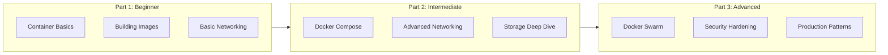
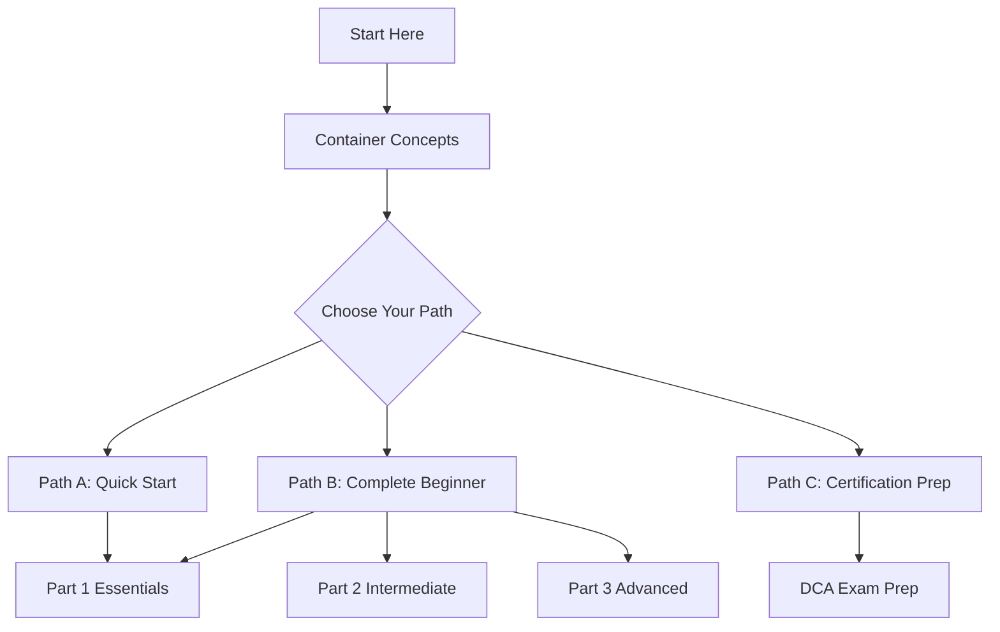
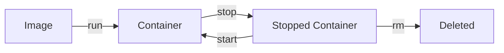

# Introduction to Containers

> **Module:** Part 1 - Beginner | **Level:** Foundation | **Time:** 30 minutes

## Learning Objectives

By the end of this section, you will be able to:

- Explain why containers are essential in modern software development
- Understand the course structure and learning path
- Set up your learning environment
- Verify your installation is working correctly

---

## Welcome to the Containers Course

This course will take you from zero container knowledge to confidently using Docker and Podman in production environments. Whether you're a developer, system administrator, or DevOps engineer, mastering containers is essential for modern software delivery.

### What You'll Learn



### Course Philosophy

| Principle | Description |
|-----------|-------------|
| **Tool-Agnostic** | Learn both Docker and Podman side by side |
| **Hands-On** | Every concept includes practical exercises |
| **Real-World** | Focus on production-ready patterns |
| **Progressive** | Build complexity gradually |

---

## Why Containers Matter

### The Problem Containers Solve

Before containers, deploying software was painful:

```
Developer: "It works on my machine!"
Operations: "But it doesn't work in production..."
```

**Common Issues:**
- Different library versions
- Missing dependencies
- Configuration drift
- Environment inconsistencies

### The Container Solution

Containers package everything an application needs:

```
┌─────────────────────────────────────────┐
│           Container                      │
│  ┌─────────────────────────────────┐    │
│  │  Your Application               │    │
│  ├─────────────────────────────────┤    │
│  │  Runtime (Python, Node, Java)   │    │
│  ├─────────────────────────────────┤    │
│  │  Libraries & Dependencies       │    │
│  ├─────────────────────────────────┤    │
│  │  Configuration Files            │    │
│  └─────────────────────────────────┘    │
│                                          │
│  Runs IDENTICALLY everywhere             │
└─────────────────────────────────────────┘
```

### Key Benefits

| Benefit | Description |
|---------|-------------|
| **Consistency** | Same behavior in dev, test, and production |
| **Isolation** | Applications don't interfere with each other |
| **Portability** | Run anywhere containers are supported |
| **Efficiency** | Share OS kernel, use fewer resources than VMs |
| **Speed** | Start in seconds, not minutes |
| **Scalability** | Easily run multiple copies |

---

## Course Structure Overview

### Learning Paths



### Part 1: Beginner Topics

1. **Introduction** (this module)
2. **Installation** - Setting up Docker and Podman
3. **First Container** - Running containers
4. **Container Commands** - Managing containers
5. **Understanding Images** - How images work
6. **Building Images** - Creating Dockerfiles
7. **Image Management** - Pushing and pulling images
8. **Basic Volumes** - Persisting data
9. **Basic Networking** - Container communication

### Time Commitment

| Section | Estimated Time |
|---------|---------------|
| Reading | 15-20 minutes |
| Exercises | 30-45 minutes |
| Labs | 1-2 hours |
| **Total** | ~3-4 hours |

---

## Setting Up Your Environment

### Option 1: Local Installation (Recommended)

For the best learning experience, install containers locally:

**Linux (Ubuntu/Debian):**
```bash
# Docker
curl -fsSL https://get.docker.com | sh
sudo usermod -aG docker $USER

# Podman
sudo apt update
sudo apt install -y podman
```

**Linux (Fedora/RHEL):**
```bash
# Docker
sudo dnf install docker-ce docker-ce-cli containerd.io
sudo systemctl enable --now docker
sudo usermod -aG docker $USER

# Podman (usually pre-installed)
sudo dnf install -y podman
```

**macOS:**
```bash
# Docker Desktop
brew install --cask docker

# Podman
brew install podman
podman machine init
podman machine start
```

**Windows:**
- Install [Docker Desktop](https://www.docker.com/products/docker-desktop/)
- Or install [Podman Desktop](https://podman-desktop.io/)
- Enable WSL 2 for best performance

### Option 2: Cloud-Based Labs

If you can't install locally, use these free alternatives:

| Platform | URL | Notes |
|----------|-----|-------|
| **Play with Docker** | [labs.play-with-docker.com](https://labs.play-with-docker.com) | 4-hour sessions, free |
| **Killercoda** | [killercoda.com](https://killercoda.com) | Interactive scenarios |
| **iximiuz Labs** | [labs.iximiuz.com](https://labs.iximiuz.com) | Containers deep dives |

### Option 3: Dev Container

This course repository includes a dev container:

```bash
# Clone the repository
git clone <repository-url>
cd dbtools

# Open in VS Code with Dev Containers extension
code .
# Then: Command Palette > "Dev Containers: Reopen in Container"
```

---

## Verifying Your Installation

### Docker Verification

```bash
# Check Docker version
docker version

# Expected output includes:
# Client: Docker Engine - Community
#  Version: 24.x.x
# Server: Docker Engine - Community
#  Version: 24.x.x

# Run test container
docker run hello-world

# Expected output:
# Hello from Docker!
# This message shows that your installation appears to be working correctly.
```

### Podman Verification

```bash
# Check Podman version
podman version

# Expected output includes:
# Client:       Podman Engine
# Version:      4.x.x

# Run test container
podman run hello-world

# Same output as Docker
```

### Troubleshooting Common Issues

**Docker: "Permission denied"**
```bash
# Solution: Add user to docker group
sudo usermod -aG docker $USER
# Then log out and back in
```

**Podman: "Error: XDG_RUNTIME_DIR..."**
```bash
# Solution: Enable lingering for your user
loginctl enable-linger $USER
```

**macOS Podman: "Cannot connect to Podman..."**
```bash
# Solution: Start the Podman machine
podman machine start
```

---

## Docker vs Podman: First Look

You'll learn both tools throughout this course. Here's a quick comparison:

### Command Compatibility

```bash
# These commands work the same way
docker run nginx       |  podman run nginx
docker ps              |  podman ps
docker images          |  podman images
docker build -t app .  |  podman build -t app .
```

### Key Differences

| Aspect | Docker | Podman |
|--------|--------|--------|
| **Daemon** | Requires daemon (dockerd) | Daemonless |
| **Default Mode** | Rootful | Rootless |
| **Pods** | Via Compose | Native support |
| **systemd** | Limited integration | Native integration |

**Don't worry about these differences yet!** We'll explore them in detail as you progress.

---

## Course Conventions

### Command Examples

Throughout this course, commands are shown for both Docker and Podman:

```bash
# Docker
docker run -d --name web -p 8080:80 nginx

# Podman (identical in most cases)
podman run -d --name web -p 8080:80 nginx
```

When commands are identical, we'll show one version with a note that it works for both.

### Diagrams

We use Mermaid diagrams for visual explanations:



### Hands-On Exercises

Each section includes exercises marked like this:

> **Exercise 1.1: Run Your First Container**
>
> Run the `hello-world` container and observe the output.
>
> ```bash
> docker run hello-world
> ```

### Quizzes

Each module ends with a quiz to test your understanding.

---

## Key Takeaways

1. **Containers solve the "works on my machine" problem** by packaging everything together
2. **Docker and Podman are interchangeable** for most basic operations
3. **This course covers both tools** so you can use either in production
4. **Hands-on practice is essential** - run every example yourself
5. **Start with local installation** if possible for the best experience

---

## What's Next

Now that you understand the course structure, let's install Docker and Podman properly.

Continue to: [02-installation.md](02-installation.md)

---

## Quick Quiz

1. What problem do containers primarily solve?
   - [ ] Making software run faster
   - [x] Ensuring consistent environments across development and production
   - [ ] Replacing virtual machines entirely
   - [ ] Reducing code complexity

2. Which statement about Docker and Podman is TRUE?
   - [ ] They use completely different command syntax
   - [ ] Docker is better than Podman
   - [x] Most commands are identical between them
   - [ ] Podman only runs on Windows

3. What does a container package together?
   - [ ] Just the application code
   - [ ] Only the operating system
   - [x] Application, runtime, libraries, and configuration
   - [ ] Hardware drivers

4. What is the recommended way to learn this course?
   - [ ] Just read the documentation
   - [x] Install locally and run every example
   - [ ] Watch videos only
   - [ ] Skip to advanced topics
