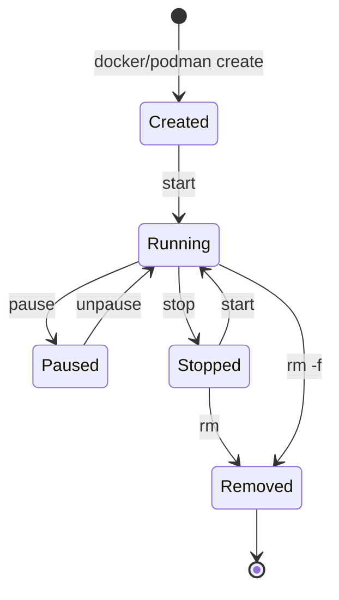
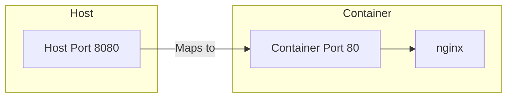
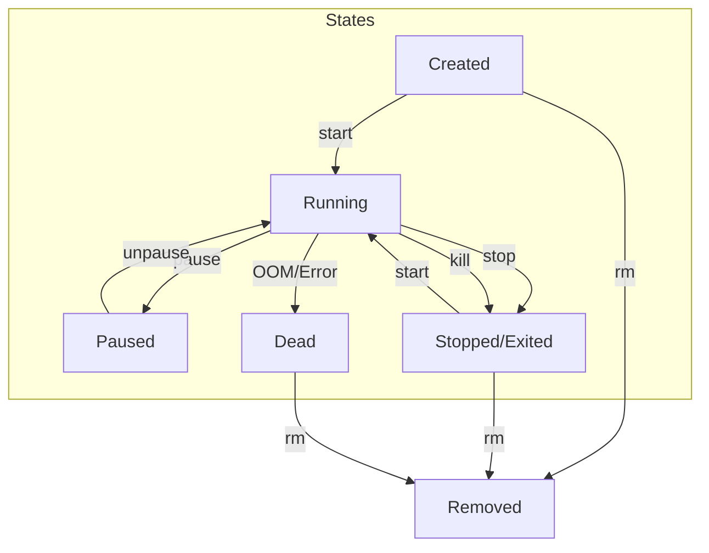

# Running Your First Container

> **Module:** Part 1 - Beginner | **Level:** Foundation | **Time:** 30 minutes

## Learning Objectives

By the end of this section, you will be able to:

- Run containers in foreground and background modes
- Understand what happens when you run a container
- Interact with running containers
- Stop, start, and remove containers
- View container logs and status

---

## The Container Lifecycle

Before running containers, understand their lifecycle:



---

## Running Your First Container

### The Basic Run Command

```bash
# Docker
docker run hello-world

# Podman
podman run hello-world
```

**What Happens:**
1. Docker/Podman looks for `hello-world` image locally
2. If not found, pulls it from Docker Hub
3. Creates a container from the image
4. Runs the container (prints message)
5. Container exits (task complete)

**Output:**
```
Unable to find image 'hello-world:latest' locally
latest: Pulling from library/hello-world
c1ec31eb5944: Pull complete
Digest: sha256:d1b0b5888fbb59111dbf2b3ed698489c41046cb9d6d61743e37ef8d9f3dda06f
Status: Downloaded newer image for hello-world:latest

Hello from Docker!
This message shows that your installation appears to be working correctly.
...
```

### Running an Interactive Container

```bash
# Run Alpine Linux with an interactive shell
docker run -it alpine sh

# You're now inside the container!
/ # whoami
root
/ # hostname
a1b2c3d4e5f6  # Random container ID
/ # cat /etc/os-release
NAME="Alpine Linux"
...
/ # exit
```

**Flags Explained:**
| Flag | Meaning |
|------|---------|
| `-i` | Interactive (keep STDIN open) |
| `-t` | Allocate a pseudo-TTY (terminal) |
| `-it` | Combined: interactive terminal |

### Running a Background Container

```bash
# Run nginx web server in background
docker run -d --name myweb -p 8080:80 nginx

# Output: container ID
a1b2c3d4e5f6g7h8i9j0...

# Access the web server
curl http://localhost:8080
# Or open http://localhost:8080 in browser
```

**Flags Explained:**
| Flag | Meaning |
|------|---------|
| `-d` | Detached mode (run in background) |
| `--name myweb` | Give container a name |
| `-p 8080:80` | Map host port 8080 to container port 80 |

---

## Understanding the Run Command

### Full Syntax

```bash
docker run [OPTIONS] IMAGE [COMMAND] [ARG...]
```

### Common Options

| Option | Description | Example |
|--------|-------------|---------|
| `-d, --detach` | Run in background | `docker run -d nginx` |
| `-it` | Interactive terminal | `docker run -it alpine sh` |
| `--name` | Assign a name | `docker run --name web nginx` |
| `-p, --publish` | Publish port | `docker run -p 8080:80 nginx` |
| `-v, --volume` | Mount volume | `docker run -v data:/data nginx` |
| `-e, --env` | Set environment variable | `docker run -e KEY=value nginx` |
| `--rm` | Remove container when it exits | `docker run --rm alpine echo hi` |
| `-w, --workdir` | Set working directory | `docker run -w /app node npm start` |

### Port Mapping Deep Dive



**Port Mapping Syntax:**
```bash
-p HOST_PORT:CONTAINER_PORT

# Examples
-p 8080:80          # Map 8080 → 80
-p 127.0.0.1:8080:80  # Only localhost
-p 8080:80/udp      # UDP protocol
-p 8080-8090:80-90  # Port range
```

---

## Managing Running Containers

### List Containers

```bash
# Show running containers
docker ps

# Output:
CONTAINER ID   IMAGE   COMMAND                  CREATED          STATUS          PORTS                  NAMES
a1b2c3d4e5f6   nginx   "/docker-entrypoint.…"   10 minutes ago   Up 10 minutes   0.0.0.0:8080->80/tcp   myweb

# Show all containers (including stopped)
docker ps -a

# Show only container IDs
docker ps -q

# Show with custom format
docker ps --format "table {{.Names}}\t{{.Status}}\t{{.Ports}}"
```

### Stop Containers

```bash
# Stop a running container (graceful)
docker stop myweb

# Stop with timeout (seconds)
docker stop -t 30 myweb

# Force stop (SIGKILL)
docker kill myweb

# Stop all running containers
docker stop $(docker ps -q)
```

### Start Containers

```bash
# Start a stopped container
docker start myweb

# Start with attached output
docker start -a myweb

# Start interactively
docker start -ai myalpine
```

### Remove Containers

```bash
# Remove a stopped container
docker rm myweb

# Force remove a running container
docker rm -f myweb

# Remove all stopped containers
docker container prune

# Remove all containers (be careful!)
docker rm -f $(docker ps -aq)
```

---

## Interacting with Containers

### Execute Commands

```bash
# Run a command in a running container
docker exec myweb cat /etc/nginx/nginx.conf

# Get an interactive shell
docker exec -it myweb bash
# or
docker exec -it myweb sh

# Run as a specific user
docker exec -u root myweb whoami

# Set environment variables
docker exec -e MY_VAR=value myweb env
```

### View Logs

```bash
# View container logs
docker logs myweb

# Follow logs (like tail -f)
docker logs -f myweb

# Show last N lines
docker logs --tail 100 myweb

# Show logs with timestamps
docker logs -t myweb

# Show logs since a time
docker logs --since 2024-01-01 myweb
docker logs --since 10m myweb  # Last 10 minutes
```

### Inspect Containers

```bash
# Detailed container information (JSON)
docker inspect myweb

# Get specific fields
docker inspect --format '{{.State.Status}}' myweb
docker inspect --format '{{.NetworkSettings.IPAddress}}' myweb

# View resource usage
docker stats myweb

# View processes in container
docker top myweb
```

---

## Practical Examples

### Example 1: Temporary Container

```bash
# Run a command and automatically remove the container
docker run --rm alpine echo "Hello from Alpine!"

# Run a quick test
docker run --rm python:3 python -c "print('Hello from Python!')"

# Check available tools
docker run --rm ubuntu which curl
```

### Example 2: Development Web Server

```bash
# Run nginx serving local files
mkdir -p ~/mywebsite
echo "<h1>Hello World!</h1>" > ~/mywebsite/index.html

# Mount local directory into container
docker run -d --name devweb \
    -p 8080:80 \
    -v ~/mywebsite:/usr/share/nginx/html:ro \
    nginx

# Access at http://localhost:8080
# Edit ~/mywebsite/index.html and refresh browser
```

### Example 3: Database Container

```bash
# Run PostgreSQL
docker run -d --name mydb \
    -e POSTGRES_PASSWORD=mysecretpassword \
    -e POSTGRES_USER=myuser \
    -e POSTGRES_DB=myapp \
    -p 5432:5432 \
    postgres:15

# Connect with psql
docker exec -it mydb psql -U myuser -d myapp
# \q to quit
```

### Example 4: Running Commands in Sequence

```bash
# Create, run command, get result
docker run --rm ubuntu bash -c "apt update && apt install -y curl && curl -s example.com"
```

---

## Container States Explained



**Check Container State:**
```bash
docker inspect --format '{{.State.Status}}' containername
# Possible values: created, running, paused, restarting, exited, dead
```

---

## Cleanup Commands

```bash
# Remove specific container
docker rm containername

# Remove all stopped containers
docker container prune

# Remove unused images
docker image prune

# Remove everything unused (containers, images, networks, volumes)
docker system prune

# Remove everything including volumes (careful!)
docker system prune -a --volumes
```

---

## Docker vs Podman Notes

All commands in this section work identically with both Docker and Podman. Simply replace `docker` with `podman`:

```bash
# Docker
docker run -d --name web nginx
docker ps
docker stop web
docker rm web

# Podman (identical)
podman run -d --name web nginx
podman ps
podman stop web
podman rm web
```

---

## Key Takeaways

1. **`docker run`** creates and starts a container from an image
2. **`-d`** runs in background, **`-it`** runs interactively
3. **`-p HOST:CONTAINER`** maps ports for network access
4. **`--name`** gives containers memorable names
5. **`docker exec`** runs commands in running containers
6. **`docker logs`** shows container output
7. **`--rm`** automatically cleans up containers after exit

---

## Exercises

> **Exercise 3.1: Run and Explore**
>
> 1. Run an Ubuntu container interactively
> 2. Inside the container, check the OS version with `cat /etc/os-release`
> 3. Install curl with `apt update && apt install -y curl`
> 4. Use curl to fetch a webpage
> 5. Exit the container

> **Exercise 3.2: Background Web Server**
>
> 1. Run nginx in the background on port 8080
> 2. Verify it's running with `docker ps`
> 3. Access http://localhost:8080
> 4. View the container logs
> 5. Stop and remove the container

> **Exercise 3.3: Container Management**
>
> 1. Run 3 nginx containers with different names
> 2. List all running containers
> 3. Stop all containers with one command
> 4. Remove all containers with one command

---

## What's Next

Now that you can run containers, let's learn the essential container management commands.

Continue to: [04-container-commands.md](04-container-commands.md)

---

## Quick Quiz

1. What flag runs a container in the background?
   - [ ] `-b`
   - [ ] `--background`
   - [x] `-d`
   - [ ] `-bg`

2. What does `-p 8080:80` do?
   - [ ] Pauses the container for 80 seconds
   - [ ] Sets the container priority to 8080
   - [x] Maps host port 8080 to container port 80
   - [ ] Opens port 8080 in the firewall

3. Which command shows running containers?
   - [ ] `docker list`
   - [x] `docker ps`
   - [ ] `docker show`
   - [ ] `docker running`

4. How do you run a command in an already running container?
   - [ ] `docker run`
   - [ ] `docker command`
   - [x] `docker exec`
   - [ ] `docker do`

---

## Navigation

| Previous | Up | Next |
|----------|-----|------|
| [Installation](02-installation.md) | [Part 1 Overview](../../course_overview.md#part-1-beginner) | [Container Commands](04-container-commands.md) |
