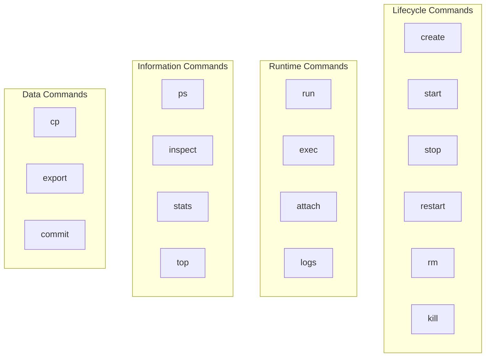

# Essential Container Commands

> **Module:** Part 1 - Beginner | **Level:** Foundation | **Time:** 25 minutes

## Learning Objectives

By the end of this section, you will be able to:

- Use all essential container management commands
- Understand command patterns and syntax
- Copy files to and from containers
- Attach to and detach from containers
- Export and import containers

---

## Command Reference Overview



---

## Lifecycle Commands

### create

Create a container without starting it:

```bash
# Create container
docker create --name mycontainer nginx

# Check status (created, not running)
docker ps -a
# STATUS: Created

# Start when ready
docker start mycontainer
```

### start / stop / restart

```bash
# Start a stopped container
docker start mycontainer

# Stop a running container (SIGTERM, then SIGKILL after timeout)
docker stop mycontainer

# Stop with custom timeout (default 10 seconds)
docker stop -t 30 mycontainer

# Restart a container
docker restart mycontainer

# Restart with timeout
docker restart -t 5 mycontainer
```

### kill

Send a signal to a container:

```bash
# Default: SIGKILL (immediate termination)
docker kill mycontainer

# Send specific signal
docker kill --signal SIGHUP mycontainer
docker kill -s SIGTERM mycontainer

# Common signals:
# SIGTERM (15) - Graceful shutdown
# SIGKILL (9)  - Immediate kill
# SIGHUP (1)   - Reload configuration
```

### rm

Remove containers:

```bash
# Remove stopped container
docker rm mycontainer

# Force remove running container
docker rm -f mycontainer

# Remove container and its volumes
docker rm -v mycontainer

# Remove multiple containers
docker rm container1 container2 container3

# Remove all stopped containers
docker container prune

# Remove all containers (running and stopped)
docker rm -f $(docker ps -aq)
```

### pause / unpause

Freeze container processes:

```bash
# Pause a container (freezes all processes)
docker pause mycontainer

# Unpause
docker unpause mycontainer

# Check status
docker ps
# STATUS shows "Paused"
```

---

## Runtime Commands

### run (recap with advanced options)

```bash
# Basic run
docker run nginx

# Full example with common options
docker run \
    -d \                          # Detached mode
    --name webapp \               # Container name
    --hostname webserver \        # Container hostname
    -p 8080:80 \                  # Port mapping
    -v /data:/app/data \          # Volume mount
    -e DATABASE_URL=postgres://.. \ # Environment variable
    --env-file .env \             # Environment file
    --restart unless-stopped \    # Restart policy
    --memory 512m \               # Memory limit
    --cpus 1.5 \                  # CPU limit
    -w /app \                     # Working directory
    --user 1000:1000 \            # Run as user
    nginx:alpine                  # Image
```

### exec

Execute commands in running containers:

```bash
# Run single command
docker exec mycontainer ls -la /app

# Interactive shell
docker exec -it mycontainer bash
docker exec -it mycontainer sh  # For Alpine

# Run as specific user
docker exec -u root mycontainer whoami
docker exec -u 1000 mycontainer id

# Set environment variables
docker exec -e MY_VAR=value mycontainer env

# Set working directory
docker exec -w /app mycontainer pwd

# Detached command (runs in background)
docker exec -d mycontainer touch /tmp/marker
```

### attach

Connect to container's main process:

```bash
# Attach to container's STDIN/STDOUT/STDERR
docker attach mycontainer

# Detach without stopping: Ctrl+P, Ctrl+Q

# Attach with signal passthrough
docker attach --sig-proxy=false mycontainer
# Ctrl+C won't stop the container
```

**Difference between `attach` and `exec -it bash`:**

| Aspect | `docker attach` | `docker exec -it bash` |
|--------|----------------|----------------------|
| Connects to | Main process (PID 1) | New bash process |
| Exit behavior | May stop container | Container continues |
| Multiple terminals | No | Yes |
| Use case | Debug main process | Interactive work |

### logs

View container output:

```bash
# View all logs
docker logs mycontainer

# Follow logs (like tail -f)
docker logs -f mycontainer

# Show timestamps
docker logs -t mycontainer

# Show last N lines
docker logs --tail 50 mycontainer

# Show logs since timestamp
docker logs --since "2024-01-01T00:00:00" mycontainer
docker logs --since 10m mycontainer  # Last 10 minutes
docker logs --since 1h mycontainer   # Last hour

# Show logs until timestamp
docker logs --until "2024-01-01T12:00:00" mycontainer

# Combine options
docker logs -f --tail 100 -t mycontainer
```

---

## Information Commands

### ps

List containers:

```bash
# Running containers
docker ps

# All containers (including stopped)
docker ps -a

# Only container IDs
docker ps -q

# Include sizes
docker ps -s

# Custom format
docker ps --format "table {{.Names}}\t{{.Status}}\t{{.Ports}}"

# Filter by status
docker ps -f status=running
docker ps -f status=exited

# Filter by name
docker ps -f name=web

# Filter by ancestor (image)
docker ps -f ancestor=nginx

# Last N containers created
docker ps -n 5
```

**Format placeholders:**
| Placeholder | Description |
|-------------|-------------|
| `.ID` | Container ID |
| `.Names` | Container names |
| `.Image` | Image name |
| `.Status` | Container status |
| `.Ports` | Published ports |
| `.Size` | Container size |
| `.Command` | Command |
| `.CreatedAt` | Creation time |

### inspect

Get detailed container information:

```bash
# Full JSON output
docker inspect mycontainer

# Get specific fields
docker inspect --format '{{.State.Status}}' mycontainer
docker inspect --format '{{.NetworkSettings.IPAddress}}' mycontainer
docker inspect --format '{{.Config.Env}}' mycontainer

# Multiple fields
docker inspect --format 'Name: {{.Name}}, Status: {{.State.Status}}' mycontainer

# Get mount points
docker inspect --format '{{range .Mounts}}{{.Source}} -> {{.Destination}}{{"\n"}}{{end}}' mycontainer

# Get port mappings
docker inspect --format '{{range $p, $conf := .NetworkSettings.Ports}}{{$p}} -> {{(index $conf 0).HostPort}}{{"\n"}}{{end}}' mycontainer
```

### stats

Live resource usage:

```bash
# Live stats for all containers
docker stats

# Stats for specific containers
docker stats mycontainer1 mycontainer2

# One-time snapshot (no streaming)
docker stats --no-stream

# Custom format
docker stats --format "table {{.Name}}\t{{.CPUPerc}}\t{{.MemUsage}}"
```

**Stats columns:**
| Column | Description |
|--------|-------------|
| CPU % | CPU usage percentage |
| MEM USAGE / LIMIT | Memory usage vs limit |
| MEM % | Memory usage percentage |
| NET I/O | Network bytes in/out |
| BLOCK I/O | Disk read/write bytes |
| PIDS | Number of processes |

### top

View processes in container:

```bash
# Show processes
docker top mycontainer

# With custom ps options
docker top mycontainer -aux
docker top mycontainer -eo pid,user,%cpu,%mem,cmd
```

---

## Data Commands

### cp

Copy files between container and host:

```bash
# Copy from container to host
docker cp mycontainer:/etc/nginx/nginx.conf ./nginx.conf

# Copy from host to container
docker cp ./config.json mycontainer:/app/config.json

# Copy directory
docker cp mycontainer:/var/log/ ./logs/
docker cp ./myapp/ mycontainer:/app/

# Copy with archive mode (preserves permissions)
docker cp -a ./files/ mycontainer:/data/
```

### export / import

Export container filesystem:

```bash
# Export container to tar file
docker export mycontainer > container.tar
docker export -o container.tar mycontainer

# Import as new image
docker import container.tar myimage:v1

# Import with commit message
docker import -m "Imported from container" container.tar myimage:v1

# Import with Dockerfile-like commands
docker import -c 'CMD ["nginx"]' container.tar myimage:v1
```

**Note:** `export` saves the container filesystem only, not volumes or network settings.

### commit

Create image from container:

```bash
# Commit container changes to new image
docker commit mycontainer myimage:v1

# With author and message
docker commit -a "John Doe" -m "Added config files" mycontainer myimage:v1

# With Dockerfile-like commands
docker commit -c 'ENV DEBUG=true' mycontainer myimage:v1
docker commit -c 'EXPOSE 8080' mycontainer myimage:v1
```

---

## Restart Policies

Control container restart behavior:

```bash
# Never restart (default)
docker run --restart no nginx

# Always restart
docker run --restart always nginx

# Restart unless manually stopped
docker run --restart unless-stopped nginx

# Restart on failure (with max retries)
docker run --restart on-failure:5 nginx

# Update restart policy on existing container
docker update --restart always mycontainer
```

| Policy | Description |
|--------|-------------|
| `no` | Never restart |
| `always` | Always restart, even on manual stop |
| `unless-stopped` | Restart unless manually stopped |
| `on-failure[:max]` | Restart on non-zero exit, optional max retries |

---

## Resource Constraints

### Memory Limits

```bash
# Hard memory limit
docker run --memory 512m nginx
docker run -m 1g nginx

# Memory + swap limit
docker run --memory 512m --memory-swap 1g nginx

# Soft limit (reservation)
docker run --memory-reservation 256m nginx
```

### CPU Limits

```bash
# CPU shares (relative weight, default 1024)
docker run --cpu-shares 512 nginx

# CPU count limit
docker run --cpus 1.5 nginx

# Specific CPUs
docker run --cpuset-cpus "0,1" nginx
docker run --cpuset-cpus "0-3" nginx
```

### Update Resources

```bash
# Update running container resources
docker update --memory 1g --cpus 2 mycontainer
```

---

## Command Cheat Sheet

| Action | Command |
|--------|---------|
| Run container | `docker run IMAGE` |
| Run in background | `docker run -d IMAGE` |
| Run interactively | `docker run -it IMAGE sh` |
| List running | `docker ps` |
| List all | `docker ps -a` |
| Stop container | `docker stop NAME` |
| Start container | `docker start NAME` |
| Remove container | `docker rm NAME` |
| View logs | `docker logs NAME` |
| Execute command | `docker exec NAME CMD` |
| Interactive shell | `docker exec -it NAME sh` |
| Copy files | `docker cp SRC DEST` |
| Inspect | `docker inspect NAME` |
| Stats | `docker stats` |

---

## Key Takeaways

1. **Lifecycle commands** (create, start, stop, rm) control container state
2. **exec** is the primary way to interact with running containers
3. **logs** streams container output for debugging
4. **inspect** provides detailed JSON information
5. **cp** moves files in/out of containers
6. **Restart policies** enable automatic container recovery
7. **Resource constraints** prevent containers from consuming all resources

---

## What's Next

Now that you can manage containers, let's understand how container images work.

Continue to: [05-understanding-images.md](05-understanding-images.md)

---

## Quick Quiz

1. What command shows real-time resource usage of containers?
   - [ ] `docker resources`
   - [ ] `docker usage`
   - [x] `docker stats`
   - [ ] `docker monitor`

2. How do you copy a file from a container to your host?
   - [ ] `docker copy container:/path ./path`
   - [x] `docker cp container:/path ./path`
   - [ ] `docker mv container:/path ./path`
   - [ ] `docker export container:/path ./path`

3. What restart policy should you use for production containers that should always be running?
   - [ ] `always`
   - [x] `unless-stopped`
   - [ ] `on-failure`
   - [ ] `never`

4. What's the difference between `docker attach` and `docker exec -it sh`?
   - [ ] They are identical
   - [ ] `attach` is faster
   - [x] `attach` connects to PID 1, `exec` creates a new process
   - [ ] `exec` only works on running containers
