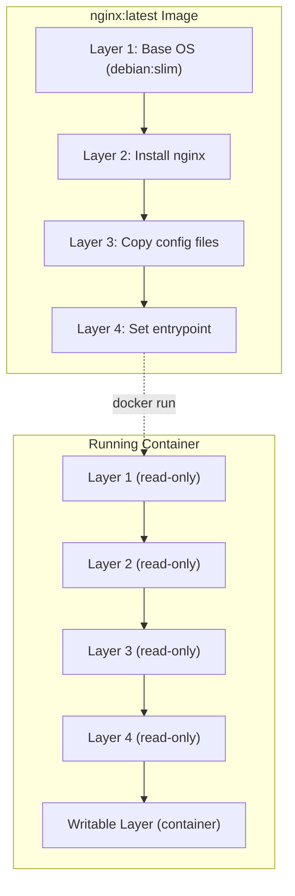

# Understanding Container Images

> **Module:** Part 1 - Beginner | **Level:** Foundation | **Time:** 30 minutes

## Learning Objectives

By the end of this section, you will be able to:

- Explain what container images are and how they differ from containers
- Understand image layers and caching
- Read image names and tags
- Find and evaluate images from registries
- Understand image digests and content addressing

---

## Images vs Containers

Think of images like this:

```
┌─────────────────────────────────────────────────────────────┐
│                                                              │
│    Image = Blueprint/Template                                │
│    Container = Running Instance                              │
│                                                              │
│    Like:                                                     │
│    - Image = Class definition                                │
│    - Container = Object instance                             │
│                                                              │
│    Or:                                                       │
│    - Image = Recipe                                          │
│    - Container = Cooked dish                                 │
│                                                              │
└─────────────────────────────────────────────────────────────┘
```

**Key Differences:**

| Aspect | Image | Container |
|--------|-------|-----------|
| **State** | Immutable (read-only) | Mutable (can write) |
| **Storage** | Shared layers | Layer + writable layer |
| **Purpose** | Distribution | Execution |
| **Created by** | `docker build` | `docker run` |

---

## Image Layers

Images are composed of stacked, read-only layers:



### Why Layers Matter

**1. Efficient Storage:**
```
Image A (100MB):  Layer1 + Layer2 + Layer3
Image B (100MB):  Layer1 + Layer2 + Layer4
                  ↑        ↑
                  (shared, stored once)

Total disk: 150MB instead of 200MB
```

**2. Fast Pulls:**
```bash
$ docker pull nginx:1.25
1.25: Pulling from library/nginx
a2abf6c4d29d: Already exists    # Cached!
a9edb18cadd1: Pull complete     # Only new layers
589b7251471a: Pull complete
```

**3. Build Caching:**
```dockerfile
FROM node:18
WORKDIR /app
COPY package.json .        # Layer cached if unchanged
RUN npm install            # Layer cached if package.json same
COPY . .                   # Only this layer rebuilds on code change
```

---

## Image Naming Convention

### Full Image Name Structure

```
[registry/][namespace/]repository[:tag][@digest]
```

**Examples:**
```bash
# Official image (Docker Hub)
nginx                           # = docker.io/library/nginx:latest
nginx:1.25                      # Specific version
nginx:alpine                    # Alpine-based variant

# User/Organization image
myuser/myapp:v1.0               # = docker.io/myuser/myapp:v1.0

# Other registries
ghcr.io/owner/image:tag         # GitHub Container Registry
gcr.io/project/image:tag        # Google Container Registry
quay.io/org/image:tag           # Red Hat Quay
registry.example.com/app:v1     # Private registry

# With digest (immutable reference)
nginx@sha256:abc123...          # Exact version by content hash
```

### Understanding Tags

| Tag Pattern | Meaning | Use Case |
|-------------|---------|----------|
| `latest` | Most recent (default) | Development |
| `1.25`, `3.12` | Version number | Production pinning |
| `1.25.1` | Patch version | Bug fix updates |
| `alpine` | Alpine-based | Smaller image |
| `slim` | Debian slim | Balanced size |
| `bullseye` | Debian codename | Specific OS |

**Best Practice:** Always use specific tags in production:
```bash
# Bad - tag can change
docker pull nginx:latest

# Good - pinned version
docker pull nginx:1.25.3

# Best - immutable digest
docker pull nginx@sha256:abc123...
```

---

## Working with Images

### List Images

```bash
# List all local images
docker images

# Output:
REPOSITORY   TAG       IMAGE ID       CREATED        SIZE
nginx        1.25      a8758716bb6a   2 weeks ago    187MB
alpine       latest    7e01a0d0a1dc   3 weeks ago    7.34MB
ubuntu       22.04     3db8720ecbf5   4 weeks ago    77.8MB

# Filter by name
docker images nginx

# Show all (including intermediate)
docker images -a

# Only show IDs
docker images -q

# Filter by dangling (unused)
docker images -f dangling=true

# Custom format
docker images --format "{{.Repository}}:{{.Tag}} - {{.Size}}"
```

### Pull Images

```bash
# Pull from Docker Hub
docker pull nginx
docker pull nginx:1.25

# Pull from other registries
docker pull ghcr.io/owner/image:tag

# Pull all tags (rarely needed)
docker pull --all-tags nginx

# Pull for different platform
docker pull --platform linux/arm64 nginx
```

### Inspect Images

```bash
# Detailed image information
docker image inspect nginx

# Get specific fields
docker image inspect --format '{{.Os}}/{{.Architecture}}' nginx
docker image inspect --format '{{.Config.Env}}' nginx
docker image inspect --format '{{.RootFS.Layers}}' nginx

# View image history (layers)
docker history nginx

# Output:
IMAGE          CREATED       CREATED BY                                      SIZE
a8758716bb6a   2 weeks ago   CMD ["nginx" "-g" "daemon off;"]               0B
<missing>      2 weeks ago   STOPSIGNAL SIGQUIT                              0B
<missing>      2 weeks ago   EXPOSE map[80/tcp:{}]                           0B
<missing>      2 weeks ago   ENTRYPOINT ["/docker-entrypoint.sh"]            0B
...
```

### Remove Images

```bash
# Remove specific image
docker rmi nginx:1.25
docker image rm nginx:1.25

# Remove by ID
docker rmi a8758716bb6a

# Force remove (even if containers exist)
docker rmi -f nginx

# Remove unused images
docker image prune

# Remove ALL unused images (not just dangling)
docker image prune -a

# Remove all images
docker rmi $(docker images -q)
```

---

## Finding Images

### Docker Hub

The default registry: [hub.docker.com](https://hub.docker.com)

**Official Images:**
- Maintained by Docker or upstream projects
- No namespace prefix (e.g., `nginx`, `python`, `postgres`)
- Security scanned and documented
- Best choice for production

**Verified Publisher:**
- From verified companies/organizations
- Look for the "Verified Publisher" badge

**Community Images:**
- User-contributed
- Format: `username/imagename`
- Verify before using in production

### Evaluating Images

Before using an image, check:

| Factor | What to Check |
|--------|--------------|
| **Source** | Official or verified publisher? |
| **Downloads** | Popularity indicator |
| **Updates** | When was it last updated? |
| **Stars** | Community trust |
| **Documentation** | Is it well documented? |
| **Dockerfile** | Can you see how it's built? |
| **Vulnerabilities** | Are there security scans? |

### Command-Line Search

```bash
# Search Docker Hub
docker search nginx

# Output:
NAME                              DESCRIPTION                  STARS   OFFICIAL
nginx                             Official build of Nginx.     18000   [OK]
linuxserver/nginx                 An Nginx container...        180
bitnami/nginx                     Bitnami nginx Docker Image   150

# Limit results
docker search --limit 5 nginx

# Filter by stars
docker search --filter stars=100 nginx

# Filter official only
docker search --filter is-official=true nginx
```

---

## Image Digests

Digests provide immutable references using content hashes:

```bash
# Pull and show digest
docker pull nginx:1.25
# 1.25: Pulling from library/nginx
# Digest: sha256:4c0fdaa8b6341bfdeca5f18f7837462c80cff90105f...

# Reference by digest
docker pull nginx@sha256:4c0fdaa8b6341bfdeca5f18f7837462c80cff90105f...

# View digest of local image
docker images --digests nginx
```

**Why Use Digests?**
- Tags can be overwritten
- Digests are immutable (content-addressed)
- Required for true reproducibility

---

## Image Layers Deep Dive

### View Layer Details

```bash
# Show layers and commands
docker history nginx --no-trunc

# View layer sizes
docker history nginx --format "{{.Size}}\t{{.CreatedBy}}"

# Inspect layer filesystem
docker save nginx > nginx.tar
tar -tvf nginx.tar
```

### Layer Filesystem

```
nginx.tar
├── manifest.json           # Layer list and config
├── abc123.../              # Layer directory
│   └── layer.tar           # Filesystem changes
├── def456.../
│   └── layer.tar
└── config.json             # Image configuration
```

### Copy-on-Write

When a container modifies a file:

```mermaid
flowchart TB
    subgraph Before["Before Modification"]
        I1[Image Layer: /etc/config]
    end

    subgraph After["After Modification"]
        I2[Image Layer: /etc/config (unchanged)]
        C1[Container Layer: /etc/config (modified copy)]
    end

    I1 -->|"Container writes"| After
```

This is called **copy-on-write (CoW)**:
1. File exists only in image layer
2. Container modifies file
3. File copied to container's writable layer
4. Container sees modified version
5. Original image layer unchanged

---

## Image Storage Locations

### Docker

```bash
# Linux
/var/lib/docker/
├── image/          # Image metadata
├── overlay2/       # Layer data (overlay2 driver)
└── containers/     # Container data

# macOS/Windows (in Docker Desktop VM)
# Access via: docker run -it --privileged --pid=host debian nsenter -t 1 -m -u -n -i sh
```

### Podman

```bash
# Rootful
/var/lib/containers/storage/

# Rootless
~/.local/share/containers/storage/
├── overlay-images/     # Image metadata
├── overlay-layers/     # Layer data
└── overlay-containers/ # Container data

# Check storage location
podman info | grep -A5 graphRoot
```

---

## Practical Example

### Comparing Image Sizes

```bash
# Pull different variants
docker pull python:3.12
docker pull python:3.12-slim
docker pull python:3.12-alpine

# Compare sizes
docker images python

# Output:
REPOSITORY   TAG          IMAGE ID       SIZE
python       3.12         abc123         1.01GB
python       3.12-slim    def456         150MB
python       3.12-alpine  ghi789         51MB
```

### Checking What's in an Image

```bash
# Run and explore
docker run -it python:3.12-alpine sh

# Check installed packages
apk list --installed

# Check Python version
python --version

# Check OS
cat /etc/os-release

# Exit
exit
```

---

## Key Takeaways

1. **Images are immutable templates**, containers are running instances
2. **Images use layered filesystem** for efficiency
3. **Use specific tags** in production, not `latest`
4. **Digests provide immutable references** to exact image versions
5. **Official images** are the safest choice
6. **Layers are shared** between images to save space
7. **Copy-on-write** means containers don't modify image layers

---

## What's Next

Now that you understand images, let's learn how to build your own!

Continue to: [06-building-images.md](06-building-images.md)

---

## Quick Quiz

1. What is the relationship between images and containers?
   - [ ] Images are running containers
   - [x] Images are templates, containers are running instances
   - [ ] Containers are stored inside images
   - [ ] There is no relationship

2. Why are image layers important?
   - [ ] They make images harder to understand
   - [ ] They slow down container startup
   - [x] They enable efficient storage and caching
   - [ ] They are only used for debugging

3. Which image reference is immutable?
   - [ ] `nginx:latest`
   - [ ] `nginx:1.25`
   - [x] `nginx@sha256:abc123...`
   - [ ] `nginx:stable`

4. What happens when a container modifies a file from the image?
   - [ ] The image is modified
   - [ ] An error occurs
   - [x] The file is copied to the container's writable layer
   - [ ] The container restarts

---

## Navigation

| Previous | Up | Next |
|----------|-----|------|
| [Container Commands](04-container-commands.md) | [Part 1 Overview](../../course_overview.md#part-1-beginner) | [Building Images](06-building-images.md) |
