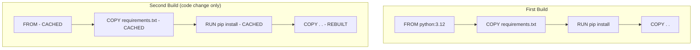

# Building Container Images

> **Module:** Part 1 - Beginner | **Level:** Foundation | **Time:** 45 minutes

## Learning Objectives

By the end of this section, you will be able to:

- Write Dockerfiles to define custom images
- Use essential Dockerfile instructions
- Build images using docker/podman build
- Understand and optimize build context
- Apply caching strategies for faster builds

---

## Introduction to Dockerfiles

A Dockerfile is a text file containing instructions to build an image:

```dockerfile
# This is a Dockerfile
FROM python:3.12-slim
WORKDIR /app
COPY requirements.txt .
RUN pip install -r requirements.txt
COPY . .
EXPOSE 8000
CMD ["python", "app.py"]
```

Each instruction creates a layer in the final image.

---

## Essential Dockerfile Instructions

### FROM

Sets the base image:

```dockerfile
# Use specific version (recommended)
FROM python:3.12-slim

# Use latest (not recommended for production)
FROM ubuntu:latest

# Use minimal base
FROM alpine:3.19

# Start from scratch (for static binaries)
FROM scratch

# Multi-platform support
FROM --platform=linux/amd64 python:3.12
```

### WORKDIR

Sets the working directory:

```dockerfile
# Set working directory (creates if doesn't exist)
WORKDIR /app

# All subsequent commands run from /app
COPY . .         # Copies to /app
RUN npm install  # Runs in /app

# Can use multiple WORKDIR
WORKDIR /app
WORKDIR src      # Now in /app/src
```

### COPY and ADD

Copy files into the image:

```dockerfile
# COPY (preferred)
COPY file.txt /app/
COPY *.py /app/
COPY src/ /app/src/

# Copy with ownership
COPY --chown=user:group files/ /app/

# ADD (use only when needed)
ADD https://example.com/file.tar.gz /app/    # Can fetch URLs
ADD archive.tar.gz /app/                      # Auto-extracts archives

# Best practice: Use COPY unless you need ADD features
```

### RUN

Execute commands during build:

```dockerfile
# Shell form (runs in /bin/sh -c)
RUN apt-get update && apt-get install -y nginx

# Exec form (no shell processing)
RUN ["apt-get", "install", "-y", "nginx"]

# Multi-line for readability
RUN apt-get update && \
    apt-get install -y \
        nginx \
        curl \
        vim && \
    rm -rf /var/lib/apt/lists/*  # Clean up

# Combine commands to reduce layers
# Bad (3 layers):
RUN apt-get update
RUN apt-get install -y nginx
RUN rm -rf /var/lib/apt/lists/*

# Good (1 layer):
RUN apt-get update && \
    apt-get install -y nginx && \
    rm -rf /var/lib/apt/lists/*
```

### ENV

Set environment variables:

```dockerfile
# Single variable
ENV NODE_ENV=production

# Multiple variables
ENV APP_HOME=/app \
    APP_USER=appuser \
    APP_PORT=8000

# Use in subsequent instructions
WORKDIR $APP_HOME
```

### ARG

Build-time variables:

```dockerfile
# Define build argument
ARG VERSION=latest
ARG NODE_VERSION=18

# Use in FROM
ARG NODE_VERSION=18
FROM node:${NODE_VERSION}

# Use in instructions
ARG APP_VERSION=1.0.0
ENV APP_VERSION=$APP_VERSION
RUN echo "Building version $APP_VERSION"
```

**Build with ARG:**
```bash
docker build --build-arg VERSION=2.0 --build-arg NODE_VERSION=20 .
```

### EXPOSE

Document listening ports:

```dockerfile
# Document that container listens on port 8000
EXPOSE 8000

# Multiple ports
EXPOSE 80 443

# UDP port
EXPOSE 53/udp

# Note: EXPOSE is documentation only!
# You still need -p to publish ports
```

### CMD and ENTRYPOINT

Define container startup:

```dockerfile
# CMD: Default command (can be overridden)
CMD ["python", "app.py"]

# ENTRYPOINT: Fixed command (arguments appended)
ENTRYPOINT ["python"]
CMD ["app.py"]  # Default argument

# Shell form (not recommended)
CMD python app.py
```

**Difference:**

```bash
# With CMD ["python", "app.py"]
docker run myimage              # Runs: python app.py
docker run myimage other.py     # Runs: other.py (CMD replaced)

# With ENTRYPOINT ["python"] CMD ["app.py"]
docker run myimage              # Runs: python app.py
docker run myimage other.py     # Runs: python other.py (arg appended)
```

### USER

Set the user for subsequent instructions:

```dockerfile
# Create user and switch
RUN addgroup --system appgroup && \
    adduser --system --ingroup appgroup appuser

# Switch to non-root user
USER appuser

# All subsequent RUN, CMD, ENTRYPOINT run as appuser
COPY --chown=appuser:appgroup . /app
```

### LABEL

Add metadata:

```dockerfile
LABEL maintainer="dev@example.com"
LABEL version="1.0"
LABEL description="My application"

# OCI standard labels
LABEL org.opencontainers.image.source="https://github.com/user/repo"
LABEL org.opencontainers.image.version="1.0.0"
```

---

## Building Images

### Basic Build

```bash
# Build from current directory
docker build -t myapp .

# Build with tag
docker build -t myapp:v1.0 .

# Build with multiple tags
docker build -t myapp:v1.0 -t myapp:latest .

# Build from specific Dockerfile
docker build -f Dockerfile.prod -t myapp:prod .

# Build with build arguments
docker build --build-arg VERSION=2.0 -t myapp .
```

### Build Context

The `.` in `docker build .` is the build context - all files sent to the daemon:

```bash
# Build context is current directory
docker build -t myapp .

# Build context from different directory
docker build -t myapp /path/to/context

# Build context from URL
docker build -t myapp https://github.com/user/repo.git
```

### .dockerignore

Exclude files from build context:

```gitignore
# .dockerignore
.git
.gitignore
node_modules
*.log
*.md
!README.md
.env
*.pyc
__pycache__
.pytest_cache
.coverage
*.egg-info
dist
build
```

**Why .dockerignore matters:**
- Speeds up builds (less data sent to daemon)
- Prevents secrets from entering images
- Reduces image size

---

## Practical Examples

### Python Application

```dockerfile
# python-app/Dockerfile
FROM python:3.12-slim

# Set working directory
WORKDIR /app

# Install dependencies first (cached layer)
COPY requirements.txt .
RUN pip install --no-cache-dir -r requirements.txt

# Copy application code
COPY . .

# Create non-root user
RUN adduser --disabled-password --gecos '' appuser
USER appuser

# Expose port
EXPOSE 8000

# Run application
CMD ["python", "-m", "uvicorn", "main:app", "--host", "0.0.0.0", "--port", "8000"]
```

### Node.js Application

```dockerfile
# node-app/Dockerfile
FROM node:20-alpine

WORKDIR /app

# Install dependencies first (cached layer)
COPY package*.json ./
RUN npm ci --only=production

# Copy application
COPY . .

# Non-root user (node user exists in official image)
USER node

EXPOSE 3000

CMD ["node", "server.js"]
```

### Go Application (Multi-stage)

```dockerfile
# go-app/Dockerfile
# Build stage
FROM golang:1.22-alpine AS builder
WORKDIR /app
COPY go.mod go.sum ./
RUN go mod download
COPY . .
RUN CGO_ENABLED=0 go build -o /app/server

# Runtime stage
FROM scratch
COPY --from=builder /app/server /server
EXPOSE 8080
ENTRYPOINT ["/server"]
```

### Static Website (nginx)

```dockerfile
# website/Dockerfile
FROM nginx:alpine

# Remove default nginx website
RUN rm -rf /usr/share/nginx/html/*

# Copy static files
COPY dist/ /usr/share/nginx/html/

# Copy custom nginx config (optional)
COPY nginx.conf /etc/nginx/conf.d/default.conf

EXPOSE 80

CMD ["nginx", "-g", "daemon off;"]
```

---

## Build Caching

### How Caching Works



**Cache Rules:**
1. Cache is invalidated if instruction changes
2. Cache is invalidated if any previous layer is invalidated
3. `COPY` and `ADD` check file content, not just names

### Optimize for Caching

```dockerfile
# Bad: Requirements change triggers full rebuild
COPY . .
RUN pip install -r requirements.txt

# Good: Dependencies cached separately from code
COPY requirements.txt .
RUN pip install -r requirements.txt
COPY . .
```

### Cache Busting

Force rebuild when needed:

```bash
# Rebuild without cache
docker build --no-cache -t myapp .

# Invalidate from specific point (change ARG)
ARG CACHE_BUST=1
RUN apt-get update && apt-get install -y curl
```

---

## Viewing Build Progress

### Build Output

```bash
# Verbose output
docker build -t myapp --progress=plain .

# Show all output (not just summary)
DOCKER_BUILDKIT=0 docker build -t myapp .
```

### Inspect Built Image

```bash
# View layers
docker history myapp

# Inspect configuration
docker inspect myapp

# View labels
docker inspect --format '{{.Config.Labels}}' myapp
```

---

## Build Best Practices

### 1. Use Specific Base Images

```dockerfile
# Bad
FROM python

# Good
FROM python:3.12-slim
```

### 2. Minimize Layers

```dockerfile
# Bad (4 layers)
RUN apt-get update
RUN apt-get install -y nginx
RUN apt-get install -y curl
RUN rm -rf /var/lib/apt/lists/*

# Good (1 layer)
RUN apt-get update && \
    apt-get install -y nginx curl && \
    rm -rf /var/lib/apt/lists/*
```

### 3. Order Instructions by Change Frequency

```dockerfile
# Least likely to change first
FROM python:3.12-slim
WORKDIR /app

# Dependencies (change occasionally)
COPY requirements.txt .
RUN pip install -r requirements.txt

# Source code (changes frequently) - last
COPY . .
```

### 4. Use Multi-stage Builds

```dockerfile
# Build stage with all tools
FROM node:20 AS builder
WORKDIR /app
COPY package*.json ./
RUN npm ci
COPY . .
RUN npm run build

# Production stage - minimal
FROM nginx:alpine
COPY --from=builder /app/dist /usr/share/nginx/html
```

### 5. Don't Run as Root

```dockerfile
# Create and use non-root user
RUN adduser --disabled-password --gecos '' appuser
USER appuser
```

### 6. Clean Up in the Same Layer

```dockerfile
# Bad (cache remains in layer)
RUN apt-get update
RUN apt-get install -y build-essential
RUN rm -rf /var/lib/apt/lists/*

# Good (cleanup in same layer)
RUN apt-get update && \
    apt-get install -y build-essential && \
    rm -rf /var/lib/apt/lists/*
```

---

## Key Takeaways

1. **Dockerfiles define how to build images** instruction by instruction
2. **Each instruction creates a layer** - minimize and combine when possible
3. **Build context matters** - use .dockerignore to exclude files
4. **Order instructions by change frequency** for optimal caching
5. **Use specific base image tags** for reproducibility
6. **Run as non-root user** for security
7. **Multi-stage builds** create smaller production images

---

## Exercises

> **Exercise 6.1: Build a Python App**
>
> Create a Dockerfile for a simple Python Flask application:
> 1. Use `python:3.12-slim` as base
> 2. Install Flask from requirements.txt
> 3. Copy your application code
> 4. Expose port 5000
> 5. Run the Flask app

> **Exercise 6.2: Optimize for Caching**
>
> Take a Dockerfile that copies all files before installing dependencies
> and refactor it to optimize layer caching.

---

## What's Next

Now that you can build images, let's learn how to manage and share them.

Continue to: [07-image-management.md](07-image-management.md)

---

## Quick Quiz

1. What does the `COPY` instruction do?
   - [ ] Copies files between containers
   - [x] Copies files from build context into the image
   - [ ] Copies images between registries
   - [ ] Copies environment variables

2. What's the difference between CMD and ENTRYPOINT?
   - [ ] They are identical
   - [ ] CMD runs during build, ENTRYPOINT runs at runtime
   - [x] CMD can be overridden, ENTRYPOINT is the fixed executable
   - [ ] ENTRYPOINT is deprecated

3. Why should you copy requirements.txt before copying all source code?
   - [ ] It's required by Docker
   - [ ] It makes the image smaller
   - [x] It enables caching of dependency installation
   - [ ] It prevents security issues

4. What does .dockerignore do?
   - [ ] Ignores Dockerfile errors
   - [ ] Ignores failing commands
   - [x] Excludes files from the build context
   - [ ] Ignores container logs

---

## Navigation

| Previous | Up | Next |
|----------|-----|------|
| [Understanding Images](05-understanding-images.md) | [Part 1 Overview](../../course_overview.md#part-1-beginner) | [Image Management](07-image-management.md) |
