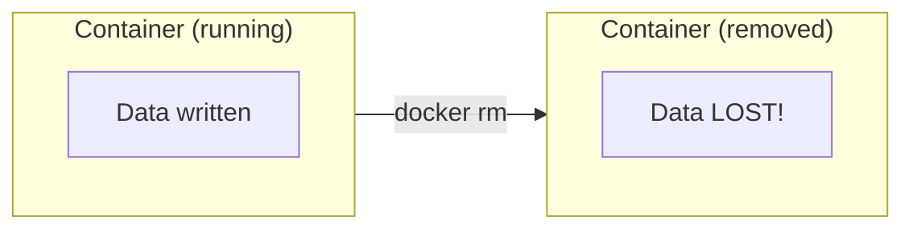
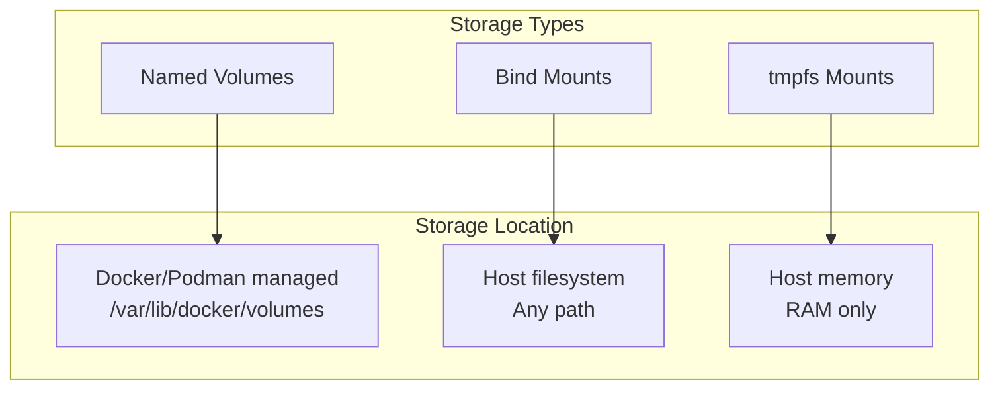
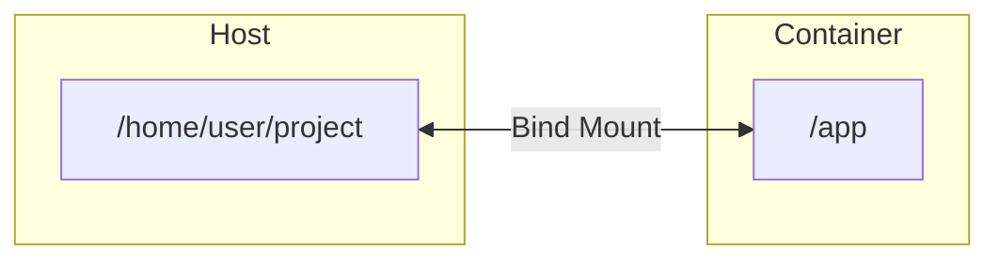

# Introduction to Volumes

> **Module:** Part 1 - Beginner | **Level:** Foundation | **Time:** 30 minutes

## Learning Objectives

By the end of this section, you will be able to:

- Explain why containers need persistent storage
- Understand the different types of container storage
- Create and use named volumes
- Mount host directories into containers
- Manage volume lifecycle

---

## The Data Persistence Problem

By default, container data is ephemeral:



**Example:**
```bash
# Create a container and write data
docker run --name mydb -d postgres:15
docker exec mydb psql -U postgres -c "CREATE TABLE test (id int);"

# Remove and recreate container
docker rm -f mydb
docker run --name mydb -d postgres:15
docker exec mydb psql -U postgres -c "SELECT * FROM test;"
# ERROR: relation "test" does not exist
```

**Solution: Volumes!**

---

## Types of Container Storage



| Type | Managed By | Persistence | Use Case |
|------|-----------|-------------|----------|
| **Named Volume** | Docker/Podman | Yes | Database storage, application data |
| **Bind Mount** | You | Yes | Development, config files |
| **tmpfs** | Kernel | No (RAM) | Secrets, temporary data |

---

## Named Volumes

### Creating Volumes

```bash
# Create a named volume
docker volume create mydata

# Create with options
docker volume create --driver local \
    --opt type=none \
    --opt device=/data/mydata \
    --opt o=bind \
    mydata
```

### Using Volumes

```bash
# Mount volume to container
docker run -d --name db \
    -v mydata:/var/lib/postgresql/data \
    postgres:15

# Same with --mount (more explicit)
docker run -d --name db \
    --mount source=mydata,target=/var/lib/postgresql/data \
    postgres:15
```

### Volume Lifecycle

```bash
# List volumes
docker volume ls

# Inspect volume
docker volume inspect mydata

# Remove volume
docker volume rm mydata

# Remove unused volumes
docker volume prune

# Remove all volumes (careful!)
docker volume rm $(docker volume ls -q)
```

### Volume Data Persistence Demo

```bash
# Create volume and container
docker volume create pgdata
docker run -d --name db1 \
    -e POSTGRES_PASSWORD=secret \
    -v pgdata:/var/lib/postgresql/data \
    postgres:15

# Wait for startup, create data
sleep 5
docker exec db1 psql -U postgres -c "CREATE TABLE users (id int, name text);"
docker exec db1 psql -U postgres -c "INSERT INTO users VALUES (1, 'Alice');"

# Remove container
docker rm -f db1

# Create new container with same volume
docker run -d --name db2 \
    -e POSTGRES_PASSWORD=secret \
    -v pgdata:/var/lib/postgresql/data \
    postgres:15

# Data persists!
sleep 5
docker exec db2 psql -U postgres -c "SELECT * FROM users;"
# id | name
#  1 | Alice
```

---

## Bind Mounts

Bind mounts map a host directory into the container:



### Using Bind Mounts

```bash
# Using -v flag (host:container)
docker run -d --name web \
    -v /home/user/website:/usr/share/nginx/html \
    -p 8080:80 \
    nginx

# Using --mount (more explicit)
docker run -d --name web \
    --mount type=bind,source=/home/user/website,target=/usr/share/nginx/html \
    -p 8080:80 \
    nginx

# Current directory (common for development)
docker run -d --name web \
    -v $(pwd):/usr/share/nginx/html \
    -p 8080:80 \
    nginx

# Read-only mount
docker run -d --name web \
    -v $(pwd):/usr/share/nginx/html:ro \
    -p 8080:80 \
    nginx
```

### Development Workflow

```bash
# Mount code directory for hot-reloading
docker run -d --name devapp \
    -v $(pwd):/app \
    -w /app \
    -p 3000:3000 \
    node:20 \
    npm run dev

# Changes in your editor immediately reflect in container
```

---

## Volume Mount Options

### -v vs --mount Syntax

```bash
# -v syntax: [host-path:]container-path[:options]
-v myvolume:/data           # Named volume
-v /host/path:/container    # Bind mount
-v /container               # Anonymous volume

# --mount syntax: key=value pairs
--mount source=myvolume,target=/data
--mount type=bind,source=/host,target=/container,readonly
--mount type=tmpfs,target=/tmp,tmpfs-size=100m
```

### Common Options

| Option | Description | Example |
|--------|-------------|---------|
| `ro` | Read-only | `-v data:/app:ro` |
| `rw` | Read-write (default) | `-v data:/app:rw` |
| `z` | SELinux shared label | `-v data:/app:z` |
| `Z` | SELinux private label | `-v data:/app:Z` |

### Podman-Specific Options

```bash
# :U option - adjust ownership to container user
podman run -v ./data:/data:U myimage

# :O option - overlay mount
podman run -v ./data:/data:O myimage
```

---

## tmpfs Mounts

For temporary, in-memory storage:

```bash
# Create tmpfs mount
docker run -d --name app \
    --tmpfs /tmp \
    --tmpfs /run:size=100m,mode=1777 \
    myapp

# Using --mount
docker run -d --name app \
    --mount type=tmpfs,target=/tmp,tmpfs-size=100m \
    myapp
```

**Use Cases:**
- Storing secrets that shouldn't persist
- Temporary processing data
- High-performance scratch space

---

## Volume Commands Reference

### List and Inspect

```bash
# List all volumes
docker volume ls

# Filter by name
docker volume ls -f name=pg

# Filter by driver
docker volume ls -f driver=local

# Inspect volume details
docker volume inspect mydata

# Example output:
[
    {
        "CreatedAt": "2024-01-15T10:30:00Z",
        "Driver": "local",
        "Labels": {},
        "Mountpoint": "/var/lib/docker/volumes/mydata/_data",
        "Name": "mydata",
        "Options": {},
        "Scope": "local"
    }
]
```

### Cleanup

```bash
# Remove specific volume
docker volume rm mydata

# Remove unused volumes
docker volume prune

# Force remove
docker volume rm -f mydata

# Remove volumes with container
docker rm -v mycontainer
```

---

## Practical Examples

### Example 1: Database with Persistent Storage

```bash
# Create network and volume
docker network create mynet
docker volume create pgdata

# Run PostgreSQL with persistent storage
docker run -d --name postgres \
    --network mynet \
    -e POSTGRES_PASSWORD=secret \
    -e POSTGRES_DB=myapp \
    -v pgdata:/var/lib/postgresql/data \
    postgres:15

# Connect from another container
docker run -it --rm --network mynet \
    postgres:15 \
    psql -h postgres -U postgres -d myapp
```

### Example 2: Development Environment

```bash
# Node.js development with hot-reload
docker run -d --name nodedev \
    -v $(pwd):/app \
    -v /app/node_modules \
    -w /app \
    -p 3000:3000 \
    node:20 \
    npm run dev

# Note: /app/node_modules anonymous volume prevents overwriting
```

### Example 3: Static Website Development

```bash
# Serve local files with nginx
mkdir -p ~/mysite
echo "<h1>Hello World</h1>" > ~/mysite/index.html

docker run -d --name mysite \
    -v ~/mysite:/usr/share/nginx/html:ro \
    -p 8080:80 \
    nginx

# Edit files locally, refresh browser
```

### Example 4: Backup and Restore

```bash
# Backup volume to tar file
docker run --rm \
    -v mydata:/data \
    -v $(pwd):/backup \
    alpine \
    tar czf /backup/mydata-backup.tar.gz -C /data .

# Restore from backup
docker volume create mydata-restored
docker run --rm \
    -v mydata-restored:/data \
    -v $(pwd):/backup \
    alpine \
    tar xzf /backup/mydata-backup.tar.gz -C /data
```

---

## Volume Storage Locations

### Docker

```bash
# Linux
/var/lib/docker/volumes/<volume-name>/_data

# macOS/Windows (inside Docker Desktop VM)
# Access via: docker run -it --privileged --pid=host debian nsenter -t 1 -m -u -n -i sh
# Then: ls /var/lib/docker/volumes/
```

### Podman

```bash
# Rootful
/var/lib/containers/storage/volumes/<volume-name>/_data

# Rootless
~/.local/share/containers/storage/volumes/<volume-name>/_data

# Check location
podman volume inspect myvolume --format '{{.Mountpoint}}'
```

---

## Common Pitfalls

### 1. Empty Directory Overwrites Container Content

```bash
# Container has files in /app
# Empty host directory mounted
docker run -v ./empty:/app myimage
# Container's /app is now empty!

# Solution: Use named volume or populate directory first
```

### 2. Permission Issues (Rootless)

```bash
# Error: permission denied
podman run -v ./data:/data alpine touch /data/file

# Solutions:
# 1. Use :U option (Podman)
podman run -v ./data:/data:U alpine touch /data/file

# 2. Use --userns=keep-id (Podman)
podman run --userns=keep-id -v ./data:/data alpine touch /data/file

# 3. Match container user to host UID
docker run -u $(id -u):$(id -g) -v ./data:/data alpine touch /data/file
```

### 3. Volume Not Removed with Container

```bash
# Volume persists after container removal
docker rm mycontainer
# Volume still exists!

# Remove volume with container
docker rm -v mycontainer

# Or clean up manually
docker volume prune
```

---

## Key Takeaways

1. **Container filesystem is ephemeral** - use volumes for persistence
2. **Named volumes** are managed by Docker/Podman (recommended for data)
3. **Bind mounts** use host directories (good for development)
4. **tmpfs mounts** are in-memory only (good for secrets/temp data)
5. **Volumes persist** after container deletion (must remove explicitly)
6. **Use :ro** for read-only mounts when write access isn't needed

---

## What's Next

Now that you understand volumes, let's learn about container networking.

Continue to: [09-basic-networking.md](09-basic-networking.md)

---

## Quick Quiz

1. What happens to data in a container when it's removed?
   - [ ] It's automatically backed up
   - [ ] It persists forever
   - [x] It's lost unless using volumes
   - [ ] It's moved to a backup container

2. What's the difference between named volumes and bind mounts?
   - [ ] Named volumes are faster
   - [x] Named volumes are managed by Docker, bind mounts use host paths
   - [ ] Bind mounts can only be read-only
   - [ ] There is no difference

3. How do you mount a volume as read-only?
   - [ ] `-v mydata:/app --readonly`
   - [ ] `-v mydata:/app:r`
   - [x] `-v mydata:/app:ro`
   - [ ] `-v mydata:/app --ro`

4. What command removes all unused volumes?
   - [ ] `docker volume clean`
   - [ ] `docker volume delete --all`
   - [x] `docker volume prune`
   - [ ] `docker volume rm *`
