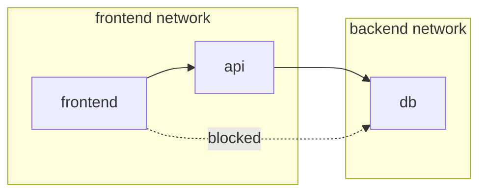

# Compose networking

> **Module:** Part 2 - Intermediate | **Level:** Intermediate | **Time:** 25 minutes

## Learning objectives

By the end of this section, you will be able to:

- Configure custom networks in Compose
- Implement network isolation patterns
- Set up external network connectivity
- Debug network issues

---

## Default networking

By default, Compose creates a single network for your application:

```yaml
# compose.yaml
name: myapp

services:
  web:
    image: nginx
  api:
    image: myapi
  db:
    image: postgres
```

```bash
# Creates network: myapp_default
# All services can reach each other by service name

docker compose up -d
docker network ls | grep myapp
# myapp_default   bridge   local
```

Services communicate using their service names as hostnames:

```bash
# From web container
curl http://api:5000    # Works
ping db                 # Works
```

---

## Custom networks

### Defining networks

```yaml
services:
  frontend:
    image: nginx
    networks:
      - frontend

  api:
    image: myapi
    networks:
      - frontend
      - backend

  db:
    image: postgres
    networks:
      - backend

networks:
  frontend:
    driver: bridge
  backend:
    driver: bridge
```



### Network isolation

```yaml
services:
  web:
    networks:
      - public

  api:
    networks:
      - public
      - private

  db:
    networks:
      - private

  redis:
    networks:
      - private

networks:
  public:
    driver: bridge
  private:
    driver: bridge
    internal: true  # No external access
```

The `internal: true` setting prevents containers on that network from accessing the internet.

---

## Network configuration

### Custom subnet and gateway

```yaml
networks:
  custom:
    driver: bridge
    ipam:
      driver: default
      config:
        - subnet: 172.28.0.0/16
          gateway: 172.28.0.1
```

### Static IP assignment

```yaml
services:
  db:
    image: postgres
    networks:
      custom:
        ipv4_address: 172.28.0.10

networks:
  custom:
    driver: bridge
    ipam:
      config:
        - subnet: 172.28.0.0/16
```

### Network aliases

```yaml
services:
  db:
    image: postgres
    networks:
      backend:
        aliases:
          - database
          - postgres
          - primary-db
```

```bash
# All of these work from other containers
ping db
ping database
ping postgres
ping primary-db
```

---

## External networks

### Connecting to existing networks

```yaml
services:
  api:
    image: myapi
    networks:
      - app-network
      - shared-network

networks:
  app-network:
    # Created by Compose
  shared-network:
    external: true  # Must exist before compose up
```

```bash
# Create external network first
docker network create shared-network

# Then run compose
docker compose up -d
```

### Named external networks

```yaml
networks:
  legacy:
    external: true
    name: my-existing-network  # Use different name
```

---

## DNS and service discovery

### Custom DNS

```yaml
services:
  api:
    image: myapi
    dns:
      - 8.8.8.8
      - 8.8.4.4
    dns_search:
      - example.com
```

### Extra hosts

```yaml
services:
  api:
    image: myapi
    extra_hosts:
      - "host.docker.internal:host-gateway"
      - "somehost:192.168.1.100"
```

---

## Port mapping

### Basic ports

```yaml
services:
  web:
    image: nginx
    ports:
      - "80:80"           # host:container
      - "443:443"
```

### Advanced port syntax

```yaml
services:
  api:
    image: myapi
    ports:
      # Short syntax
      - "8080:80"                    # Bind to all interfaces
      - "127.0.0.1:8080:80"          # Bind to localhost only
      - "8080-8090:80-90"            # Port ranges

      # Long syntax
      - target: 80
        published: 8080
        protocol: tcp
        mode: host
```

### Expose vs ports

```yaml
services:
  api:
    expose:
      - "5000"    # Internal only, for container-to-container
    ports:
      - "8080:80" # Published to host
```

---

## Network modes

### Host network

```yaml
services:
  monitoring:
    image: prometheus
    network_mode: host  # Share host's network stack
```

### Container network

```yaml
services:
  app:
    image: myapp

  sidecar:
    image: logging-agent
    network_mode: "service:app"  # Share app's network
```

### No network

```yaml
services:
  isolated:
    image: myapp
    network_mode: none  # No network access
```

---

## Practical patterns

### Frontend/backend isolation

```yaml
name: webapp

services:
  nginx:
    image: nginx
    ports:
      - "80:80"
    volumes:
      - ./nginx.conf:/etc/nginx/nginx.conf:ro
    networks:
      - frontend
    depends_on:
      - api

  api:
    build: ./api
    networks:
      - frontend
      - backend
    depends_on:
      db:
        condition: service_healthy

  db:
    image: postgres:15-alpine
    volumes:
      - db_data:/var/lib/postgresql/data
    networks:
      - backend
    healthcheck:
      test: ["CMD-SHELL", "pg_isready"]
      interval: 10s
      timeout: 5s
      retries: 5

networks:
  frontend:
    driver: bridge
  backend:
    driver: bridge
    internal: true  # Database not accessible from outside

volumes:
  db_data:
```

### Multi-project communication

```yaml
# Project A: compose.yaml
name: project-a

services:
  api:
    image: api-a
    networks:
      - shared

networks:
  shared:
    name: shared-services
    driver: bridge
```

```yaml
# Project B: compose.yaml
name: project-b

services:
  api:
    image: api-b
    networks:
      - shared

networks:
  shared:
    external: true
    name: shared-services
```

```bash
# Start project A first (creates shared-services network)
cd project-a && docker compose up -d

# Start project B (joins existing network)
cd project-b && docker compose up -d

# Now api containers can communicate
docker compose exec api ping project-a-api-1
```

---

## Debugging networks

### Inspect network

```bash
# List networks
docker network ls

# Inspect network details
docker network inspect myapp_default

# Find which containers are connected
docker network inspect myapp_default --format '{{range .Containers}}{{.Name}} {{end}}'
```

### Test connectivity

```bash
# Exec into container and test
docker compose exec api ping db
docker compose exec api nc -zv db 5432

# Test DNS resolution
docker compose exec api nslookup db
```

### Network troubleshooting

```bash
# Check container networking
docker compose exec api ip addr
docker compose exec api cat /etc/resolv.conf

# Check routes
docker compose exec api ip route
```

---

## Key takeaways

1. **Default networks** connect all services automatically
2. **Custom networks** enable isolation patterns
3. **Internal networks** prevent external access
4. **External networks** allow cross-project communication
5. **Aliases** provide multiple DNS names for services

---

## What's next

Learn about volumes and persistent storage in Compose.

Continue to: [04-compose-volumes.md](04-compose-volumes.md)
