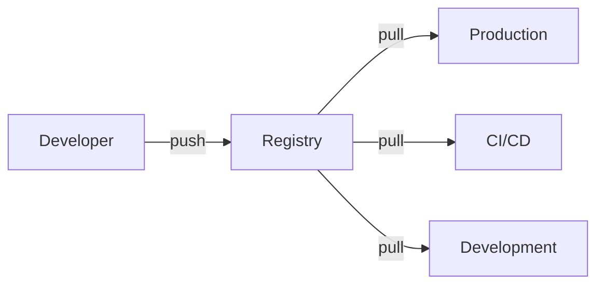

# Container registries

> **Module:** Part 2 - Intermediate | **Level:** Intermediate | **Time:** 25 minutes

## Learning objectives

By the end of this section, you will be able to:

- Understand container registry concepts
- Push and pull images from registries
- Set up private registries
- Manage image tags and versions

---

## Registry concepts

A container registry stores and distributes container images:



### Image naming

```
[registry/][namespace/]repository[:tag][@digest]
```

| Component | Example | Description |
|-----------|---------|-------------|
| Registry | `docker.io`, `ghcr.io` | Registry hostname |
| Namespace | `library`, `myorg` | Organization or user |
| Repository | `nginx`, `myapp` | Image name |
| Tag | `latest`, `v1.0.0` | Version identifier |
| Digest | `sha256:abc123...` | Content hash |

### Examples

```bash
# Official Docker Hub image
nginx                        # = docker.io/library/nginx:latest
nginx:alpine                 # = docker.io/library/nginx:alpine

# Docker Hub user image
myuser/myapp:v1.0.0

# GitHub Container Registry
ghcr.io/myorg/myapp:latest

# Private registry
registry.example.com/myapp:v1.0.0

# By digest (immutable)
nginx@sha256:abc123def456...
```

---

## Public registries

### Docker Hub

```bash
# Login
docker login
# or
podman login docker.io

# Pull
docker pull nginx:alpine

# Push (requires login)
docker tag myapp:latest myuser/myapp:v1.0.0
docker push myuser/myapp:v1.0.0
```

### GitHub Container Registry (ghcr.io)

```bash
# Login with personal access token
echo $GITHUB_TOKEN | docker login ghcr.io -u USERNAME --password-stdin

# Tag and push
docker tag myapp:latest ghcr.io/myorg/myapp:v1.0.0
docker push ghcr.io/myorg/myapp:v1.0.0
```

### Other registries

| Registry | URL | Notes |
|----------|-----|-------|
| Docker Hub | `docker.io` | Default, rate limited |
| GitHub | `ghcr.io` | Free for public repos |
| GitLab | `registry.gitlab.com` | Integrated with GitLab CI |
| Google | `gcr.io`, `us-docker.pkg.dev` | GCP integration |
| AWS ECR | `<account>.dkr.ecr.<region>.amazonaws.com` | AWS integration |
| Azure | `<name>.azurecr.io` | Azure integration |
| Quay.io | `quay.io` | Red Hat registry |

---

## Authentication

### Docker credential store

```bash
# Configure credential helper (macOS)
# ~/.docker/config.json
{
  "credsStore": "osxkeychain"
}

# Linux with pass
{
  "credsStore": "pass"
}
```

### Registry authentication

```bash
# Interactive login
docker login registry.example.com

# Non-interactive
echo "$PASSWORD" | docker login -u "$USERNAME" --password-stdin registry.example.com

# Podman (supports same commands)
podman login registry.example.com
```

### Multiple registries

```json
// ~/.docker/config.json
{
  "auths": {
    "docker.io": {},
    "ghcr.io": {},
    "registry.example.com": {}
  },
  "credsStore": "pass"
}
```

---

## Private registry setup

### Basic registry

```yaml
# compose.yaml
services:
  registry:
    image: registry:2
    ports:
      - "5000:5000"
    volumes:
      - registry_data:/var/lib/registry

volumes:
  registry_data:
```

```bash
# Start registry
docker compose up -d

# Tag and push local image
docker tag myapp:latest localhost:5000/myapp:v1.0.0
docker push localhost:5000/myapp:v1.0.0

# Pull from registry
docker pull localhost:5000/myapp:v1.0.0
```

### Registry with authentication

```yaml
services:
  registry:
    image: registry:2
    ports:
      - "5000:5000"
    environment:
      REGISTRY_AUTH: htpasswd
      REGISTRY_AUTH_HTPASSWD_REALM: "Registry Realm"
      REGISTRY_AUTH_HTPASSWD_PATH: /auth/htpasswd
    volumes:
      - registry_data:/var/lib/registry
      - ./auth:/auth:ro

volumes:
  registry_data:
```

```bash
# Create password file
mkdir auth
docker run --rm --entrypoint htpasswd httpd:2 -Bbn admin secretpassword > auth/htpasswd

# Start registry
docker compose up -d

# Login
docker login localhost:5000
```

### Registry with TLS

```yaml
services:
  registry:
    image: registry:2
    ports:
      - "443:443"
    environment:
      REGISTRY_HTTP_ADDR: 0.0.0.0:443
      REGISTRY_HTTP_TLS_CERTIFICATE: /certs/domain.crt
      REGISTRY_HTTP_TLS_KEY: /certs/domain.key
    volumes:
      - registry_data:/var/lib/registry
      - ./certs:/certs:ro

volumes:
  registry_data:
```

---

## Image tagging strategies

### Semantic versioning

```bash
# Tag with version
docker tag myapp:latest myregistry/myapp:1.0.0
docker tag myapp:latest myregistry/myapp:1.0
docker tag myapp:latest myregistry/myapp:1
docker tag myapp:latest myregistry/myapp:latest

# Push all tags
docker push myregistry/myapp --all-tags
```

### Git-based tagging

```bash
# Tag with git SHA
GIT_SHA=$(git rev-parse --short HEAD)
docker tag myapp:latest myregistry/myapp:${GIT_SHA}

# Tag with branch name
BRANCH=$(git rev-parse --abbrev-ref HEAD | sed 's/\//-/g')
docker tag myapp:latest myregistry/myapp:${BRANCH}
```

### CI/CD tagging pattern

```bash
# Example tagging script
VERSION=${GITHUB_REF_NAME:-dev}
SHA=${GITHUB_SHA:0:7}
TIMESTAMP=$(date +%Y%m%d%H%M%S)

docker tag myapp:latest myregistry/myapp:${VERSION}
docker tag myapp:latest myregistry/myapp:${SHA}
docker tag myapp:latest myregistry/myapp:${VERSION}-${SHA}
docker tag myapp:latest myregistry/myapp:${TIMESTAMP}
```

---

## Compose with registries

### Using registry images

```yaml
services:
  api:
    image: ghcr.io/myorg/api:${VERSION:-latest}

  worker:
    image: myregistry.example.com/worker:${VERSION:-latest}
```

### Build and push

```yaml
services:
  api:
    build: ./api
    image: ghcr.io/myorg/api:${VERSION:-latest}
```

```bash
# Build and push
docker compose build
docker compose push

# Or in one command
docker compose build --push
```

---

## Registry management

### List images in registry

```bash
# Docker Hub
curl -s "https://hub.docker.com/v2/repositories/myuser/?page_size=100" | jq '.results[].name'

# Private registry (v2 API)
curl -s https://registry.example.com/v2/_catalog | jq

# List tags
curl -s https://registry.example.com/v2/myapp/tags/list | jq
```

### Delete images

```bash
# Get digest
DIGEST=$(curl -sI -H "Accept: application/vnd.docker.distribution.manifest.v2+json" \
    https://registry.example.com/v2/myapp/manifests/v1.0.0 \
    | grep -i docker-content-digest | awk '{print $2}' | tr -d '\r')

# Delete manifest
curl -X DELETE https://registry.example.com/v2/myapp/manifests/${DIGEST}
```

### Garbage collection

```bash
# Run garbage collection on private registry
docker exec registry bin/registry garbage-collect /etc/docker/registry/config.yml

# Dry run first
docker exec registry bin/registry garbage-collect --dry-run /etc/docker/registry/config.yml
```

---

## Practical example: Multi-registry CI/CD

```yaml
# compose.yaml
name: myapp

services:
  api:
    build:
      context: ./api
      target: ${BUILD_TARGET:-production}
    image: ${REGISTRY:-ghcr.io}/${NAMESPACE:-myorg}/api:${VERSION:-latest}
    environment:
      - DATABASE_URL=${DATABASE_URL}
    depends_on:
      - db

  worker:
    build: ./worker
    image: ${REGISTRY:-ghcr.io}/${NAMESPACE:-myorg}/worker:${VERSION:-latest}
    environment:
      - DATABASE_URL=${DATABASE_URL}
    depends_on:
      - db

  db:
    image: postgres:15-alpine
    volumes:
      - postgres_data:/var/lib/postgresql/data

volumes:
  postgres_data:
```

```bash
# CI/CD script
#!/bin/bash
set -e

# Configuration
export REGISTRY=ghcr.io
export NAMESPACE=myorg
export VERSION=${GITHUB_REF_NAME:-$(git rev-parse --short HEAD)}

# Login
echo "$GITHUB_TOKEN" | docker login ghcr.io -u "$GITHUB_ACTOR" --password-stdin

# Build
docker compose build

# Push
docker compose push

# Tag as latest if on main branch
if [ "$GITHUB_REF_NAME" = "main" ]; then
    docker tag ${REGISTRY}/${NAMESPACE}/api:${VERSION} ${REGISTRY}/${NAMESPACE}/api:latest
    docker tag ${REGISTRY}/${NAMESPACE}/worker:${VERSION} ${REGISTRY}/${NAMESPACE}/worker:latest
    docker push ${REGISTRY}/${NAMESPACE}/api:latest
    docker push ${REGISTRY}/${NAMESPACE}/worker:latest
fi
```

---

## Key takeaways

1. **Image names** include registry, namespace, repository, and tag
2. **Use digests** for immutable, reproducible deployments
3. **Semantic versioning** helps track releases
4. **Private registries** provide control and security
5. **Authentication** is required for pushing images

---

## What's next

Learn about multi-stage builds and image optimization.

Continue to: [08-image-optimization.md](08-image-optimization.md)
