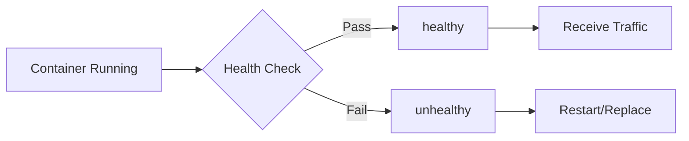

# Container health checks

> **Module:** Part 2 - Intermediate | **Level:** Intermediate | **Time:** 20 minutes

## Learning objectives

By the end of this section, you will be able to:

- Implement effective health checks
- Configure health check parameters
- Use health checks for dependencies
- Debug health check issues

---

## Why health checks matter

Without health checks, a container is considered healthy if its main process is running, even if the application is unresponsive.



---

## Health check basics

### In Dockerfile

```dockerfile
FROM nginx:alpine

HEALTHCHECK --interval=30s --timeout=10s --start-period=5s --retries=3 \
    CMD curl -f http://localhost/ || exit 1
```

### In docker run

```bash
docker run -d \
    --health-cmd "curl -f http://localhost/health || exit 1" \
    --health-interval 30s \
    --health-timeout 10s \
    --health-retries 3 \
    --health-start-period 5s \
    myapp:latest
```

### In Compose

```yaml
services:
  api:
    image: myapi:latest
    healthcheck:
      test: ["CMD", "curl", "-f", "http://localhost:5000/health"]
      interval: 30s
      timeout: 10s
      retries: 3
      start_period: 10s
```

---

## Health check parameters

| Parameter | Description | Default |
|-----------|-------------|---------|
| `interval` | Time between checks | 30s |
| `timeout` | Max time for check to complete | 30s |
| `start_period` | Grace period for startup | 0s |
| `retries` | Failures before unhealthy | 3 |

### Parameter guidelines

```yaml
healthcheck:
  # Fast checks for critical services
  interval: 10s
  timeout: 5s
  retries: 3
  start_period: 30s  # Allow time for startup
```

**Start period**: Health check failures during start_period don't count toward retries. Use this for slow-starting applications.

---

## Health check commands

### CMD vs CMD-SHELL

```yaml
# CMD form (exec, no shell)
healthcheck:
  test: ["CMD", "curl", "-f", "http://localhost/health"]

# CMD-SHELL form (runs through shell)
healthcheck:
  test: ["CMD-SHELL", "curl -f http://localhost/health || exit 1"]

# String form (same as CMD-SHELL)
healthcheck:
  test: "curl -f http://localhost/health || exit 1"
```

### Exit codes

| Exit Code | Status |
|-----------|--------|
| 0 | healthy |
| 1 | unhealthy |
| Other | unhealthy |

---

## Health check patterns

### HTTP health endpoint

```yaml
# Check HTTP endpoint
healthcheck:
  test: ["CMD", "curl", "-f", "http://localhost:8080/health"]
  interval: 30s
  timeout: 10s
  retries: 3
```

```python
# Flask health endpoint
@app.route('/health')
def health():
    # Check dependencies
    try:
        db.session.execute('SELECT 1')
        redis_client.ping()
        return {'status': 'healthy'}, 200
    except Exception as e:
        return {'status': 'unhealthy', 'error': str(e)}, 500
```

### TCP port check

```yaml
# Check if port is listening
healthcheck:
  test: ["CMD-SHELL", "nc -z localhost 5432 || exit 1"]
```

### Database health checks

```yaml
# PostgreSQL
services:
  postgres:
    image: postgres:15-alpine
    healthcheck:
      test: ["CMD-SHELL", "pg_isready -U postgres -d mydb"]
      interval: 10s
      timeout: 5s
      retries: 5

# MySQL
services:
  mysql:
    image: mysql:8
    healthcheck:
      test: ["CMD", "mysqladmin", "ping", "-h", "localhost"]
      interval: 10s
      timeout: 5s
      retries: 5

# MongoDB
services:
  mongodb:
    image: mongo:7
    healthcheck:
      test: ["CMD", "mongosh", "--eval", "db.adminCommand('ping')"]
      interval: 10s
      timeout: 5s
      retries: 5
```

### Redis health check

```yaml
services:
  redis:
    image: redis:7-alpine
    healthcheck:
      test: ["CMD", "redis-cli", "ping"]
      interval: 10s
      timeout: 5s
      retries: 5
```

### Custom script

```dockerfile
# Copy health check script
COPY healthcheck.sh /usr/local/bin/
RUN chmod +x /usr/local/bin/healthcheck.sh

HEALTHCHECK --interval=30s --timeout=10s --retries=3 \
    CMD /usr/local/bin/healthcheck.sh
```

```bash
#!/bin/sh
# healthcheck.sh

# Check HTTP
if ! curl -sf http://localhost:8080/health > /dev/null; then
    exit 1
fi

# Check disk space
DISK_USAGE=$(df -h / | awk 'NR==2 {print $5}' | tr -d '%')
if [ "$DISK_USAGE" -gt 90 ]; then
    exit 1
fi

# Check memory
# Add more checks as needed

exit 0
```

---

## Dependency health in Compose

### Wait for healthy dependency

```yaml
services:
  db:
    image: postgres:15-alpine
    healthcheck:
      test: ["CMD-SHELL", "pg_isready -U postgres"]
      interval: 10s
      timeout: 5s
      retries: 5

  api:
    image: myapi:latest
    depends_on:
      db:
        condition: service_healthy
```

### Dependency conditions

| Condition | Description |
|-----------|-------------|
| `service_started` | Container started (default) |
| `service_healthy` | Health check passing |
| `service_completed_successfully` | Container exited with 0 |

### Multiple dependencies

```yaml
services:
  api:
    image: myapi:latest
    depends_on:
      postgres:
        condition: service_healthy
      redis:
        condition: service_healthy
      migrations:
        condition: service_completed_successfully
    healthcheck:
      test: ["CMD", "curl", "-f", "http://localhost:5000/health"]
      interval: 30s
      timeout: 10s
      retries: 3
      start_period: 30s

  postgres:
    image: postgres:15-alpine
    healthcheck:
      test: ["CMD-SHELL", "pg_isready -U postgres"]
      interval: 10s
      timeout: 5s
      retries: 5

  redis:
    image: redis:7-alpine
    healthcheck:
      test: ["CMD", "redis-cli", "ping"]
      interval: 10s
      timeout: 5s
      retries: 5

  migrations:
    image: myapp-migrations:latest
    depends_on:
      postgres:
        condition: service_healthy
    restart: "no"
```

---

## Checking health status

### View health status

```bash
# List with health status
docker ps

# Detailed health info
docker inspect --format '{{json .State.Health}}' mycontainer | jq

# Health status only
docker inspect --format '{{.State.Health.Status}}' mycontainer

# Recent health check logs
docker inspect --format '{{range .State.Health.Log}}{{.Output}}{{end}}' mycontainer
```

### Health states

| State | Description |
|-------|-------------|
| `starting` | In start_period, not yet healthy |
| `healthy` | Check passing |
| `unhealthy` | Check failing (after retries) |

---

## Disabling health checks

```yaml
# Disable in Compose
services:
  debug:
    image: myapi:latest
    healthcheck:
      disable: true
```

```dockerfile
# Disable inherited health check
FROM mybaseimage
HEALTHCHECK NONE
```

---

## Practical example: Full stack

```yaml
name: healthcheck-demo

services:
  # Frontend
  frontend:
    build: ./frontend
    ports:
      - "80:80"
    healthcheck:
      test: ["CMD", "curl", "-f", "http://localhost/"]
      interval: 30s
      timeout: 10s
      retries: 3
    depends_on:
      api:
        condition: service_healthy

  # API
  api:
    build: ./api
    ports:
      - "5000:5000"
    environment:
      - DATABASE_URL=postgres://user:pass@db:5432/app
      - REDIS_URL=redis://redis:6379
    healthcheck:
      test: ["CMD", "curl", "-f", "http://localhost:5000/health"]
      interval: 30s
      timeout: 10s
      retries: 3
      start_period: 30s
    depends_on:
      db:
        condition: service_healthy
      redis:
        condition: service_healthy

  # Database
  db:
    image: postgres:15-alpine
    environment:
      POSTGRES_USER: user
      POSTGRES_PASSWORD: pass
      POSTGRES_DB: app
    volumes:
      - postgres_data:/var/lib/postgresql/data
    healthcheck:
      test: ["CMD-SHELL", "pg_isready -U user -d app"]
      interval: 10s
      timeout: 5s
      retries: 5
      start_period: 10s

  # Cache
  redis:
    image: redis:7-alpine
    command: redis-server --appendonly yes
    volumes:
      - redis_data:/data
    healthcheck:
      test: ["CMD", "redis-cli", "ping"]
      interval: 10s
      timeout: 5s
      retries: 5

volumes:
  postgres_data:
  redis_data:
```

---

## Key takeaways

1. **Health checks** verify application responsiveness, not just process running
2. **Use start_period** for slow-starting applications
3. **Check dependencies** before marking service healthy
4. **Use service_healthy** condition in depends_on
5. **Create dedicated /health endpoints** that verify all dependencies

---

## What's next

Learn about logging and debugging containers.

Continue to: [10-logging-debugging.md](10-logging-debugging.md)
