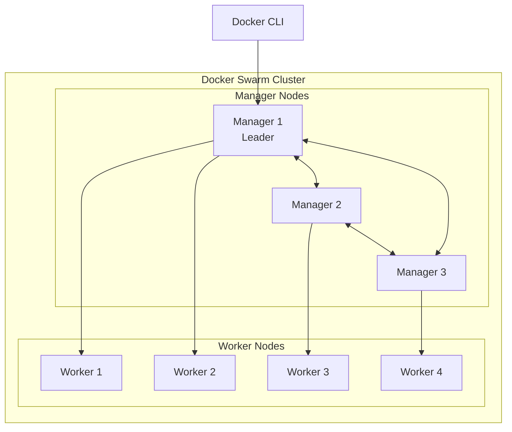
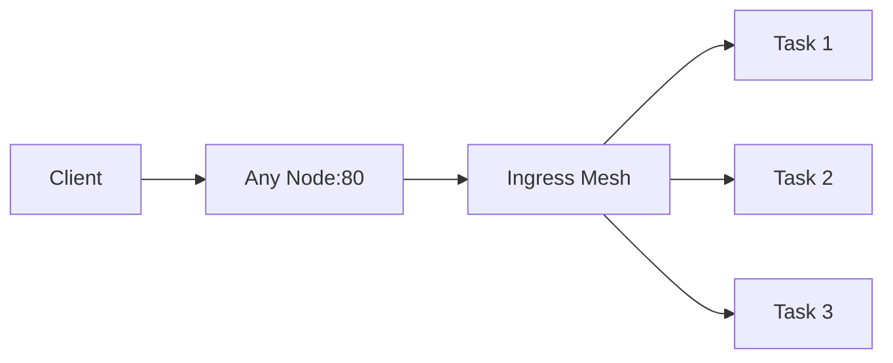

# Docker Swarm Introduction

> **Module:** Part 3 - Advanced | **Level:** Advanced | **Time:** 40 minutes

## Learning Objectives

By the end of this section, you will be able to:

- Explain what Docker Swarm is and when to use it
- Understand Swarm architecture and concepts
- Initialize a Swarm cluster
- Deploy services to Swarm

---

## What is Docker Swarm?

Docker Swarm is Docker's native orchestration solution for managing clusters of Docker engines.



### Key Features

| Feature | Description |
|---------|-------------|
| **Built-in** | No additional software needed |
| **Declarative** | Define desired state, Swarm maintains it |
| **Scaling** | Easy horizontal scaling |
| **Load Balancing** | Built-in ingress load balancing |
| **Rolling Updates** | Zero-downtime deployments |
| **Service Discovery** | Automatic DNS for services |
| **Secrets Management** | Secure secrets distribution |

---

## Swarm Architecture

### Node Types

**Manager Nodes:**
- Maintain cluster state
- Schedule services
- Serve Swarm API
- Run Raft consensus algorithm

**Worker Nodes:**
- Execute container workloads
- Report status to managers
- Don't participate in scheduling decisions

### Raft Consensus

Managers use Raft to maintain consistent state:

| Managers | Quorum | Fault Tolerance |
|----------|--------|-----------------|
| 1 | 1 | 0 failures |
| 3 | 2 | 1 failure |
| 5 | 3 | 2 failures |
| 7 | 4 | 3 failures |

**Best Practice:** Use 3 or 5 managers for production.

---

## Core Concepts

### Services

A service is the definition of tasks to run on the swarm:

```bash
# Service = desired state
docker service create \
    --name web \
    --replicas 3 \
    --publish 80:80 \
    nginx

# Tasks = actual containers running
```

### Tasks

A task is a single container instance:

```
Service: web (replicas: 3)
├── Task 1: web.1 → Container on Worker1
├── Task 2: web.2 → Container on Worker2
└── Task 3: web.3 → Container on Worker3
```

### Stacks

A stack is a collection of services defined in a Compose file:

```yaml
# stack.yaml
version: '3.8'
services:
  web:
    image: nginx
    deploy:
      replicas: 3
  api:
    image: myapi
    deploy:
      replicas: 2
```

---

## Initializing a Swarm

### Create the First Manager

```bash
# Initialize Swarm
docker swarm init

# If multiple IPs, specify which one
docker swarm init --advertise-addr 192.168.1.10

# Output includes join tokens:
# To add a worker: docker swarm join --token SWMTKN-1-xxx 192.168.1.10:2377
# To add a manager: docker swarm join-token manager
```

### Add Worker Nodes

```bash
# On each worker node
docker swarm join --token SWMTKN-1-xxx 192.168.1.10:2377
```

### Add Manager Nodes

```bash
# Get manager join token
docker swarm join-token manager

# On new manager node
docker swarm join --token SWMTKN-1-xxx-manager 192.168.1.10:2377
```

### View Cluster Status

```bash
# List nodes
docker node ls

# Output:
ID                  HOSTNAME    STATUS   AVAILABILITY   MANAGER STATUS
abc123 *           manager1     Ready    Active         Leader
def456             manager2     Ready    Active         Reachable
ghi789             manager3     Ready    Active         Reachable
jkl012             worker1      Ready    Active
mno345             worker2      Ready    Active
```

---

## Deploying Services

### Basic Service

```bash
# Create a service
docker service create --name web nginx

# List services
docker service ls

# View service details
docker service ps web

# View service logs
docker service logs web
```

### Service with Options

```bash
docker service create \
    --name web \
    --replicas 3 \
    --publish 80:80 \
    --env NODE_ENV=production \
    --mount type=volume,source=webdata,target=/data \
    --limit-cpu 0.5 \
    --limit-memory 256M \
    --constraint 'node.role==worker' \
    nginx:alpine
```

### Scaling Services

```bash
# Scale to 5 replicas
docker service scale web=5

# Or update the service
docker service update --replicas 5 web

# Scale multiple services
docker service scale web=5 api=3 worker=10
```

---

## Service Networking

### Overlay Networks

Services communicate over overlay networks that span the cluster:

```bash
# Create overlay network
docker network create --driver overlay backend

# Create services on the network
docker service create --name api --network backend myapi
docker service create --name db --network backend postgres

# Services can reach each other by name
# api can connect to db using hostname "db"
```

### Ingress Routing Mesh

Swarm provides built-in load balancing:



```bash
# Service available on port 80 of ANY node
docker service create --name web --publish 80:80 nginx

# Request to any node reaches the service
curl http://node1:80
curl http://node2:80
curl http://node3:80
# All work, even if container isn't on that node
```

---

## Rolling Updates

### Update Service

```bash
# Update image
docker service update --image nginx:1.25 web

# Update with controlled rollout
docker service update \
    --image nginx:1.25 \
    --update-parallelism 2 \
    --update-delay 10s \
    --update-failure-action rollback \
    web
```

### Rollback

```bash
# Rollback to previous version
docker service rollback web

# Or update with specific previous image
docker service update --image nginx:1.24 web
```

---

## Stacks

### Stack File (Compose v3)

```yaml
# stack.yaml
version: '3.8'

services:
  web:
    image: nginx:alpine
    ports:
      - "80:80"
    deploy:
      replicas: 3
      update_config:
        parallelism: 1
        delay: 10s
      restart_policy:
        condition: on-failure
    networks:
      - frontend

  api:
    image: myapi:latest
    deploy:
      replicas: 2
    networks:
      - frontend
      - backend

  db:
    image: postgres:15
    environment:
      POSTGRES_PASSWORD_FILE: /run/secrets/db_password
    volumes:
      - dbdata:/var/lib/postgresql/data
    deploy:
      placement:
        constraints:
          - node.role == manager
    networks:
      - backend
    secrets:
      - db_password

networks:
  frontend:
  backend:

volumes:
  dbdata:

secrets:
  db_password:
    external: true
```

### Deploy Stack

```bash
# Create secret first
echo "mysecretpassword" | docker secret create db_password -

# Deploy stack
docker stack deploy -c stack.yaml myapp

# List stacks
docker stack ls

# List stack services
docker stack services myapp

# List stack tasks
docker stack ps myapp

# Remove stack
docker stack rm myapp
```

---

## Node Management

### Node Labels

```bash
# Add label to node
docker node update --label-add zone=us-east worker1
docker node update --label-add disk=ssd worker2

# Use in service constraints
docker service create \
    --constraint 'node.labels.zone==us-east' \
    --constraint 'node.labels.disk==ssd' \
    myapp
```

### Node Availability

```bash
# Drain node (for maintenance)
docker node update --availability drain worker1
# Tasks will be rescheduled to other nodes

# Return to active
docker node update --availability active worker1

# Pause (no new tasks, existing continue)
docker node update --availability pause worker1
```

### Promote/Demote Nodes

```bash
# Promote worker to manager
docker node promote worker1

# Demote manager to worker
docker node demote manager2
```

---

## When to Use Swarm

### Good Use Cases

| Scenario | Why Swarm |
|----------|-----------|
| Small-medium deployments | Simple, built-in |
| Docker Compose users | Same file format |
| Quick cluster setup | Minutes to deploy |
| Limited resources | Low overhead |
| Learning orchestration | Simpler than K8s |

### Consider Kubernetes Instead

| Scenario | Why Kubernetes |
|----------|----------------|
| Large scale (1000s of containers) | More scalable |
| Complex networking needs | More network plugins |
| Multi-cloud | Better support |
| Large ecosystem needs | More tools/integrations |
| Industry standard required | More widespread |

---

## Key Takeaways

1. **Swarm is Docker-native orchestration** - no additional installation
2. **Managers maintain state**, workers run containers
3. **Services define desired state**, tasks are running containers
4. **Overlay networks** enable multi-host communication
5. **Ingress mesh** provides built-in load balancing
6. **Rolling updates** enable zero-downtime deployments
7. **Stacks** deploy multi-service applications

---

## What's Next

Learn advanced Swarm deployment patterns and production configurations.

Continue to: [02-swarm-services.md](02-swarm-services.md)

---

## Quick Quiz

1. What is the minimum number of manager nodes for fault tolerance?
   - [ ] 1
   - [ ] 2
   - [x] 3
   - [ ] 5

2. What does "docker node update --availability drain" do?
   - [ ] Removes the node from the swarm
   - [ ] Deletes all containers on the node
   - [x] Reschedules tasks away from the node
   - [ ] Pauses all containers

3. How do services on different nodes communicate?
   - [ ] Regular bridge network
   - [x] Overlay network
   - [ ] Host network
   - [ ] They can't communicate

4. What provides automatic load balancing in Swarm?
   - [ ] External load balancer
   - [ ] nginx
   - [x] Ingress routing mesh
   - [ ] DNS round-robin

---

## Navigation

| Previous | Up | Next |
|----------|-----|------|
| [Part 2 Quiz](../part2-intermediate/quiz.md) | [Part 3 Overview](../../course_overview.md#part-3-advanced) | [Swarm Services](02-swarm-services.md) |
