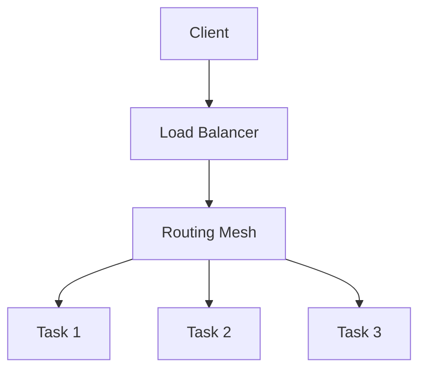

# Swarm services deep dive

> **Module:** Part 3 - Advanced | **Level:** Advanced | **Time:** 30 minutes

## Learning objectives

By the end of this section, you will be able to:

- Create and manage Swarm services
- Configure service replicas and placement
- Implement rolling updates
- Manage service networking

---

## Service fundamentals

### Creating services

```bash
# Basic service
docker service create --name web nginx:alpine

# With replicas
docker service create --name api --replicas 3 myapi:latest

# With published port
docker service create --name web -p 80:80 nginx:alpine

# With environment variables
docker service create --name api \
    -e DATABASE_URL=postgres://db:5432/app \
    -e LOG_LEVEL=info \
    myapi:latest
```

### Service vs container

| Aspect | Container | Service |
|--------|-----------|---------|
| Scope | Single host | Cluster-wide |
| Replicas | Manual | Automatic |
| Scheduling | Manual | Orchestrated |
| Recovery | Manual restart | Auto-restart |
| Updates | Manual | Rolling updates |

---

## Managing services

### List and inspect

```bash
# List services
docker service ls

# Service details
docker service inspect web

# Service tasks (containers)
docker service ps web

# Filter by status
docker service ps web --filter "desired-state=running"
```

### Scaling

```bash
# Scale up/down
docker service scale web=5

# Scale multiple services
docker service scale web=5 api=3

# Using update
docker service update --replicas 10 web
```

### Logs

```bash
# All replicas
docker service logs web

# Follow logs
docker service logs -f web

# With timestamps
docker service logs -t web

# Last N lines
docker service logs --tail 100 web
```

---

## Service configuration

### Resource limits

```bash
docker service create --name api \
    --limit-cpu 2.0 \
    --limit-memory 512M \
    --reserve-cpu 0.5 \
    --reserve-memory 256M \
    myapi:latest
```

### Restart policy

```bash
docker service create --name api \
    --restart-condition on-failure \
    --restart-delay 5s \
    --restart-max-attempts 3 \
    --restart-window 120s \
    myapi:latest
```

| Condition | Description |
|-----------|-------------|
| `none` | Never restart |
| `on-failure` | Restart on non-zero exit |
| `any` | Always restart (default) |

### Health checks

```bash
docker service create --name api \
    --health-cmd "curl -f http://localhost/health" \
    --health-interval 30s \
    --health-timeout 10s \
    --health-retries 3 \
    --health-start-period 60s \
    myapi:latest
```

---

## Rolling updates

### Update configuration

```bash
docker service create --name api \
    --replicas 6 \
    --update-parallelism 2 \
    --update-delay 10s \
    --update-failure-action rollback \
    --update-max-failure-ratio 0.25 \
    --update-order start-first \
    myapi:v1
```

| Option | Description |
|--------|-------------|
| `--update-parallelism` | Tasks to update simultaneously |
| `--update-delay` | Delay between updates |
| `--update-failure-action` | Action on failure (pause, continue, rollback) |
| `--update-max-failure-ratio` | Failure threshold |
| `--update-order` | start-first or stop-first |

### Performing updates

```bash
# Update image
docker service update --image myapi:v2 api

# Update with detach (don't wait)
docker service update --image myapi:v2 --detach api

# Force update (redeploy same image)
docker service update --force api
```

### Rollback

```bash
# Rollback to previous version
docker service rollback api

# Configure rollback behavior
docker service update \
    --rollback-parallelism 1 \
    --rollback-delay 10s \
    --rollback-failure-action pause \
    api
```

---

## Placement constraints

### Node labels

```bash
# Add label to node
docker node update --label-add environment=production node1
docker node update --label-add disk=ssd node2

# List node labels
docker node inspect node1 --format '{{json .Spec.Labels}}'
```

### Constraint examples

```bash
# Run only on worker nodes
docker service create --name api \
    --constraint 'node.role==worker' \
    myapi:latest

# Run on specific labeled nodes
docker service create --name db \
    --constraint 'node.labels.disk==ssd' \
    postgres:15-alpine

# Multiple constraints (AND)
docker service create --name api \
    --constraint 'node.role==worker' \
    --constraint 'node.labels.environment==production' \
    myapi:latest
```

### Placement preferences

```bash
# Spread across zones
docker service create --name web \
    --replicas 6 \
    --placement-pref 'spread=node.labels.zone' \
    nginx:alpine
```

---

## Service networking

### Overlay networks

```bash
# Create overlay network
docker network create --driver overlay --attachable app-network

# Create service on network
docker service create --name api \
    --network app-network \
    myapi:latest

# Connect existing service to network
docker service update --network-add app-network api
```

### Publishing ports

```bash
# Routing mesh (default)
docker service create --name web \
    -p 80:80 \
    nginx:alpine

# Host mode (no routing mesh)
docker service create --name web \
    -p mode=host,target=80,published=80 \
    nginx:alpine
```

### Load balancing



---

## Secrets and configs

### Using secrets

```bash
# Create secret
echo "mysecretpassword" | docker secret create db_password -

# Use in service
docker service create --name api \
    --secret db_password \
    myapi:latest

# Secret with target path
docker service create --name api \
    --secret source=db_password,target=/run/secrets/database_password,mode=0400 \
    myapi:latest
```

### Using configs

```bash
# Create config
docker config create nginx_config nginx.conf

# Use in service
docker service create --name web \
    --config source=nginx_config,target=/etc/nginx/nginx.conf \
    nginx:alpine
```

### Rotating secrets

```bash
# Create new secret
echo "newsecretpassword" | docker secret create db_password_v2 -

# Update service with new secret
docker service update \
    --secret-rm db_password \
    --secret-add db_password_v2 \
    api
```

---

## Global services

For services that run on every node:

```bash
# Create global service
docker service create --name monitoring \
    --mode global \
    prom/node-exporter:latest

# Global with constraints
docker service create --name logs \
    --mode global \
    --constraint 'node.role==worker' \
    fluent/fluentd:latest
```

---

## Practical example: Full stack

```bash
# Create overlay network
docker network create --driver overlay backend

# Create secrets
echo "dbpassword" | docker secret create postgres_password -
echo "apisecret" | docker secret create api_secret_key -

# Deploy PostgreSQL
docker service create --name postgres \
    --network backend \
    --secret postgres_password \
    -e POSTGRES_PASSWORD_FILE=/run/secrets/postgres_password \
    -e POSTGRES_DB=myapp \
    --mount type=volume,source=postgres_data,target=/var/lib/postgresql/data \
    --constraint 'node.labels.disk==ssd' \
    postgres:15-alpine

# Deploy Redis
docker service create --name redis \
    --network backend \
    redis:7-alpine

# Deploy API
docker service create --name api \
    --network backend \
    --replicas 3 \
    --secret api_secret_key \
    --secret postgres_password \
    -e DATABASE_URL=postgres://postgres@postgres:5432/myapp \
    -e SECRET_KEY_FILE=/run/secrets/api_secret_key \
    -e REDIS_URL=redis://redis:6379 \
    -p 5000:5000 \
    --update-parallelism 1 \
    --update-delay 10s \
    --health-cmd "curl -f http://localhost:5000/health" \
    --health-interval 30s \
    myapi:latest

# Deploy nginx
docker service create --name nginx \
    --network backend \
    --replicas 2 \
    -p 80:80 \
    --config source=nginx_config,target=/etc/nginx/nginx.conf \
    nginx:alpine
```

---

## Service troubleshooting

```bash
# Check service status
docker service ps api --no-trunc

# See why tasks failed
docker service ps api --filter "desired-state=shutdown"

# Inspect task
docker inspect <task-id>

# Check service logs
docker service logs api --since 5m

# Node task list
docker node ps <node-name>
```

---

## Key takeaways

1. **Services** are the unit of deployment in Swarm
2. **Rolling updates** provide zero-downtime deployments
3. **Placement constraints** control where tasks run
4. **Overlay networks** connect services across nodes
5. **Secrets and configs** manage sensitive and configuration data

---

## What's next

Learn about Docker stacks for declarative deployments.

Continue to: [03-docker-stacks.md](03-docker-stacks.md)
