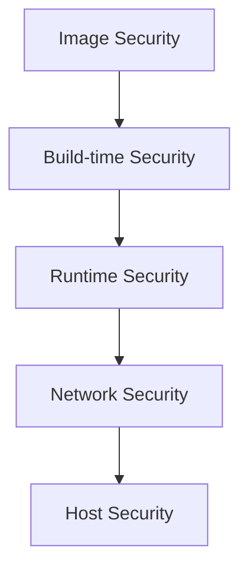

# Container security deep dive

> **Module:** Part 3 - Advanced | **Level:** Advanced | **Time:** 35 minutes

## Learning objectives

By the end of this section, you will be able to:

- Implement defense-in-depth for containers
- Configure Linux security modules
- Scan and secure container images
- Implement runtime security

---

## Security layers



---

## Image security

### Base image selection

```dockerfile
# Prefer: Minimal, maintained images
FROM alpine:3.19           # ~5MB
FROM gcr.io/distroless/static  # ~2MB

# Avoid: Large, outdated images
FROM ubuntu:latest         # ~75MB, unpredictable
FROM debian:latest         # ~125MB
```

### Image scanning

```bash
# Docker Scout
docker scout cves myimage:latest
docker scout recommendations myimage:latest

# Trivy
trivy image myimage:latest
trivy image --severity HIGH,CRITICAL myimage:latest

# Grype
grype myimage:latest

# Snyk
snyk container test myimage:latest
```

### Signed images

```bash
# Enable Docker Content Trust
export DOCKER_CONTENT_TRUST=1

# Sign image when pushing
docker push myregistry/myimage:v1.0.0

# Verify signature when pulling
docker pull myregistry/myimage:v1.0.0
```

---

## Build-time security

### Non-root user

```dockerfile
FROM node:20-alpine

# Create non-root user
RUN addgroup -g 1001 -S appgroup && \
    adduser -u 1001 -S appuser -G appgroup

# Set ownership
WORKDIR /app
COPY --chown=appuser:appgroup . .

# Switch to non-root
USER appuser

CMD ["node", "index.js"]
```

### Multi-stage builds

```dockerfile
# Build stage - has build tools
FROM node:20 AS builder
WORKDIR /app
COPY package*.json ./
RUN npm ci
COPY . .
RUN npm run build

# Production stage - minimal
FROM node:20-alpine AS production
WORKDIR /app

# Copy only necessary files
COPY --from=builder /app/dist ./dist
COPY --from=builder /app/node_modules ./node_modules

# Non-root user
USER node
CMD ["node", "dist/index.js"]
```

### Remove unnecessary packages

```dockerfile
FROM debian:slim

RUN apt-get update && \
    apt-get install -y --no-install-recommends \
        curl \
        ca-certificates && \
    # Remove package manager after install
    apt-get purge -y --auto-remove && \
    rm -rf /var/lib/apt/lists/* /tmp/* /var/tmp/*
```

### Secret handling in builds

```dockerfile
# syntax=docker/dockerfile:1

# BAD: Secret in environment or copy
# ENV API_KEY=secret
# COPY .env /app/.env

# GOOD: Build-time secret (not stored in layer)
RUN --mount=type=secret,id=npmrc,target=/root/.npmrc \
    npm ci --only=production
```

---

## Runtime security

### Read-only filesystem

```yaml
services:
  api:
    image: myapi:latest
    read_only: true
    tmpfs:
      - /tmp
      - /var/run
    volumes:
      - logs:/app/logs  # Writable volume if needed
```

```bash
# Docker run
docker run --read-only --tmpfs /tmp myimage:latest
```

### Drop capabilities

```yaml
services:
  api:
    image: myapi:latest
    cap_drop:
      - ALL
    cap_add:
      - NET_BIND_SERVICE  # Only if binding to port < 1024
```

**Default capabilities to drop:**

| Capability | Risk |
|------------|------|
| SYS_ADMIN | Mount filesystems, load kernel modules |
| NET_ADMIN | Configure networking |
| SYS_PTRACE | Debug other processes |
| SYS_MODULE | Load kernel modules |

### No new privileges

```yaml
services:
  api:
    image: myapi:latest
    security_opt:
      - no-new-privileges:true
```

### Seccomp profiles

```yaml
services:
  api:
    image: myapi:latest
    security_opt:
      - seccomp:./seccomp-profile.json
```

```json
// seccomp-profile.json (restrictive example)
{
  "defaultAction": "SCMP_ACT_ERRNO",
  "architectures": ["SCMP_ARCH_X86_64"],
  "syscalls": [
    {
      "names": ["read", "write", "open", "close", "stat", "fstat", "mmap", "mprotect", "munmap", "brk", "exit_group"],
      "action": "SCMP_ACT_ALLOW"
    }
  ]
}
```

### AppArmor profiles

```yaml
services:
  api:
    image: myapi:latest
    security_opt:
      - apparmor:docker-default
```

---

## Network security

### Network isolation

```yaml
services:
  frontend:
    networks:
      - public

  api:
    networks:
      - public
      - private

  db:
    networks:
      - private

networks:
  public:
    driver: bridge
  private:
    driver: bridge
    internal: true  # No external access
```

### Limit inter-container communication

```bash
# Disable ICC (inter-container communication)
# /etc/docker/daemon.json
{
  "icc": false
}
```

### Use user-defined networks

```bash
# Containers on default bridge can reach each other by IP
# User-defined networks provide DNS isolation

docker network create --driver bridge isolated
docker run --network isolated myimage
```

---

## Secrets management

### Docker/Swarm secrets

```bash
# Create secret
echo "mysecretpassword" | docker secret create db_password -

# Use in service
docker service create --secret db_password myimage
```

### External secrets managers

```yaml
# HashiCorp Vault integration
services:
  api:
    image: myapi:latest
    environment:
      - VAULT_ADDR=https://vault:8200
      - VAULT_TOKEN_FILE=/run/secrets/vault_token
    secrets:
      - vault_token
```

### Never do this

```yaml
# BAD: Secrets in environment
services:
  api:
    environment:
      - DATABASE_PASSWORD=mysecret

# BAD: Secrets in image
COPY .env /app/.env

# BAD: Secrets in compose file
environment:
  - API_KEY=hardcoded-secret
```

---

## Resource limits

Prevent resource exhaustion attacks:

```yaml
services:
  api:
    deploy:
      resources:
        limits:
          cpus: '2.0'
          memory: 512M
          pids: 100  # Limit process count
        reservations:
          cpus: '0.5'
          memory: 256M
```

```bash
# Docker run
docker run \
    --memory 512m \
    --cpus 2.0 \
    --pids-limit 100 \
    myimage:latest
```

---

## Host security

### Docker daemon security

```json
// /etc/docker/daemon.json
{
  "icc": false,
  "live-restore": true,
  "userland-proxy": false,
  "no-new-privileges": true,
  "seccomp-profile": "/etc/docker/seccomp.json"
}
```

### Socket protection

```bash
# Never expose Docker socket to containers without careful consideration
# BAD:
docker run -v /var/run/docker.sock:/var/run/docker.sock myimage

# If necessary, use read-only and with specific tools
docker run -v /var/run/docker.sock:/var/run/docker.sock:ro \
    --security-opt no-new-privileges \
    monitoring-tool
```

### Rootless Docker/Podman

```bash
# Rootless Docker
dockerd-rootless-setuptool.sh install

# Podman (rootless by default)
podman run --rm alpine id
# uid=0(root) gid=0(root)  # root inside container
# But runs as your user on host
```

---

## Security scanning workflow

### CI/CD integration

```yaml
# GitHub Actions example
name: Security Scan

on: [push, pull_request]

jobs:
  scan:
    runs-on: ubuntu-latest
    steps:
      - uses: actions/checkout@v4

      - name: Build image
        run: docker build -t myapp:${{ github.sha }} .

      - name: Scan with Trivy
        uses: aquasecurity/trivy-action@master
        with:
          image-ref: myapp:${{ github.sha }}
          format: 'sarif'
          output: 'trivy-results.sarif'
          severity: 'CRITICAL,HIGH'

      - name: Upload results
        uses: github/codeql-action/upload-sarif@v2
        with:
          sarif_file: 'trivy-results.sarif'
```

### Pre-deployment checks

```bash
#!/bin/bash
# security-check.sh

IMAGE=$1
SEVERITY_THRESHOLD=${2:-HIGH}

echo "Scanning $IMAGE..."

# Scan with Trivy
trivy image --exit-code 1 --severity $SEVERITY_THRESHOLD $IMAGE

if [ $? -ne 0 ]; then
    echo "Security vulnerabilities found. Blocking deployment."
    exit 1
fi

# Check for root user
ROOT_USER=$(docker inspect --format '{{.Config.User}}' $IMAGE)
if [ -z "$ROOT_USER" ] || [ "$ROOT_USER" = "root" ]; then
    echo "WARNING: Image runs as root"
fi

echo "Security check passed"
```

---

## Security checklist

### Image

- [ ] Use minimal base images
- [ ] Scan for vulnerabilities
- [ ] Sign images
- [ ] Don't run as root
- [ ] No secrets in image

### Runtime

- [ ] Read-only filesystem
- [ ] Drop all capabilities, add only needed
- [ ] Set resource limits
- [ ] Use security profiles (seccomp, AppArmor)
- [ ] Enable no-new-privileges

### Network

- [ ] Use user-defined networks
- [ ] Isolate backend services
- [ ] Disable inter-container communication where possible

### Secrets

- [ ] Use secrets management
- [ ] Never hardcode secrets
- [ ] Rotate secrets regularly

---

## Key takeaways

1. **Defense in depth** - Multiple security layers
2. **Minimal images** - Smaller attack surface
3. **Non-root users** - Limit privilege escalation
4. **Drop capabilities** - Principle of least privilege
5. **Network isolation** - Segment services
6. **Scan continuously** - Catch vulnerabilities early

---

## What's next

Learn about advanced networking patterns.

---

## Navigation

| Previous | Up | Next |
|----------|-----|------|
| [Orchestration Patterns](04-orchestration-patterns.md) | [Part 3 Overview](../../course_overview.md#part-3-advanced) | [Advanced Networking](06-advanced-networking.md) |
