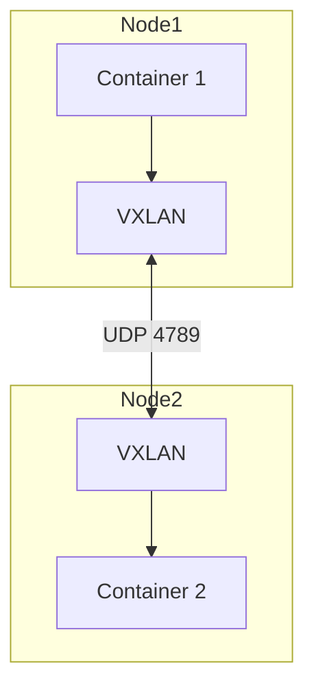

# Advanced container networking

> **Module:** Part 3 - Advanced | **Level:** Advanced | **Time:** 30 minutes

## Learning objectives

By the end of this section, you will be able to:

- Implement advanced network topologies
- Configure overlay networking
- Use macvlan for direct network access
- Troubleshoot complex network issues

---

## Network driver comparison

| Driver | Use Case | Scope |
|--------|----------|-------|
| bridge | Default, single host | Local |
| host | Performance, no isolation | Local |
| overlay | Multi-host, Swarm | Swarm |
| macvlan | Direct LAN access | Local |
| ipvlan | Similar to macvlan | Local |
| none | Disabled networking | Local |

---

## Bridge networking deep dive

### Custom bridge networks

```bash
# Create with specific subnet
docker network create \
    --driver bridge \
    --subnet 172.20.0.0/16 \
    --gateway 172.20.0.1 \
    --ip-range 172.20.240.0/20 \
    custom-bridge

# Assign static IP
docker run --network custom-bridge --ip 172.20.240.10 nginx
```

### Bridge network options

```bash
docker network create \
    --driver bridge \
    --opt com.docker.network.bridge.name=br-custom \
    --opt com.docker.network.bridge.enable_ip_masquerade=true \
    --opt com.docker.network.bridge.enable_icc=true \
    --opt com.docker.network.bridge.host_binding_ipv4=0.0.0.0 \
    custom-net
```

| Option | Description |
|--------|-------------|
| `enable_icc` | Inter-container communication |
| `enable_ip_masquerade` | NAT for outbound traffic |
| `host_binding_ipv4` | IP to bind published ports |

---

## Overlay networking

### Creating overlay networks

```bash
# Initialize swarm first
docker swarm init

# Create overlay network
docker network create \
    --driver overlay \
    --attachable \
    --subnet 10.10.0.0/16 \
    my-overlay

# Encrypted overlay
docker network create \
    --driver overlay \
    --opt encrypted \
    secure-overlay
```

### Overlay network architecture



### Attachable overlay

```bash
# Create attachable overlay
docker network create --driver overlay --attachable my-overlay

# Standalone containers can join
docker run --network my-overlay nginx

# Services also use it
docker service create --network my-overlay myapi
```

---

## Macvlan networking

Containers get their own MAC address and appear as physical devices on the network.

### Creating macvlan network

```bash
# Create macvlan network
docker network create \
    --driver macvlan \
    --subnet 192.168.1.0/24 \
    --gateway 192.168.1.1 \
    -o parent=eth0 \
    my-macvlan

# Run container with macvlan
docker run --network my-macvlan --ip 192.168.1.100 nginx
```

### Macvlan modes

| Mode | Description |
|------|-------------|
| bridge (default) | Containers can communicate |
| private | No inter-container communication |
| vepa | Requires external switch support |
| passthru | Single container per parent |

### Macvlan 802.1q trunking

```bash
# Create VLAN-tagged macvlan
docker network create \
    --driver macvlan \
    --subnet 192.168.10.0/24 \
    --gateway 192.168.10.1 \
    -o parent=eth0.10 \
    vlan10

docker network create \
    --driver macvlan \
    --subnet 192.168.20.0/24 \
    --gateway 192.168.20.1 \
    -o parent=eth0.20 \
    vlan20
```

---

## IPvlan networking

Similar to macvlan but shares MAC address with parent interface.

```bash
# L2 mode (like macvlan)
docker network create \
    --driver ipvlan \
    --subnet 192.168.1.0/24 \
    -o parent=eth0 \
    -o ipvlan_mode=l2 \
    my-ipvlan-l2

# L3 mode (routing)
docker network create \
    --driver ipvlan \
    --subnet 192.168.100.0/24 \
    -o parent=eth0 \
    -o ipvlan_mode=l3 \
    my-ipvlan-l3
```

---

## Load balancing

### Docker Swarm routing mesh

```bash
# Published port is available on all nodes
docker service create --name web -p 80:80 --replicas 3 nginx

# Traffic to any node:80 is load balanced across replicas
```

### Host mode (bypass routing mesh)

```bash
docker service create --name web \
    --publish mode=host,target=80,published=80 \
    --mode global \
    nginx
```

### External load balancer integration

```yaml
services:
  api:
    image: myapi:latest
    deploy:
      replicas: 3
      labels:
        - "traefik.enable=true"
        - "traefik.http.routers.api.rule=PathPrefix(`/api`)"
        - "traefik.http.services.api.loadbalancer.server.port=5000"
        - "traefik.http.services.api.loadbalancer.healthcheck.path=/health"
        - "traefik.http.services.api.loadbalancer.healthcheck.interval=10s"
```

---

## DNS and service discovery

### Embedded DNS

```bash
# Container DNS resolution
docker exec mycontainer cat /etc/resolv.conf
# nameserver 127.0.0.11

# Service name resolution
docker exec mycontainer nslookup api
# Returns service VIP

# Tasks endpoint (individual IPs)
docker exec mycontainer nslookup tasks.api
# Returns all replica IPs
```

### Custom DNS

```yaml
services:
  api:
    dns:
      - 8.8.8.8
      - 8.8.4.4
    dns_search:
      - example.com
    dns_opt:
      - timeout:2
```

### Extra hosts

```yaml
services:
  api:
    extra_hosts:
      - "host.docker.internal:host-gateway"
      - "legacy-db:192.168.1.50"
```

---

## Network troubleshooting

### Network inspection

```bash
# List networks
docker network ls

# Detailed inspection
docker network inspect my-network

# Find containers on network
docker network inspect my-network --format '{{range .Containers}}{{.Name}} {{.IPv4Address}}{{println}}{{end}}'
```

### Container networking

```bash
# Check container network settings
docker inspect mycontainer --format '{{json .NetworkSettings.Networks}}' | jq

# Network interfaces inside container
docker exec mycontainer ip addr

# Routing table
docker exec mycontainer ip route

# DNS configuration
docker exec mycontainer cat /etc/resolv.conf
```

### Connectivity testing

```bash
# Using netshoot for debugging
docker run -it --rm --network container:mycontainer nicolaka/netshoot

# Inside netshoot:
ping other-container
nc -zv db 5432
dig api
tcpdump -i any port 80
curl -v http://api:5000/health
```

### Common issues

**Container can't reach internet:**
```bash
# Check NAT
docker network inspect bridge --format '{{.Options}}'
# Verify enable_ip_masquerade is true

# Check iptables
sudo iptables -t nat -L -n -v | grep MASQUERADE
```

**Container can't resolve DNS:**
```bash
# Check DNS server
docker exec mycontainer cat /etc/resolv.conf

# Test external DNS
docker exec mycontainer nslookup google.com 8.8.8.8
```

**Containers can't communicate:**
```bash
# Check same network
docker inspect container1 --format '{{json .NetworkSettings.Networks}}' | jq
docker inspect container2 --format '{{json .NetworkSettings.Networks}}' | jq

# Check ICC setting
docker network inspect mynetwork --format '{{.Options}}'
```

---

## Network security patterns

### Zero trust networking

```yaml
services:
  # Public facing
  nginx:
    networks:
      - dmz

  # Internal API
  api:
    networks:
      - dmz
      - internal

  # Backend services
  db:
    networks:
      - internal

  redis:
    networks:
      - internal

networks:
  dmz:
    driver: bridge
    internal: false  # Internet access

  internal:
    driver: bridge
    internal: true   # No internet
```

### Service mesh (Consul Connect example)

```yaml
services:
  api:
    image: myapi:latest
    networks:
      - mesh

  api-sidecar:
    image: consul:latest
    command: agent -config-file=/etc/consul/config.json
    network_mode: "service:api"
    volumes:
      - ./consul-config.json:/etc/consul/config.json
```

---

## Practical example: Multi-tier network

```yaml
version: '3.8'

services:
  # Public tier
  nginx:
    image: nginx:alpine
    ports:
      - "80:80"
      - "443:443"
    networks:
      - public
    configs:
      - source: nginx_conf
        target: /etc/nginx/nginx.conf

  # Application tier
  api:
    image: myapi:latest
    networks:
      - public
      - application
    deploy:
      replicas: 3

  worker:
    image: myworker:latest
    networks:
      - application
      - data
    deploy:
      replicas: 2

  # Data tier
  postgres:
    image: postgres:15-alpine
    networks:
      - data
    volumes:
      - postgres_data:/var/lib/postgresql/data

  redis:
    image: redis:7-alpine
    networks:
      - application
      - data

networks:
  public:
    driver: overlay

  application:
    driver: overlay
    internal: true

  data:
    driver: overlay
    internal: true
    attachable: false

volumes:
  postgres_data:

configs:
  nginx_conf:
    file: ./nginx.conf
```

---

## Key takeaways

1. **Bridge networks** for single-host isolation
2. **Overlay networks** for multi-host communication
3. **Macvlan** for direct LAN integration
4. **Internal networks** for backend isolation
5. **Routing mesh** provides automatic load balancing
6. **Use netshoot** for network debugging

---

## What's next

Learn about storage drivers and advanced volume management.

---

## Navigation

| Previous | Up | Next |
|----------|-----|------|
| [Security Deep Dive](05-security-deep-dive.md) | [Part 3 Overview](../../course_overview.md#part-3-advanced) | [Storage Deep Dive](07-storage-deep-dive.md) |
