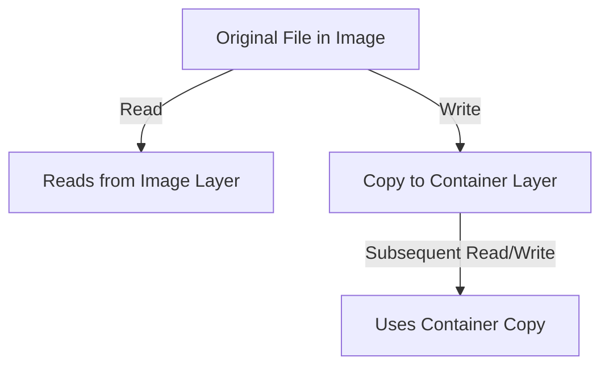

# Storage deep dive

> **Module:** Part 3 - Advanced | **Level:** Advanced | **Time:** 30 minutes

## Learning objectives

By the end of this section, you will be able to:

- Understand storage drivers and their trade-offs
- Configure advanced volume options
- Implement distributed storage solutions
- Optimize storage performance

---

## Storage drivers

### Driver comparison

| Driver | Union FS | Best For | Copy-on-Write |
|--------|----------|----------|---------------|
| overlay2 | Yes | Most Linux | File-level |
| btrfs | Yes | Btrfs hosts | Block-level |
| zfs | Yes | ZFS hosts | Block-level |
| devicemapper | No | Direct LVM | Block-level |
| vfs | No | Testing only | None (full copy) |

### Checking current driver

```bash
# Check storage driver
docker info | grep "Storage Driver"

# Detailed storage info
docker info --format '{{json .Driver}}'
docker system df
```

### Configuring storage driver

```json
// /etc/docker/daemon.json
{
  "storage-driver": "overlay2",
  "storage-opts": [
    "overlay2.override_kernel_check=true"
  ]
}
```

---

## overlay2 driver

The recommended driver for most deployments.

### How it works

```
Container Layer (writable)
         ↑
    Image Layer N
         ↑
    Image Layer 2
         ↑
    Image Layer 1 (base)
```

### Configuration options

```json
{
  "storage-driver": "overlay2",
  "storage-opts": [
    "overlay2.size=10G"
  ]
}
```

### Best practices

- Keep layers small
- Minimize writes to container layer
- Use volumes for data

---

## Volume drivers

### Local driver options

```bash
# Create volume with options
docker volume create \
    --driver local \
    --opt type=none \
    --opt device=/mnt/data/myvolume \
    --opt o=bind \
    myvolume

# tmpfs volume
docker volume create \
    --driver local \
    --opt type=tmpfs \
    --opt device=tmpfs \
    --opt o=size=100m,uid=1000 \
    tmpvol
```

### NFS volume

```bash
# Create NFS volume
docker volume create \
    --driver local \
    --opt type=nfs \
    --opt o=addr=192.168.1.100,rw \
    --opt device=:/exports/data \
    nfs-volume
```

```yaml
# In compose
volumes:
  nfs_data:
    driver: local
    driver_opts:
      type: nfs
      o: addr=192.168.1.100,rw,nfsvers=4
      device: ":/exports/data"
```

### CIFS/SMB volume

```bash
docker volume create \
    --driver local \
    --opt type=cifs \
    --opt device=//server/share \
    --opt o=addr=server,username=user,password=pass,file_mode=0777,dir_mode=0777 \
    smb-volume
```

---

## Volume plugins

### Popular plugins

| Plugin | Type | Use Case |
|--------|------|----------|
| REX-Ray | Multi-backend | AWS EBS, Azure, etc. |
| Portworx | Distributed | Kubernetes, Swarm |
| GlusterFS | Distributed | Self-hosted |
| NetApp | Enterprise | NetApp storage |

### Installing plugins

```bash
# Install plugin
docker plugin install rexray/ebs

# List plugins
docker plugin ls

# Configure plugin
docker plugin set rexray/ebs EBS_ACCESSKEY=xxx EBS_SECRETKEY=xxx
```

### Using plugins

```bash
# Create volume with plugin
docker volume create \
    --driver rexray/ebs \
    --opt size=100 \
    ebs-volume

# Use in container
docker run -v ebs-volume:/data myimage
```

---

## Distributed storage

### GlusterFS example

```yaml
# compose.yaml for GlusterFS client
services:
  app:
    image: myapp:latest
    volumes:
      - gluster_data:/app/data

volumes:
  gluster_data:
    driver: glusterfs
    driver_opts:
      servers: gluster1,gluster2,gluster3
      volume: myvolume
      subdir: /appdata
```

### Portworx example

```yaml
volumes:
  postgres_data:
    driver: pxd
    driver_opts:
      repl: 3
      io_priority: high
      snap_interval: 60
      snap_max: 10
```

---

## Performance optimization

### Volume mount options

```yaml
services:
  app:
    volumes:
      # Cached: Relaxed consistency (faster reads)
      - ./src:/app/src:cached

      # Delegated: Relaxed consistency (faster writes)
      - logs:/app/logs:delegated

      # Consistent: Full consistency (default)
      - data:/app/data:consistent
```

**Note:** cached/delegated are primarily for Docker Desktop on macOS/Windows.

### Tmpfs for temporary data

```yaml
services:
  app:
    tmpfs:
      - /tmp:size=100M,mode=1777
      - /run:size=50M
```

### SSD placement for databases

```yaml
services:
  postgres:
    deploy:
      placement:
        constraints:
          - node.labels.storage == ssd
    volumes:
      - postgres_data:/var/lib/postgresql/data

volumes:
  postgres_data:
    driver: local
    driver_opts:
      type: none
      device: /mnt/ssd/postgres
      o: bind
```

---

## Backup and restore

### Volume backup

```bash
# Backup volume to tar
docker run --rm \
    -v myvolume:/data:ro \
    -v $(pwd):/backup \
    alpine tar czf /backup/myvolume-backup.tar.gz -C /data .

# With timestamp
BACKUP_FILE="myvolume-$(date +%Y%m%d_%H%M%S).tar.gz"
docker run --rm \
    -v myvolume:/data:ro \
    -v $(pwd):/backup \
    alpine tar czf /backup/$BACKUP_FILE -C /data .
```

### Volume restore

```bash
# Create new volume
docker volume create myvolume-restored

# Restore from backup
docker run --rm \
    -v myvolume-restored:/data \
    -v $(pwd):/backup \
    alpine tar xzf /backup/myvolume-backup.tar.gz -C /data
```

### Database-specific backups

```bash
# PostgreSQL backup
docker exec postgres pg_dump -U postgres mydb > backup.sql

# PostgreSQL backup to compressed file
docker exec postgres pg_dump -U postgres -Fc mydb > backup.dump

# MySQL backup
docker exec mysql mysqldump -u root -p$MYSQL_ROOT_PASSWORD mydb > backup.sql

# MongoDB backup
docker exec mongo mongodump --archive=/backup/mongo.archive
```

### Automated backup service

```yaml
services:
  backup:
    image: alpine
    volumes:
      - postgres_data:/source:ro
      - backup_data:/backup
    command: |
      sh -c 'while true; do
        TIMESTAMP=$$(date +%Y%m%d_%H%M%S)
        tar czf /backup/postgres_$$TIMESTAMP.tar.gz -C /source .
        find /backup -mtime +7 -delete
        sleep 86400
      done'
```

---

## Copy-on-write considerations

### Understanding CoW



### Avoiding CoW overhead

```dockerfile
# Bad: Large file modification
FROM ubuntu
RUN apt-get update && apt-get install -y large-package
RUN apt-get clean  # Still in previous layer

# Good: Single layer for package management
FROM ubuntu
RUN apt-get update && \
    apt-get install -y large-package && \
    apt-get clean && \
    rm -rf /var/lib/apt/lists/*
```

### Data-heavy applications

```yaml
services:
  # Use volumes for data-intensive workloads
  database:
    image: postgres:15
    volumes:
      - pg_data:/var/lib/postgresql/data  # Bypasses CoW
```

---

## Storage quotas

### Per-container storage limits

```bash
# With devicemapper
docker run --storage-opt size=10G myimage

# With overlay2 (requires xfs with pquota)
docker run --storage-opt size=10G myimage
```

### Host filesystem configuration

```bash
# Mount XFS with quota support
mount -o pquota /dev/sdb1 /var/lib/docker
```

---

## Cleanup and maintenance

### Remove unused resources

```bash
# Remove unused volumes
docker volume prune

# Remove all unused data
docker system prune -a --volumes

# Check disk usage
docker system df -v
```

### Volume inspection

```bash
# List volumes
docker volume ls

# Inspect volume
docker volume inspect myvolume

# Find volume mount point
docker volume inspect myvolume --format '{{.Mountpoint}}'
```

---

## Practical example: Production storage setup

```yaml
name: production-app

services:
  api:
    image: myapi:latest
    tmpfs:
      - /tmp:size=100M
    volumes:
      - api_logs:/app/logs
    deploy:
      resources:
        limits:
          memory: 512M

  postgres:
    image: postgres:15-alpine
    volumes:
      - postgres_data:/var/lib/postgresql/data
      - postgres_backup:/backup
    deploy:
      placement:
        constraints:
          - node.labels.storage == ssd
    configs:
      - source: postgres_conf
        target: /etc/postgresql/postgresql.conf

  redis:
    image: redis:7-alpine
    command: redis-server --appendonly yes
    volumes:
      - redis_data:/data
    deploy:
      resources:
        limits:
          memory: 256M

  backup:
    image: alpine
    volumes:
      - postgres_data:/pg_data:ro
      - redis_data:/redis_data:ro
      - backup_storage:/backup
    command: |
      sh -c 'while true; do
        echo "Starting backup at $$(date)"
        tar czf /backup/pg_$$(date +%Y%m%d).tar.gz -C /pg_data .
        tar czf /backup/redis_$$(date +%Y%m%d).tar.gz -C /redis_data .
        find /backup -mtime +30 -delete
        sleep 86400
      done'
    deploy:
      placement:
        constraints:
          - node.labels.backup == true

volumes:
  api_logs:
  postgres_data:
  postgres_backup:
  redis_data:
  backup_storage:
    driver: local
    driver_opts:
      type: nfs
      o: addr=backup-server,rw
      device: ":/exports/backups"

configs:
  postgres_conf:
    file: ./postgresql.conf
```

---

## Key takeaways

1. **overlay2** is the recommended storage driver
2. **Use volumes** for persistent and performance-critical data
3. **NFS/distributed storage** for multi-host scenarios
4. **Regular backups** are essential
5. **Avoid CoW overhead** with proper volume usage

---

## What's next

Learn about CI/CD pipelines for containers.

---

## Navigation

| Previous | Up | Next |
|----------|-----|------|
| [Advanced Networking](06-advanced-networking.md) | [Part 3 Overview](../../course_overview.md#part-3-advanced) | [CI/CD Pipelines](08-cicd-pipelines.md) |
