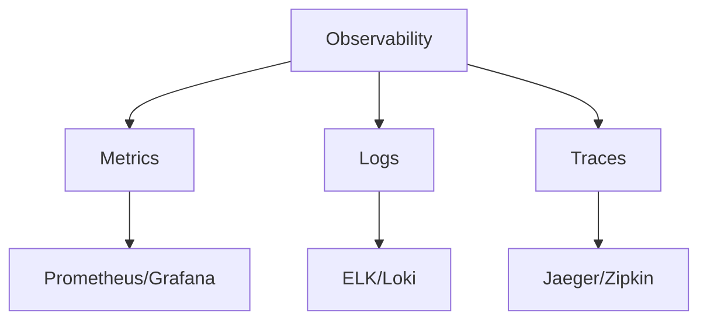

# Monitoring and observability

> **Module:** Part 3 - Advanced | **Level:** Advanced | **Time:** 30 minutes

## Learning objectives

By the end of this section, you will be able to:

- Implement comprehensive monitoring
- Set up centralized logging
- Create meaningful dashboards
- Configure alerting

---

## Observability pillars



---

## Metrics collection

### Prometheus stack

```yaml
# monitoring-stack.yaml
version: '3.8'

services:
  prometheus:
    image: prom/prometheus:latest
    volumes:
      - ./prometheus.yml:/etc/prometheus/prometheus.yml:ro
      - prometheus_data:/prometheus
    command:
      - '--config.file=/etc/prometheus/prometheus.yml'
      - '--storage.tsdb.path=/prometheus'
      - '--web.enable-lifecycle'
    ports:
      - "9090:9090"
    networks:
      - monitoring

  grafana:
    image: grafana/grafana:latest
    volumes:
      - grafana_data:/var/lib/grafana
      - ./grafana/provisioning:/etc/grafana/provisioning:ro
    environment:
      - GF_SECURITY_ADMIN_PASSWORD=${GRAFANA_PASSWORD:-admin}
      - GF_USERS_ALLOW_SIGN_UP=false
    ports:
      - "3000:3000"
    networks:
      - monitoring
    depends_on:
      - prometheus

  cadvisor:
    image: gcr.io/cadvisor/cadvisor:latest
    volumes:
      - /:/rootfs:ro
      - /var/run:/var/run:ro
      - /sys:/sys:ro
      - /var/lib/docker/:/var/lib/docker:ro
    ports:
      - "8080:8080"
    networks:
      - monitoring
    deploy:
      mode: global

  node-exporter:
    image: prom/node-exporter:latest
    volumes:
      - /proc:/host/proc:ro
      - /sys:/host/sys:ro
      - /:/rootfs:ro
    command:
      - '--path.procfs=/host/proc'
      - '--path.sysfs=/host/sys'
      - '--collector.filesystem.mount-points-exclude=^/(sys|proc|dev|host|etc)($$|/)'
    networks:
      - monitoring
    deploy:
      mode: global

networks:
  monitoring:
    driver: overlay

volumes:
  prometheus_data:
  grafana_data:
```

### Prometheus configuration

```yaml
# prometheus.yml
global:
  scrape_interval: 15s
  evaluation_interval: 15s

alerting:
  alertmanagers:
    - static_configs:
        - targets:
          - alertmanager:9093

rule_files:
  - /etc/prometheus/rules/*.yml

scrape_configs:
  - job_name: 'prometheus'
    static_configs:
      - targets: ['localhost:9090']

  - job_name: 'cadvisor'
    dns_sd_configs:
      - names:
          - 'tasks.cadvisor'
        type: 'A'
        port: 8080

  - job_name: 'node-exporter'
    dns_sd_configs:
      - names:
          - 'tasks.node-exporter'
        type: 'A'
        port: 9100

  - job_name: 'docker'
    static_configs:
      - targets: ['host.docker.internal:9323']

  - job_name: 'api'
    dns_sd_configs:
      - names:
          - 'tasks.api'
        type: 'A'
        port: 5000
    metrics_path: /metrics
```

### Application metrics

```python
# Python with prometheus_client
from prometheus_client import Counter, Histogram, generate_latest
from flask import Flask, Response

app = Flask(__name__)

REQUEST_COUNT = Counter(
    'http_requests_total',
    'Total HTTP requests',
    ['method', 'endpoint', 'status']
)

REQUEST_LATENCY = Histogram(
    'http_request_duration_seconds',
    'HTTP request latency',
    ['method', 'endpoint']
)

@app.before_request
def before_request():
    request.start_time = time.time()

@app.after_request
def after_request(response):
    latency = time.time() - request.start_time
    REQUEST_COUNT.labels(
        method=request.method,
        endpoint=request.path,
        status=response.status_code
    ).inc()
    REQUEST_LATENCY.labels(
        method=request.method,
        endpoint=request.path
    ).observe(latency)
    return response

@app.route('/metrics')
def metrics():
    return Response(generate_latest(), mimetype='text/plain')
```

---

## Centralized logging

### ELK Stack

```yaml
# elk-stack.yaml
services:
  elasticsearch:
    image: elasticsearch:8.11.0
    environment:
      - discovery.type=single-node
      - xpack.security.enabled=false
      - "ES_JAVA_OPTS=-Xms512m -Xmx512m"
    volumes:
      - es_data:/usr/share/elasticsearch/data
    networks:
      - logging

  logstash:
    image: logstash:8.11.0
    volumes:
      - ./logstash/pipeline:/usr/share/logstash/pipeline:ro
    ports:
      - "5044:5044"
      - "5000:5000/tcp"
      - "5000:5000/udp"
    environment:
      LS_JAVA_OPTS: "-Xms256m -Xmx256m"
    networks:
      - logging
    depends_on:
      - elasticsearch

  kibana:
    image: kibana:8.11.0
    ports:
      - "5601:5601"
    environment:
      - ELASTICSEARCH_HOSTS=http://elasticsearch:9200
    networks:
      - logging
    depends_on:
      - elasticsearch

networks:
  logging:
    driver: overlay

volumes:
  es_data:
```

### Loki + Promtail

```yaml
# loki-stack.yaml
services:
  loki:
    image: grafana/loki:2.9.0
    ports:
      - "3100:3100"
    volumes:
      - ./loki-config.yaml:/etc/loki/local-config.yaml:ro
      - loki_data:/loki
    command: -config.file=/etc/loki/local-config.yaml
    networks:
      - logging

  promtail:
    image: grafana/promtail:2.9.0
    volumes:
      - /var/log:/var/log:ro
      - /var/lib/docker/containers:/var/lib/docker/containers:ro
      - ./promtail-config.yaml:/etc/promtail/config.yaml:ro
    command: -config.file=/etc/promtail/config.yaml
    networks:
      - logging
    deploy:
      mode: global

volumes:
  loki_data:

networks:
  logging:
    driver: overlay
```

```yaml
# promtail-config.yaml
server:
  http_listen_port: 9080
  grpc_listen_port: 0

positions:
  filename: /tmp/positions.yaml

clients:
  - url: http://loki:3100/loki/api/v1/push

scrape_configs:
  - job_name: containers
    static_configs:
      - targets:
          - localhost
        labels:
          job: containerlogs
          __path__: /var/lib/docker/containers/*/*log

    pipeline_stages:
      - json:
          expressions:
            output: log
            stream: stream
            attrs:
      - json:
          expressions:
            tag:
          source: attrs
      - regex:
          expression: (?P<container_name>(?:[a-zA-Z0-9][a-zA-Z0-9_.-]+))
          source: tag
      - labels:
          stream:
          container_name:
      - output:
          source: output
```

---

## Distributed tracing

### Jaeger

```yaml
services:
  jaeger:
    image: jaegertracing/all-in-one:latest
    ports:
      - "16686:16686"  # UI
      - "6831:6831/udp"  # Thrift compact
      - "14268:14268"  # HTTP collector
    environment:
      - COLLECTOR_OTLP_ENABLED=true
    networks:
      - tracing
```

### OpenTelemetry integration

```python
# Python with OpenTelemetry
from opentelemetry import trace
from opentelemetry.exporter.jaeger.thrift import JaegerExporter
from opentelemetry.sdk.trace import TracerProvider
from opentelemetry.sdk.trace.export import BatchSpanProcessor
from opentelemetry.instrumentation.flask import FlaskInstrumentor
from opentelemetry.instrumentation.requests import RequestsInstrumentor

# Configure tracer
trace.set_tracer_provider(TracerProvider())
jaeger_exporter = JaegerExporter(
    agent_host_name="jaeger",
    agent_port=6831,
)
trace.get_tracer_provider().add_span_processor(
    BatchSpanProcessor(jaeger_exporter)
)

# Auto-instrument Flask and requests
FlaskInstrumentor().instrument_app(app)
RequestsInstrumentor().instrument()
```

---

## Alerting

### Alertmanager configuration

```yaml
# alertmanager.yml
global:
  slack_api_url: 'https://hooks.slack.com/services/xxx'

route:
  group_by: ['alertname', 'service']
  group_wait: 30s
  group_interval: 5m
  repeat_interval: 3h
  receiver: 'slack-notifications'
  routes:
    - match:
        severity: critical
      receiver: 'pagerduty'

receivers:
  - name: 'slack-notifications'
    slack_configs:
      - channel: '#alerts'
        send_resolved: true
        title: '{{ .Status | toUpper }}: {{ .CommonLabels.alertname }}'
        text: '{{ range .Alerts }}{{ .Annotations.description }}{{ end }}'

  - name: 'pagerduty'
    pagerduty_configs:
      - service_key: '<service_key>'
        severity: critical
```

### Prometheus alert rules

```yaml
# alerts.yml
groups:
  - name: containers
    rules:
      - alert: ContainerHighCPU
        expr: sum(rate(container_cpu_usage_seconds_total{name!=""}[5m])) by (name) > 0.9
        for: 5m
        labels:
          severity: warning
        annotations:
          summary: "Container {{ $labels.name }} high CPU usage"
          description: "Container {{ $labels.name }} CPU usage is above 90%"

      - alert: ContainerHighMemory
        expr: container_memory_usage_bytes{name!=""} / container_spec_memory_limit_bytes{name!=""} > 0.9
        for: 5m
        labels:
          severity: warning
        annotations:
          summary: "Container {{ $labels.name }} high memory usage"
          description: "Container {{ $labels.name }} memory usage is above 90%"

      - alert: ContainerDown
        expr: absent(container_last_seen{name=~".+"})
        for: 1m
        labels:
          severity: critical
        annotations:
          summary: "Container {{ $labels.name }} is down"
          description: "Container {{ $labels.name }} has been down for more than 1 minute"

  - name: services
    rules:
      - alert: ServiceHighLatency
        expr: histogram_quantile(0.95, rate(http_request_duration_seconds_bucket[5m])) > 1
        for: 5m
        labels:
          severity: warning
        annotations:
          summary: "High latency on {{ $labels.service }}"
          description: "95th percentile latency is above 1 second"

      - alert: ServiceHighErrorRate
        expr: sum(rate(http_requests_total{status=~"5.."}[5m])) / sum(rate(http_requests_total[5m])) > 0.05
        for: 5m
        labels:
          severity: critical
        annotations:
          summary: "High error rate on {{ $labels.service }}"
          description: "Error rate is above 5%"
```

---

## Dashboards

### Key metrics to monitor

| Metric | Description | Alert Threshold |
|--------|-------------|-----------------|
| CPU usage | Container CPU % | > 90% |
| Memory usage | Container memory % | > 90% |
| Network I/O | Bytes in/out | Anomaly |
| Request rate | Requests/second | Anomaly |
| Error rate | % of 5xx responses | > 1% |
| Latency p95 | 95th percentile | > 500ms |

### Grafana dashboard JSON

```json
{
  "dashboard": {
    "title": "Container Overview",
    "panels": [
      {
        "title": "CPU Usage by Container",
        "type": "graph",
        "targets": [
          {
            "expr": "sum(rate(container_cpu_usage_seconds_total{name!=\"\"}[5m])) by (name) * 100",
            "legendFormat": "{{name}}"
          }
        ]
      },
      {
        "title": "Memory Usage by Container",
        "type": "graph",
        "targets": [
          {
            "expr": "container_memory_usage_bytes{name!=\"\"} / 1024 / 1024",
            "legendFormat": "{{name}}"
          }
        ]
      },
      {
        "title": "Request Rate",
        "type": "graph",
        "targets": [
          {
            "expr": "sum(rate(http_requests_total[5m])) by (service)",
            "legendFormat": "{{service}}"
          }
        ]
      },
      {
        "title": "Error Rate",
        "type": "graph",
        "targets": [
          {
            "expr": "sum(rate(http_requests_total{status=~\"5..\"}[5m])) / sum(rate(http_requests_total[5m])) * 100",
            "legendFormat": "Error %"
          }
        ]
      }
    ]
  }
}
```

---

## Complete monitoring stack

```yaml
# monitoring-complete.yaml
version: '3.8'

services:
  # Metrics
  prometheus:
    image: prom/prometheus:latest
    volumes:
      - ./prometheus:/etc/prometheus:ro
      - prometheus_data:/prometheus
    command:
      - '--config.file=/etc/prometheus/prometheus.yml'
      - '--storage.tsdb.retention.time=15d'
    networks:
      - monitoring
    deploy:
      placement:
        constraints:
          - node.role == manager

  alertmanager:
    image: prom/alertmanager:latest
    volumes:
      - ./alertmanager:/etc/alertmanager:ro
    command:
      - '--config.file=/etc/alertmanager/alertmanager.yml'
    networks:
      - monitoring

  grafana:
    image: grafana/grafana:latest
    volumes:
      - grafana_data:/var/lib/grafana
      - ./grafana/provisioning:/etc/grafana/provisioning:ro
    environment:
      - GF_SECURITY_ADMIN_PASSWORD=${GRAFANA_PASSWORD}
    ports:
      - "3000:3000"
    networks:
      - monitoring

  # Node metrics
  cadvisor:
    image: gcr.io/cadvisor/cadvisor:latest
    volumes:
      - /:/rootfs:ro
      - /var/run:/var/run:ro
      - /sys:/sys:ro
      - /var/lib/docker/:/var/lib/docker:ro
    networks:
      - monitoring
    deploy:
      mode: global

  node-exporter:
    image: prom/node-exporter:latest
    volumes:
      - /proc:/host/proc:ro
      - /sys:/host/sys:ro
    command:
      - '--path.procfs=/host/proc'
      - '--path.sysfs=/host/sys'
    networks:
      - monitoring
    deploy:
      mode: global

  # Logging
  loki:
    image: grafana/loki:latest
    volumes:
      - loki_data:/loki
    networks:
      - monitoring

  promtail:
    image: grafana/promtail:latest
    volumes:
      - /var/log:/var/log:ro
      - /var/lib/docker/containers:/var/lib/docker/containers:ro
      - ./promtail:/etc/promtail:ro
    networks:
      - monitoring
    deploy:
      mode: global

  # Tracing
  jaeger:
    image: jaegertracing/all-in-one:latest
    ports:
      - "16686:16686"
    networks:
      - monitoring

networks:
  monitoring:
    driver: overlay
    attachable: true

volumes:
  prometheus_data:
  grafana_data:
  loki_data:
```

---

## Key takeaways

1. **Three pillars** - Metrics, logs, and traces
2. **Prometheus + Grafana** - Industry standard for metrics
3. **Loki** - Efficient log aggregation
4. **Global mode** - Deploy exporters on every node
5. **Alerting** - Catch issues before users do

---

## What's next

Complete the advanced exercises and quiz.

---

## Navigation

| Previous | Up | Next |
|----------|-----|------|
| [CI/CD Pipelines](08-cicd-pipelines.md) | [Part 3 Overview](../../course_overview.md#part-3-advanced) | [Part 3 Quiz](quiz.md) |
