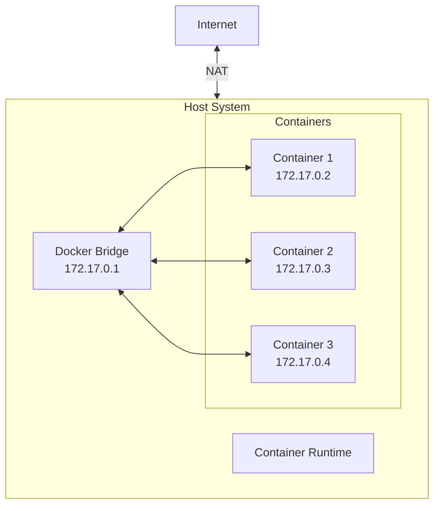
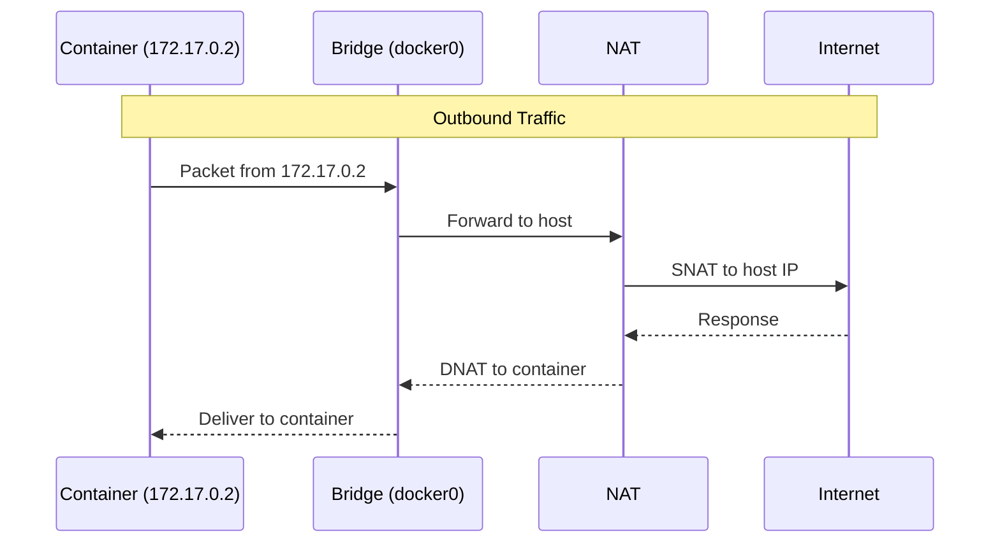
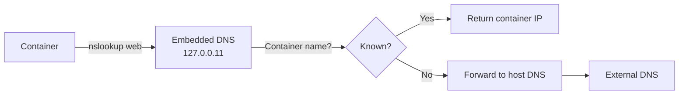

# Container Networking Fundamentals

> **Module:** Networking | **Level:** Intermediate | **Time:** 35 minutes

## Learning Objectives

By the end of this section, you will be able to:

- Understand how container networking works at a fundamental level
- Explain the role of network namespaces
- Describe the default bridge network architecture
- Understand NAT and port publishing

---

## Networking Overview

Containers need networking for:

1. **External access** - Users reaching containerized services
2. **Inter-container communication** - Microservices talking to each other
3. **External resources** - Containers accessing databases, APIs, etc.



---

## Network Namespaces

Each container has its own network namespace providing:

- **Isolated network stack** - Own interfaces, routing table, firewall rules
- **Own IP address** - Independent from other containers
- **Own ports** - No conflicts with host or other containers

```bash
# View host network namespaces
sudo lsns -t net

# Container has its own namespace
docker run --rm alpine ip addr
# Shows container's network interfaces, not host's

# Compare with host
ip addr
# Shows host's interfaces
```

### Namespace Isolation

```
┌─────────────────────────────────────────────────────┐
│ Host Network Namespace                               │
│                                                      │
│   eth0: 192.168.1.100                               │
│   docker0: 172.17.0.1                               │
│   veth123: (connected to container)                 │
│                                                      │
│   ┌─────────────────────────────────────────────┐   │
│   │ Container Network Namespace                  │   │
│   │                                              │   │
│   │   lo: 127.0.0.1                             │   │
│   │   eth0: 172.17.0.2                          │   │
│   │                                              │   │
│   │   Routing: default via 172.17.0.1           │   │
│   │                                              │   │
│   └─────────────────────────────────────────────┘   │
│                                                      │
└─────────────────────────────────────────────────────┘
```

---

## The Default Bridge Network

When Docker starts, it creates a default bridge network:

```bash
# View the default bridge
docker network inspect bridge

# On Linux, see the docker0 interface
ip addr show docker0
# docker0: 172.17.0.1/16

# View iptables rules
sudo iptables -t nat -L -n
# Shows NAT rules for container traffic
```

### How Bridge Networking Works



### Virtual Ethernet Pairs (veth)

Each container connects to the bridge via a veth pair:

```
Host                          Container
┌─────────────┐              ┌─────────────┐
│             │              │             │
│  docker0    │◄─────────────►│   eth0     │
│  (bridge)   │   veth pair  │             │
│             │              │             │
└─────────────┘              └─────────────┘
```

```bash
# On host, see veth interfaces
ip link | grep veth

# Each container's eth0 connects to a veth on the host
docker run -d --name web nginx
docker exec web ip link show eth0

# Find matching veth on host
cat /sys/class/net/veth*/ifindex
docker exec web cat /sys/class/net/eth0/iflink
```

---

## Port Publishing and NAT

### Publishing Ports

```bash
# Map host port 8080 to container port 80
docker run -d -p 8080:80 nginx

# This creates iptables rules:
# DNAT: Host:8080 → Container:80
```

### NAT Types

| Direction | Type | Purpose |
|-----------|------|---------|
| **Outbound** | SNAT/Masquerade | Container → Internet |
| **Inbound** | DNAT | Host port → Container port |

### iptables Rules

```bash
# View NAT rules
sudo iptables -t nat -L DOCKER -n

# Example output:
# Chain DOCKER (2 references)
# DNAT tcp -- 0.0.0.0/0 0.0.0.0/0 tcp dpt:8080 to:172.17.0.2:80
```

---

## Container DNS

### Embedded DNS Server

Docker runs a DNS server at 127.0.0.11:

```bash
# Check DNS configuration in container
docker run --rm alpine cat /etc/resolv.conf
# nameserver 127.0.0.11

# DNS resolution (on custom networks only)
docker network create mynet
docker run -d --name web --network mynet nginx
docker run --rm --network mynet alpine nslookup web
# Returns: 172.18.0.2
```

### DNS Resolution Flow



### Important DNS Note

**DNS resolution by container name only works on custom networks!**

```bash
# Default bridge - DNS doesn't work
docker run -d --name c1 alpine sleep 3600
docker run -d --name c2 alpine sleep 3600
docker exec c1 ping c2
# ping: bad address 'c2'

# Custom network - DNS works
docker network create mynet
docker run -d --name c3 --network mynet alpine sleep 3600
docker run -d --name c4 --network mynet alpine sleep 3600
docker exec c3 ping c4
# PING c4 (172.18.0.3): 56 data bytes
```

---

## Network Drivers

### Built-in Drivers

| Driver | Use Case | Scope |
|--------|----------|-------|
| **bridge** | Default, single-host | Local |
| **host** | No isolation, use host network | Local |
| **none** | Disable networking | Local |
| **overlay** | Multi-host (Swarm) | Swarm |
| **macvlan** | Direct physical network | Local |
| **ipvlan** | Similar to macvlan | Local |

### Driver Selection

```bash
# Bridge (default)
docker run -d nginx

# Host networking
docker run -d --network host nginx

# No networking
docker run -d --network none alpine sleep 3600

# Custom bridge
docker network create mybridge
docker run -d --network mybridge nginx
```

---

## Network Inspection

### View Network Details

```bash
# List networks
docker network ls

# Inspect network
docker network inspect bridge

# Key information:
# - Subnet and gateway
# - Connected containers
# - Driver options
```

### Container Network Info

```bash
# View container's network settings
docker inspect web --format '{{json .NetworkSettings}}' | jq

# Get IP address
docker inspect --format '{{.NetworkSettings.IPAddress}}' web

# Get all network memberships
docker inspect --format '{{range $k, $v := .NetworkSettings.Networks}}{{$k}}: {{$v.IPAddress}}{{"\n"}}{{end}}' web
```

---

## Practical Examples

### Example 1: Inspect Network Flow

```bash
# Run nginx
docker run -d --name web -p 8080:80 nginx

# Check assigned IP
docker inspect --format '{{.NetworkSettings.IPAddress}}' web
# 172.17.0.2

# Test from host
curl http://localhost:8080
curl http://172.17.0.2:80  # Direct to container (from host only)

# Check NAT rules
sudo iptables -t nat -L DOCKER -n | grep 8080
```

### Example 2: Container-to-Container

```bash
# Create network
docker network create appnet

# Run server
docker run -d --name server --network appnet nginx

# Run client and connect to server
docker run --rm --network appnet curlimages/curl curl -s http://server
# Returns nginx welcome page
```

---

## Key Takeaways

1. **Network namespaces** provide isolation per container
2. **veth pairs** connect containers to the bridge
3. **NAT (iptables)** handles port publishing and outbound traffic
4. **DNS works only on custom networks** for container name resolution
5. **Multiple network drivers** for different use cases
6. **Bridge is default** but custom bridges offer more features

---

## What's Next

Learn about the different network types and when to use each.

Continue to: [02-network-types.md](02-network-types.md)

---

## Quick Quiz

1. What provides network isolation between containers?
   - [ ] Virtual machines
   - [x] Network namespaces
   - [ ] Physical network cards
   - [ ] Firewall rules only

2. What technology connects a container to the bridge network?
   - [ ] Physical cable
   - [ ] Wireless adapter
   - [x] Virtual ethernet pair (veth)
   - [ ] USB network adapter

3. Why doesn't DNS work on the default bridge network?
   - [ ] DNS is disabled by default
   - [ ] The default bridge is too slow
   - [x] The embedded DNS server doesn't support it for legacy compatibility
   - [ ] Containers can't resolve DNS

4. What type of NAT is used for port publishing?
   - [ ] SNAT
   - [x] DNAT
   - [ ] PAT
   - [ ] Static NAT
