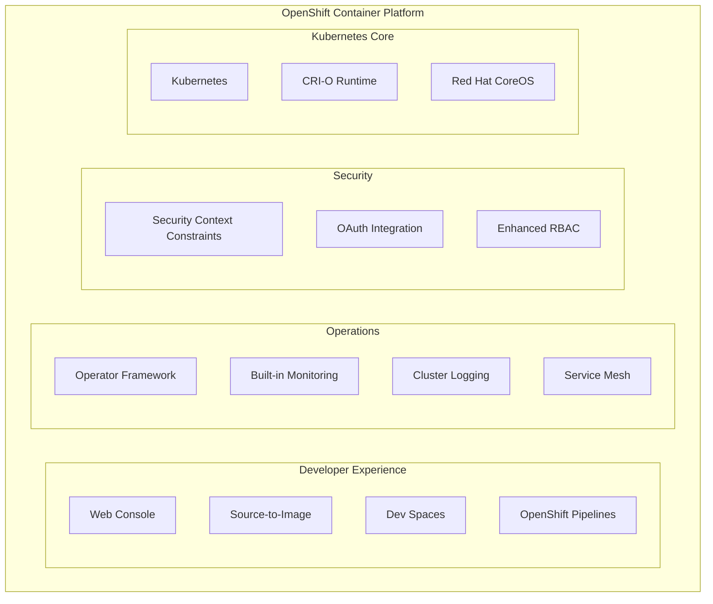
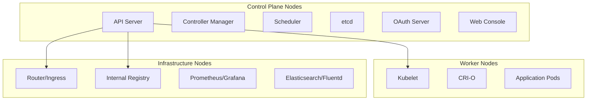
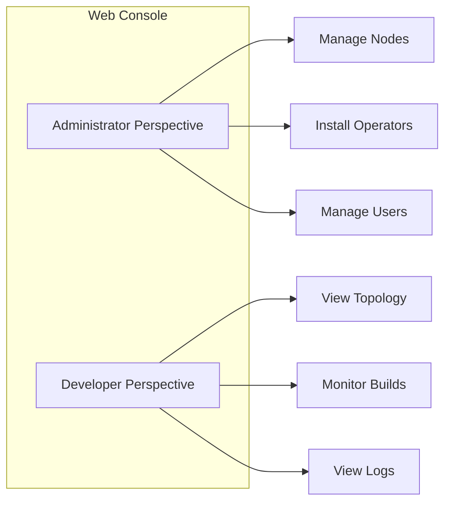

# OpenShift introduction

> **Module:** OpenShift | **Level:** Intermediate | **Time:** 30 minutes

## Learning objectives

By the end of this section, you will be able to:

- Understand what OpenShift is and its relationship to Kubernetes
- Differentiate between OCP, OKD, and other OpenShift variants
- Understand OpenShift architecture and components
- Recognize when to choose OpenShift over vanilla Kubernetes

---

## What is OpenShift?

OpenShift is Red Hat's enterprise Kubernetes platform. It extends Kubernetes with developer and operations-focused tools, enhanced security, and integrated CI/CD capabilities.



### Key value propositions

| Feature | Vanilla Kubernetes | OpenShift |
|---------|-------------------|-----------|
| Installation | Manual, complex | Automated installer |
| Updates | Manual orchestration | Managed updates |
| Security | Basic RBAC | SCCs + enhanced RBAC |
| Developer tools | Limited | Web console, S2I, pipelines |
| Support | Community | Enterprise support |
| Certification | Self-managed | Red Hat certified |

---

## OpenShift variants

### OpenShift Container Platform (OCP)

The enterprise, fully-supported version:

- Commercial license required
- Red Hat support included
- Certified operators and images
- Runs on-premises or major clouds

### OKD (Origin Community Distribution)

The open-source upstream:

- Free to use
- Community support
- Testing ground for OCP features
- Great for learning and development

### Managed OpenShift services

| Service | Cloud Provider | Notes |
|---------|---------------|-------|
| **ROSA** | AWS | Red Hat OpenShift Service on AWS |
| **ARO** | Azure | Azure Red Hat OpenShift |
| **RHOIC** | IBM Cloud | Red Hat OpenShift on IBM Cloud |
| **OpenShift Dedicated** | AWS/GCP | Fully managed by Red Hat |

### OpenShift Local (formerly CodeReady Containers)

Single-node cluster for development:

```bash
# Download from Red Hat
# https://developers.redhat.com/products/openshift-local/overview

# Start local cluster
crc setup
crc start

# Access cluster
eval $(crc oc-env)
oc login -u developer -p developer https://api.crc.testing:6443
```

---

## OpenShift architecture

### Control plane components



### Node types

| Node Type | Purpose | Typical Count |
|-----------|---------|---------------|
| **Control Plane** | API, etcd, controllers | 3 (HA) |
| **Worker** | Application workloads | Variable |
| **Infrastructure** | Platform services | 2-3 |

### Underlying technologies

**CRI-O**: Container runtime (not Docker)
```bash
# OpenShift uses CRI-O, not Docker
# Images are OCI-compliant
crictl ps
crictl images
```

**Red Hat CoreOS (RHCOS)**: Immutable host OS
- Automatic updates via Machine Config Operator
- Minimal attack surface
- Designed for containers

---

## OpenShift vs Kubernetes concepts

### Terminology mapping

| Kubernetes | OpenShift | Notes |
|------------|-----------|-------|
| Namespace | Project | Projects have additional metadata |
| Ingress | Route | Routes are more feature-rich |
| Deployment | DeploymentConfig* | DC is legacy, Deployment preferred |
| - | BuildConfig | Native build automation |
| - | ImageStream | Image abstraction layer |
| PodSecurityPolicy (deprecated) | SecurityContextConstraints | More granular control |

*DeploymentConfig is OpenShift-specific but now deprecated in favor of Kubernetes Deployments.

### Projects vs namespaces

```bash
# Kubernetes
kubectl create namespace myapp
kubectl config set-context --current --namespace=myapp

# OpenShift (projects wrap namespaces)
oc new-project myapp --description="My Application" --display-name="My App"
oc project myapp

# Projects include:
# - Namespace
# - Default service accounts
# - Default network policies
# - Resource quotas (if configured)
```

---

## Getting access to OpenShift

### Option 1: OpenShift Local (CRC)

Best for: Local development and learning

```bash
# System requirements
# - 4 CPU cores
# - 9 GB RAM minimum
# - 35 GB disk space

# Setup (one-time)
crc setup

# Start cluster
crc start

# Get credentials
crc console --credentials

# Access web console
crc console
```

### Option 2: Developer Sandbox

Best for: Quick testing without installation

- Free tier available at [developers.redhat.com](https://developers.redhat.com/developer-sandbox)
- 30-day access
- Limited resources but real OpenShift

### Option 3: Managed service trial

Best for: Evaluating production capabilities

- ROSA, ARO, or OpenShift Dedicated trials
- Full cluster experience
- Production-like environment

### Option 4: Self-managed cluster

Best for: Production or advanced learning

```bash
# Download installer
# https://mirror.openshift.com/pub/openshift-v4/clients/ocp/

# Create install config
openshift-install create install-config --dir=cluster

# Create cluster
openshift-install create cluster --dir=cluster

# Access cluster
export KUBECONFIG=cluster/auth/kubeconfig
oc get nodes
```

---

## OpenShift web console

### Two perspectives

**Administrator perspective:**
- Cluster management
- User administration
- Operator installation
- Monitoring and alerting
- Node management

**Developer perspective:**
- Application topology view
- Build monitoring
- Log viewing
- Terminal access
- Pipeline management



### Key console features

| Feature | Description |
|---------|-------------|
| Topology view | Visual application map |
| Integrated terminal | Pod shell access |
| Log streaming | Real-time log viewing |
| YAML editor | In-browser resource editing |
| Catalog | Deploy from templates |
| Operator Hub | Install operators graphically |

---

## When to choose OpenShift

### Choose OpenShift when you need

- **Enterprise support**: 24/7 Red Hat support
- **Security compliance**: SOC 2, PCI-DSS, HIPAA requirements
- **Integrated CI/CD**: Built-in pipelines and builds
- **Developer experience**: Web console, S2I, Dev Spaces
- **Managed updates**: Automated cluster upgrades
- **Certified ecosystem**: Tested operator catalog

### Consider vanilla Kubernetes when

- **Budget constraints**: No license costs
- **Maximum flexibility**: Full control over components
- **Specific requirements**: Need Docker runtime or specific CNI
- **Cloud-native services**: Heavy use of cloud-specific features
- **Simple workloads**: Basic container orchestration needs

### Decision matrix

| Requirement | Vanilla K8s | OpenShift |
|-------------|-------------|-----------|
| Enterprise support | Community | Red Hat |
| Learning curve | Steeper | Gentler (console) |
| Initial cost | Free | License cost |
| Operational overhead | Higher | Lower |
| Security defaults | Basic | Hardened |
| Developer productivity | Build yourself | Built-in |

---

## Hands-on: First look at OpenShift

### Login to cluster

```bash
# CLI login
oc login https://api.cluster.example.com:6443 -u myuser

# Token-based login (from web console)
oc login --token=sha256~xxxx --server=https://api.cluster.example.com:6443

# Check cluster info
oc cluster-info
oc get clusterversion
oc get nodes
```

### Explore the cluster

```bash
# List all projects you can access
oc projects

# Create a new project
oc new-project my-first-project

# View project details
oc describe project my-first-project

# See what's running
oc get all

# Check cluster operators
oc get clusteroperators
```

### Deploy a simple application

```bash
# Deploy from container image
oc new-app --image=nginx --name=my-nginx

# Check deployment
oc get pods
oc get deployment
oc get service

# Expose externally via Route
oc expose service/my-nginx

# Get the route URL
oc get route my-nginx
```

---

## Key takeaways

1. **OpenShift extends Kubernetes** with enterprise features
2. **OCP is commercial**, OKD is open source
3. **Projects enhance namespaces** with additional features
4. **Routes replace Ingress** with more capabilities
5. **Security is stricter** by default (SCCs)
6. **Web console** provides both admin and developer views
7. **CRI-O** is the container runtime, not Docker

---

## What's next

Learn about OpenShift-specific concepts like Routes, BuildConfigs, and ImageStreams.

Continue to: [02-openshift-concepts.md](02-openshift-concepts.md)
