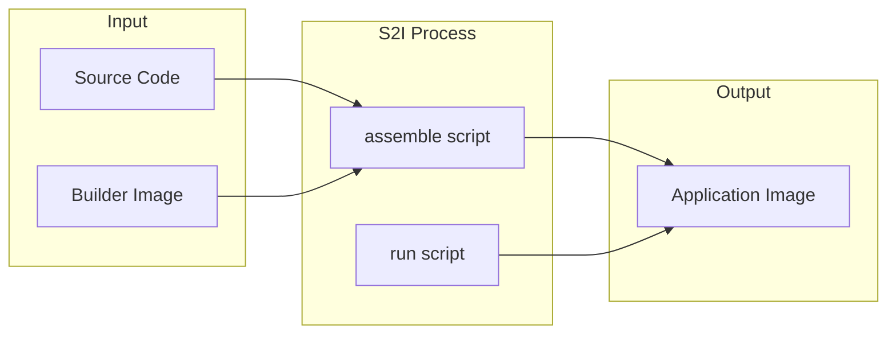

# Source-to-Image (S2I)

> **Module:** OpenShift | **Level:** Intermediate | **Time:** 30 minutes

## Learning objectives

By the end of this section, you will be able to:

- Understand how S2I builds work
- Use S2I builder images effectively
- Customize S2I builds with scripts
- Create custom S2I builder images

---

## What is Source-to-Image?

Source-to-Image (S2I) is a framework for building reproducible container images from source code without writing Dockerfiles.



### Benefits of S2I

| Benefit | Description |
|---------|-------------|
| **Speed** | Incremental builds cache dependencies |
| **Security** | No shell access needed during build |
| **Consistency** | Reproducible builds across environments |
| **Simplicity** | No Dockerfile required |
| **Best practices** | Builder images enforce conventions |

---

## How S2I works

### The build process

1. **Fetch source**: Clone repository or receive binary
2. **Run assemble**: Execute `/usr/libexec/s2i/assemble` script
3. **Commit image**: Create new layer with application
4. **Set run command**: Configure `/usr/libexec/s2i/run` as CMD

### S2I scripts

| Script | Purpose | Required |
|--------|---------|----------|
| `assemble` | Install dependencies and build app | Yes |
| `run` | Start the application | Yes |
| `save-artifacts` | Save build artifacts for incremental builds | No |
| `usage` | Print usage information | No |
| `test/run` | Run tests | No |

---

## Using S2I builds

### Basic S2I build

```bash
# Create app from source
oc new-app nodejs:18~https://github.com/myorg/my-nodejs-app.git

# The ~ syntax means:
# nodejs:18 = builder image
# https://... = source code repository
```

### BuildConfig for S2I

```yaml
# buildconfig-s2i.yaml
apiVersion: build.openshift.io/v1
kind: BuildConfig
metadata:
  name: my-app
spec:
  source:
    type: Git
    git:
      uri: https://github.com/myorg/my-app.git
      ref: main
    contextDir: src/
  strategy:
    type: Source
    sourceStrategy:
      from:
        kind: ImageStreamTag
        name: nodejs:18
        namespace: openshift
      env:
        - name: NPM_MIRROR
          value: https://registry.npmjs.org
      incremental: true
  output:
    to:
      kind: ImageStreamTag
      name: my-app:latest
  triggers:
    - type: ConfigChange
    - type: ImageChange
      imageChange: {}
    - type: GitHub
      github:
        secret: my-webhook-secret
```

### Common builder images

```bash
# List available builders
oc get imagestreams -n openshift | grep -E "nodejs|python|ruby|php|java|go|dotnet"

# Common builders in OpenShift
# nodejs:18, nodejs:20
# python:3.9, python:3.11
# ruby:3.0, ruby:3.1
# php:8.0, php:8.1
# java:11, java:17
# go-toolset:1.20
# dotnet:6.0, dotnet:7.0
```

---

## S2I with different languages

### Node.js

```bash
# Create Node.js app
oc new-app nodejs:18~https://github.com/user/express-app.git

# Environment variables recognized by Node.js builder
# NPM_RUN - npm script to run (default: start)
# NPM_MIRROR - npm registry mirror
# NODE_ENV - Node environment
```

```yaml
# Customize Node.js build
spec:
  strategy:
    sourceStrategy:
      from:
        kind: ImageStreamTag
        name: nodejs:18
        namespace: openshift
      env:
        - name: NPM_RUN
          value: "serve"
        - name: NODE_ENV
          value: "production"
```

### Python

```bash
# Create Python app
oc new-app python:3.11~https://github.com/user/flask-app.git

# Environment variables
# APP_FILE - main application file
# APP_MODULE - WSGI module:application
# PIP_INDEX_URL - PyPI mirror
```

```yaml
# Customize Python build
spec:
  strategy:
    sourceStrategy:
      from:
        kind: ImageStreamTag
        name: python:3.11
        namespace: openshift
      env:
        - name: APP_MODULE
          value: "wsgi:application"
        - name: APP_CONFIG
          value: "gunicorn.conf.py"
```

### Java (OpenJDK)

```bash
# Create Java app (Maven/Gradle)
oc new-app java:17~https://github.com/user/spring-boot-app.git

# Environment variables
# MAVEN_ARGS - Maven build arguments
# MAVEN_MIRROR_URL - Maven mirror
# JAVA_APP_JAR - JAR file to run
# JAVA_OPTIONS - JVM options
```

```yaml
# Customize Java build
spec:
  strategy:
    sourceStrategy:
      from:
        kind: ImageStreamTag
        name: java:17
        namespace: openshift
      env:
        - name: MAVEN_ARGS
          value: "-DskipTests package"
        - name: JAVA_OPTIONS
          value: "-Xms256m -Xmx512m"
```

### Go

```bash
# Create Go app
oc new-app golang:1.20~https://github.com/user/go-app.git

# Environment variables
# GO_BUILD_PATH - Go import path
# GOPROXY - Go module proxy
```

```yaml
# Customize Go build
spec:
  strategy:
    sourceStrategy:
      from:
        kind: ImageStreamTag
        name: golang:1.20
        namespace: openshift
      env:
        - name: GO_BUILD_PATH
          value: "github.com/user/myapp"
```

---

## Customizing S2I builds

### Custom assemble script

Create `.s2i/bin/assemble` in your repository:

```bash
#!/bin/bash
# .s2i/bin/assemble

# Run the default assemble script first
/usr/libexec/s2i/assemble

# Add custom steps
echo "Running custom build steps..."

# Example: Run database migrations
npm run migrate

# Example: Generate static assets
npm run build:assets

# Example: Custom validation
npm run validate
```

### Custom run script

Create `.s2i/bin/run` in your repository:

```bash
#!/bin/bash
# .s2i/bin/run

# Custom startup logic
echo "Starting application with custom configuration..."

# Wait for dependent services
while ! nc -z $DB_HOST 5432; do
    echo "Waiting for database..."
    sleep 2
done

# Run the application
exec npm start
```

### Environment file

Create `.s2i/environment` for build-time variables:

```bash
# .s2i/environment
NPM_RUN=build
NODE_ENV=production
DISABLE_ESLINT=true
```

---

## Incremental builds

Incremental builds reuse artifacts from previous builds to speed up the process.

### Enable incremental builds

```yaml
spec:
  strategy:
    sourceStrategy:
      incremental: true
```

### Save artifacts script

Create `.s2i/bin/save-artifacts` to define what to cache:

```bash
#!/bin/bash
# .s2i/bin/save-artifacts

# Save node_modules for Node.js
if [ -d node_modules ]; then
    tar -cf - node_modules
fi

# Save Maven/Gradle cache for Java
if [ -d ~/.m2 ]; then
    tar -cf - -C ~ .m2
fi
```

### Restore artifacts

The `assemble` script receives saved artifacts via stdin:

```bash
#!/bin/bash
# .s2i/bin/assemble

# Restore artifacts if provided
if [ -d /tmp/artifacts ]; then
    echo "Restoring cached artifacts..."
    mv /tmp/artifacts/node_modules ./node_modules 2>/dev/null || true
fi

# Continue with normal build
npm install
npm run build
```

---

## Binary builds

Build from local files instead of git repository.

### From directory

```bash
# Create build config for binary input
oc new-build --name=my-app --binary=true --image-stream=nodejs:18

# Build from local directory
oc start-build my-app --from-dir=./app --follow

# Build from specific files
oc start-build my-app --from-file=package.json --follow
```

### From archive

```bash
# Create tarball
tar czf app.tar.gz -C ./app .

# Build from archive
oc start-build my-app --from-archive=app.tar.gz --follow
```

### CI/CD integration

```yaml
# GitHub Actions example
jobs:
  build:
    runs-on: ubuntu-latest
    steps:
      - uses: actions/checkout@v4

      - name: Login to OpenShift
        run: oc login --token=${{ secrets.OPENSHIFT_TOKEN }} --server=${{ secrets.OPENSHIFT_SERVER }}

      - name: Build and deploy
        run: |
          oc project my-project
          oc start-build my-app --from-dir=. --follow
          oc rollout status deployment/my-app
```

---

## Creating custom S2I builders

### Builder image structure

```dockerfile
# Dockerfile for custom S2I builder
FROM registry.access.redhat.com/ubi8/ubi

LABEL io.k8s.description="My Custom Builder" \
      io.k8s.display-name="My Builder 1.0" \
      io.openshift.s2i.scripts-url="image:///usr/libexec/s2i" \
      io.openshift.expose-services="8080:http" \
      io.openshift.tags="builder,custom"

# Install build tools
RUN dnf install -y nodejs npm && dnf clean all

# Copy S2I scripts
COPY ./s2i/bin/ /usr/libexec/s2i/

# Set permissions
RUN chown -R 1001:0 /opt/app-root && \
    chmod -R g=u /opt/app-root

# Drop to non-root user
USER 1001

# Set working directory
WORKDIR /opt/app-root/src

# Expose port
EXPOSE 8080

# Default command
CMD ["/usr/libexec/s2i/usage"]
```

### S2I scripts for custom builder

```bash
# s2i/bin/assemble
#!/bin/bash
set -e

echo "---> Installing dependencies..."
npm install

echo "---> Building application..."
npm run build

echo "---> Cleaning up..."
npm prune --production
```

```bash
# s2i/bin/run
#!/bin/bash
exec npm start
```

```bash
# s2i/bin/usage
#!/bin/bash
cat <<EOF
This is my custom Node.js S2I builder.

To use:
  oc new-app my-builder~https://github.com/user/app.git

Environment variables:
  NPM_RUN - npm script to execute (default: start)
EOF
```

### Build and test custom builder

```bash
# Build the builder image
podman build -t my-builder .

# Test locally with s2i tool
s2i build https://github.com/user/sample-app my-builder my-app:test

# Push to registry
podman push my-builder quay.io/myorg/my-builder:latest

# Use in OpenShift
oc import-image my-builder --from=quay.io/myorg/my-builder:latest --confirm
oc new-app my-builder~https://github.com/user/my-app.git
```

---

## Build troubleshooting

### Common issues

**Build fails with permission denied:**
```bash
# Check builder runs as non-root
oc describe is nodejs -n openshift | grep -i user

# Use correct permissions in assemble script
chmod -R g+w /opt/app-root/src
```

**Dependencies not found:**
```bash
# Check build logs for package manager output
oc logs -f bc/my-app

# Verify package.json/requirements.txt exists
# Check contextDir setting in BuildConfig
```

**Incremental build not working:**
```bash
# Ensure save-artifacts script is executable
chmod +x .s2i/bin/save-artifacts

# Check if artifacts are being saved
oc start-build my-app --incremental=true --follow
```

### Debug builds

```bash
# Get build pod logs
oc get builds
oc logs build/my-app-1

# Debug a failed build
oc debug build/my-app-1

# Start build with verbose output
oc start-build my-app --env=DEBUG=true --follow
```

---

## Key takeaways

1. **S2I builds from source** without Dockerfiles
2. **Builder images** provide language-specific tooling
3. **Custom scripts** in `.s2i/bin/` override defaults
4. **Incremental builds** speed up subsequent builds
5. **Binary builds** work with local files and CI/CD
6. **Custom builders** extend S2I for specialized needs

---

## What's next

Learn about OpenShift security features including Security Context Constraints.

Continue to: [05-openshift-security.md](05-openshift-security.md)
