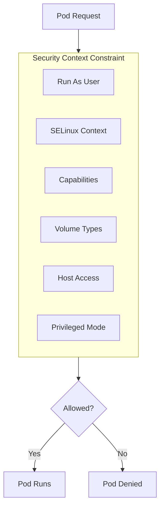

# OpenShift security

> **Module:** OpenShift | **Level:** Intermediate-Advanced | **Time:** 35 minutes

## Learning objectives

By the end of this section, you will be able to:

- Understand Security Context Constraints (SCCs)
- Configure RBAC for OpenShift
- Manage service accounts securely
- Implement network security policies
- Use secrets and secure configurations

---

## Security Context Constraints (SCCs)

SCCs are OpenShift's enhanced pod security model, more powerful than Kubernetes PodSecurityPolicies (now deprecated) or Pod Security Standards.

### What SCCs control



### Built-in SCCs

| SCC | Description | Use Case |
|-----|-------------|----------|
| `restricted` | Most restrictive, default for all pods | Standard applications |
| `restricted-v2` | Updated restricted with v2 defaults | Modern applications |
| `nonroot` | Must run as non-root | Security-conscious apps |
| `nonroot-v2` | Updated nonroot | Modern non-root apps |
| `hostnetwork` | Access to host network | Network monitoring |
| `hostaccess` | Access to host resources | Host-aware apps |
| `anyuid` | Run as any UID | Legacy applications |
| `privileged` | Full access | System components |

### View SCCs

```bash
# List all SCCs
oc get scc

# Describe an SCC
oc describe scc restricted

# View SCC details
oc get scc restricted -o yaml

# See which SCC a pod is using
oc get pod my-pod -o yaml | grep scc
```

### SCC priority and selection

OpenShift evaluates SCCs in priority order:

```bash
# View SCC priorities
oc get scc -o custom-columns=NAME:.metadata.name,PRIORITY:.priority

# Output:
# NAME                          PRIORITY
# anyuid                        10
# hostaccess                    <none>
# hostmount-anyuid             <none>
# hostnetwork                  <none>
# nonroot                      <none>
# privileged                   <none>
# restricted                   <none>
```

---

## Configuring SCCs

### Grant SCC to service account

```bash
# Add SCC to service account
oc adm policy add-scc-to-user anyuid -z my-service-account -n my-project

# Remove SCC from service account
oc adm policy remove-scc-from-user anyuid -z my-service-account -n my-project

# Add SCC to group
oc adm policy add-scc-to-group nonroot system:authenticated

# View who can use an SCC
oc adm policy who-can use scc anyuid
```

### Custom SCC

```yaml
# custom-scc.yaml
apiVersion: security.openshift.io/v1
kind: SecurityContextConstraints
metadata:
  name: custom-restricted
allowHostDirVolumePlugin: false
allowHostIPC: false
allowHostNetwork: false
allowHostPID: false
allowHostPorts: false
allowPrivilegeEscalation: false
allowPrivilegedContainer: false
allowedCapabilities: []
defaultAddCapabilities: []
fsGroup:
  type: MustRunAs
  ranges:
    - min: 1000
      max: 65535
groups: []
priority: 10
readOnlyRootFilesystem: true
requiredDropCapabilities:
  - ALL
runAsUser:
  type: MustRunAsNonRoot
seLinuxContext:
  type: MustRunAs
supplementalGroups:
  type: MustRunAs
  ranges:
    - min: 1000
      max: 65535
users: []
volumes:
  - configMap
  - downwardAPI
  - emptyDir
  - persistentVolumeClaim
  - projected
  - secret
```

```bash
# Create custom SCC
oc create -f custom-scc.yaml

# Assign to service account
oc adm policy add-scc-to-user custom-restricted -z my-sa -n my-project
```

### Pod security context

```yaml
# Deployment with security context
apiVersion: apps/v1
kind: Deployment
metadata:
  name: secure-app
spec:
  template:
    spec:
      securityContext:
        runAsNonRoot: true
        runAsUser: 1000
        fsGroup: 1000
        seccompProfile:
          type: RuntimeDefault
      containers:
        - name: app
          image: my-app:latest
          securityContext:
            allowPrivilegeEscalation: false
            readOnlyRootFilesystem: true
            capabilities:
              drop:
                - ALL
          volumeMounts:
            - name: tmp
              mountPath: /tmp
      volumes:
        - name: tmp
          emptyDir: {}
```

---

## RBAC in OpenShift

### Built-in cluster roles

| Role | Description |
|------|-------------|
| `cluster-admin` | Full cluster access |
| `cluster-reader` | Read-only cluster access |
| `admin` | Full project access |
| `edit` | Edit most project resources |
| `view` | Read-only project access |
| `basic-user` | Read own project info |
| `self-provisioner` | Create new projects |

### Role bindings

```bash
# Grant role to user in project
oc adm policy add-role-to-user edit developer -n my-project

# Grant cluster role
oc adm policy add-cluster-role-to-user cluster-reader auditor

# View role bindings
oc get rolebindings -n my-project
oc get clusterrolebindings

# Remove role
oc adm policy remove-role-from-user edit developer -n my-project
```

### Custom roles

```yaml
# custom-role.yaml
apiVersion: rbac.authorization.k8s.io/v1
kind: Role
metadata:
  name: deployment-manager
  namespace: my-project
rules:
  - apiGroups: ["apps"]
    resources: ["deployments"]
    verbs: ["get", "list", "watch", "create", "update", "patch"]
  - apiGroups: [""]
    resources: ["pods", "pods/log"]
    verbs: ["get", "list", "watch"]
  - apiGroups: [""]
    resources: ["configmaps", "secrets"]
    verbs: ["get", "list"]
```

```bash
# Create role
oc create -f custom-role.yaml

# Bind to user
oc adm policy add-role-to-user deployment-manager developer -n my-project
```

---

## Service accounts

### Service account management

```bash
# Create service account
oc create serviceaccount my-sa

# View service accounts
oc get serviceaccounts
oc get sa

# Get service account details
oc describe sa my-sa

# Use service account in deployment
oc set serviceaccount deployment/my-app my-sa
```

### Service account in pod

```yaml
apiVersion: apps/v1
kind: Deployment
metadata:
  name: my-app
spec:
  template:
    spec:
      serviceAccountName: my-sa
      automountServiceAccountToken: false  # Disable if not needed
      containers:
        - name: app
          image: my-app:latest
```

### Service account tokens

```bash
# Create bound token (recommended)
oc create token my-sa

# Create long-lived token (legacy)
oc create token my-sa --duration=8760h

# View token secrets
oc get secrets | grep my-sa
```

---

## Secrets management

### Creating secrets

```bash
# Generic secret
oc create secret generic db-credentials \
  --from-literal=username=admin \
  --from-literal=password=secretpass

# From file
oc create secret generic tls-certs \
  --from-file=cert.pem \
  --from-file=key.pem

# TLS secret
oc create secret tls my-tls-secret \
  --cert=cert.pem \
  --key=key.pem

# Docker registry secret
oc create secret docker-registry my-registry \
  --docker-server=quay.io \
  --docker-username=user \
  --docker-password=pass
```

### Using secrets

```yaml
# As environment variables
apiVersion: apps/v1
kind: Deployment
metadata:
  name: my-app
spec:
  template:
    spec:
      containers:
        - name: app
          env:
            - name: DB_USER
              valueFrom:
                secretKeyRef:
                  name: db-credentials
                  key: username
            - name: DB_PASS
              valueFrom:
                secretKeyRef:
                  name: db-credentials
                  key: password
```

```yaml
# As volume mount
spec:
  containers:
    - name: app
      volumeMounts:
        - name: certs
          mountPath: /etc/certs
          readOnly: true
  volumes:
    - name: certs
      secret:
        secretName: tls-certs
```

### Secret encryption

```bash
# Check if encryption is enabled
oc get apiserver cluster -o yaml | grep -A5 encryption

# Secrets are encrypted at rest in etcd when configured
```

---

## Network policies

### Deny all by default

```yaml
# deny-all.yaml
apiVersion: networking.k8s.io/v1
kind: NetworkPolicy
metadata:
  name: deny-all
  namespace: my-project
spec:
  podSelector: {}
  policyTypes:
    - Ingress
    - Egress
```

### Allow specific traffic

```yaml
# allow-same-namespace.yaml
apiVersion: networking.k8s.io/v1
kind: NetworkPolicy
metadata:
  name: allow-same-namespace
  namespace: my-project
spec:
  podSelector: {}
  ingress:
    - from:
        - podSelector: {}
  policyTypes:
    - Ingress
```

```yaml
# allow-from-routes.yaml
apiVersion: networking.k8s.io/v1
kind: NetworkPolicy
metadata:
  name: allow-from-router
  namespace: my-project
spec:
  podSelector:
    matchLabels:
      app: web
  ingress:
    - from:
        - namespaceSelector:
            matchLabels:
              network.openshift.io/policy-group: ingress
  policyTypes:
    - Ingress
```

### Egress policies

```yaml
# allow-egress-dns-https.yaml
apiVersion: networking.k8s.io/v1
kind: NetworkPolicy
metadata:
  name: allow-egress-essential
spec:
  podSelector: {}
  egress:
    # Allow DNS
    - to:
        - namespaceSelector: {}
      ports:
        - protocol: UDP
          port: 53
    # Allow HTTPS
    - to:
        - ipBlock:
            cidr: 0.0.0.0/0
      ports:
        - protocol: TCP
          port: 443
  policyTypes:
    - Egress
```

---

## OAuth and authentication

### OAuth providers

```yaml
# OAuth configuration (cluster-admin)
apiVersion: config.openshift.io/v1
kind: OAuth
metadata:
  name: cluster
spec:
  identityProviders:
    # LDAP
    - name: ldap
      type: LDAP
      ldap:
        url: ldaps://ldap.example.com/ou=users,dc=example,dc=com?uid
        bindDN: cn=admin,dc=example,dc=com
        bindPassword:
          name: ldap-bind-secret
        insecure: false
        ca:
          name: ldap-ca

    # OIDC (Keycloak, Okta, etc.)
    - name: oidc
      type: OpenID
      openID:
        clientID: openshift
        clientSecret:
          name: oidc-client-secret
        issuer: https://keycloak.example.com/realms/openshift
        claims:
          preferredUsername:
            - preferred_username
          name:
            - name
          email:
            - email

    # GitHub
    - name: github
      type: GitHub
      github:
        clientID: xxx
        clientSecret:
          name: github-secret
        organizations:
          - myorg
```

### HTPasswd provider (development)

```bash
# Create htpasswd file
htpasswd -c -B -b users.htpasswd developer devpass
htpasswd -B -b users.htpasswd admin adminpass

# Create secret
oc create secret generic htpasswd-secret \
  --from-file=htpasswd=users.htpasswd \
  -n openshift-config

# Configure OAuth (as cluster-admin)
oc patch oauth cluster --type=merge -p '
spec:
  identityProviders:
  - name: htpasswd
    type: HTPasswd
    htpasswd:
      fileData:
        name: htpasswd-secret
'
```

---

## Image security

### Registry authentication

```bash
# Link registry secret to service account
oc secrets link default my-registry --for=pull
oc secrets link builder my-registry

# For builds
oc set build-secret --push bc/my-app my-registry
oc set build-secret --pull bc/my-app my-registry
```

### Image signature verification

```yaml
# policy.json for signature verification
{
  "default": [{"type": "reject"}],
  "transports": {
    "docker": {
      "registry.example.com": [
        {
          "type": "signedBy",
          "keyType": "GPGKeys",
          "keyPath": "/etc/pki/rpm-gpg/RPM-GPG-KEY-redhat-release"
        }
      ]
    }
  }
}
```

### Image scanning

```bash
# View image vulnerabilities (if scanner installed)
oc get imagemanifestvuln

# Using Quay.io scanning
# Images in Quay are automatically scanned
# View in Quay UI or API
```

---

## Security best practices

### Checklist

- [ ] Use `restricted` SCC by default
- [ ] Run containers as non-root
- [ ] Drop all capabilities
- [ ] Use read-only root filesystem
- [ ] Implement network policies
- [ ] Use secrets for sensitive data
- [ ] Enable audit logging
- [ ] Use service accounts with minimal permissions
- [ ] Scan images for vulnerabilities
- [ ] Keep OpenShift updated

### Hardened deployment example

```yaml
apiVersion: apps/v1
kind: Deployment
metadata:
  name: secure-app
spec:
  template:
    spec:
      serviceAccountName: secure-app-sa
      automountServiceAccountToken: false
      securityContext:
        runAsNonRoot: true
        runAsUser: 1000
        fsGroup: 1000
        seccompProfile:
          type: RuntimeDefault
      containers:
        - name: app
          image: registry.example.com/secure-app:v1.0@sha256:abc123...
          securityContext:
            allowPrivilegeEscalation: false
            readOnlyRootFilesystem: true
            capabilities:
              drop:
                - ALL
          resources:
            limits:
              cpu: 500m
              memory: 512Mi
            requests:
              cpu: 100m
              memory: 256Mi
          volumeMounts:
            - name: tmp
              mountPath: /tmp
            - name: cache
              mountPath: /app/cache
      volumes:
        - name: tmp
          emptyDir: {}
        - name: cache
          emptyDir: {}
```

---

## Key takeaways

1. **SCCs are more powerful** than Kubernetes pod security
2. **Default is restricted** - use least privilege
3. **Grant SCCs to service accounts**, not users
4. **Network policies** provide micro-segmentation
5. **Use secrets** for sensitive data, never in images
6. **Scan images** before deployment

---

## What's next

Learn about OpenShift networking in detail.

---

## Navigation

| Previous | Up | Next |
|----------|-----|------|
| [Source-to-Image](04-source-to-image.md) | [Course Overview](../course_overview.md) | [OpenShift Networking](06-openshift-networking.md) |
