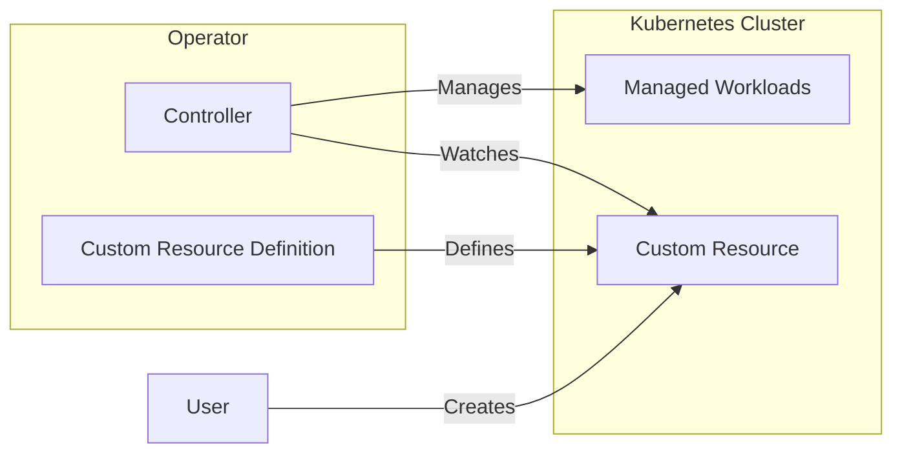
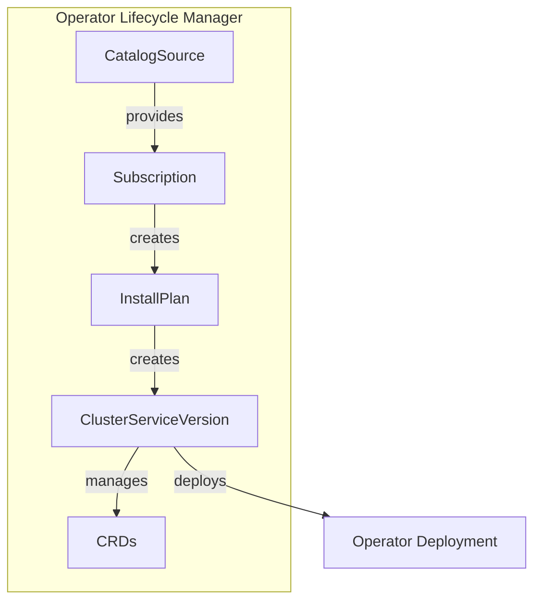

# Operators and OperatorHub

> **Module:** OpenShift | **Level:** Intermediate-Advanced | **Time:** 30 minutes

## Learning objectives

By the end of this section, you will be able to:

- Understand the Operator pattern
- Install operators from OperatorHub
- Manage operator lifecycle
- Create custom resources for operators

---

## What are operators?

Operators are software extensions that use custom resources to manage applications and their components. They encode operational knowledge into software.



### Operator capabilities

| Level | Capability | Example |
|-------|------------|---------|
| 1 | Basic install | Deploy application |
| 2 | Seamless upgrades | Update without downtime |
| 3 | Full lifecycle | Backup, restore |
| 4 | Deep insights | Metrics, alerts |
| 5 | Auto-pilot | Auto-scaling, self-healing |

---

## OperatorHub

### Accessing OperatorHub

**Web Console:**
1. Administrator perspective
2. Operators > OperatorHub
3. Search and filter operators

**CLI:**
```bash
# List available operators
oc get packagemanifests -n openshift-marketplace

# Search for specific operator
oc get packagemanifests -n openshift-marketplace | grep postgres

# View operator details
oc describe packagemanifest postgresql -n openshift-marketplace
```

### Operator sources

| Source | Description | Scope |
|--------|-------------|-------|
| **Red Hat Operators** | Certified by Red Hat | Production |
| **Certified Operators** | Partner certified | Production |
| **Community Operators** | Community maintained | Development |
| **Marketplace** | Red Hat Marketplace | Commercial |

```bash
# View catalog sources
oc get catalogsources -n openshift-marketplace

# Output:
# certified-operators
# community-operators
# redhat-marketplace
# redhat-operators
```

---

## Installing operators

### Via web console

1. Navigate to **Operators > OperatorHub**
2. Search for desired operator
3. Click **Install**
4. Configure:
   - Update channel
   - Installation mode (namespace or cluster-wide)
   - Approval strategy (automatic or manual)
5. Click **Install**

### Via CLI

```yaml
# subscription.yaml
apiVersion: operators.coreos.com/v1alpha1
kind: Subscription
metadata:
  name: postgresql
  namespace: openshift-operators  # or specific namespace
spec:
  channel: v5
  name: postgresql
  source: certified-operators
  sourceNamespace: openshift-marketplace
  installPlanApproval: Automatic  # or Manual
```

```bash
# Apply subscription
oc apply -f subscription.yaml

# Check installation
oc get subscriptions -n openshift-operators
oc get csv -n openshift-operators
oc get installplan -n openshift-operators
```

### Namespace-scoped installation

```yaml
# Create operator group for namespace
apiVersion: operators.coreos.com/v1
kind: OperatorGroup
metadata:
  name: my-operator-group
  namespace: my-project
spec:
  targetNamespaces:
    - my-project
---
# Subscribe in namespace
apiVersion: operators.coreos.com/v1alpha1
kind: Subscription
metadata:
  name: postgresql
  namespace: my-project
spec:
  channel: v5
  name: postgresql
  source: certified-operators
  sourceNamespace: openshift-marketplace
```

---

## Managing operators

### View installed operators

```bash
# List subscriptions
oc get subscriptions -A

# List ClusterServiceVersions (installed operators)
oc get csv -A

# Describe operator
oc describe csv postgresql-operator.v5.4.0 -n openshift-operators

# View operator pods
oc get pods -n openshift-operators -l olm.owner=postgresql-operator.v5.4.0
```

### Update operators

```bash
# Check current version
oc get csv -n openshift-operators

# View available updates
oc get installplan -n openshift-operators

# For manual approval
oc patch installplan install-xxxxx -n openshift-operators \
  --type merge \
  --patch '{"spec":{"approved":true}}'

# Change update channel
oc patch subscription postgresql -n openshift-operators \
  --type merge \
  --patch '{"spec":{"channel":"v6"}}'
```

### Uninstall operators

```bash
# Delete subscription
oc delete subscription postgresql -n openshift-operators

# Delete CSV (uninstalls operator)
oc delete csv postgresql-operator.v5.4.0 -n openshift-operators

# Clean up CRDs (optional, removes all instances)
oc get crd | grep postgresql | xargs oc delete crd
```

---

## Using operators

### View custom resources

```bash
# List CRDs from operator
oc get crd | grep postgresql

# Example output:
# postgresclusters.postgres-operator.crunchydata.com

# View CRD details
oc describe crd postgresclusters.postgres-operator.crunchydata.com
```

### Create operator instances

```yaml
# Example: Crunchy PostgreSQL cluster
apiVersion: postgres-operator.crunchydata.com/v1beta1
kind: PostgresCluster
metadata:
  name: my-postgres
  namespace: my-project
spec:
  image: registry.developers.crunchydata.com/crunchydata/crunchy-postgres:ubi8-14.5-1
  postgresVersion: 14
  instances:
    - name: instance1
      replicas: 2
      dataVolumeClaimSpec:
        accessModes:
          - ReadWriteOnce
        resources:
          requests:
            storage: 10Gi
  backups:
    pgbackrest:
      repos:
        - name: repo1
          volume:
            volumeClaimSpec:
              accessModes:
                - ReadWriteOnce
              resources:
                requests:
                  storage: 5Gi
```

```bash
# Apply custom resource
oc apply -f postgres-cluster.yaml

# Check status
oc get postgresclusters
oc describe postgrescluster my-postgres

# View managed resources
oc get all -l postgres-operator.crunchydata.com/cluster=my-postgres
```

---

## Common operators

### Database operators

**PostgreSQL (Crunchy Data):**
```yaml
apiVersion: postgres-operator.crunchydata.com/v1beta1
kind: PostgresCluster
metadata:
  name: postgres
spec:
  postgresVersion: 15
  instances:
    - replicas: 3
```

**MongoDB (Community):**
```yaml
apiVersion: mongodbcommunity.mongodb.com/v1
kind: MongoDBCommunity
metadata:
  name: mongodb
spec:
  members: 3
  type: ReplicaSet
  version: "6.0.5"
```

### Messaging operators

**AMQ Streams (Kafka):**
```yaml
apiVersion: kafka.strimzi.io/v1beta2
kind: Kafka
metadata:
  name: my-cluster
spec:
  kafka:
    replicas: 3
    listeners:
      - name: plain
        port: 9092
        type: internal
    storage:
      type: persistent-claim
      size: 100Gi
  zookeeper:
    replicas: 3
    storage:
      type: persistent-claim
      size: 10Gi
```

### Monitoring operators

**Prometheus:**
```yaml
apiVersion: monitoring.coreos.com/v1
kind: Prometheus
metadata:
  name: prometheus
spec:
  replicas: 2
  serviceAccountName: prometheus
  serviceMonitorSelector:
    matchLabels:
      team: frontend
```

### Service mesh

**OpenShift Service Mesh (Istio):**
```yaml
apiVersion: maistra.io/v2
kind: ServiceMeshControlPlane
metadata:
  name: basic
  namespace: istio-system
spec:
  version: v2.4
  tracing:
    type: Jaeger
  addons:
    kiali:
      enabled: true
    grafana:
      enabled: true
```

---

## Operator SDK (creating operators)

### Operator types

| Type | Language | Use Case |
|------|----------|----------|
| **Go** | Go | Complex controllers |
| **Ansible** | Ansible | Config management |
| **Helm** | Helm charts | Package deployment |

### Initialize Go operator

```bash
# Install operator-sdk
# https://sdk.operatorframework.io/docs/installation/

# Initialize project
operator-sdk init --domain=example.com --repo=github.com/example/my-operator

# Create API and controller
operator-sdk create api --group=apps --version=v1alpha1 --kind=MyApp --resource --controller

# Build and push
make docker-build docker-push IMG=quay.io/myorg/my-operator:v0.1.0

# Deploy to cluster
make deploy IMG=quay.io/myorg/my-operator:v0.1.0
```

### Simple Helm-based operator

```bash
# Create Helm operator
operator-sdk init --plugins=helm --domain=example.com

# Create API from existing chart
operator-sdk create api --group=apps --version=v1alpha1 --kind=Nginx --helm-chart=nginx

# Structure:
# helm-charts/
#   nginx/
#     Chart.yaml
#     values.yaml
#     templates/
```

---

## Operator lifecycle manager (OLM)

### OLM components



### Key resources

```bash
# Catalog sources (available operators)
oc get catalogsources -n openshift-marketplace

# Subscriptions (operator selections)
oc get subscriptions -A

# Install plans (pending installations)
oc get installplans -A

# ClusterServiceVersions (installed operators)
oc get csv -A
```

### Custom catalog

```yaml
# Custom catalog source
apiVersion: operators.coreos.com/v1alpha1
kind: CatalogSource
metadata:
  name: my-catalog
  namespace: openshift-marketplace
spec:
  displayName: My Operators
  sourceType: grpc
  image: quay.io/myorg/my-catalog:latest
  updateStrategy:
    registryPoll:
      interval: 30m
```

---

## Best practices

### Operator selection

- [ ] Check operator maturity level (1-5)
- [ ] Review update channel stability
- [ ] Verify resource requirements
- [ ] Test in non-production first
- [ ] Review security implications

### Maintenance

```bash
# Monitor operator health
oc get csv -A | grep -v Succeeded

# Check operator logs
oc logs deployment/my-operator -n openshift-operators

# Review events
oc get events -n openshift-operators --sort-by='.lastTimestamp'
```

### Troubleshooting

```bash
# Operator not installing
oc describe subscription my-operator -n openshift-operators
oc describe installplan <plan-name> -n openshift-operators

# Custom resource not working
oc describe <kind> <name>
oc logs deployment/<operator> -n openshift-operators

# CRD issues
oc get crd <name> -o yaml
```

---

## Key takeaways

1. **Operators automate** application management
2. **OperatorHub** provides curated operator catalog
3. **Subscriptions** manage operator lifecycle
4. **Custom resources** create operator instances
5. **OLM handles** installation and updates
6. **Check maturity level** before production use

---

## What's next

Compare OpenShift with vanilla Kubernetes.

---

## Navigation

| Previous | Up | Next |
|----------|-----|------|
| [OpenShift Networking](06-openshift-networking.md) | [Course Overview](../course_overview.md) | [OpenShift vs Kubernetes](08-openshift-vs-kubernetes.md) |
