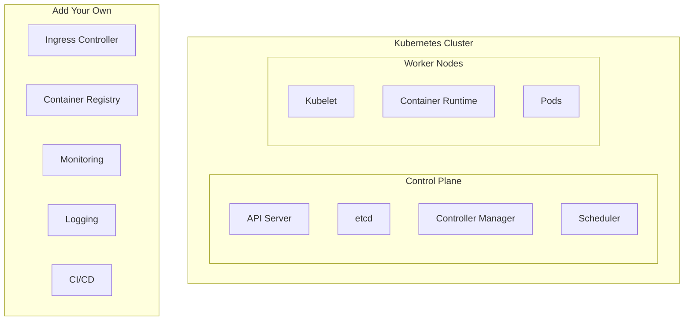
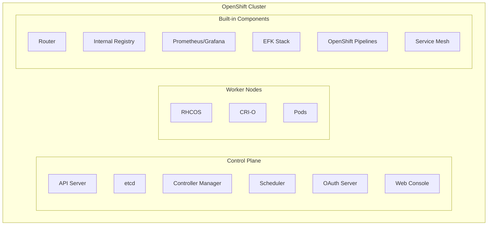

# OpenShift vs Kubernetes

> **Module:** OpenShift | **Level:** Intermediate | **Time:** 20 minutes

## Learning objectives

By the end of this section, you will be able to:

- Compare OpenShift and Kubernetes features
- Understand migration considerations
- Choose the right platform for your needs

---

## Feature comparison

### Core platform

| Feature | Kubernetes | OpenShift |
|---------|------------|-----------|
| Container runtime | Various (containerd, CRI-O) | CRI-O only |
| Host OS | Any Linux | RHCOS (workers), RHEL optional |
| Installation | kubeadm, kops, etc. | Installer (IPI/UPI) |
| Updates | Manual | Managed (OTA) |
| Multi-tenancy | Namespaces | Projects (enhanced) |
| CLI | kubectl | oc (kubectl compatible) |
| Dashboard | Optional add-on | Integrated web console |

### Developer experience

| Feature | Kubernetes | OpenShift |
|---------|------------|-----------|
| Build automation | External (Jenkins, GitHub Actions) | Built-in (BuildConfig, S2I) |
| Image management | External registry | ImageStreams + internal registry |
| Templates | Helm charts | Templates + Helm |
| Developer console | Limited | Rich developer perspective |
| IDE integration | Various | Dev Spaces, Extensions |

### Security

| Feature | Kubernetes | OpenShift |
|---------|------------|-----------|
| Pod security | Pod Security Standards | SCCs (more granular) |
| Default security | Permissive | Restrictive |
| RBAC | Standard | Enhanced + project roles |
| Authentication | External | Built-in OAuth |
| Registry security | External | Integrated signing/scanning |
| Network policies | CNI-dependent | OVN-Kubernetes |

### Operations

| Feature | Kubernetes | OpenShift |
|---------|------------|-----------|
| Monitoring | Prometheus (install yourself) | Built-in Prometheus/Grafana |
| Logging | EFK (install yourself) | Built-in logging stack |
| Ingress | Various controllers | HAProxy router + Ingress |
| Service mesh | Istio (install yourself) | OpenShift Service Mesh |
| Operators | OLM optional | OLM built-in |

---

## Architecture differences

### Kubernetes



### OpenShift



---

## Resource mapping

### Projects vs namespaces

```bash
# Kubernetes
kubectl create namespace myapp
kubectl get namespaces

# OpenShift (projects are enhanced namespaces)
oc new-project myapp
oc projects

# Projects include:
# - Default service accounts
# - Default role bindings
# - Resource quotas (if configured)
# - Network policies (if configured)
```

### Routes vs Ingress

```yaml
# Kubernetes Ingress
apiVersion: networking.k8s.io/v1
kind: Ingress
metadata:
  name: my-ingress
spec:
  rules:
    - host: app.example.com
      http:
        paths:
          - path: /
            pathType: Prefix
            backend:
              service:
                name: my-app
                port:
                  number: 8080
```

```yaml
# OpenShift Route
apiVersion: route.openshift.io/v1
kind: Route
metadata:
  name: my-route
spec:
  host: app.example.com
  to:
    kind: Service
    name: my-app
    weight: 100
  port:
    targetPort: 8080
  tls:
    termination: edge
```

### Deployments (compatible)

```yaml
# Works in both Kubernetes and OpenShift
apiVersion: apps/v1
kind: Deployment
metadata:
  name: my-app
spec:
  replicas: 3
  selector:
    matchLabels:
      app: my-app
  template:
    metadata:
      labels:
        app: my-app
    spec:
      containers:
        - name: my-app
          image: nginx:alpine
```

---

## Migration considerations

### Kubernetes to OpenShift

**Compatible without changes:**
- Deployments, StatefulSets, DaemonSets
- Services, ConfigMaps, Secrets
- PersistentVolumeClaims
- Network policies

**May need adjustment:**
- Ingress → Routes (or keep Ingress)
- Pod security (root containers → non-root)
- Host networking/volumes
- Privileged containers

**Security adjustments:**
```yaml
# Kubernetes (may run as root)
spec:
  containers:
    - name: app
      image: my-app

# OpenShift (must be non-root by default)
spec:
  securityContext:
    runAsNonRoot: true
  containers:
    - name: app
      image: my-app
      securityContext:
        allowPrivilegeEscalation: false
```

### OpenShift to Kubernetes

**Remove OpenShift-specific resources:**
- Routes (convert to Ingress)
- BuildConfigs (use external CI/CD)
- ImageStreams (use registry directly)
- DeploymentConfigs (convert to Deployments)

**Add external components:**
- Ingress controller
- Container registry
- CI/CD system
- Monitoring stack
- Logging stack

---

## Command comparison

### Basic commands

| Task | kubectl | oc |
|------|---------|-----|
| Login | Use kubeconfig | `oc login` |
| Context | `kubectl config use-context` | `oc project` |
| Deploy | `kubectl apply -f` | `oc apply -f` or `oc new-app` |
| Expose | `kubectl expose` | `oc expose` (creates Route) |
| Logs | `kubectl logs` | `oc logs` |
| Exec | `kubectl exec` | `oc exec` or `oc rsh` |
| Debug | `kubectl debug` | `oc debug` |

### OpenShift-specific commands

```bash
# No kubectl equivalent
oc new-project myproject
oc new-app nginx
oc start-build myapp
oc import-image nginx
oc set triggers
oc rollback
```

---

## When to choose each

### Choose Kubernetes when

- **Maximum flexibility** needed
- **Multi-cloud portability** is priority
- **Cost-sensitive** (no license)
- **Team has K8s expertise**
- **Simple workloads** only
- **Cloud-managed K8s** available (GKE, EKS, AKS)

### Choose OpenShift when

- **Enterprise support** required
- **Security compliance** is critical
- **Developer productivity** matters
- **Integrated CI/CD** needed
- **Reduced operational overhead** desired
- **Red Hat ecosystem** in use

### Decision matrix

| Criteria | Kubernetes | OpenShift |
|----------|------------|-----------|
| Initial cost | Free | License |
| Operational cost | Higher (DIY) | Lower (integrated) |
| Time to production | Longer | Shorter |
| Security posture | Build it | Built-in |
| Learning curve | Steeper | Gentler (console) |
| Flexibility | Maximum | Opinionated |
| Support | Community | Enterprise |

---

## Hybrid approach

### Use both platforms

```yaml
# Portable manifests
# Works on both Kubernetes and OpenShift

apiVersion: apps/v1
kind: Deployment
metadata:
  name: my-app
spec:
  replicas: 3
  selector:
    matchLabels:
      app: my-app
  template:
    metadata:
      labels:
        app: my-app
    spec:
      securityContext:
        runAsNonRoot: true
      containers:
        - name: my-app
          image: my-registry/my-app:v1
          securityContext:
            allowPrivilegeEscalation: false
            readOnlyRootFilesystem: true
            capabilities:
              drop:
                - ALL
---
apiVersion: v1
kind: Service
metadata:
  name: my-app
spec:
  ports:
    - port: 80
      targetPort: 8080
  selector:
    app: my-app
```

### Platform-specific overlays

```bash
# Kustomize structure
base/
  deployment.yaml
  service.yaml
  kustomization.yaml
overlays/
  kubernetes/
    ingress.yaml
    kustomization.yaml
  openshift/
    route.yaml
    kustomization.yaml

# Apply for Kubernetes
kubectl apply -k overlays/kubernetes/

# Apply for OpenShift
oc apply -k overlays/openshift/
```

---

## Key takeaways

1. **OpenShift builds on Kubernetes** - not a replacement
2. **Most K8s manifests work** in OpenShift
3. **Security is stricter** in OpenShift by default
4. **Routes are more powerful** than Ingress
5. **Built-in features** reduce operational overhead
6. **Choose based on** needs, not hype

---

## What's next

Test your OpenShift knowledge with the quiz.

Continue to: [quiz.md](quiz.md)
