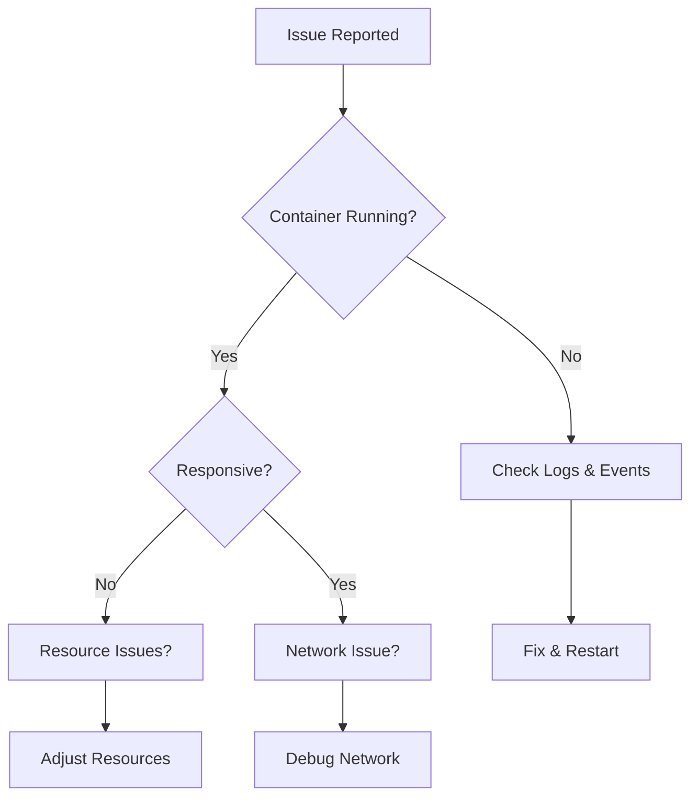

# Container troubleshooting

> **Module:** Operations | **Level:** Intermediate-Advanced | **Time:** 35 minutes

## Learning objectives

By the end of this section, you will be able to:

- Diagnose common container issues
- Debug networking problems
- Troubleshoot storage issues
- Analyze container crashes

---

## Troubleshooting framework



---

## Container startup issues

### Container exits immediately

```bash
# Check exit code
docker inspect --format '{{.State.ExitCode}}' mycontainer

# Common exit codes
# 0   - Normal exit
# 1   - Application error
# 137 - Killed (OOM or manual)
# 139 - Segmentation fault
# 143 - Graceful termination (SIGTERM)
```

**Exit code 137 (OOM killed):**
```bash
# Check if OOM killed
docker inspect --format '{{.State.OOMKilled}}' mycontainer

# Solution: Increase memory limit
docker run -m 1g myimage:latest
```

**Exit code 1 (application error):**
```bash
# Check logs
docker logs mycontainer

# Run interactively to debug
docker run -it --entrypoint /bin/sh myimage:latest
```

### Container won't start

```bash
# Check for error messages
docker logs mycontainer 2>&1

# Common causes:
# - Image not found
# - Port already in use
# - Volume mount issues
# - Permission denied

# Check if port is in use
netstat -tlnp | grep :8080
lsof -i :8080

# Check image exists
docker images | grep myimage
```

### Permission denied errors

```bash
# Check container user
docker inspect --format '{{.Config.User}}' myimage:latest

# Run as specific user
docker run --user 1000:1000 myimage:latest

# Check file permissions in container
docker run --rm myimage:latest ls -la /app

# Fix ownership on volumes
docker run --rm -v myvolume:/data alpine chown -R 1000:1000 /data
```

---

## Runtime issues

### Container is slow

```bash
# Check resource usage
docker stats mycontainer

# Check for resource limits
docker inspect --format '{{.HostConfig.Memory}} {{.HostConfig.NanoCpus}}' mycontainer

# Look for high I/O
docker stats --format "{{.Name}}\t{{.BlockIO}}"
```

### Container is unresponsive

```bash
# Check if process is running
docker top mycontainer

# Check process inside container
docker exec mycontainer ps aux

# Try to exec into container
docker exec -it mycontainer /bin/sh

# If exec fails, check container state
docker inspect --format '{{.State.Status}}' mycontainer
```

### Memory issues

```bash
# Check memory usage
docker stats --no-stream --format "{{.Name}}\t{{.MemUsage}}\t{{.MemPerc}}"

# Check for OOM events
dmesg | grep -i "out of memory"
journalctl -k | grep -i "oom"

# Increase memory limit
docker update --memory 2g mycontainer
```

---

## Networking issues

### Can't connect to container

```bash
# Check container IP
docker inspect --format '{{range.NetworkSettings.Networks}}{{.IPAddress}}{{end}}' mycontainer

# Check port mapping
docker port mycontainer

# Test from inside another container
docker run --rm nicolaka/netshoot curl http://mycontainer:8080

# Check if service is listening inside container
docker exec mycontainer netstat -tlnp
docker exec mycontainer ss -tlnp
```

### DNS resolution fails

```bash
# Check DNS configuration
docker exec mycontainer cat /etc/resolv.conf

# Test DNS resolution
docker exec mycontainer nslookup google.com
docker exec mycontainer nslookup othercontainer

# Check Docker DNS
docker exec mycontainer nslookup othercontainer 127.0.0.11
```

### Network connectivity between containers

```bash
# Check if containers are on same network
docker network inspect mynetwork

# Test connectivity
docker exec container1 ping container2
docker exec container1 nc -zv container2 5432

# Check for network policies (if using orchestration)
docker exec container1 curl -v http://container2:8080
```

### Debugging with netshoot

```bash
# Run netshoot in container's network namespace
docker run -it --rm --network container:mycontainer nicolaka/netshoot

# Available tools:
# - tcpdump
# - netstat
# - nslookup / dig
# - curl / wget
# - traceroute
# - iptables
```

---

## Storage issues

### Volume mount problems

```bash
# Check volume exists
docker volume ls | grep myvolume

# Inspect volume
docker volume inspect myvolume

# Check mount point
docker inspect --format '{{json .Mounts}}' mycontainer | jq

# Verify data in volume
docker run --rm -v myvolume:/data alpine ls -la /data
```

### Permission denied on volume

```bash
# Check file ownership
docker run --rm -v myvolume:/data alpine ls -la /data

# Fix ownership
docker run --rm -v myvolume:/data alpine chown -R 1000:1000 /data

# Or run container as root temporarily
docker exec -u root mycontainer ls -la /data
```

### Disk space issues

```bash
# Check Docker disk usage
docker system df
docker system df -v

# Clean up unused resources
docker system prune -a --volumes

# Check specific volume size
docker run --rm -v myvolume:/data alpine du -sh /data
```

---

## Log analysis

### Accessing logs

```bash
# All logs
docker logs mycontainer

# Last 100 lines
docker logs --tail 100 mycontainer

# Follow logs
docker logs -f mycontainer

# With timestamps
docker logs -t mycontainer

# Since specific time
docker logs --since 1h mycontainer
docker logs --since "2024-01-15T10:00:00" mycontainer
```

### Log file location

```bash
# Find log file
docker inspect --format '{{.LogPath}}' mycontainer

# View raw JSON logs
sudo cat /var/lib/docker/containers/<container-id>/*-json.log | jq

# Check log size
sudo du -sh /var/lib/docker/containers/*/
```

### Truncate logs

```bash
# Truncate specific container log
sudo truncate -s 0 $(docker inspect --format='{{.LogPath}}' mycontainer)
```

---

## Common error messages

### "No space left on device"

```bash
# Check disk space
df -h /var/lib/docker

# Clean up
docker system prune -a --volumes
docker builder prune -a

# Check for large containers
docker ps -s
```

### "Cannot connect to Docker daemon"

```bash
# Check if Docker is running
systemctl status docker

# Check socket permissions
ls -la /var/run/docker.sock

# Add user to docker group
sudo usermod -aG docker $USER
# Log out and back in
```

### "Image not found" / "Pull access denied"

```bash
# Check image name spelling
docker search myimage

# Login to registry
docker login registry.example.com

# Check credentials
cat ~/.docker/config.json
```

### "Port already in use"

```bash
# Find what's using the port
lsof -i :8080
netstat -tlnp | grep 8080

# Kill the process or use different port
docker run -p 8081:80 nginx
```

---

## Compose troubleshooting

### Services not starting

```bash
# Check compose logs
docker compose logs

# Check specific service
docker compose logs api

# View compose config
docker compose config

# Check events
docker compose events
```

### Dependency issues

```bash
# Check service health
docker compose ps

# Inspect health status
docker inspect --format '{{json .State.Health}}' myapp-db-1 | jq

# Force recreate
docker compose up -d --force-recreate
```

---

## Debugging checklist

### Quick diagnosis

```bash
# 1. Is container running?
docker ps -a | grep mycontainer

# 2. What are the logs?
docker logs --tail 50 mycontainer

# 3. What's the exit code?
docker inspect --format '{{.State.ExitCode}}' mycontainer

# 4. Any resource issues?
docker stats --no-stream mycontainer

# 5. Network accessible?
docker exec mycontainer curl localhost:8080
```

### Deep diagnosis

```bash
# Get full container details
docker inspect mycontainer > container-inspect.json

# Check events
docker events --since 1h --filter container=mycontainer

# System information
docker info
docker version
```

---

## Key takeaways

1. **Check logs first** - Most issues are revealed in logs
2. **Exit codes tell stories** - Learn common codes
3. **netshoot is your friend** - Essential for network debugging
4. **Resource limits matter** - OOM kills are common
5. **Clean up regularly** - Disk space issues are preventable

---

## What's next

Learn about backup and disaster recovery strategies.

Continue to: [03-backup-recovery.md](03-backup-recovery.md)
