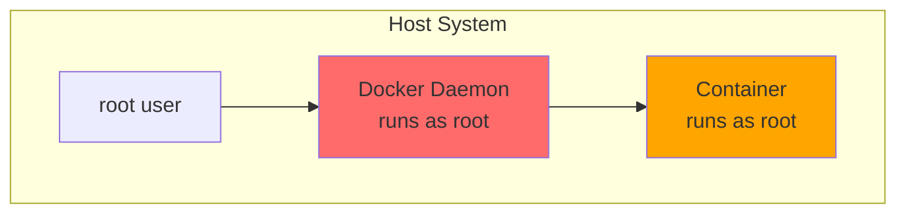
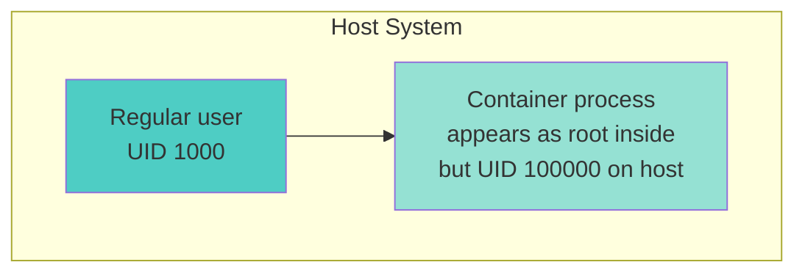

# Introduction to Rootless Containers

> **Module:** Rootless Containers | **Level:** Intermediate | **Time:** 30 minutes

## Learning Objectives

By the end of this section, you will be able to:

- Explain what rootless containers are and why they matter
- Understand the security benefits of rootless mode
- Compare rootful and rootless architectures
- Know which tool (Docker/Podman) supports rootless better

---

## What Are Rootless Containers?

Rootless containers run without requiring root (administrator) privileges on the host system.

### Traditional Containers (Rootful)



**Problem:** If the container is compromised, the attacker potentially has root access to the host.

### Rootless Containers



**Benefit:** Even if the container is compromised, the attacker only has access as an unprivileged user.

---

## Why Rootless Matters

### Security Comparison

| Scenario | Rootful | Rootless |
|----------|---------|----------|
| **Container escape** | Attacker gets root | Attacker gets unprivileged user |
| **Daemon vulnerability** | System compromise | User-level compromise |
| **Privilege escalation** | Common path | Much harder |
| **Multi-tenant systems** | Shared root | Isolated users |

### Real-World Attack Scenario

```
Rootful Attack Path:
1. Attacker exploits vulnerability in containerized app
2. Attacker escapes container
3. Attacker has ROOT access to host
4. Attacker can access all data, install backdoors, etc.

Rootless Attack Path:
1. Attacker exploits vulnerability in containerized app
2. Attacker escapes container
3. Attacker has UNPRIVILEGED user access
4. Cannot read other users' files
5. Cannot modify system configuration
6. Cannot install system-wide malware
7. Impact contained to single user
```

---

## How Rootless Works

### User Namespaces

User namespaces allow processes to have different UIDs inside vs outside:

```
┌─────────────────────────────────────────────────────┐
│                 Host System                          │
│                                                      │
│   Your user: UID 1000                               │
│                                                      │
│   ┌─────────────────────────────────────────────┐   │
│   │            Container                         │   │
│   │                                              │   │
│   │   Process sees: UID 0 (root)                │   │
│   │   Host sees: UID 100000 (subordinate)       │   │
│   │                                              │   │
│   │   "I'm root!" → Actually just user 100000   │   │
│   │                                              │   │
│   └─────────────────────────────────────────────┘   │
│                                                      │
└─────────────────────────────────────────────────────┘
```

### UID Mapping

```bash
# Your user (UID 1000) gets a range of subordinate UIDs
cat /etc/subuid
# username:100000:65536

# Mapping:
# Container UID 0 (root)  → Host UID 1000 (your user)
# Container UID 1         → Host UID 100000
# Container UID 2         → Host UID 100001
# ...
# Container UID 65535     → Host UID 165535
```

---

## Podman: Rootless by Default

Podman was designed with rootless as the primary mode:

```bash
# Just works - no setup needed
podman run hello-world

# Check who you're running as
podman run alpine whoami
# root (inside container)

# But on host:
ps aux | grep alpine
# youruser ... podman ...  (running as your user)
```

### Why Podman is Better for Rootless

| Feature | Podman | Docker |
|---------|--------|--------|
| Default mode | Rootless | Rootful |
| Setup required | None | Extra steps |
| Daemon | None (daemonless) | Runs as user |
| UID handling | Native support | Requires config |
| systemd integration | Native | Limited |

---

## Docker: Rootless Mode

Docker supports rootless but requires setup:

### Installing Docker Rootless

```bash
# Install prerequisites
sudo apt-get install -y uidmap dbus-user-session

# Run the setup script
dockerd-rootless-setuptool.sh install

# Add to shell profile
echo 'export PATH=/usr/bin:$PATH' >> ~/.bashrc
echo 'export DOCKER_HOST=unix://$XDG_RUNTIME_DIR/docker.sock' >> ~/.bashrc
source ~/.bashrc

# Start rootless Docker
systemctl --user start docker

# Enable on login
systemctl --user enable docker

# Verify
docker info | grep -i root
# Docker Root Dir: /home/user/.local/share/docker
```

### Docker Rootless Limitations

| Limitation | Workaround |
|------------|------------|
| Ports < 1024 | Use higher ports or configure sysctl |
| Some storage drivers | Use overlay2 (fuse-overlayfs) |
| AppArmor | Limited support |
| Cgroup v1 | Requires cgroup v2 for full features |

---

## Comparison: Rootful vs Rootless

### Feature Comparison

| Feature | Rootful | Rootless |
|---------|---------|----------|
| **Privileged ports (< 1024)** | Yes | No (without config) |
| **Host networking** | Full | Limited |
| **All storage drivers** | Yes | Subset |
| **Performance** | Slightly better | Slightly slower |
| **Security** | Lower | Higher |
| **Multi-user** | Shared daemon | Per-user isolation |

### When to Use Each

**Use Rootful When:**
- Need privileged ports without configuration
- Maximum compatibility required
- Single-user development machine
- Legacy system integration

**Use Rootless When:**
- Security is priority
- Multi-user systems
- CI/CD runners
- Production workloads
- Compliance requirements

---

## Checking Your Mode

### Podman

```bash
# Check if running rootless
podman info | grep -i rootless
# rootless: true

# Or check the storage location
podman info | grep graphRoot
# Rootless: ~/.local/share/containers/storage
# Rootful: /var/lib/containers/storage
```

### Docker

```bash
# Check Docker mode
docker info | grep -i "Docker Root Dir"
# Rootless: /home/user/.local/share/docker
# Rootful: /var/lib/docker

# Check if using user namespace
docker info | grep -i "userns"
```

---

## Quick Start Guide

### Podman (Already Rootless)

```bash
# No setup needed!
podman run -d --name web -p 8080:80 nginx
curl http://localhost:8080
podman rm -f web
```

### Docker (Enable Rootless)

```bash
# 1. Install prerequisites
sudo apt-get install -y uidmap

# 2. Run setup
dockerd-rootless-setuptool.sh install

# 3. Set environment
export DOCKER_HOST=unix://$XDG_RUNTIME_DIR/docker.sock

# 4. Start daemon
systemctl --user start docker

# 5. Test
docker run hello-world
```

---

## Key Takeaways

1. **Rootless containers don't need root** on the host
2. **User namespaces** map container UIDs to unprivileged host UIDs
3. **Podman is rootless by default** - no setup needed
4. **Docker requires setup** for rootless mode
5. **Security is significantly better** with rootless
6. **Some limitations exist** (ports, networking) but have workarounds
7. **Use rootless** unless you have a specific reason not to

---

## What's Next

Learn how user namespaces and subordinate UIDs work in detail.

Continue to: [02-user-namespaces.md](02-user-namespaces.md)

---

## Quick Quiz

1. What makes rootless containers more secure?
   - [ ] They run faster
   - [ ] They use less memory
   - [x] Container escape gives only user-level access
   - [ ] They have better networking

2. Which tool is rootless by default?
   - [ ] Docker
   - [x] Podman
   - [ ] containerd
   - [ ] runc

3. In rootless mode, what does container UID 0 (root) map to on the host?
   - [ ] Host UID 0 (root)
   - [x] The user's UID who started the container
   - [ ] UID 65534 (nobody)
   - [ ] UID 1000 always

4. What is required for rootless containers to work?
   - [ ] Special hardware
   - [ ] Windows Subsystem for Linux
   - [x] User namespaces and subordinate UIDs
   - [ ] A Kubernetes cluster

---

## Navigation

| Previous | Up | Next |
|----------|-----|------|
| [Networking Fundamentals](../networking/01-networking-fundamentals.md) | [Course Overview](../course_overview.md) | [Security Overview](../security/01-security-overview.md) |
