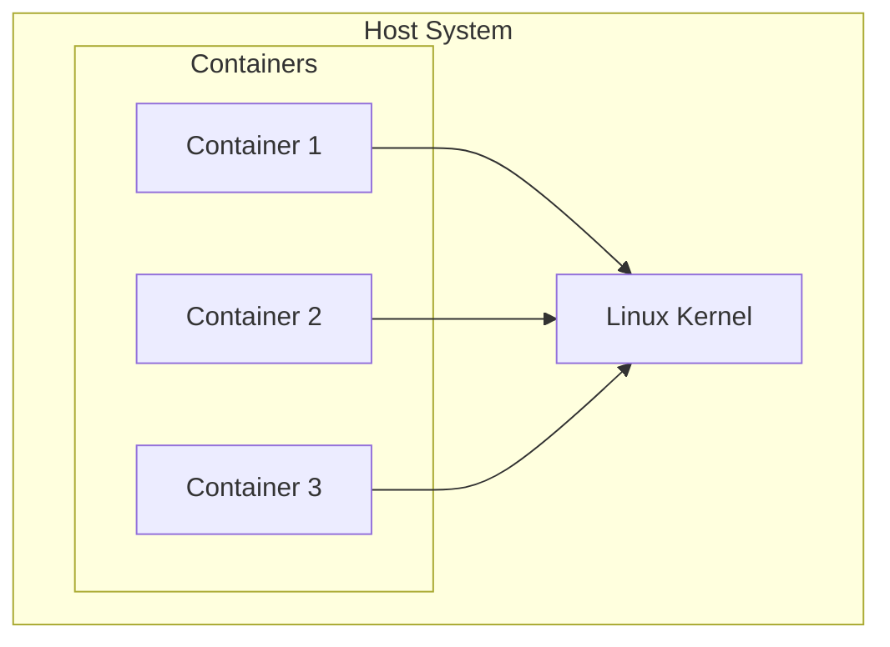
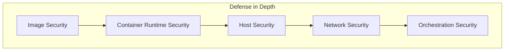

# Container Security Overview

> **Module:** Security | **Level:** Intermediate-Advanced | **Time:** 30 minutes

## Learning Objectives

By the end of this section, you will be able to:

- Understand the container security model
- Identify common container security risks
- Apply defense-in-depth strategies
- Know the security differences between rootful and rootless containers

---

## The Container Security Model

Containers provide isolation, but they share the host kernel:



**Key Insight:** Container isolation is provided by Linux kernel features, not hardware virtualization.

---

## Security Layers



| Layer | Components | Purpose |
|-------|------------|---------|
| **Image** | Base images, vulnerabilities, secrets | Secure the artifact |
| **Runtime** | Namespaces, cgroups, capabilities | Isolate processes |
| **Host** | Kernel, Docker daemon, file permissions | Secure the platform |
| **Network** | Firewalls, encryption, segmentation | Protect communication |
| **Orchestration** | Swarm/K8s security, RBAC | Control access |

---

## Common Security Risks

### 1. Running as Root

```bash
# RISKY: Container runs as root
docker run nginx
docker exec nginx whoami  # root

# If container escapes, attacker has root on host
```

### 2. Privileged Containers

```bash
# DANGEROUS: Full host access
docker run --privileged nginx

# Can access host devices, load kernel modules, etc.
```

### 3. Sensitive Mount Points

```bash
# DANGEROUS: Docker socket access
docker run -v /var/run/docker.sock:/var/run/docker.sock nginx
# Container can control Docker, spawn privileged containers

# DANGEROUS: Host filesystem access
docker run -v /:/host nginx
# Container can read/write entire host filesystem
```

### 4. Vulnerable Images

```bash
# Old images with known vulnerabilities
docker run node:14  # EOL, has CVEs

# Unverified images
docker run randomuser/suspicous-image  # Who made this?
```

### 5. Hardcoded Secrets

```dockerfile
# BAD: Secret in Dockerfile
ENV API_KEY=sk-123456789

# BAD: Secret in image layer
RUN echo "password" > /app/secret
```

---

## Security Best Practices Overview

### Image Security

| Practice | Description |
|----------|-------------|
| Use official images | From verified publishers |
| Pin specific versions | Not `:latest` |
| Scan for vulnerabilities | Trivy, Scout, Grype |
| Minimize image size | Less attack surface |
| Use multi-stage builds | No build tools in production |
| Sign images | Docker Content Trust |

### Runtime Security

| Practice | Description |
|----------|-------------|
| Run as non-root | Use `USER` instruction |
| Use rootless mode | Podman default, Docker optional |
| Drop capabilities | `--cap-drop ALL` |
| Read-only filesystem | `--read-only` |
| No new privileges | `--security-opt=no-new-privileges` |
| Resource limits | `--memory`, `--cpus` |

### Network Security

| Practice | Description |
|----------|-------------|
| Use custom networks | Not default bridge |
| Network segmentation | Separate frontend/backend |
| Encrypt traffic | TLS/mTLS |
| Limit published ports | Only what's needed |

---

## Rootful vs Rootless Security

### Rootful (Traditional)

```
┌─────────────────────────────────────────────┐
│ Host System                                  │
│                                              │
│   Docker Daemon (runs as root)              │
│       │                                      │
│       └── Container (root inside)           │
│           └── If escape: FULL ROOT ACCESS   │
│                                              │
└─────────────────────────────────────────────┘
```

### Rootless (Recommended)

```
┌─────────────────────────────────────────────┐
│ Host System                                  │
│                                              │
│   User Process (UID 1000)                   │
│       │                                      │
│       └── Container (appears as root)       │
│           └── If escape: Only user 1000     │
│               - No system access             │
│               - Can't affect other users     │
│                                              │
└─────────────────────────────────────────────┘
```

| Aspect | Rootful | Rootless |
|--------|---------|----------|
| Daemon privilege | Root | User |
| Container escape | Full root access | User-level only |
| Port < 1024 | Yes | No (without config) |
| All features | Yes | Some limitations |
| Default | Docker | Podman |

---

## Security Scanning

### Vulnerability Scanning Tools

```bash
# Docker Scout (built into Docker)
docker scout cves nginx:latest

# Trivy (open source, comprehensive)
trivy image nginx:latest

# Grype (Anchore, fast)
grype nginx:latest

# Snyk (commercial, CI/CD integration)
snyk container test nginx:latest
```

### Example: Trivy Scan

```bash
$ trivy image python:3.9

python:3.9 (debian 11.6)
Total: 125 (UNKNOWN: 0, LOW: 82, MEDIUM: 29, HIGH: 12, CRITICAL: 2)

┌──────────────┬──────────────────┬──────────┬────────┐
│   Library    │  Vulnerability   │ Severity │ Status │
├──────────────┼──────────────────┼──────────┼────────┤
│ openssl      │ CVE-2023-XXXX    │ CRITICAL │ fixed  │
│ libcurl      │ CVE-2023-YYYY    │ HIGH     │ fixed  │
│ ...          │ ...              │ ...      │ ...    │
└──────────────┴──────────────────┴──────────┴────────┘
```

---

## Quick Security Checklist

### Before Production

- [ ] Image from trusted source
- [ ] Image scanned for vulnerabilities
- [ ] No secrets in image
- [ ] Container runs as non-root
- [ ] Unnecessary capabilities dropped
- [ ] Resource limits set
- [ ] Read-only filesystem where possible
- [ ] Network properly segmented
- [ ] Logs collected and monitored

### Container Run Flags

```bash
# Security-hardened container run
docker run -d \
    --name secure-app \
    --user 1000:1000 \
    --read-only \
    --cap-drop ALL \
    --cap-add NET_BIND_SERVICE \
    --security-opt no-new-privileges:true \
    --memory 512m \
    --cpus 1 \
    --pids-limit 100 \
    --tmpfs /tmp:rw,noexec,nosuid \
    myapp:v1
```

---

## Standards and Frameworks

### CIS Docker Benchmark

The Center for Internet Security provides comprehensive Docker security guidelines:

- Host configuration
- Docker daemon configuration
- Docker daemon configuration files
- Container images and build
- Container runtime
- Docker security operations

### NIST SP 800-190

NIST Application Container Security Guide:

- Image vulnerabilities
- Image configuration defects
- Embedded malware
- Embedded secrets
- Use of untrusted images

---

## Key Takeaways

1. **Containers share the kernel** - not as isolated as VMs
2. **Defense in depth** - multiple security layers
3. **Rootless mode** dramatically reduces attack impact
4. **Scan images** before deployment
5. **Run as non-root** inside containers
6. **Drop capabilities** you don't need
7. **Follow CIS benchmarks** for comprehensive security

---

## What's Next

Deep dive into image security and vulnerability management.

Continue to: [02-image-security.md](02-image-security.md)

---

## Quick Quiz

1. Why are containers less isolated than VMs?
   - [ ] Containers are older technology
   - [x] Containers share the host kernel
   - [ ] Containers don't use namespaces
   - [ ] VMs have better networking

2. What's the main security benefit of rootless containers?
   - [ ] Faster performance
   - [ ] Smaller images
   - [x] Container escape gives only user-level access
   - [ ] Better networking

3. Which is NOT a security best practice?
   - [ ] Run as non-root user
   - [ ] Scan images for vulnerabilities
   - [ ] Use specific image tags
   - [x] Mount Docker socket into containers

4. What does `--cap-drop ALL` do?
   - [ ] Removes all containers
   - [ ] Disables all networking
   - [x] Removes all Linux capabilities
   - [ ] Stops all running processes

---

## Navigation

| Previous | Up | Next |
|----------|-----|------|
| [Rootless Introduction](../rootless/01-rootless-introduction.md) | [Course Overview](../course_overview.md) | [Monitoring and Logging](../operations/01-monitoring-logging.md) |
