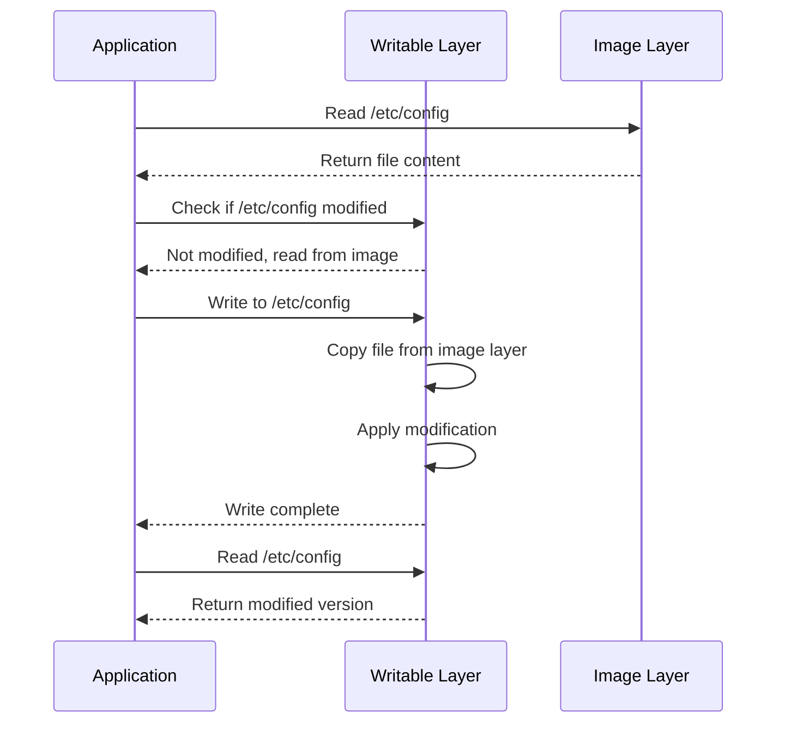

# Container Storage Overview

> **Module:** Storage Deep Dive | **Level:** Intermediate | **Time:** 30 minutes

## Learning Objectives

By the end of this section, you will be able to:

- Understand the complete storage architecture of containers
- Differentiate between storage types and their use cases
- Explain how storage drivers work
- Know where container data is stored on disk

---

## Storage Architecture

```mermaid
flowchart TB
    subgraph Container["Running Container"]
        WL[Writable Layer]
        IL[Image Layers<br>(read-only)]
        V[Volumes]
        BM[Bind Mounts]
        TM[tmpfs]
    end

    subgraph Host["Host System"]
        SD[Storage Driver<br>overlay2, btrfs]
        VD[Volume Directory<br>/var/lib/docker/volumes]
        HP[Host Path<br>Any directory]
        RAM[RAM]
    end

    WL --> SD
    IL --> SD
    V --> VD
    BM --> HP
    TM --> RAM
```

---

## Storage Types Comparison

| Type | Persistence | Managed By | Location | Best For |
|------|-------------|-----------|----------|----------|
| **Container Layer** | No (lost on rm) | Docker/Podman | Storage driver | Temporary data |
| **Named Volume** | Yes | Docker/Podman | Volume directory | Database, app data |
| **Bind Mount** | Yes | User | Any host path | Development, config |
| **tmpfs** | No (RAM only) | Kernel | Memory | Secrets, temp files |
| **Anonymous Volume** | Until rm -v | Docker/Podman | Volume directory | Temp persistence |

---

## The Container Writable Layer

Every running container has a writable layer on top of image layers:

```
┌─────────────────────────────────────────────┐
│ Container Writable Layer (thin, ephemeral)  │
├─────────────────────────────────────────────┤
│ Image Layer 3 (read-only)                   │
├─────────────────────────────────────────────┤
│ Image Layer 2 (read-only)                   │
├─────────────────────────────────────────────┤
│ Image Layer 1 (read-only)                   │
└─────────────────────────────────────────────┘
```

### How Copy-on-Write Works



**Key Points:**
- Reads go through layers from top to bottom
- First write copies file to writable layer
- Subsequent reads/writes use writable layer copy
- Original image layer unchanged

---

## Storage Drivers

Storage drivers handle layering mechanics:

### overlay2 (Default)

Modern, efficient driver using OverlayFS:

```bash
# Check current driver
docker info | grep "Storage Driver"
# Storage Driver: overlay2

# View overlay mounts
mount | grep overlay
```

**Characteristics:**
- Default for modern Linux kernels (3.18+)
- Efficient with many layers
- Two layers: lower (image) and upper (container)
- Excellent performance for most workloads

### btrfs

Uses Btrfs filesystem features:

```bash
# Enable btrfs driver (requires btrfs filesystem)
# /etc/docker/daemon.json
{
  "storage-driver": "btrfs"
}
```

**Characteristics:**
- Native copy-on-write filesystem
- Snapshot-based layers
- Good for write-heavy workloads
- Requires btrfs formatted storage

### zfs

Uses ZFS features:

```bash
# Enable zfs driver (requires ZFS)
{
  "storage-driver": "zfs"
}
```

**Characteristics:**
- Enterprise-grade features
- Built-in compression
- Deduplication support
- High memory usage

### vfs

Simple directory-based driver (no CoW):

```bash
{
  "storage-driver": "vfs"
}
```

**Characteristics:**
- No copy-on-write
- Each layer is full copy
- Very slow and space-inefficient
- Only for testing/special cases

---

## Storage Locations

### Docker Storage Locations

```bash
# Linux default
/var/lib/docker/
├── containers/          # Container metadata and logs
├── image/              # Image metadata
├── overlay2/           # Layer data (if using overlay2)
│   ├── l/              # Shortened layer IDs
│   └── <layer-id>/     # Each layer's data
├── volumes/            # Named volumes
│   └── <volume-name>/
│       └── _data/      # Actual data
├── network/            # Network configs
└── plugins/            # Plugin data

# Check Docker root directory
docker info | grep "Docker Root Dir"
```

### Podman Storage Locations

```bash
# Rootful
/var/lib/containers/storage/
├── overlay/             # Layer data
├── overlay-containers/  # Container data
├── overlay-images/      # Image metadata
└── volumes/             # Volumes

# Rootless
~/.local/share/containers/storage/
├── overlay/
├── overlay-containers/
├── overlay-images/
└── volumes/

# Check Podman storage config
podman info | grep -A10 store
```

---

## Configuring Storage Location

### Docker: Change Data Directory

```bash
# Stop Docker
sudo systemctl stop docker

# Create new directory
sudo mkdir -p /mnt/docker-data

# Configure Docker
sudo nano /etc/docker/daemon.json
```

```json
{
  "data-root": "/mnt/docker-data"
}
```

```bash
# Move existing data (optional)
sudo rsync -aP /var/lib/docker/ /mnt/docker-data/

# Start Docker
sudo systemctl start docker

# Verify
docker info | grep "Docker Root Dir"
```

### Podman: Change Storage Location

**Rootful:**
```bash
# /etc/containers/storage.conf
[storage]
driver = "overlay"
graphroot = "/mnt/containers/storage"
```

**Rootless:**
```bash
# ~/.config/containers/storage.conf
[storage]
driver = "overlay"
graphroot = "/mnt/user-containers/storage"
```

```bash
# Reset storage to apply changes
podman system reset

# Verify
podman info | grep graphRoot
```

---

## Checking Storage Usage

### Docker

```bash
# Overall disk usage
docker system df

# Output:
TYPE            TOTAL   ACTIVE  SIZE      RECLAIMABLE
Images          15      5       5.2GB     3.1GB (60%)
Containers      8       3       150MB     50MB (33%)
Local Volumes   10      4       2.1GB     1.5GB (71%)
Build Cache     20      0       1.5GB     1.5GB (100%)

# Detailed breakdown
docker system df -v

# Per-container usage
docker ps -s
```

### Podman

```bash
# System info
podman system df

# Detailed
podman system df -v

# Per-container
podman ps -s
```

---

## Storage Best Practices

### 1. Use Volumes for Persistent Data

```bash
# Good: Named volume
docker run -v mydata:/var/lib/mysql mysql

# Avoid: Container layer for important data
docker run mysql  # Data lost on container removal
```

### 2. Separate Storage for Heavy Workloads

```bash
# Use dedicated disk/partition for Docker
{
  "data-root": "/mnt/fast-ssd/docker"
}
```

### 3. Monitor Storage Usage

```bash
# Create monitoring script
#!/bin/bash
docker system df
echo "---"
df -h /var/lib/docker
```

### 4. Clean Up Regularly

```bash
# Remove unused data
docker system prune

# Include volumes (careful!)
docker system prune --volumes

# Remove dangling images only
docker image prune

# Remove stopped containers
docker container prune
```

### 5. Use Appropriate Storage Driver

| Workload | Recommended Driver |
|----------|-------------------|
| General purpose | overlay2 |
| Write-heavy databases | btrfs or direct volumes |
| High-memory systems | zfs |
| Testing only | vfs |

---

## Key Takeaways

1. **Container writable layers are ephemeral** - data lost when container removed
2. **Volumes are the recommended way** to persist data
3. **overlay2 is the default** and best storage driver for most use cases
4. **Storage location can be customized** for performance or capacity needs
5. **Regular cleanup is essential** to manage disk space
6. **Monitor storage usage** to prevent disk full issues

---

## What's Next

Learn about configuring custom storage directories for images and volumes.

Continue to: [02-custom-storage-locations.md](02-custom-storage-locations.md)

---

## Quick Quiz

1. What happens to the container writable layer when a container is removed?
   - [ ] It's preserved for the next container
   - [ ] It's backed up automatically
   - [x] It's deleted along with the container
   - [ ] It merges with the image

2. Which storage driver is the default for modern Docker installations?
   - [ ] btrfs
   - [x] overlay2
   - [ ] vfs
   - [ ] aufs

3. Where does Podman rootless store volumes by default?
   - [ ] /var/lib/podman/volumes
   - [x] ~/.local/share/containers/storage/volumes
   - [ ] /var/lib/containers/storage/volumes
   - [ ] /tmp/containers/volumes

4. What is copy-on-write (CoW)?
   - [ ] Duplicating files immediately on creation
   - [x] Only copying files when they are modified
   - [ ] Writing files to multiple locations
   - [ ] A backup mechanism

---

## Navigation

| Previous | Up | Next |
|----------|-----|------|
| - | [Course Overview](../course_overview.md) | [Custom Storage Locations](02-custom-storage-locations.md) |
