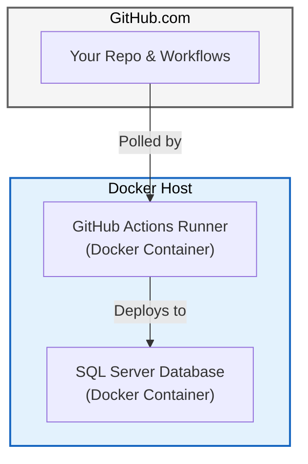
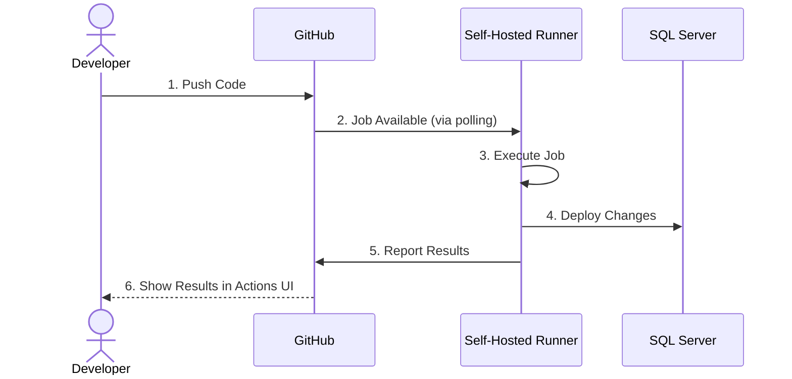

# Self-Hosted GitHub Actions Runners with Docker (Linux/WSL)

## Table of Contents

- [Introduction](#introduction)
- [Why Use Self-Hosted Runners?](#why-use-self-hosted-runners)
- [Architecture Overview](#architecture-overview)
- [Prerequisites](#prerequisites)
- [Part 1: Setup Docker Host](#part-1-setup-docker-host)
- [Part 2: Setup SQL Server](#part-2-setup-sql-server)
- [Part 3: Configure GitHub Runner](#part-3-configure-github-runner)
- [Part 4: Connect Runner to SQL Server](#part-4-connect-runner-to-sql-server)
- [Part 5: Update Workflows](#part-5-update-workflows)
- [Part 6: Test Your Setup](#part-6-test-your-setup)
- [Part 7: Advanced Configuration](#part-7-advanced-configuration)
- [Part 8: Hybrid Approach](#part-8-hybrid-approach)
- [Troubleshooting](#troubleshooting)
- [Comparison: Self-Hosted vs GitHub-Hosted](#comparison-self-hosted-vs-github-hosted)
- [Migration Path](#migration-path)
- [Maintenance and Operations](#maintenance-and-operations)
- [Security Considerations](#security-considerations)
- [Conclusion](#conclusion)
- [Appendix: Reference Information](#appendix-reference-information)

## Introduction

This guide teaches you how to set up **self-hosted GitHub Actions runners** running in Docker containers.

### Self-Hosted vs. GitHub-Hosted Runners

GitHub Actions offers two types of runners:

1. **GitHub-Hosted Runners**: Virtual machines managed by GitHub. They are clean, pre-installed with common software, and maintenance-free. However, they cannot access your local resources (like a local SQL Server) without complex networking.
2. **Self-Hosted Runners**: Machines that you manage. They offer full control over hardware and software.

For this course, we use **self-hosted runners** because they allow:

- **Direct Access to Local Resources**: The runner can talk directly to your local SQL Server container.
- **Cost Savings**: Unlimited minutes for learning without consuming your GitHub Actions quota.
- **Enterprise Simulation**: Mimics real-world scenarios where database servers are behind firewalls.

For more details, see the official [GitHub documentation on self-hosted runners](https://docs.github.com/en/actions/hosting-your-own-runners/managing-self-hosted-runners/about-self-hosted-runners).

### What You'll Build



## Why Use Self-Hosted Runners?

### Advantages

✅ **No Firewall Configuration**

- Direct access to local SQL Server
- No Azure SQL firewall rules needed
- Works with completely private databases

✅ **Zero GitHub Actions Minutes Used**

- Unlimited free runs
- No cost concerns
- Perfect for learning and testing

✅ **Faster Feedback Loops**

- No network latency to GitHub
- Direct localhost connections
- Instant deployment testing

✅ **Production-Like Environment**

- Learn self-hosted runner management
- Understand enterprise CI/CD patterns
- Prepare for on-premises deployments

✅ **Full Control**

- Install any tools you need
- Custom configurations
- Debug workflow issues locally

## Architecture Overview

### Components

### 1. Docker Host (Linux or WSL)

- Linux environment (RHEL, Ubuntu, or WSL)
- Runs Docker daemon
- Hosts runner and SQL Server containers

### 2. Docker

- Container runtime
- Isolates runner and database
- Easy cleanup and reset

### 3. GitHub Actions Runner Container

- Connects to GitHub.com
- Pulls workflow jobs
- Executes steps locally

### 4. SQL Server Container

- Local database instance
- Accessible to runner
- No internet exposure needed

### How It Works



**Key point:** The runner is **pulling** jobs from GitHub, not receiving incoming connections. This works through firewalls and NAT.

## Prerequisites

### Required Software

- ✅ **Docker Host OS**
  - **Linux**: Ubuntu 20.04+, RHEL 8+, or similar.
  - **Windows**: Windows 10/11 with WSL 2.
- ✅ **Docker Engine installed** (Docker Desktop or Engine)
- ✅ **Git installed**
- ✅ **GitHub account** with a repository
- ✅ **(RHEL Only) SELinux configuration**
  - Docker volumes need the `:z` flag (shared) or `:Z` flag (private) to be accessible.
  - This guide includes `:z` in examples to support both RHEL and Ubuntu.

### Check Your Setup

```bash
# Check Windows version (in PowerShell)
winver
# Should show version 2004 or higher

# Check WSL version
wsl --list --verbose
# Should show "VERSION 2" for your distro

# In WSL terminal:
# Check WSL is Ubuntu
cat /etc/os-release
# Should show Ubuntu

# Check you have internet
ping -c 3 google.com
```

### Install WSL 2 (If Not Already Installed)

**In PowerShell (as Administrator):**

```powershell
# Install WSL 2
wsl --install

# Restart computer

# After restart, set default version to WSL 2
wsl --set-default-version 2

# Install Ubuntu
wsl --install -d Ubuntu

# Launch Ubuntu and create your user
```

## Part 1: Setup Docker Host

### For Windows Users (WSL 2)

If you are on Windows, you must install WSL 2 first:

```powershell
# Install WSL 2
wsl --install
```

Then follow the Linux/Ubuntu steps inside your WSL terminal.

### Option A: Docker Desktop (Windows/Mac/Linux)

**Pros:** Simple installation, GUI management
**Cons:** Resource intensive, commercial licensing for large companies

**Steps:**

1. Download [Docker Desktop](https://www.docker.com/products/docker-desktop/)
2. Install Docker Desktop
3. In Docker Desktop settings:
   - ✅ Enable "Use the WSL 2 based engine" (if on Windows)
   - ✅ Enable integration with your distro
4. Restart Docker Desktop

**Verify:**

```bash
# In your terminal
docker --version
docker run hello-world
```

### Option B: Docker Engine (Linux / WSL)

**Best for:** RHEL, Ubuntu Server, or lightweight WSL setup

**Pros:** Lightweight, no extra software, free
**Cons:** Command-line only, manual setup

**Steps:**

```bash
# Update package list
sudo apt update

# Install prerequisites
sudo apt install -y \
    apt-transport-https \
    ca-certificates \
    curl \
    gnupg \
    lsb-release

# Add Docker's official GPG key
curl -fsSL https://download.docker.com/linux/ubuntu/gpg | sudo gpg --dearmor -o /usr/share/keyrings/docker-archive-keyring.gpg

# Add Docker repository
echo \
  "deb [arch=$(dpkg --print-architecture) signed-by=/usr/share/keyrings/docker-archive-keyring.gpg] https://download.docker.com/linux/ubuntu \
  $(lsb_release -cs) stable" | sudo tee /etc/apt/sources.list.d/docker.list > /dev/null

# Install Docker Engine
sudo apt update
sudo apt install -y docker-ce docker-ce-cli containerd.io docker-compose-plugin

# Start Docker service
sudo service docker start

# Add your user to docker group (avoid sudo)
sudo usermod -aG docker $USER

# Apply group membership (logout/login or use newgrp)
newgrp docker
```

#### For Red Hat Enterprise Linux (RHEL) / CentOS / Fedora

```bash
# Remove old versions
sudo dnf remove docker \
                  docker-client \
                  docker-client-latest \
                  docker-common \
                  docker-latest \
                  docker-latest-logrotate \
                  docker-logrotate \
                  docker-engine

# set up the repository
sudo dnf -y install dnf-plugins-core
sudo dnf config-manager --add-repo https://download.docker.com/linux/rhel/docker-ce.repo

# Install Docker Engine
sudo dnf install docker-ce docker-ce-cli containerd.io docker-compose-plugin

# Start Docker
sudo systemctl start docker
sudo systemctl enable docker

# Add user to docker group
sudo usermod -aG docker $USER
newgrp docker
```

### Configure Docker to Start on Boot (WSL Only)

For standard Linux (Ubuntu/RHEL), Docker starts automatically via systemd. For WSL, you may need a startup script:

```bash
# Create startup script
cat >> ~/.bashrc << 'EOF'

# Start Docker daemon if not running
if ! docker info > /dev/null 2>&1; then
    sudo service docker start > /dev/null 2>&1
fi
EOF

# Reload bash configuration
source ~/.bashrc
```

### Create Docker Network for Liquibase

```bash
# Create isolated network for runner and database
docker network create liquibase_tutorial

# Verify
docker network ls | grep liquibase
```

✅ **Checkpoint:** Docker is installed and working!

## Part 2: Setup SQL Server

### Option 1: SQL Server in Docker (Recommended)

**Best for:** Learning, clean setup, easy reset

```bash
# Pull SQL Server 2025 image
docker pull mcr.microsoft.com/mssql/server:2025-latest

# Run SQL Server container
docker run -d \
  --name sqlserver \
  --network liquibase_tutorial \
  -e "ACCEPT_EULA=Y" \
  -e "SA_PASSWORD=YourStrong!Passw0rd" \
  -e "MSSQL_PID=Developer" \
  -p 1433:1433 \
  -v sqlserver-data:/var/opt/mssql \
  mcr.microsoft.com/mssql/server:2025-latest

# Wait for SQL Server to start (30 seconds)
sleep 30

# Verify SQL Server is running
docker logs sqlserver | grep "SQL Server is now ready"

# Test connection
docker exec -it sqlserver /opt/mssql-tools/bin/sqlcmd \
  -S localhost -U sa -P 'YourStrong!Passw0rd' \
  -Q "SELECT @@VERSION"
```

**Expected output:** SQL Server version information

### Create Database for Tutorial

```bash
# Create database
docker exec -it sqlserver /opt/mssql-tools/bin/sqlcmd \
  -S localhost -U sa -P 'YourStrong!Passw0rd' \
  -Q "CREATE DATABASE liquibase_demo; SELECT name FROM sys.databases WHERE name = 'liquibase_demo';"
```

### Option 2: SQL Server on Windows Host (From WSL/Linux)

**Best for:** Already have SQL Server installed on a Windows host machine

**Connection from Docker Host:**

```bash
# Get Windows host IP (WSL specific command, for Linux use host IP)
export WINDOWS_HOST=$(ip route show | grep -i default | awk '{ print $3}')
echo "Windows host IP: $WINDOWS_HOST"

# Test connection (replace SA password)
docker run --rm mcr.microsoft.com/mssql-tools \
  /opt/mssql-tools/bin/sqlcmd \
  -S $WINDOWS_HOST -U sa -P 'YourPassword' \
  -Q "SELECT @@VERSION"
```

**Note:** Ensure SQL Server on Windows allows TCP/IP connections:

1. SQL Server Configuration Manager
2. SQL Server Network Configuration
3. Protocols for MSSQLSERVER
4. Enable TCP/IP
5. Restart SQL Server service

### Option 3: SQL Server Directly on Host (Linux)

**Best for:** Native Linux development (RHEL/Ubuntu)

```bash
# Add Microsoft repository
curl https://packages.microsoft.com/keys/microsoft.asc | sudo apt-key add -
curl https://packages.microsoft.com/config/ubuntu/$(lsb_release -rs)/prod.list | sudo tee /etc/apt/sources.list.d/msprod.list

# Install SQL Server
sudo apt update
sudo apt install -y mssql-server

# Configure SQL Server
sudo /opt/mssql/bin/mssql-conf setup
# Choose: Developer edition
# Accept EULA: Yes
# Set SA password

# Start SQL Server
sudo systemctl start mssql-server

# Verify
systemctl status mssql-server
```

✅ **Checkpoint:** SQL Server is running and accessible!

## Part 3: Configure GitHub Runner

> Runner Naming: The default runner name used throughout this tutorial is `liquibase-tutorial-runner`. You may choose any name. If you customize it, ensure you (a) set `RUNNER_NAME` when generating `runner.env.local`, (b) adjust the `container_name` in `docs/courses/liquibase/docker/docker-compose.yml`, and (c) pass `--runner <your-name>` to `verify-self-hosted-env.sh` (or rely on auto-detect if only one runner container exists). All commands using `docker exec` or `docker logs` should reference your chosen name.

### Step 3.1: Register Runner in GitHub

1. Go to your GitHub repository
1. Click **Settings** tab
1. In left sidebar: **Actions** → **Runners**
1. Click **New self-hosted runner** button
1. Select:
   - **Linux** (operating system)
   - **x64** (architecture)

**You'll see registration instructions. DON'T FOLLOW THEM YET.**

**Note:** This process uses a **runner registration token** (temporary, expires in 1 hour), not a Personal Access Token (PAT). PATs are used for Git operations and API access, not runner registration.

1. **Copy the registration token** shown (looks like: `AABBC...XYZ`)
   - ⚠️ **Important:** This token expires after 1 hour
   - You'll use it in the next step
   - If it expires, return here to generate a new token

### Step 3.2: Create Runner Configuration

#### Option 1: Use the interactive setup script (recommended)

```bash
# Run the setup script from the repository
bash docs/courses/liquibase/scripts/setup-github-runner-config.sh
```

The script will:

- Prompt you for your GitHub repository URL
- Automatically generate a registration token (if GitHub CLI is installed) or ask you to enter one from Step 3.1
- Ask for runner name, labels, and other settings (with sensible defaults)
- Create the configuration file at `/data/github-runner-config/runner.env`
- Display the configuration and next steps

**Note:** If you have GitHub CLI (`gh`) installed and authenticated, the script can automatically generate the registration token for you. To install GitHub CLI:

```bash
# Install GitHub CLI
sudo apt install gh

# Authenticate with GitHub
gh auth login
```

#### Option 2: Create configuration file manually

If you prefer to create the configuration manually:

```bash
# Create directory for runner configuration
mkdir -p /data/github-runner-config
cd /data/github-runner-config

# Create .env file with your details
cat > runner.env << 'EOF'
# GitHub Runner Configuration

# Your GitHub repository URL
REPO_URL=https://github.com/ORG_NAME/YOUR_REPO

# Registration token from GitHub (Step 3.1)
RUNNER_TOKEN=YOUR_REGISTRATION_TOKEN_HERE

# Runner name (appears in GitHub)
RUNNER_NAME=wsl-docker-runner

# Runner labels (comma-separated)
RUNNER_LABELS=self-hosted,linux,x64,wsl,docker

# Runner group (leave as default)
RUNNER_GROUP=default

# Runner work directory
RUNNER_WORKDIR=/tmp/github-runner
EOF

# Edit the file to add your actual values
nano runner.env
```

**Configuration values:**

- `REPO_URL` - Your GitHub repository URL
- `RUNNER_TOKEN` - Registration token from Step 3.1
- `RUNNER_NAME` - Appears in GitHub (default: wsl-docker-runner)
- `RUNNER_LABELS` - Labels for targeting workflows (default: self-hosted,linux,x64,wsl,docker)
- `RUNNER_GROUP` - Runner group (default: default)
- `RUNNER_WORKDIR` - Work directory inside container (default: /tmp/github-runner)

### Step 3.3: Run GitHub Actions Runner Container

#### Option A: Using Docker Compose (recommended)

The tutorial's docker-compose file includes a runner service. Simply enable it:

```bash
# Load environment variables
source /data/github-runner-config/runner.env

# Export variables for docker-compose
export RUNNER_NAME RUNNER_WORKDIR RUNNER_TOKEN REPO_URL RUNNER_LABELS RUNNER_GROUP

# Start the runner (SQL Server will start automatically if not running)
cd docs/courses/liquibase/docker
docker-compose --profile runner up -d github_runner

# Check status
docker-compose ps
```

#### Option B: Using docker run command

If you prefer to run the container directly:

```bash
# Load environment variables
source /data/github-runner-config/runner.env

# Run runner container
docker run -d \
  --name ${RUNNER_NAME:-liquibase-tutorial-runner} \
  --network liquibase_tutorial \
  --restart unless-stopped \
  -e RUNNER_NAME="${RUNNER_NAME}" \
  -e RUNNER_WORKDIR="${RUNNER_WORKDIR}" \
  -e RUNNER_TOKEN="${RUNNER_TOKEN}" \
  -e REPO_URL="${REPO_URL}" \
  -e RUNNER_LABELS="${RUNNER_LABELS}" \
  -e RUNNER_GROUP="${RUNNER_GROUP}" \
  -v /var/run/docker.sock:/var/run/docker.sock \
  -v ~/github-runner:/tmp/github-runner:z \
  myoung34/github-runner:latest
```

#### Verify runner started

```bash
# Wait for runner to register (10 seconds)
sleep 10

# Check runner logs
docker logs ${RUNNER_NAME:-liquibase-tutorial-runner}
```

**Expected output:**

```text
√ Connected to GitHub
√ Runner successfully added
√ Runner connection is good
```

### Step 3.4: Verify Runner in GitHub

1. Go back to GitHub: **Settings** → **Actions** → **Runners**
2. You should see your runner listed:
   - **Name:** linux-docker-runner
   - **Status:** 🟢 Idle (green dot)
   - **Labels:** self-hosted, linux, x64, docker

✅ **Checkpoint:** GitHub runner is connected and waiting for jobs!

## Part 4: Connect Runner to SQL Server

### Understanding Networking

Your runner and SQL Server are in the same Docker network (`liquibase_tutorial`). They can communicate using container names.

### Step 4.1: Test Connectivity from Runner

```bash
# Test SQL Server port 1433 connectivity from runner
docker exec ${RUNNER_NAME:-liquibase-tutorial-runner} timeout 3 bash -c 'cat < /dev/null > /dev/tcp/sqlserver/1433' \
  && echo "✓ Port 1433 is open" \
  || echo "✗ Port 1433 is not accessible"
```

**Expected:** Confirmation that port 1433 is open.

**Note:** This test uses Bash's built-in `/dev/tcp` feature, which requires no additional tools or packages.

✅ **Checkpoint:** Runner can reach SQL Server!

### Step 4.2: Automated Environment Verification

A comprehensive verification script is available to validate your entire setup automatically.

#### What the Script Checks

The `verify-self-hosted-env.sh` script performs the following validations:

1. **Docker Availability** - Confirms Docker daemon is accessible
2. **Network Existence** - Verifies `liquibase_tutorial` network exists
3. **Container Health** - Checks both `sqlserver` and your runner container (default `liquibase-tutorial-runner`) are running
4. **Runner Registration** - Scans logs for successful GitHub registration
5. **Configuration Files** - Validates `runner.env.local` exists with correct `REPO_URL`
6. **GitHub CLI Auth** - Confirms `gh` authentication status (if installed)
7. **Network Connectivity** - Tests ping and port connectivity between runner and SQL Server

#### Running the Verification Script

```bash
# Run from repository root
# Auto-detect runner name or specify explicitly
bash docs/courses/liquibase/scripts/verify-self-hosted-env.sh --runner liquibase-tutorial-runner
```

#### Understanding the Output

**Successful verification:**

```text
========================================
Self-Hosted Runner Environment Check
========================================

[PASS] Docker is available
[PASS] Network 'liquibase_tutorial' exists
[PASS] Container 'sqlserver' is running
[PASS] Container 'liquibase-tutorial-runner' is running
[PASS] Runner log shows successful registration
[PASS] REPO_URL present (https://github.com/your-org/your-repo)
[PASS] GitHub CLI authenticated as: your-username
[PASS] Ping from runner to sqlserver: successful
[PASS] Port 1433 accessible from runner

========================================
Summary: All critical checks passed (0 failures, 0 warnings)
Environment is healthy and ready for workflows.
========================================
```

**With warnings (non-critical):**

```text
[WARN] gh CLI not installed (skipping API runner check)
```

This warning indicates netcat isn't installed but doesn't prevent operation. You can install it following Step 4.3 instructions.

**With failures (critical):**

```text
[FAIL] Container 'liquibase-tutorial-runner' is not running
[FAIL] Runner log shows no successful registration
```

Failures require attention. Review the [Troubleshooting](#troubleshooting) section for solutions.

#### When to Run Verification

- **After initial setup** - Confirm everything is configured correctly
- **After Windows restart** - Ensure containers restarted properly
- **Before running workflows** - Validate environment is healthy
- **When troubleshooting** - Identify specific issues quickly
- **Periodically** - Catch configuration drift or token expiration

✅ **Best Practice:** Run verification after any environment changes or before critical workflow testing.

## Part 5: Update Workflows

### Step 5.1: Create or Update Secrets

Even though it's local, use secrets for best practices:

1. Go to GitHub: **Settings** → **Secrets and variables** → **Actions**
2. Click **New repository secret**

Add these secrets:

#### Secret 1: DB_USERNAME

```text
Name: LOCAL_DB_USERNAME
Value: sa
```

#### Secret 2: DB_PASSWORD

```text
Name: LOCAL_DB_PASSWORD
Value: YourStrong!Passw0rd
```

### Step 5.2: Create Workflow for Self-Hosted Runner

```bash
# In your repository directory
cd ~/your-repo-directory

# Create workflow directory if it doesn't exist
mkdir -p .github/workflows

# Create workflow file
cat > .github/workflows/deploy-local.yml << 'EOF'
name: Deploy to Local Database (Self-Hosted)

on:
  push:
    branches:
      - main
    paths:
      - 'database/**'
  workflow_dispatch:

jobs:
  deploy-local:
    name: Deploy to Local SQL Server
    runs-on: self-hosted  # Use your self-hosted runner

    steps:
      - name: Checkout code
        uses: actions/checkout@v4

      - name: Show pending changes
        run: |
          echo "Checking for pending database changes..."
          docker run --rm \
            --network liquibase_tutorial \
            -v ${{ github.workspace }}/database:/liquibase/changelog \
            liquibase:latest \
            --url="jdbc:sqlserver://sqlserver:1433;databaseName=liquibase_demo;encrypt=true;trustServerCertificate=true;loginTimeout=30" \
            --username="${{ secrets.LOCAL_DB_USERNAME }}" \
            --password="${{ secrets.LOCAL_DB_PASSWORD }}" \
            --changeLogFile=changelog/changelog.xml \
            status

      - name: Deploy changes
        run: |
          echo "Deploying to local SQL Server..."
          docker run --rm \
            --network liquibase_tutorial \
            -v ${{ github.workspace }}/database:/liquibase/changelog \
            liquibase:latest \
            --url="jdbc:sqlserver://sqlserver:1433;databaseName=liquibase_demo;encrypt=true;trustServerCertificate=true;loginTimeout=30" \
            --username="${{ secrets.LOCAL_DB_USERNAME }}" \
            --password="${{ secrets.LOCAL_DB_PASSWORD }}" \
            --changeLogFile=changelog/changelog.xml \
            update

      - name: Show deployment history
        run: |
          echo "Recent deployments:"
          docker run --rm \
            --network liquibase_tutorial \
            -v ${{ github.workspace }}/database:/liquibase/changelog \
            liquibase:latest \
            --url="jdbc:sqlserver://sqlserver:1433;databaseName=liquibase_demo;encrypt=true;trustServerCertificate=true;loginTimeout=30" \
            --username="${{ secrets.LOCAL_DB_USERNAME }}" \
            --password="${{ secrets.LOCAL_DB_PASSWORD }}" \
            --changeLogFile=changelog/changelog.xml \
            history --count=5

      - name: Deployment summary
        run: |
          echo "✅ Deployment completed successfully!"
          echo "Environment: Local (Docker)"
          echo "Triggered by: ${{ github.actor }}"
          echo "Commit: ${{ github.sha }}"
EOF
```

#### Optional: Using Labels to Target Specific Runners

You can filter runners by labels:

```yaml
jobs:
  deploy-local:
    # Match all these labels
    runs-on: [self-hosted, linux, x64, wsl, docker]
```

This ensures the job only runs on runners with all specified labels.

### Step 5.3: Commit and Push Workflow

```bash
# Add workflow file
git add .github/workflows/deploy-local.yml

# Commit
git commit -m "Add self-hosted runner workflow for local deployment"

# Push to GitHub
git push origin main
```

## Part 6: Test Your Setup

### Step 6.1: Watch Workflow Execute

1. Go to GitHub: **Actions** tab
2. You should see "Deploy to Local Database (Self-Hosted)" running
3. Click on the workflow run
4. Watch the steps execute in real-time

**You'll see:**

```text
Checkout code ✓
Set up Liquibase ✓
Verify connection ✓
Show pending changes ✓
Deploy changes ✓
Show deployment history ✓
Deployment summary ✓
```

### Step 6.2: Monitor Runner Locally

In WSL terminal:

```bash
# Watch runner logs in real-time
docker logs -f ${RUNNER_NAME:-liquibase-tutorial-runner}

# You'll see:
# - Job received from GitHub
# - Steps executing
# - Liquibase commands running
# - Job completed and reported back to GitHub
```

### Step 6.3: Verify Database Changes

```bash
# Connect to SQL Server
docker exec -it sqlserver /opt/mssql-tools/bin/sqlcmd \
  -S localhost -U sa -P 'YourStrong!Passw0rd'

# Check Liquibase tables were created
1> USE liquibase_demo;
2> SELECT * FROM DATABASECHANGELOG ORDER BY DATEEXECUTED DESC;
3> GO

# Check your application tables
1> SELECT name FROM sys.tables;
2> GO

# Exit sqlcmd
1> EXIT
```

### Step 6.4: Test Manual Trigger

1. Go to **Actions** tab
2. Click **Deploy to Local Database (Self-Hosted)** workflow
3. Click **Run workflow** button
4. Select branch: `main`
5. Click **Run workflow**

**Result:** Workflow runs immediately without code changes!

✅ **Checkpoint:** Complete CI/CD pipeline working locally!

## Part 7: Advanced Configuration

### Custom Runner Image with Pre-installed Tools

Create a custom runner image with Liquibase pre-installed:

```bash
# Create Dockerfile
mkdir -p ~/custom-runner
cd ~/custom-runner

cat > Dockerfile << 'EOF'
FROM myoung34/github-runner:latest

# Install Liquibase
USER root
RUN apt-get update && \
    apt-get install -y wget openjdk-11-jdk && \
    wget -O /tmp/liquibase.tar.gz https://github.com/liquibase/liquibase/releases/download/v4.32.0/liquibase-4.32.0.tar.gz && \
    mkdir /opt/liquibase && \
    tar -xzf /tmp/liquibase.tar.gz -C /opt/liquibase && \
    ln -s /opt/liquibase/liquibase /usr/local/bin/liquibase && \
    chmod +x /usr/local/bin/liquibase && \
    rm /tmp/liquibase.tar.gz

# Install SQL Server tools
RUN curl https://packages.microsoft.com/keys/microsoft.asc | apt-key add - && \
    curl https://packages.microsoft.com/config/ubuntu/20.04/prod.list > /etc/apt/sources.list.d/mssql-release.list && \
    apt-get update && \
    ACCEPT_EULA=Y apt-get install -y mssql-tools unixodbc-dev

ENV PATH="/opt/mssql-tools/bin:${PATH}"

USER runner
EOF

# Build custom image
docker build -t custom-github-runner:latest .

# Stop and remove existing runner
docker stop ${RUNNER_NAME:-liquibase-tutorial-runner}
docker rm ${RUNNER_NAME:-liquibase-tutorial-runner}

# Run with custom image
source /data/github-runner-config/runner.env
docker run -d \
  --name ${RUNNER_NAME:-liquibase-tutorial-runner} \
  --network liquibase_tutorial \
  --restart unless-stopped \
  -e RUNNER_NAME="${RUNNER_NAME}" \
  -e RUNNER_WORKDIR="${RUNNER_WORKDIR}" \
  -e RUNNER_TOKEN="${RUNNER_TOKEN}" \
  -e REPO_URL="${REPO_URL}" \
  -v /var/run/docker.sock:/var/run/docker.sock \
  -v ~/github-runner:/tmp/github-runner \
  custom-github-runner:latest
```

**Benefits:**

- Faster workflow execution (no tool installation)
- Consistent environment
- Custom configurations

### Multiple Runners

Run multiple runners for parallel jobs:

```bash
# Runner 1 (already running)
docker ps | grep github-runner

# Runner 2
docker run -d \
  --name github-runner-2 \
  --network liquibase_tutorial \
  --restart unless-stopped \
  -e RUNNER_NAME="wsl-docker-runner-2" \
  -e RUNNER_WORKDIR="/tmp/github-runner-2" \
  -e RUNNER_TOKEN="NEW_TOKEN_HERE" \
  -e REPO_URL="${REPO_URL}" \
  -v /var/run/docker.sock:/var/run/docker.sock \
  -v ~/github-runner-2:/tmp/github-runner-2 \
  myoung34/github-runner:latest
```

**Use case:** Run tests in parallel with deployments

### Runner Startup Script

Create a script to start all containers:

```bash
cat > ~/start-liquibase-env.sh << 'EOF'
#!/bin/bash
set -e

echo "Starting Liquibase CI/CD environment..."

# Start SQL Server if not running
if ! docker ps | grep -q sqlserver; then
    echo "Starting SQL Server..."
    docker start sqlserver || docker run -d \
      --name sqlserver \
      --network liquibase_tutorial \
      -e "ACCEPT_EULA=Y" \
      -e "SA_PASSWORD=YourStrong!Passw0rd" \
      -e "MSSQL_PID=Developer" \
      -p 1433:1433 \
      -v sqlserver-data:/var/opt/mssql \
      mcr.microsoft.com/mssql/server:2025-latest
fi

# Wait for SQL Server
sleep 10

# Start GitHub runner if not running
if ! docker ps | grep -q github-runner; then
    echo "Starting GitHub Actions runner..."
    source /data/github-runner-config/runner.env
    docker start github-runner || docker run -d \
      --name github-runner \
      --network liquibase_tutorial \
      --restart unless-stopped \
      -e RUNNER_NAME="${RUNNER_NAME}" \
      -e RUNNER_WORKDIR="${RUNNER_WORKDIR}" \
      -e RUNNER_TOKEN="${RUNNER_TOKEN}" \
      -e REPO_URL="${REPO_URL}" \
      -v /var/run/docker.sock:/var/run/docker.sock \
      -v ~/github-runner:/tmp/github-runner \
      myoung34/github-runner:latest
fi

echo "✅ Environment ready!"
echo ""
echo "SQL Server: localhost:1433"
echo "Runner status: Check GitHub Settings → Actions → Runners"
echo ""
echo "Stop with: docker stop github-runner sqlserver"
EOF

chmod +x ~/start-liquibase-env.sh

# Run it
~/start-liquibase-env.sh
```

### Shutdown Script

```bash
cat > ~/stop-liquibase-env.sh << 'EOF'
#!/bin/bash

echo "Stopping Liquibase CI/CD environment..."

docker stop github-runner sqlserver 2>/dev/null || true

echo "✅ Environment stopped"
echo "Restart with: ~/start-liquibase-env.sh"
EOF

chmod +x ~/stop-liquibase-env.sh
```

## Part 8: Hybrid Approach

Use self-hosted for development, GitHub-hosted for staging/production:

```yaml
# .github/workflows/deploy-hybrid.yml
name: Hybrid Deployment Pipeline

on:
  push:
    branches:
      - main
    paths:
      - 'database/**'
  workflow_dispatch:

jobs:
  # Local development - self-hosted
  deploy-dev-local:
    name: Deploy to Development (Local)
    runs-on: self-hosted
    environment: development

    steps:
      - uses: actions/checkout@v4
      - uses: liquibase/setup-liquibase@v2
        with:
          version: '4.32.0'

      - name: Deploy to local SQL Server
        run: |
          liquibase update \
            --changelog-file=database/changelog/changelog.xml \
            --url="${{ secrets.LOCAL_DB_URL }}" \
            --username="${{ secrets.LOCAL_DB_USERNAME }}" \
            --password="${{ secrets.LOCAL_DB_PASSWORD }}"

  # Cloud staging - GitHub-hosted
  deploy-staging-cloud:
    name: Deploy to Staging (Azure SQL)
    runs-on: ubuntu-latest
    needs: deploy-dev-local
    environment: staging

    steps:
      - uses: actions/checkout@v4
      - uses: liquibase/setup-liquibase@v2
        with:
          version: '4.32.0'

      - name: Deploy to Azure SQL
        run: |
          liquibase update \
            --changelog-file=database/changelog/changelog.xml \
            --url="${{ secrets.AZURE_STAGE_DB_URL }}" \
            --username="${{ secrets.AZURE_STAGE_DB_USERNAME }}" \
            --password="${{ secrets.AZURE_STAGE_DB_PASSWORD }}"

  # Cloud production - GitHub-hosted
  deploy-production-cloud:
    name: Deploy to Production (Azure SQL)
    runs-on: ubuntu-latest
    needs: deploy-staging-cloud
    environment: production

    steps:
      - uses: actions/checkout@v4
      - uses: liquibase/setup-liquibase@v2
        with:
          version: '4.32.0'

      - name: Deploy to production
        run: |
          liquibase update \
            --changelog-file=database/changelog/changelog.xml \
            --url="${{ secrets.AZURE_PROD_DB_URL }}" \
            --username="${{ secrets.AZURE_PROD_DB_USERNAME }}" \
            --password="${{ secrets.AZURE_PROD_DB_PASSWORD }}"
```

**Benefits of hybrid:**

- Fast local development (self-hosted)
- Production-like cloud testing (GitHub-hosted)
- Learn both approaches
- Optimize costs

## Troubleshooting

### Runner Not Appearing in GitHub

**Symptom:** No runner shows up in Settings → Actions → Runners

**Solutions:**

```bash
# Check runner logs
docker logs github-runner

# Look for errors like:
# - "Failed to connect to GitHub"
# - "Invalid token"
# - "Repository not found"

# If token expired, get new token:
# 1. GitHub → Settings → Actions → Runners → New runner
# 2. Copy new token
# 3. Update runner.env
# 4. Recreate container:

docker stop github-runner
docker rm github-runner

source /data/github-runner-config/runner.env
docker run -d \
  --name github-runner \
  --network liquibase-network \
  --restart unless-stopped \
  -e RUNNER_NAME="${RUNNER_NAME}" \
  -e RUNNER_WORKDIR="${RUNNER_WORKDIR}" \
  -e RUNNER_TOKEN="${RUNNER_TOKEN}" \
  -e REPO_URL="${REPO_URL}" \
  -v /var/run/docker.sock:/var/run/docker.sock \
  -v ~/github-runner:/tmp/github-runner \
  myoung34/github-runner:latest
```

### Workflow Doesn't Run on Self-Hosted Runner

**Symptom:** Workflow queued forever or runs on GitHub-hosted runner

**Check:**

```yaml
# Verify workflow specifies self-hosted
jobs:
  my-job:
    runs-on: self-hosted  # Must be present

# If using labels:
jobs:
  my-job:
    runs-on: [self-hosted, linux]
```

**Verify runner labels match:**

1. GitHub → Settings → Actions → Runners
2. Click your runner name
3. Check labels match workflow

### SQL Server Connection Failed

**Symptom:** "Cannot open server" or "Login timeout"

**Diagnose:**

```bash
# 1. Check SQL Server is running
docker ps | grep sqlserver

# 2. Check containers are on same network
docker inspect github-runner | grep -A 10 Networks
docker inspect sqlserver | grep -A 10 Networks
# Should both show "liquibase_tutorial"

# 3. Test SQL Server port
docker exec github-runner timeout 3 bash -c 'cat < /dev/null > /dev/tcp/sqlserver/1433' \
  && echo "Port 1433 is open" \
  || echo "Port 1433 is not accessible"

# 4. Check SQL Server logs
docker logs sqlserver | tail -20

# 5. Verify SQL Server is ready
docker exec sqlserver /opt/mssql-tools/bin/sqlcmd \
  -S localhost -U sa -P 'YourStrong!Passw0rd' \
  -Q "SELECT @@VERSION"
```

**Fix network issue:**

```bash
# Reconnect runner to network
docker network disconnect liquibase_tutorial github-runner
docker network connect liquibase_tutorial github-runner

# Restart runner
docker restart github-runner
```

### Liquibase Command Not Found

**Symptom:** "liquibase: command not found" in workflow

#### Solution 1: Ensure setup step runs

```yaml
steps:
  - uses: actions/checkout@v4

  # This step MUST be present
  - uses: liquibase/setup-liquibase@v2
    with:
      version: '4.32.0'

  # Then liquibase commands work
  - run: liquibase --version
```

#### Solution 2: Use custom runner image (Part 7)

### Docker Permission Denied

**Symptom:** "permission denied while trying to connect to the Docker daemon socket"

**Solution:**

```bash
# Add user to docker group
sudo usermod -aG docker $USER

# Apply group membership
newgrp docker

# Verify
docker ps
```

### Docker Service Not Starting

**Symptom:** "Cannot connect to the Docker daemon"

**Solutions:**

```bash
# Start Docker service
sudo service docker start

# Check status
sudo service docker status

# If fails, check logs
sudo journalctl -u docker

# Reinstall Docker if corrupted (nuclear option)
sudo apt remove docker docker-engine docker.io containerd runc
# Then follow Part 1 installation steps again
```

### Runner Offline After Windows Restart

**Symptom:** Runner shows offline in GitHub after rebooting Windows

**Solution:**

```bash
# Linux services don't always auto-start on WSL
# Start manually:
sudo service docker start
docker start sqlserver
docker start github-runner

# OR use startup script from Part 7
~/start-liquibase-env.sh

# OR set auto-start in .bashrc (already done in Part 1)
```

### High Memory/CPU Usage

**Symptom:** Windows slow, high resource usage

**Check:**

```bash
# See resource usage
docker stats

# Limit container resources:
docker stop github-runner sqlserver
docker rm github-runner sqlserver

# Recreate with limits
docker run -d \
  --name sqlserver \
  --network liquibase_tutorial \
  --memory="2g" \
  --cpus="2" \
  -e "ACCEPT_EULA=Y" \
  -e "SA_PASSWORD=YourStrong!Passw0rd" \
  -e "MSSQL_PID=Developer" \
  -p 1433:1433 \
  mcr.microsoft.com/mssql/server:2025-latest

# Runner usually doesn't need limits (only active during jobs)
```

## Comparison: Self-Hosted vs GitHub-Hosted

| Feature | Self-Hosted (This Guide) | GitHub-Hosted |
|---------|-------------------------|---------------|
| **Cost** | ✅ Free, unlimited | ⚠️ 2,000 min/month free |
| **Setup Time** | ⚠️ 2-3 hours | ✅ 0 minutes |
| **Maintenance** | ⚠️ You maintain | ✅ GitHub maintains |
| **Database Access** | ✅ Direct, no firewall | ❌ Firewall rules needed |
| **Speed** | ✅ Localhost speed | ⚠️ Internet latency |
| **Learning Value** | ✅ Learn self-hosted | ⚠️ Limited to GitHub |
| **Security** | ⚠️ Your responsibility | ✅ GitHub's responsibility |
| **Persistence** | ✅ Keeps working | ✅ Always available |
| **Windows Restart** | ⚠️ Manual restart | ✅ N/A |
| **Production Ready** | ✅ Yes (enterprise) | ✅ Yes (cloud) |

## Migration Path

### Week 1: Learn Locally (Self-Hosted)

```yaml
# Use self-hosted for everything
jobs:
  deploy:
    runs-on: self-hosted
```

**Benefits:**

- Fast iteration
- No costs
- Learn GitHub Actions

### Week 2: Add Cloud Database (Hybrid)

```yaml
jobs:
  deploy-local:
    runs-on: self-hosted

  deploy-cloud:
    needs: deploy-local
    runs-on: ubuntu-latest
```

**Benefits:**

- Keep fast local development
- Add cloud testing
- Learn firewall configuration

### Week 3: Full Cloud (GitHub-Hosted)

```yaml
jobs:
  deploy:
    runs-on: ubuntu-latest
```

**Benefits:**

- Production-like
- No maintenance
- Team can use

### Enterprise: Keep Self-Hosted

```yaml
jobs:
  deploy:
    runs-on: [self-hosted, production]
```

**Benefits:**

- Private databases
- Compliance requirements
- Custom tooling

## Maintenance and Operations

### Daily Operations

**Start environment:**

```bash
~/start-liquibase-env.sh
```

**Check status:**

```bash
docker ps
# Should show: github-runner (Up), sqlserver (Up)

# Check runner in GitHub
# Settings → Actions → Runners → should show green dot
```

**Stop environment:**

```bash
~/stop-liquibase-env.sh
```

### Weekly Maintenance

```bash
# Update runner image
docker pull myoung34/github-runner:latest
docker stop github-runner
docker rm github-runner
# Recreate with new image (use commands from Part 3)

# Update SQL Server
docker pull mcr.microsoft.com/mssql/server:2025-latest
# Backup database first if needed
docker stop sqlserver
docker rm sqlserver
# Recreate (data persists in volume)
```

### Backup SQL Server Data

```bash
# Backup SQL Server volume
docker run --rm \
  -v sqlserver-data:/source \
  -v ~/backups:/backup \
  ubuntu tar czf /backup/sqlserver-backup-$(date +%Y%m%d).tar.gz /source

# Restore backup
docker run --rm \
  -v sqlserver-data:/target \
  -v ~/backups:/backup \
  ubuntu tar xzf /backup/sqlserver-backup-YYYYMMDD.tar.gz -C /
```

### Clean Up Old Workflow Runs

```bash
# GitHub auto-deletes after 90 days
# Manual cleanup in runner:
docker exec github-runner find /tmp/github-runner -type d -mtime +30 -exec rm -rf {} +
```

## Security Considerations

### Advantages of Local Setup

✅ **Database Never Exposed to Internet**

- No public IP
- No firewall rules
- No attack surface

✅ **Secrets Only Used Locally**

- GitHub secrets stay in GitHub
- Runner pulls secrets, doesn't expose them
- Even if compromised, only local access

✅ **Isolated Environment**

- Containers are isolated
- Easy to reset/rebuild
- No impact on production

### Security Best Practices

#### 1. Use Strong Passwords

```bash
# Generate strong password
openssl rand -base64 24

# Use in SA_PASSWORD
-e "SA_PASSWORD=$(openssl rand -base64 24)"
```

#### 2. Rotate Runner Tokens

```bash
# Every 30 days, regenerate:
# 1. GitHub → Settings → Actions → Runners
# 2. Remove old runner
# 3. Add new runner (get new token)
# 4. Update runner.env
# 5. Recreate container
```

#### 3. Keep Docker Updated

```bash
# Update Docker
sudo apt update
sudo apt upgrade docker-ce docker-ce-cli containerd.io

# Update images
docker pull myoung34/github-runner:latest
docker pull mcr.microsoft.com/mssql/server:2025-latest
```

#### 4. Don't Share Secrets

- Never commit `runner.env` to Git
- Don't share screenshots with tokens visible
- Use GitHub Secrets for sensitive data

#### 5. Monitor Runner Activity

```bash
# Watch logs for suspicious activity
docker logs -f github-runner

# Check what workflows ran
# GitHub → Actions → View workflow history
```

## Conclusion

Congratulations! You've set up a complete local CI/CD environment with:

✅ **GitHub Actions runner** in Docker (Linux/WSL)
✅ **SQL Server** accessible to runner
✅ **Automated deployments** via GitHub workflows
✅ **Production-like environment** for learning
✅ **Zero cost** unlimited runs

### What You've Learned

1. **Self-hosted runners** - How they work and when to use them
2. **Docker networking** - Container communication
3. **Linux/WSL integration** - Development environment setup
4. **CI/CD patterns** - Local → Cloud migration
5. **Troubleshooting** - Common issues and solutions

### Next Steps

**Continue Learning:**

1. Follow the main tutorial: [Part 3: CI/CD Automation](./series-part3-cicd.md)
2. Add cloud staging environment (hybrid approach)
3. Implement advanced workflows from the [GitHub Actions Best Practices Guide](../../../../best-practices/liquibase/github-actions.md)

**For Production:**

1. Move to GitHub-hosted runners for cloud databases
2. Or scale self-hosted runners for enterprise
3. Add monitoring and alerting
4. Implement security hardening

### Resources

**Official Documentation:**

- [GitHub Self-Hosted Runners](https://docs.github.com/en/actions/hosting-your-own-runners)
- [Docker Documentation](https://docs.docker.com/)
- [WSL Documentation](https://learn.microsoft.com/en-us/windows/wsl/)
- [SQL Server on Docker](https://hub.docker.com/_/microsoft-mssql-server)

**Community Resources:**

- [myoung34/github-runner](https://github.com/myoung34/docker-github-actions-runner) - Runner Docker image
- [Liquibase Forum](https://forum.liquibase.org/)
- [GitHub Community](https://github.com/orgs/community/discussions)

### Feedback and Support

If you encounter issues with this guide:

1. Check the [Troubleshooting](#troubleshooting) section
2. Review Docker and runner logs
3. Search GitHub Community discussions
4. Check the main tutorial's troubleshooting section

## Appendix: Reference Information

### SQL Server Connection Strings

**Docker SQL Server (most common):**

```text
jdbc:sqlserver://sqlserver:1433;databaseName=liquibase_demo;encrypt=true;trustServerCertificate=true;loginTimeout=30
```

**Windows Host SQL Server:**

```bash
# Get Windows host IP from runner
docker exec github-runner sh -c "ip route show | grep -i default | awk '{ print \$3}'"
# Example output: 172.28.160.1

# Connection string:
jdbc:sqlserver://172.28.160.1:1433;databaseName=liquibase_demo;encrypt=true;trustServerCertificate=true;loginTimeout=30
```

**Connection string components:**

- `sqlserver` or `<IP>` - Host (use container name or IP address)
- `1433` - Default SQL Server port
- `liquibase_demo` - Database name
- `encrypt=true` - Enables encryption (required for SQL Server 2022+)
- `trustServerCertificate=true` - Accepts self-signed certificates
- `loginTimeout=30` - Connection timeout in seconds

### Testing SQL Server Connection Manually

If you want to verify SQL Server authentication before running workflows:

```bash
# Install sqlcmd in runner container
docker exec -u root github-runner bash -c "
  curl https://packages.microsoft.com/keys/microsoft.asc | apt-key add -
  curl https://packages.microsoft.com/config/ubuntu/20.04/prod.list > /etc/apt/sources.list.d/mssql-release.list
  apt-get update
  ACCEPT_EULA=Y apt-get install -y mssql-tools unixodbc-dev
"

# Test connection
docker exec github-runner /opt/mssql-tools/bin/sqlcmd \
  -S sqlserver -U sa -P 'YourStrong!Passw0rd' \
  -Q "SELECT @@VERSION"
```

**Expected output:** SQL Server version information

### Alternative: Using GitHub Action Instead of Docker

If you prefer using the Liquibase GitHub Action instead of the Docker container:

```yaml
steps:
  - name: Checkout code
    uses: actions/checkout@v4

  - name: Set up Liquibase
    uses: liquibase/setup-liquibase@v2
    with:
      version: '4.32.0'
      edition: 'oss'

  - name: Deploy changes
    run: |
      liquibase update \
        --changelog-file=database/changelog/changelog.xml \
        --url="jdbc:sqlserver://sqlserver:1433;databaseName=liquibase_demo;encrypt=true;trustServerCertificate=true" \
        --username="${{ secrets.LOCAL_DB_USERNAME }}" \
        --password="${{ secrets.LOCAL_DB_PASSWORD }}"
```

**Pros:** Simpler syntax, GitHub manages Liquibase installation
**Cons:** Less control, doesn't match local development workflow

---

**Document Version:** 1.0
**Last Updated:** November 20, 2025
**Author:** Database DevOps Team
**Related Tutorials:** [README.md](./README.md) for complete series

**Happy automating!** 🚀
