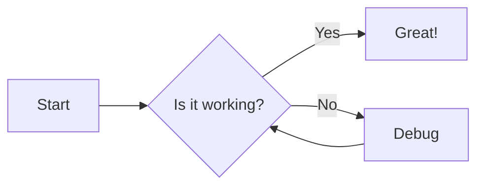
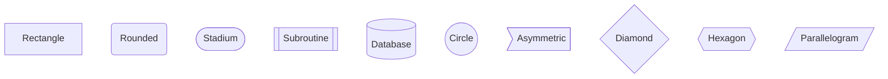
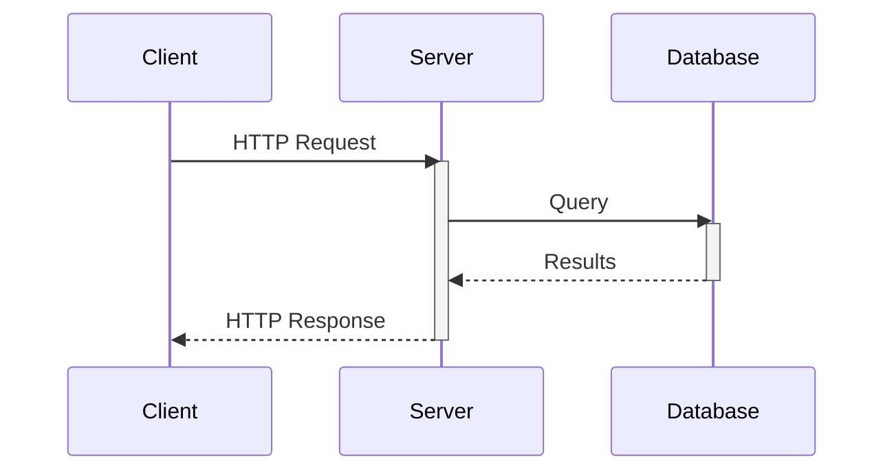
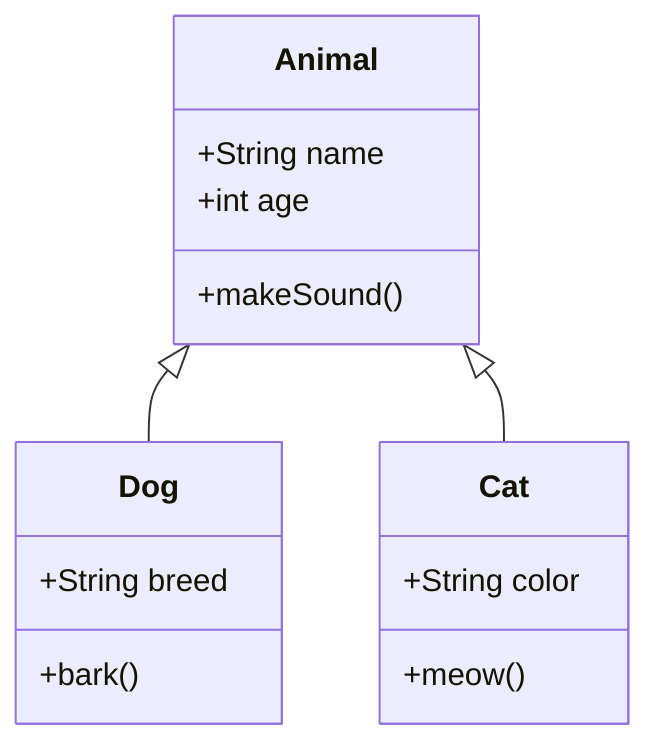
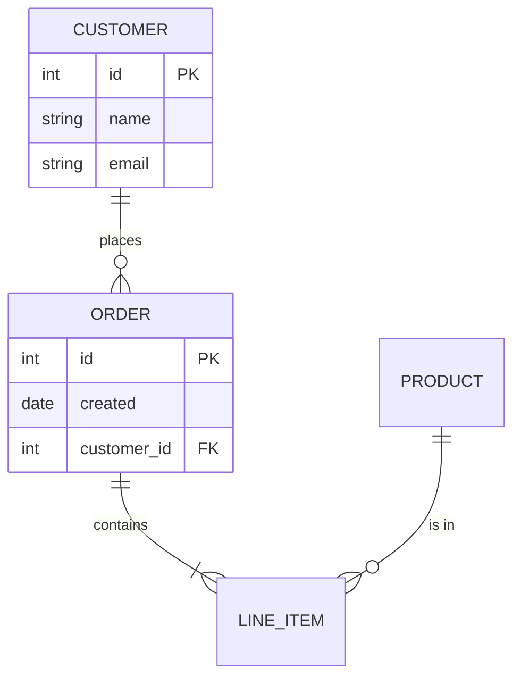
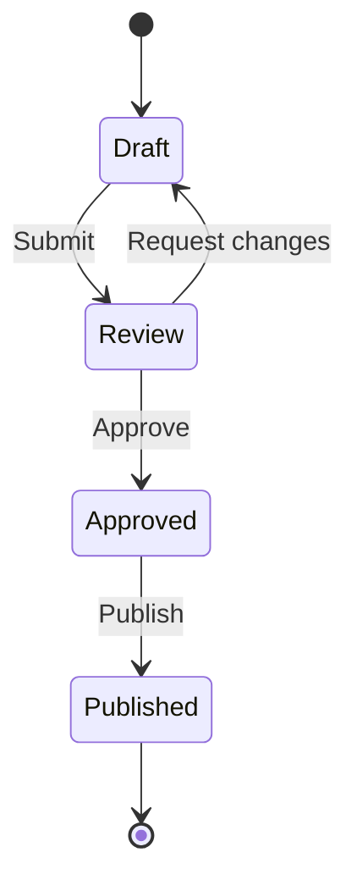
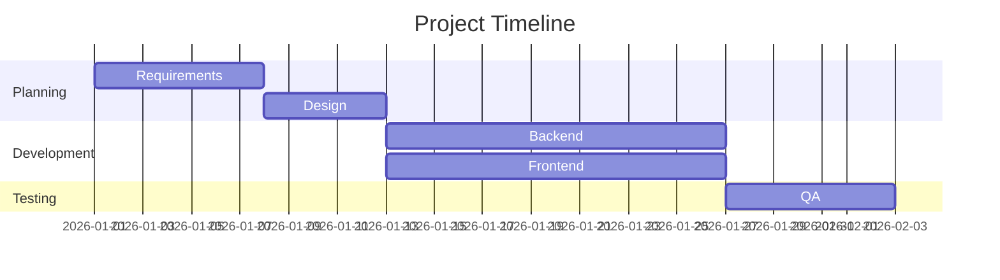
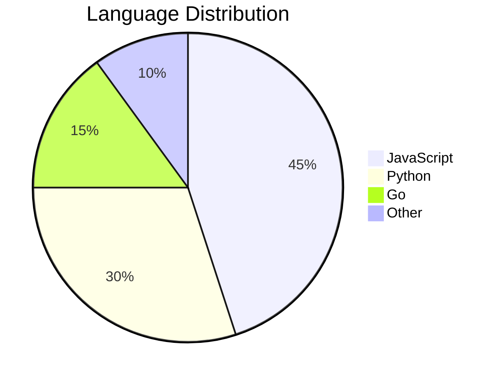
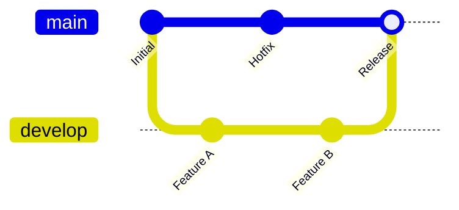
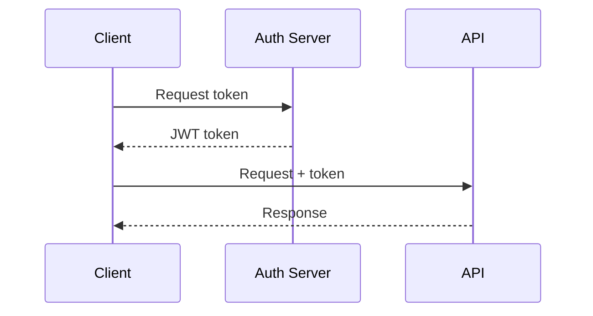

# Part 3: Advanced techniques

**[← Back to Course Index](../README.md)**

> **Document Version:** 1.0
> **Last Updated:** January 22, 2026
> **Maintainers:** Application Infrastructure Team
> **Status:** Production


> [!IMPORTANT]
> **Related Docs:** [Part 2: Intermediate](./series-part2-intermediate.md) | [Quick Reference](../quick-reference.md) | [Glossary](../glossary.md)

## Table of contents

- [Introduction](#introduction)
- [Mermaid diagrams](#mermaid-diagrams)
- [Mathematical equations](#mathematical-equations)
- [Document conversion with Pandoc](#document-conversion-with-pandoc)
- [Front matter and metadata](#front-matter-and-metadata)
- [Documentation frameworks](#documentation-frameworks)
- [Markdown linting](#markdown-linting)
- [Advanced automation](#advanced-automation)
- [Accessibility considerations](#accessibility-considerations)
- [Putting it together: Documentation site](#putting-it-together-documentation-site)
- [Practice exercises](#practice-exercises)
- [Summary](#summary)
- [Additional resources](#additional-resources)

---

## Introduction

Part 3 covers advanced Markdown features and professional workflows. You'll learn to create diagrams, write mathematical equations, convert between formats, and build documentation sites.

### What you'll learn

- Creating diagrams with Mermaid
- Writing math equations with LaTeX/KaTeX
- Converting documents with Pandoc
- Using front matter for metadata
- Building documentation sites
- Linting and automation

### Prerequisites

- Completion of Parts 1 and 2
- Command line familiarity
- Git basics (for some sections)

[↑ Back to Table of Contents](#table-of-contents)

---

## Mermaid diagrams

Mermaid lets you create diagrams from text descriptions. GitHub, GitLab, and many documentation tools support it natively.

### Flowcharts

````markdown

````

**Result:**


### Flowchart directions

| Direction | Meaning |
|-----------|---------|
| `TB` or `TD` | Top to bottom |
| `BT` | Bottom to top |
| `LR` | Left to right |
| `RL` | Right to left |

### Node shapes

````markdown

````

### Sequence diagrams

Show interactions between components:

````markdown

````

**Result:**


### Sequence diagram arrow types

| Arrow | Meaning |
|-------|---------|
| `->` | Solid line |
| `-->` | Dotted line |
| `->>` | Solid with arrowhead |
| `-->>` | Dotted with arrowhead |
| `-x` | Solid with cross |
| `--x` | Dotted with cross |

### Class diagrams

````markdown

````

**Result:**


### Entity relationship diagrams

````markdown

````

**Result:**


### State diagrams

````markdown

````

**Result:**


### Gantt charts

````markdown

````

**Result:**


### Pie charts

````markdown

````

**Result:**


### Git graphs

````markdown

````

**Result:**


### Mermaid best practices

1. **Keep diagrams simple** - complex diagrams are hard to read
2. **Use meaningful labels** - avoid single letters except for temporary nodes
3. **Choose the right diagram type** - match the information you're conveying
4. **Test on target platform** - GitHub has some limitations

> [!NOTE]
> Mermaid documentation: [mermaid.js.org](https://mermaid.js.org/)

[↑ Back to Table of Contents](#table-of-contents)

---

## Mathematical equations

Many platforms support LaTeX-style math notation using KaTeX or MathJax.

### Inline math

Use single dollar signs for inline equations:

```markdown
The famous equation $E = mc^2$ changed physics forever.

The quadratic formula is $x = \frac{-b \pm \sqrt{b^2-4ac}}{2a}$.
```

**Result:**

The famous equation $E = mc^2$ changed physics forever.

The quadratic formula is $x = \frac{-b \pm \sqrt{b^2-4ac}}{2a}$.

### Block math

Use double dollar signs for display equations:

```markdown
$$
\sum_{i=1}^{n} x_i = x_1 + x_2 + \cdots + x_n
$$
```

**Result:**

$$
\sum_{i=1}^{n} x_i = x_1 + x_2 + \cdots + x_n
$$

### Common math notation

#### Greek letters

| Symbol | Code | Symbol | Code |
|--------|------|--------|------|
| $\alpha$ | `\alpha` | $\beta$ | `\beta` |
| $\gamma$ | `\gamma` | $\delta$ | `\delta` |
| $\epsilon$ | `\epsilon` | $\theta$ | `\theta` |
| $\lambda$ | `\lambda` | $\mu$ | `\mu` |
| $\pi$ | `\pi` | $\sigma$ | `\sigma` |
| $\omega$ | `\omega` | $\Omega$ | `\Omega` |

#### Operators and symbols

| Symbol | Code | Description |
|--------|------|-------------|
| $\times$ | `\times` | Multiplication |
| $\div$ | `\div` | Division |
| $\pm$ | `\pm` | Plus or minus |
| $\neq$ | `\neq` | Not equal |
| $\leq$ | `\leq` | Less than or equal |
| $\geq$ | `\geq` | Greater than or equal |
| $\approx$ | `\approx` | Approximately |
| $\infty$ | `\infty` | Infinity |
| $\partial$ | `\partial` | Partial derivative |
| $\nabla$ | `\nabla` | Nabla/gradient |

#### Fractions and roots

```markdown
$\frac{a}{b}$           Fraction
$\sqrt{x}$              Square root
$\sqrt[n]{x}$           nth root
$x^{n}$                 Superscript
$x_{n}$                 Subscript
$x^{a}_{b}$             Combined
```

#### Sums, products, and integrals

```markdown
$$
\sum_{i=1}^{n} i = \frac{n(n+1)}{2}
$$

$$
\prod_{i=1}^{n} i = n!
$$

$$
\int_{a}^{b} f(x) \, dx
$$
```

**Results:**

$$
\sum_{i=1}^{n} i = \frac{n(n+1)}{2}
$$

$$
\prod_{i=1}^{n} i = n!
$$

$$
\int_{a}^{b} f(x) \, dx
$$

#### Matrices

```markdown
$$
\begin{pmatrix}
a & b \\
c & d
\end{pmatrix}
$$

$$
\begin{bmatrix}
1 & 2 & 3 \\
4 & 5 & 6
\end{bmatrix}
$$
```

**Results:**

$$
\begin{pmatrix}
a & b \\
c & d
\end{pmatrix}
$$

$$
\begin{bmatrix}
1 & 2 & 3 \\
4 & 5 & 6
\end{bmatrix}
$$

### Math in documentation

```markdown
## Algorithm complexity

The algorithm has time complexity $O(n \log n)$ and space complexity $O(n)$.

## Formula

The distance between two points is:

$$
d = \sqrt{(x_2 - x_1)^2 + (y_2 - y_1)^2}
$$
```

> [!NOTE]
> Math support varies by platform. GitHub supports it in Markdown files. Check your target platform's documentation.

[↑ Back to Table of Contents](#table-of-contents)

---

## Document conversion with Pandoc

Pandoc is the "Swiss Army knife" of document conversion.

### Installing Pandoc

```bash
# macOS
brew install pandoc

# Ubuntu/Debian
sudo apt install pandoc

# Windows
choco install pandoc
# or download from pandoc.org
```

### Basic conversion

```bash
# Markdown to HTML
pandoc input.md -o output.html

# Markdown to PDF (requires LaTeX)
pandoc input.md -o output.pdf

# Markdown to Word
pandoc input.md -o output.docx

# Word to Markdown
pandoc input.docx -o output.md
```

### Common conversions

| From | To | Command |
|------|-----|---------|
| Markdown | HTML | `pandoc file.md -o file.html` |
| Markdown | PDF | `pandoc file.md -o file.pdf` |
| Markdown | DOCX | `pandoc file.md -o file.docx` |
| DOCX | Markdown | `pandoc file.docx -o file.md` |
| HTML | Markdown | `pandoc file.html -o file.md` |
| Markdown | EPUB | `pandoc file.md -o file.epub` |

### Conversion options

```bash
# Standalone HTML with CSS
pandoc input.md -s -c style.css -o output.html

# Table of contents
pandoc input.md --toc -o output.html

# Number sections
pandoc input.md --number-sections -o output.pdf

# From specific format
pandoc -f gfm -t html input.md -o output.html

# Multiple input files
pandoc chapter1.md chapter2.md -o book.pdf
```

### Converting from Confluence

Using third-party tools:

```bash
# Using confluence-to-markdown
# https://github.com/meridius/confluence-to-markdown

# Export Confluence space as HTML first, then:
pandoc confluence-export.html -o output.md
```

### Converting from Word

```bash
# Basic conversion
pandoc document.docx -o document.md

# Extract images to folder
pandoc document.docx --extract-media=./images -o document.md

# Wrap lines at 80 characters
pandoc document.docx --wrap=auto --columns=80 -o document.md
```

### Pandoc templates

Create consistent output with templates:

```bash
# Use custom template
pandoc input.md --template=mytemplate.html -o output.html

# List default template
pandoc -D html > default-template.html
```

### Pandoc filters

Transform documents programmatically:

```bash
# Using Lua filters
pandoc input.md --lua-filter=filter.lua -o output.html
```

> [!TIP]
> Pandoc documentation: [pandoc.org/MANUAL.html](https://pandoc.org/MANUAL.html)

[↑ Back to Table of Contents](#table-of-contents)

---

## Front matter and metadata

Front matter provides metadata for your documents, commonly used by static site generators.

### YAML front matter

```markdown
---
title: My Document
author: John Doe
date: 2026-01-22
tags:
  - documentation
  - tutorial
draft: false
---

# Document content starts here
```

### Common front matter fields

| Field | Purpose | Example |
|-------|---------|---------|
| `title` | Document title | `title: Getting Started` |
| `author` | Author name(s) | `author: Jane Smith` |
| `date` | Publication date | `date: 2026-01-22` |
| `description` | Brief summary | `description: A guide to...` |
| `tags` | Categorization | `tags: [api, guide]` |
| `draft` | Draft status | `draft: true` |
| `layout` | Template to use | `layout: post` |
| `permalink` | Custom URL | `permalink: /guides/start/` |

### Jekyll front matter

```markdown
---
layout: post
title: "My Blog Post"
date: 2026-01-22 10:00:00 -0500
categories: tutorials
---
```

### Hugo front matter

```markdown
---
title: "My Page"
date: 2026-01-22T10:00:00-05:00
draft: false
weight: 10
---
```

### MkDocs front matter

```markdown
---
title: Configuration
description: How to configure the application
---
```

### Docusaurus front matter

```markdown
---
id: intro
title: Introduction
sidebar_label: Intro
sidebar_position: 1
---
```

### TOML front matter (Hugo alternative)

```markdown
+++
title = "My Page"
date = 2026-01-22
draft = false
+++
```

[↑ Back to Table of Contents](#table-of-contents)

---

## Documentation frameworks

Build professional documentation sites from Markdown.

### Popular frameworks

| Framework | Language | Best For |
|-----------|----------|----------|
| **MkDocs** | Python | Technical docs |
| **Docusaurus** | JavaScript | Product docs |
| **Jekyll** | Ruby | Blogs, GitHub Pages |
| **Hugo** | Go | Fast static sites |
| **GitBook** | JavaScript | Books, manuals |
| **VuePress** | JavaScript | Vue ecosystem |
| **Astro** | JavaScript | Modern sites |

### MkDocs

Simple, fast documentation site generator.

```bash
# Install
pip install mkdocs mkdocs-material

# Create project
mkdocs new my-docs
cd my-docs

# Project structure
my-docs/
├── docs/
│   └── index.md
└── mkdocs.yml

# Serve locally
mkdocs serve

# Build site
mkdocs build
```

**mkdocs.yml configuration:**

```yaml
site_name: My Documentation
theme:
  name: material
nav:
  - Home: index.md
  - Getting Started: getting-started.md
  - API Reference: api.md
```

### Docusaurus

Modern documentation framework by Meta.

```bash
# Create project
npx create-docusaurus@latest my-docs classic
cd my-docs

# Project structure
my-docs/
├── docs/
│   └── intro.md
├── blog/
├── src/
└── docusaurus.config.js

# Start development
npm start

# Build
npm run build
```

### Jekyll with GitHub Pages

Free hosting on GitHub Pages.

```bash
# Create with GitHub Pages theme
# In repository settings, enable GitHub Pages

# Project structure
my-site/
├── _posts/
│   └── 2026-01-22-my-post.md
├── _config.yml
└── index.md
```

**_config.yml:**

```yaml
title: My Site
theme: minima
plugins:
  - jekyll-feed
```

### Hugo

Extremely fast static site generator.

```bash
# Install
brew install hugo

# Create site
hugo new site my-site
cd my-site

# Add theme
git submodule add https://github.com/theNewDynamic/gohugo-theme-ananke themes/ananke

# Create content
hugo new posts/my-first-post.md

# Serve locally
hugo server -D

# Build
hugo
```

### Choosing a framework

| Need | Recommendation |
|------|----------------|
| Simple technical docs | MkDocs + Material |
| Product documentation | Docusaurus |
| Free GitHub hosting | Jekyll |
| Maximum speed | Hugo |
| Note publishing | Obsidian Publish |

[↑ Back to Table of Contents](#table-of-contents)

---

## Markdown linting

Ensure consistent, error-free Markdown with linting tools.

### markdownlint

The most popular Markdown linter.

```bash
# Install
npm install -g markdownlint-cli

# Lint files
markdownlint "**/*.md"

# Fix automatically
markdownlint --fix "**/*.md"
```

### Configuration (.markdownlint.json)

```json
{
  "default": true,
  "MD013": false,
  "MD033": false,
  "MD041": false,
  "line-length": {
    "line_length": 120
  }
}
```

### Common rules

| Rule | Description | Default |
|------|-------------|---------|
| MD001 | Heading levels increment by one | Enabled |
| MD009 | No trailing spaces | Enabled |
| MD010 | No hard tabs | Enabled |
| MD013 | Line length | 80 chars |
| MD022 | Headings surrounded by blank lines | Enabled |
| MD033 | No inline HTML | Enabled |
| MD041 | First line should be H1 | Enabled |

### VS Code integration

Install the "markdownlint" extension for real-time linting.

**.vscode/settings.json:**

```json
{
  "markdownlint.config": {
    "MD013": false,
    "MD033": false
  }
}
```

### Pre-commit hooks

Add Markdown linting to your Git workflow.

**.pre-commit-config.yaml:**

```yaml
repos:
  - repo: https://github.com/igorshubovych/markdownlint-cli
    rev: v0.37.0
    hooks:
      - id: markdownlint
        args: ["--fix"]
```

### Other linting tools

| Tool | Purpose |
|------|---------|
| **alex** | Catch insensitive writing |
| **write-good** | Style suggestions |
| **textlint** | Pluggable linting |
| **vale** | Prose linting |

```bash
# alex - checks for insensitive language
npm install -g alex
alex document.md

# write-good - style checker
npm install -g write-good
write-good document.md
```

[↑ Back to Table of Contents](#table-of-contents)

---

## Advanced automation

Automate Markdown workflows with CI/CD.

### GitHub Actions for documentation

**.github/workflows/docs.yml:**

```yaml
name: Documentation

on:
  push:
    branches: [main]
    paths:
      - 'docs/**'
      - 'mkdocs.yml'

jobs:
  deploy:
    runs-on: ubuntu-latest
    steps:
      - uses: actions/checkout@v4

      - name: Setup Python
        uses: actions/setup-python@v5
        with:
          python-version: '3.x'

      - name: Install dependencies
        run: |
          pip install mkdocs-material

      - name: Build and deploy
        run: mkdocs gh-deploy --force
```

### Link checking

**.github/workflows/links.yml:**

```yaml
name: Check Links

on:
  push:
    branches: [main]
  schedule:
    - cron: '0 0 * * 0'  # Weekly

jobs:
  check:
    runs-on: ubuntu-latest
    steps:
      - uses: actions/checkout@v4

      - name: Link Checker
        uses: lycheeverse/lychee-action@v1
        with:
          args: --verbose --no-progress '**/*.md'
```

### Markdown linting in CI

```yaml
name: Lint

on: [push, pull_request]

jobs:
  lint:
    runs-on: ubuntu-latest
    steps:
      - uses: actions/checkout@v4

      - name: markdownlint
        uses: DavidAnson/markdownlint-cli2-action@v14
        with:
          globs: '**/*.md'
```

### Automated TOC generation

Use tools to auto-generate table of contents:

```bash
# markdown-toc
npm install -g markdown-toc
markdown-toc -i README.md

# doctoc
npm install -g doctoc
doctoc README.md
```

### Spell checking

```yaml
name: Spell Check

on: [push, pull_request]

jobs:
  spellcheck:
    runs-on: ubuntu-latest
    steps:
      - uses: actions/checkout@v4

      - name: Check Spelling
        uses: crate-ci/typos@master
```

[↑ Back to Table of Contents](#table-of-contents)

---

## Accessibility considerations

Make your Markdown documents accessible to everyone.

### Image alt text

Always provide meaningful alt text:

```markdown
<!-- Bad -->


<!-- Good -->

```

### Alt text guidelines

1. **Be descriptive** - explain what the image shows
2. **Be concise** - typically under 125 characters
3. **Include context** - why is this image here?
4. **Avoid redundancy** - don't start with "Image of..."

### Heading structure

- Use headings in order (don't skip levels)
- Headings create document outline for screen readers
- Use meaningful heading text

```markdown
<!-- Bad -->
# Title
### Subtitle (skipped H2)

<!-- Good -->
# Title
## Subtitle
### Sub-subtitle
```

### Link text

Make links descriptive:

```markdown
<!-- Bad -->
Click [here](docs.md) for documentation.
See [this link](api.md).

<!-- Good -->
See our [API documentation](api.md).
Read the [installation guide](install.md).
```

### Tables

- Include header rows
- Keep tables simple
- Consider alternatives for complex data

### Color and contrast

When using HTML or custom styling:
- Don't rely on color alone to convey meaning
- Ensure sufficient contrast ratios

### Language

Specify document language when possible:

```markdown
---
lang: en
---
```

[↑ Back to Table of Contents](#table-of-contents)

---

## Putting it together: Documentation site

Here's a complete example structure for a documentation project.

### Project structure

```text
my-docs/
├── .github/
│   └── workflows/
│       ├── deploy.yml
│       └── lint.yml
├── docs/
│   ├── index.md
│   ├── getting-started/
│   │   ├── installation.md
│   │   └── quickstart.md
│   ├── guides/
│   │   ├── configuration.md
│   │   └── deployment.md
│   ├── reference/
│   │   └── api.md
│   └── assets/
│       └── images/
├── mkdocs.yml
├── .markdownlint.json
└── README.md
```

### mkdocs.yml

```yaml
site_name: My Project Documentation
site_url: https://example.com/docs
repo_url: https://github.com/org/repo
edit_uri: edit/main/docs/

theme:
  name: material
  features:
    - navigation.tabs
    - navigation.sections
    - toc.integrate
    - search.suggest

nav:
  - Home: index.md
  - Getting Started:
    - Installation: getting-started/installation.md
    - Quickstart: getting-started/quickstart.md
  - Guides:
    - Configuration: guides/configuration.md
    - Deployment: guides/deployment.md
  - Reference:
    - API: reference/api.md

markdown_extensions:
  - admonition
  - pymdownx.details
  - pymdownx.superfences:
      custom_fences:
        - name: mermaid
          class: mermaid
          format: !!python/name:pymdownx.superfences.fence_code_format
  - pymdownx.arithmatex:
      generic: true
  - toc:
      permalink: true

extra_javascript:
  - https://cdn.jsdelivr.net/npm/mathjax@3/es5/tex-mml-chtml.js
```

### Sample page with advanced features

```markdown
# API reference

**[← Back to Documentation](../index.md)**

> **Document Version:** 1.0
> **Last Updated:** January 22, 2026

## Authentication

> [!IMPORTANT]
> All API requests require authentication via Bearer token.

### Flow diagram



### Token format

The JWT payload contains:

$$
\text{payload} = \{ \text{sub}, \text{exp}, \text{iat}, \text{roles} \}
$$

## Endpoints

| Method | Endpoint | Description |
|--------|----------|-------------|
| GET | `/api/users` | List users |
| POST | `/api/users` | Create user |
| GET | `/api/users/{id}` | Get user |

### Example request

```bash
curl -X GET https://api.example.com/users \
  -H "Authorization: Bearer ${TOKEN}"
```

### Response

```json
{
  "users": [
    {"id": 1, "name": "Alice"},
    {"id": 2, "name": "Bob"}
  ]
}
```

<details>
<summary>View error codes</summary>

| Code | Meaning |
|------|---------|
| 401 | Unauthorized |
| 403 | Forbidden |
| 404 | Not found |

</details>
```

[↑ Back to Table of Contents](#table-of-contents)

---

## Practice exercises

### Exercise 1: Mermaid diagrams

Create a document with:
- A flowchart showing a decision process
- A sequence diagram showing API interaction
- An ER diagram for a simple database

### Exercise 2: Document conversion

1. Create a Markdown document with various elements
2. Convert it to HTML with Pandoc
3. Convert it to PDF with Pandoc
4. Convert a Word document to Markdown

### Exercise 3: Documentation site

Set up a basic MkDocs site with:
- At least 3 pages
- Navigation
- Mermaid diagram support
- A custom theme configuration

### Exercise 4: Automation

Create a GitHub Actions workflow that:
- Lints Markdown files
- Checks for broken links
- Deploys documentation on merge

[↑ Back to Table of Contents](#table-of-contents)

---

## Summary

In Part 3, you learned:

| Topic | Key Concepts |
|-------|--------------|
| **Mermaid** | Flowcharts, sequence, class, ER, state, Gantt, pie, git graphs |
| **Math** | Inline (`$...$`), block (`$$...$$`), LaTeX notation |
| **Pandoc** | Format conversion, templates, filters |
| **Front matter** | YAML metadata, framework-specific fields |
| **Frameworks** | MkDocs, Docusaurus, Jekyll, Hugo |
| **Linting** | markdownlint, configuration, CI integration |
| **Automation** | GitHub Actions, link checking, deployment |
| **Accessibility** | Alt text, headings, link text, structure |

### Key principles

1. **Choose the right tool** for your needs
2. **Automate quality checks** early
3. **Keep diagrams simple** and focused
4. **Test on target platforms** - not all features work everywhere
5. **Prioritize accessibility** from the start

[↑ Back to Table of Contents](#table-of-contents)

---

## Additional resources

### Official documentation

- [CommonMark Spec](https://spec.commonmark.org/)
- [GitHub Flavored Markdown](https://github.github.com/gfm/)
- [Mermaid Documentation](https://mermaid.js.org/)
- [Pandoc Manual](https://pandoc.org/MANUAL.html)
- [MkDocs Documentation](https://www.mkdocs.org/)
- [Docusaurus Documentation](https://docusaurus.io/)

### Learning resources

- [Markdown Guide](https://www.markdownguide.org/)
- [Markdown Tutorial](https://www.markdowntutorial.com/)
- [Learn LaTeX](https://www.learnlatex.org/)

### Tools

- [Pandoc](https://pandoc.org/) - Universal document converter
- [markdownlint](https://github.com/DavidAnson/markdownlint) - Markdown linter
- [Mermaid Live Editor](https://mermaid.live/) - Test Mermaid diagrams
- [StackEdit](https://stackedit.io/) - Online Markdown editor
- [Typora](https://typora.io/) - WYSIWYG Markdown editor

---

**Congratulations!** You've completed the Markdown Mastery course. You now have the skills to write professional documentation, create diagrams, convert documents, and build documentation sites.

[↑ Back to Table of Contents](#table-of-contents)
