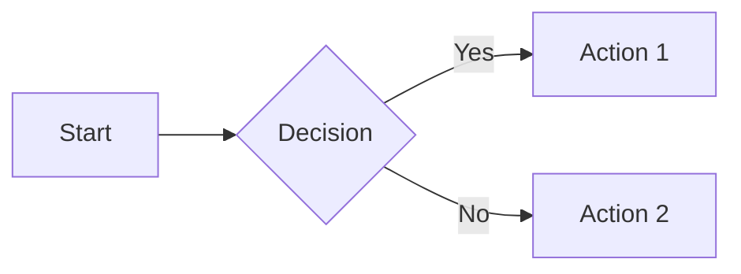
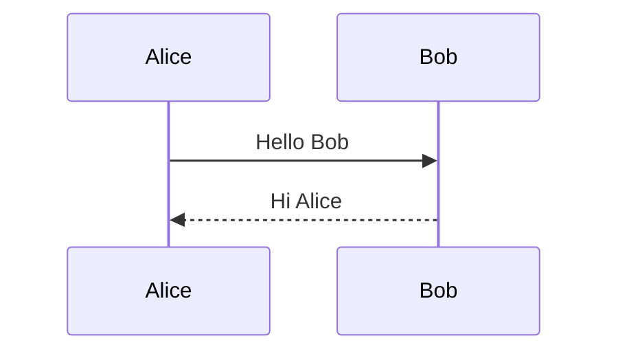

# Markdown quick reference

**[← Back to Course Index](./README.md)**

> **Document Version:** 1.0
> **Last Updated:** January 22, 2026
> **Maintainers:** Application Infrastructure Team
> **Status:** Production


> [!IMPORTANT]
> **Related Docs:** [Glossary](./glossary.md) | [Part 1: Basics](./learning-paths/series-part1-basics.md)

## Table of contents

- [Headings](#headings)
- [Text formatting](#text-formatting)
- [Links](#links)
- [Images](#images)
- [Lists](#lists)
- [Code](#code)
- [Blockquotes](#blockquotes)
- [Tables](#tables)
- [Task lists](#task-lists)
- [Alerts/Admonitions](#alertsadmonitions)
- [Horizontal rules](#horizontal-rules)
- [Escaping characters](#escaping-characters)
- [Emoji](#emoji)
- [Footnotes](#footnotes)

---

## Headings

```markdown
# Heading 1
## Heading 2
### Heading 3
#### Heading 4
##### Heading 5
###### Heading 6
```

> [!NOTE]
> Use sentence case for headings per documentation standards.

[↑ Back to Table of Contents](#table-of-contents)

---

## Text formatting

| Syntax | Result | Example |
|--------|--------|---------|
| `**bold**` | **bold** | `**important**` |
| `*italic*` | *italic* | `*emphasis*` |
| `***bold italic***` | ***bold italic*** | `***critical***` |
| `~~strikethrough~~` | ~~strikethrough~~ | `~~removed~~` |
| `` `code` `` | `code` | `` `variable` `` |
| `<sub>subscript</sub>` | H<sub>2</sub>O | `H<sub>2</sub>O` |
| `<sup>superscript</sup>` | x<sup>2</sup> | `x<sup>2</sup>` |

[↑ Back to Table of Contents](#table-of-contents)

---

## Links

### Inline links

```markdown
[Link text](https://example.com)
[Link with title](https://example.com "Title text")
```

### Reference-style links

```markdown
[Link text][reference]
[Another link][ref2]

[reference]: https://example.com
[ref2]: https://example.com/page "Optional title"
```

### Autolinks

```markdown
<https://example.com>
<email@example.com>
```

### Section links (anchors)

```markdown
[Jump to headings](#headings)
```

[↑ Back to Table of Contents](#table-of-contents)

---

## Images

### Inline images

```markdown


```

### Reference-style images

```markdown
![Alt text][logo]

[logo]: /path/to/image.png "Optional title"
```

### Linked images

```markdown
[](https://example.com)
```

[↑ Back to Table of Contents](#table-of-contents)

---

## Lists

### Unordered lists

```markdown
- Item one
- Item two
  - Nested item
  - Another nested
- Item three
```

### Ordered lists

```markdown
1. First item
2. Second item
   1. Nested item
   2. Another nested
3. Third item
```

### Mixed lists

```markdown
1. First item
   - Bullet point
   - Another bullet
2. Second item
```

[↑ Back to Table of Contents](#table-of-contents)

---

## Code

### Inline code

```markdown
Use the `print()` function.
```

### Fenced code blocks

````markdown
```python
def hello():
    print("Hello, World!")
```
````

### Code block with line numbers (some renderers)

````markdown
```python {.line-numbers}
def hello():
    print("Hello, World!")
```
````

### Diff syntax

````markdown
```diff
- removed line
+ added line
  unchanged line
```
````

### Common language identifiers

| Language | Identifier |
|----------|------------|
| Python | `python` |
| JavaScript | `javascript` or `js` |
| TypeScript | `typescript` or `ts` |
| Bash/Shell | `bash` or `shell` |
| SQL | `sql` |
| JSON | `json` |
| YAML | `yaml` |
| Markdown | `markdown` or `md` |
| HTML | `html` |
| CSS | `css` |
| Plain text | `text` |

[↑ Back to Table of Contents](#table-of-contents)

---

## Blockquotes

### Simple blockquote

```markdown
> This is a blockquote.
```

### Multi-paragraph blockquote

```markdown
> First paragraph.
>
> Second paragraph.
```

### Nested blockquotes

```markdown
> Outer quote
>
> > Nested quote
```

[↑ Back to Table of Contents](#table-of-contents)

---

## Tables

### Basic table

```markdown
| Header 1 | Header 2 | Header 3 |
|----------|----------|----------|
| Cell 1   | Cell 2   | Cell 3   |
| Cell 4   | Cell 5   | Cell 6   |
```

### Column alignment

```markdown
| Left | Center | Right |
|:-----|:------:|------:|
| L    | C      | R     |
```

- `:---` = Left align
- `:---:` = Center align
- `---:` = Right align

[↑ Back to Table of Contents](#table-of-contents)

---

## Task lists

```markdown
- [x] Completed task
- [ ] Incomplete task
- [ ] Another task
```

**Result:**

- [x] Completed task
- [ ] Incomplete task
- [ ] Another task

[↑ Back to Table of Contents](#table-of-contents)

---

## Alerts/Admonitions

GitHub Flavored Markdown supports these alert types:

```markdown
> [!NOTE]
> Useful information that users should know.

> [!TIP]
> Helpful advice for doing things better.

> [!IMPORTANT]
> Key information users need to know.

> [!WARNING]
> Urgent info that needs immediate attention.

> [!CAUTION]
> Advises about risks or negative outcomes.
```

[↑ Back to Table of Contents](#table-of-contents)

---

## Horizontal rules

Any of these creates a horizontal line:

```markdown
---
***
___
```

[↑ Back to Table of Contents](#table-of-contents)

---

## Escaping characters

Use backslash to escape special characters:

```markdown
\* Not italic \*
\# Not a heading
\[Not a link\]
\`Not code\`
```

**Characters that can be escaped:**

```text
\ ` * _ { } [ ] ( ) # + - . ! |
```

[↑ Back to Table of Contents](#table-of-contents)

---

## Emoji

### Shortcodes (GitHub/GitLab)

```markdown
:smile: :rocket: :warning: :+1:
```

### Common emoji shortcodes

| Shortcode | Emoji | Shortcode | Emoji |
|-----------|-------|-----------|-------|
| `:smile:` | :smile: | `:rocket:` | :rocket: |
| `:warning:` | :warning: | `:+1:` | :+1: |
| `:x:` | :x: | `:white_check_mark:` | :white_check_mark: |
| `:bug:` | :bug: | `:memo:` | :memo: |
| `:fire:` | :fire: | `:star:` | :star: |

[↑ Back to Table of Contents](#table-of-contents)

---

## Footnotes

```markdown
Here is a sentence with a footnote.[^1]

[^1]: This is the footnote content.
```

### Named footnotes

```markdown
Reference to a note.[^note]

[^note]: This is a named footnote.
```

[↑ Back to Table of Contents](#table-of-contents)

---

## Mermaid diagrams (advanced)

### Flowchart

````markdown

````

### Sequence diagram

````markdown

````

See [Part 3: Advanced](./learning-paths/series-part3-advanced.md) for full Mermaid documentation.

[↑ Back to Table of Contents](#table-of-contents)

---

## Math equations (advanced)

### Inline math

```markdown
The equation $E = mc^2$ is famous.
```

### Block math

```markdown
$$
\sum_{i=1}^{n} x_i = x_1 + x_2 + \cdots + x_n
$$
```

See [Part 3: Advanced](./learning-paths/series-part3-advanced.md) for full math documentation.

[↑ Back to Table of Contents](#table-of-contents)
