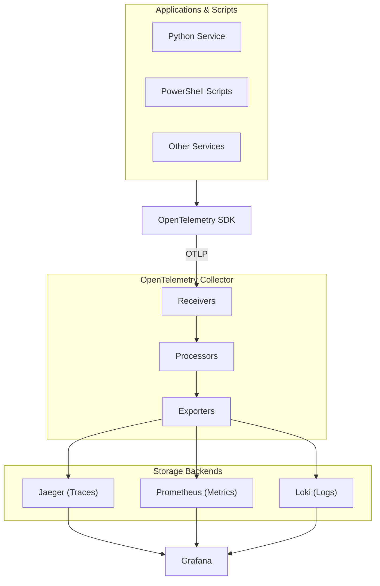

# Observability Tutorial

A comprehensive, beginner-to-advanced guide to enterprise observability covering telemetry collection, distributed tracing, metrics, logging, and alerting.

## Learning Objectives

By completing this tutorial, you will:

- Understand the fundamentals of observability and the three pillars (traces, metrics, logs)
- Learn how to design and implement event-driven telemetry pipelines
- Master OpenTelemetry for unified observability
- Implement structured logging in PowerShell and Python
- Configure Kafka for telemetry streaming
- Build alerting and notification systems
- Apply best practices and design patterns

---

## Prerequisites

Before starting, you should have:

- Basic understanding of programming concepts
- Familiarity with either Python or PowerShell (ideally both)
- Understanding of distributed systems concepts
- Access to a development environment with:
  - Python 3.9+
  - PowerShell 7+
  - Docker (for running Kafka, OpenTelemetry Collector, etc.)

---

## Tutorial Parts

### Fundamentals

| Part | Title | Description | Level |
|------|-------|-------------|-------|
| 1 | [Introduction to Observability](01_INTRODUCTION.md) | What is observability, why it matters, key terminology | Beginner |
| 2 | [The Three Pillars](02_THREE_PILLARS.md) | Traces, Metrics, and Logs in depth | Beginner |

### Architecture

| Part | Title | Description | Level |
|------|-------|-------------|-------|
| 3 | [Data Pipeline Architecture](03_DATA_PIPELINE_ARCHITECTURE.md) | Event-driven streaming with Kafka | Intermediate |
| 4 | [OpenTelemetry Deep Dive](04_OPENTELEMETRY.md) | Complete OpenTelemetry guide | Intermediate |

### Implementation

| Part | Title | Description | Level |
|------|-------|-------------|-------|
| 5 | [PowerShell Logging](05_POWERSHELL_LOGGING.md) | Structured logging patterns for PowerShell | Intermediate |
| 6 | [Python Integration](06_PYTHON_INTEGRATION.md) | Python instrumentation and examples | Intermediate |
| 7 | [Kafka Streaming](07_KAFKA_STREAMING.md) | Kafka configuration and patterns | Advanced |

### Operations

| Part | Title | Description | Level |
|------|-------|-------------|-------|
| 8 | [Alerting and Notification](08_ALERTING_NOTIFICATION.md) | Alert rules, evaluation, and notification | Advanced |
| 9 | [Best Practices](09_BEST_PRACTICES.md) | Patterns, anti-patterns, and recommendations | Advanced |

### Reference

| Resource | Description |
|----------|-------------|
| [Quick Reference](QUICK_REFERENCE.md) | Cheat sheet for common tasks |
| [Exercises](exercises/) | Hands-on labs to practice concepts |

---

## Learning Paths

### 🚀 Quick Start (1-2 hours)

For those who want a high-level understanding:

1. [Introduction to Observability](01_INTRODUCTION.md)
2. [The Three Pillars](02_THREE_PILLARS.md)
3. [Quick Reference](QUICK_REFERENCE.md)

### 📚 Complete Course (8-10 hours)

For comprehensive learning, follow parts 1-9 in order.

### 🔧 PowerShell Focus (3-4 hours)

For PowerShell developers:

1. [Introduction](01_INTRODUCTION.md)
2. [The Three Pillars](02_THREE_PILLARS.md)
3. [PowerShell Logging](05_POWERSHELL_LOGGING.md)
4. [Best Practices](09_BEST_PRACTICES.md)
5. [Exercise: PowerShell Logging](exercises/03_powershell_logging.md)

### 🐍 Python Focus (3-4 hours)

For Python developers:

1. [Introduction](01_INTRODUCTION.md)
2. [The Three Pillars](02_THREE_PILLARS.md)
3. [OpenTelemetry](04_OPENTELEMETRY.md)
4. [Python Integration](06_PYTHON_INTEGRATION.md)
5. [Exercise: Instrument Python](exercises/02_instrument_python.md)

### 🏗️ Platform Engineer Path (5-6 hours)

For platform/infrastructure engineers:

1. [Data Pipeline Architecture](03_DATA_PIPELINE_ARCHITECTURE.md)
2. [OpenTelemetry](04_OPENTELEMETRY.md)
3. [Kafka Streaming](07_KAFKA_STREAMING.md)
4. [Alerting and Notification](08_ALERTING_NOTIFICATION.md)
5. [Exercise: Setup Collector](exercises/01_setup_collector.md)

---

## Key Concepts at a Glance

---

## Architecture Reference

For detailed architecture documentation, see:

- [Enterprise Observability Architecture](../../explanation/architecture/observability/Enterprise_Observability_Notification_Data_Pipeline_Architecture.md)
- [OpenTelemetry Architecture](../../explanation/architecture/observability/OPENTELEMETRY_ARCHITECTURE.md)
- [PowerShell Logging Architecture](../../explanation/architecture/observability/POWERSHELL_LOGGING_ARCHITECTURE.md)

---

## Getting Help

If you have questions or encounter issues:

1. Check the [Quick Reference](QUICK_REFERENCE.md) for common solutions
2. Review the relevant architecture documentation
3. Consult the troubleshooting sections in each tutorial part
