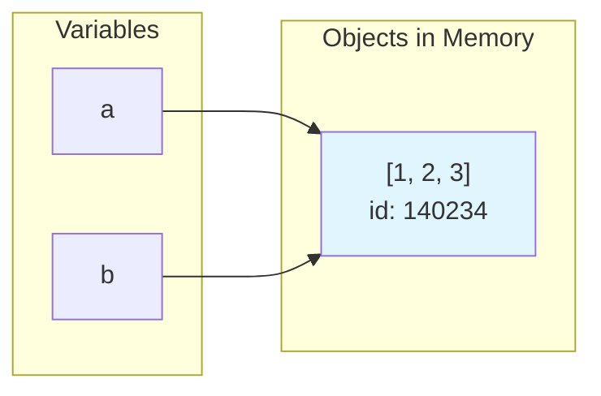

# Variables and Data Types

## What is a Variable?

A variable is a name that refers to a value stored in memory. Unlike some languages, Python doesn't require you to declare the type—it's determined automatically.

```python
# Different types of data
name = "Alice"          # String (text)
age = 30                # Integer (whole number)
height = 5.7            # Float (decimal number)
is_student = True       # Boolean (True or False)
nothing = None          # None (represents "no value")
```

## Python's Memory Model

Understanding how Python handles variables is crucial:



Variables in Python are **references** (labels) that point to objects in memory:

```python
# Both variables point to the SAME list object
a = [1, 2, 3]
b = a
b.append(4)
print(a)  # [1, 2, 3, 4] - a is also changed!

# Creating a copy instead
a = [1, 2, 3]
b = a.copy()  # or list(a) or a[:]
b.append(4)
print(a)  # [1, 2, 3] - a is unchanged
print(b)  # [1, 2, 3, 4]
```

## Primitive Types

### Integers

Whole numbers of unlimited size:

```python
count = 42
big_number = 10_000_000_000  # Underscores for readability
hex_value = 0xFF             # Hexadecimal (255)
binary = 0b1010              # Binary (10)
octal = 0o17                 # Octal (15)
```

### Floats

Decimal numbers (IEEE 754 double precision):

```python
price = 19.99
scientific = 6.022e23   # Scientific notation
negative = -273.15

# Floating point has precision limits!
print(0.1 + 0.2)        # 0.30000000000000004
print(0.1 + 0.2 == 0.3) # False!

# Use decimal for precise calculations
from decimal import Decimal
price = Decimal("19.99")
tax = Decimal("0.08")
total = price * (1 + tax)  # Exact: 21.5892
```

### Booleans

True or False values:

```python
is_active = True
is_deleted = False

# Truthiness - values that evaluate to False
bool(0)       # False
bool(0.0)     # False
bool("")      # False (empty string)
bool([])      # False (empty list)
bool({})      # False (empty dict)
bool(None)    # False

# Everything else is True
bool(1)       # True
bool("hello") # True
bool([1, 2])  # True
```

### Strings

Text data (immutable sequences of Unicode characters):

```python
single = 'Hello'
double = "World"
triple = """Multi-line
string"""

# Common string operations
name = "alice"
print(name.upper())       # "ALICE"
print(name.capitalize())  # "Alice"
print(name.replace("a", "@"))  # "@lice"
print(len(name))          # 5

# String formatting
name = "Alice"
age = 30
# f-strings (recommended)
print(f"{name} is {age} years old")
# .format() method
print("{} is {} years old".format(name, age))
# % formatting (legacy)
print("%s is %d years old" % (name, age))

# f-string features
value = 3.14159
print(f"{value:.2f}")     # "3.14" - 2 decimal places
print(f"{value:10.2f}")   # "      3.14" - padded
print(f"{1000:,}")        # "1,000" - thousands separator
print(f"{name!r}")        # "'Alice'" - repr()
print(f"{name=}")         # "name='Alice'" - debug (3.8+)
```

### None

Represents the absence of a value:

```python
# Explicitly set to None
result = None

# Functions without return statement return None
def do_something():
    print("Done")

x = do_something()  # x is None

# Common pattern: check for None
def find_user(user_id):
    if user_id == 1:
        return "Alice"
    return None  # Explicit return None

user = find_user(5)
if user is None:
    print("User not found!")
```

## Type Checking and Conversion

### Checking Types

```python
x = 42
print(type(x))         # <class 'int'>
print(type(x).__name__) # "int"

# isinstance is preferred for type checking
print(isinstance(x, int))        # True
print(isinstance(x, (int, float))) # True (check multiple types)
```

### Type Conversion

```python
# String to number
age = int("30")        # 30
price = float("19.99") # 19.99

# Number to string
str_age = str(30)      # "30"

# Be careful with invalid conversions
try:
    int("hello")       # Raises ValueError
except ValueError as e:
    print(f"Cannot convert: {e}")

# Base conversion
int("FF", 16)          # 255 (hex to int)
int("1010", 2)         # 10 (binary to int)
hex(255)               # "0xff"
bin(10)                # "0b1010"
```

## Identity vs Equality

Python distinguishes between:
- **Identity** (`is`): Are these the same object in memory?
- **Equality** (`==`): Do these have the same value?

```python
# Lists: different objects, same value
a = [1, 2, 3]
b = [1, 2, 3]
print(a == b)  # True (same value)
print(a is b)  # False (different objects)

# Assigning creates a reference
c = a
print(a is c)  # True (same object)

# Small integers are cached (implementation detail)
x = 256
y = 256
print(x is y)  # True (cached)

x = 257
y = 257
print(x is y)  # False (not cached)

# ALWAYS use == for value comparison
# ONLY use "is" for None, True, False
if result is None:  # Correct
    pass
if result == None:  # Works but not recommended
    pass
```

## Mutability

Objects are either **mutable** (can be changed) or **immutable** (cannot be changed):

| Immutable | Mutable |
|-----------|---------|
| int, float | list |
| str | dict |
| tuple | set |
| frozenset | bytearray |

```python
# Immutable: operations create new objects
s = "hello"
s.upper()       # Returns "HELLO", but s is still "hello"
s = s.upper()   # Now s is "HELLO" (new object)

# Mutable: operations modify in place
lst = [1, 2, 3]
lst.append(4)   # lst is now [1, 2, 3, 4]

# This matters for function arguments!
def add_item(items, item):
    items.append(item)  # Modifies the original list!

my_list = [1, 2, 3]
add_item(my_list, 4)
print(my_list)  # [1, 2, 3, 4]
```

## Variable Naming Conventions

Python follows PEP 8 naming conventions:

```python
# Variables and functions: snake_case
user_name = "alice"
total_count = 42

# Constants: UPPER_SNAKE_CASE
MAX_CONNECTIONS = 100
DEFAULT_TIMEOUT = 30

# Private variables: prefix with _
_internal_state = "hidden"

# Name mangling: prefix with __ (in classes)
class Example:
    def __init__(self):
        self.__private = "mangled"

# Never use these as variable names (keywords):
# if, else, for, while, class, def, return, import, etc.

# Avoid shadowing built-ins:
# list, dict, str, int, print, len, etc.
```

## Example from Our Code

From `connection.py`:

```python
class SnowflakeConnection:
    def __init__(self, account: str, user: Optional[str] = None):
        self.account = account      # Store account name
        self.user = user            # Store username (can be None)
        self.connection = None      # No connection yet
        self._initialized = False   # Private variable (starts with _)
```

**Why this design?**

- `self.account` stores the account name for this specific connection
- `self.connection = None` means "no connection yet"—we'll set it later
- `self._initialized` starts with `_` to indicate it's "private" (internal use only)

## Best Practices Summary

1. **Use descriptive names**: `user_count` not `n`
2. **Follow naming conventions**: snake_case for variables
3. **Use `is` only for `None`, `True`, `False`**: Use `==` for value comparison
4. **Be aware of mutability**: Know when objects are shared
5. **Use type hints**: Document expected types
6. **Use f-strings**: Cleaner than .format() or % formatting
7. **Handle None explicitly**: Don't let None propagate silently

---

[← Back to Module 1](./README.md) | [Next: Control Flow →](./03_control_flow.md) | [Exercises →](./exercises/ex_02_variables.md)
