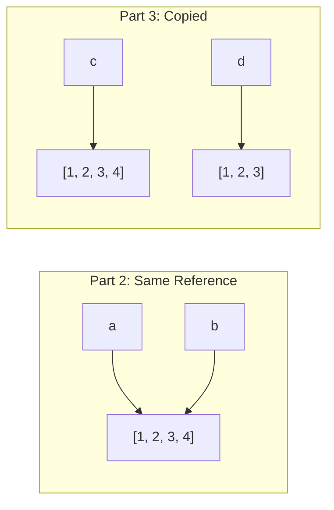

# Solutions — 02: Variables and Data Types

## Key Concepts Demonstrated

- Python's built-in types: str, int, float, bool, None, list, dict
- Type conversion functions: `int()`, `float()`, `str()`, `bool()`
- Reference semantics vs value semantics
- Identity (`is`) vs equality (`==`)
- Working with `None` as a sentinel value

## Common Mistakes to Avoid

- Using `==` instead of `is` when checking for `None`
- Confusing reference assignment with copying for mutable objects
- Forgetting that `int()` truncates (doesn't round) floats
- Assuming `0`, `""`, and `[]` are the same as `None`

---

## Exercise 1 Solution

**Explanation**: Use `type()` to inspect variable types at runtime.

```python
# ex1_type_detective.py
a = 42
b = 3.14
c = "Hello"
d = True
e = None
f = [1, 2, 3]
g = {"name": "Alice"}

print(f"a = {a}, type: {type(a)}")
print(f"b = {b}, type: {type(b)}")
print(f"c = {c}, type: {type(c)}")
print(f"d = {d}, type: {type(d)}")
print(f"e = {e}, type: {type(e)}")
print(f"f = {f}, type: {type(f)}")
print(f"g = {g}, type: {type(g)}")
```

**Output**:
```
a = 42, type: <class 'int'>
b = 3.14, type: <class 'float'>
c = Hello, type: <class 'str'>
d = True, type: <class 'bool'>
e = None, type: <class 'NoneType'>
f = [1, 2, 3], type: <class 'list'>
g = {'name': 'Alice'}, type: <class 'dict'>
```

---

## Exercise 2 Solution

**Explanation**: Type conversion functions change one type to another.

```python
# ex2_type_conversion.py
num_str = "42"
num_int = int(num_str)
num_float = float(num_str)

pi = 3.14159
pi_int = int(pi)  # Truncates to 3 (doesn't round!)

num_str_again = str(num_int)

print(f"num_str = '{num_str}', type: {type(num_str).__name__}")
print(f"num_int = {num_int}, type: {type(num_int).__name__}")
print(f"num_float = {num_float}, type: {type(num_float).__name__}")
print(f"pi = {pi}, type: {type(pi).__name__}")
print(f"pi_int = {pi_int}, type: {type(pi_int).__name__}")
print(f"num_str_again = '{num_str_again}', type: {type(num_str_again).__name__}")
```

**Output**:
```
num_str = '42', type: str
num_int = 42, type: int
num_float = 42.0, type: float
pi = 3.14159, type: float
pi_int = 3, type: int
num_str_again = '42', type: str
```

**Key Insight**: `int()` truncates toward zero, not rounds. Use `round()` if you want rounding.

---

## Exercise 3 Solution

**Explanation**: Understanding references is crucial for avoiding bugs.

```python
# Part 1: Integers (immutable)
x = 10
y = x      # y gets the VALUE 10, not a reference to x
x = 20     # x now points to a new value, y unchanged
print(f"x = {x}, y = {y}")  # x = 20, y = 10

# Part 2: Lists (mutable, same reference)
a = [1, 2, 3]
b = a      # b points to the SAME list as a
a.append(4)  # Modifies the list both a and b reference
print(f"a = {a}, b = {b}")  # a = [1, 2, 3, 4], b = [1, 2, 3, 4]

# Part 3: Lists (mutable, copied)
c = [1, 2, 3]
d = c.copy()  # d is a NEW list with same values
c.append(4)   # Only c is modified
print(f"c = {c}, d = {d}")  # c = [1, 2, 3, 4], d = [1, 2, 3]
```

**Answers**:

1. **Why doesn't changing `x` affect `y`?**
   - Integers are immutable. When we do `y = x`, Python copies the value 10 to `y`.
   - When we do `x = 20`, we're creating a new integer object and pointing `x` to it.
   - `y` still points to the original value 10.

2. **Why does modifying `a` also change `b`?**
   - Lists are mutable. When we do `b = a`, both variables point to the same list object.
   - `a.append(4)` modifies that shared list.
   - Since `b` points to the same list, we see the change through `b` too.

3. **Why doesn't modifying `c` affect `d`?**
   - `c.copy()` creates a new list with the same values.
   - `c` and `d` now point to different list objects.
   - Modifying `c` only affects its own list.



---

## Exercise 4 Solution

**Explanation**: `==` checks value equality, `is` checks identity (same object).

```python
# Equality (==) - compares VALUES
print([1, 2] == [1, 2])   # True - same values
print("hello" == "hello") # True - same values
print(1 == 1.0)           # True - 1 and 1.0 have same value
print(None == False)      # False - None is not equal to False

# Identity (is) - compares OBJECT IDENTITY
a = [1, 2]
b = [1, 2]
c = a

print(a is b)  # False - different list objects
print(a is c)  # True - same list object
print(a == b)  # True - same values

# Special cases
print(None is None)  # True - there's only one None object
print(True is True)  # True - there's only one True object
```

**Output**:
```
True
True
True
False
False
True
True
True
True
```

**Rule of thumb**:
- Use `is` only for `None`, `True`, `False`
- Use `==` for everything else

---

## Exercise 5 Solution

**Explanation**: `None` is Python's way of representing "no value" or "not yet set."

```python
# ex5_none_handling.py
result = None

num_str = input("Enter a number: ")
num = float(num_str)

if num > 0:
    result = "positive"
elif num < 0:
    result = "negative"
# If num == 0, result stays None

if result is None:
    print("No result (value is None)")
else:
    print(f"Result: {result}")
```

**Example Runs**:
```
Enter a number: 5
Result: positive

Enter a number: -3
Result: negative

Enter a number: 0
No result (value is None)
```

**Key Concepts**:
- Initialize with `None` to indicate "not yet set"
- Use `is None` (not `== None`) to check for None
- `None` is different from `0`, `""`, `False`, or `[]`

---

## Exercise 6 Solution

**Explanation**: Building a complete data structure with proper types.

```python
# ex6_user_profile.py
name = input("Enter your name: ")
age = int(input("Enter your age: "))
height = float(input("Enter your height in meters: "))

student_input = input("Are you a student? (yes/no): ").lower()
is_student = student_input == "yes"

print("\n=== User Profile ===")
print(f"Name: {name} ({type(name).__name__})")
print(f"Age: {age} ({type(age).__name__})")
print(f"Height: {height} ({type(height).__name__})")
print(f"Student: {is_student} ({type(is_student).__name__})")
```

**Example Interaction**:
```
Enter your name: Alice
Enter your age: 25
Enter your height in meters: 1.65
Are you a student? (yes/no): yes

=== User Profile ===
Name: Alice (str)
Age: 25 (int)
Height: 1.65 (float)
Student: True (bool)
```

**Alternative with error handling**:

```python
# More robust version
name = input("Enter your name: ").strip()

while True:
    try:
        age = int(input("Enter your age: "))
        if age < 0 or age > 150:
            print("Please enter a valid age.")
            continue
        break
    except ValueError:
        print("Please enter a number.")

while True:
    try:
        height = float(input("Enter your height in meters: "))
        if height <= 0 or height > 3:
            print("Please enter a valid height.")
            continue
        break
    except ValueError:
        print("Please enter a number.")

student_input = input("Are you a student? (yes/no): ").lower().strip()
is_student = student_input in ("yes", "y", "true", "1")

print(f"\n=== User Profile ===")
print(f"Name: {name} ({type(name).__name__})")
print(f"Age: {age} ({type(age).__name__})")
print(f"Height: {height:.2f} ({type(height).__name__})")
print(f"Student: {is_student} ({type(is_student).__name__})")
```

---

## Alternative Approaches

### Checking type

```python
value = 42

# Using type()
if type(value) == int:
    print("It's an integer")

# Using isinstance() - preferred, handles inheritance
if isinstance(value, int):
    print("It's an integer")

# Multiple types
if isinstance(value, (int, float)):
    print("It's a number")
```

### Safe type conversion

```python
def safe_int(value, default=0):
    """Convert to int, returning default if conversion fails."""
    try:
        return int(value)
    except (ValueError, TypeError):
        return default

# Usage
age = safe_int(input("Enter age: "), default=0)
```

---

[← Back to Exercises](../exercises/ex_02_variables.md) | [← Back to Chapter](../02_variables.md) | [← Back to Module 1](../README.md)
