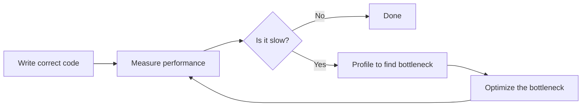
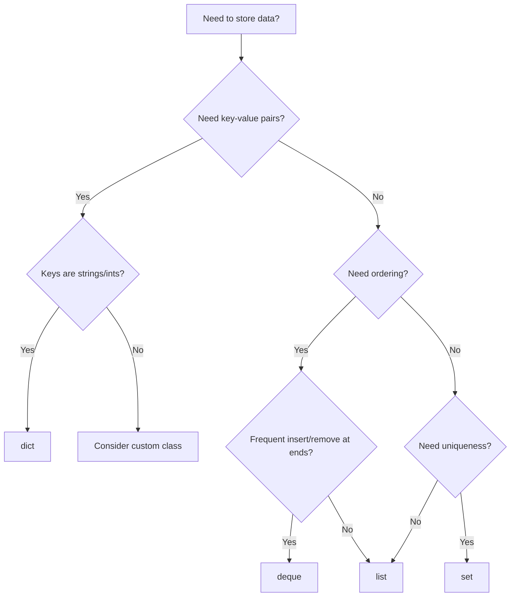

# Performance and Optimization

Performance optimization is the art of making code run faster and use less memory. However, the most important rule is: **measure before optimizing**. Premature optimization often wastes time and reduces code readability.

## The optimization mindset

> "Premature optimization is the root of all evil" — Donald Knuth

Follow this workflow:



**Key principles**:
1. **Make it work** first, then make it fast
2. **Measure** before and after every change
3. **Profile** to find the actual bottleneck (often surprising)
4. **Optimize** only the hot path (the 20% that takes 80% of time)
5. **Document** why optimizations were made

## Profiling tools

### cProfile (built-in)

Python's built-in profiler tracks function calls and time spent:

```python
import cProfile
import pstats
from io import StringIO

def slow_function():
    total = 0
    for i in range(1000000):
        total += i ** 2
    return total

# Profile and print results
cProfile.run('slow_function()', sort='cumulative')
```

Output:
```
         4 function calls in 0.156 seconds

   Ordered by: cumulative time

   ncalls  tottime  percall  cumtime  percall filename:lineno(function)
        1    0.000    0.000    0.156    0.156 {built-in method builtins.exec}
        1    0.156    0.156    0.156    0.156 <string>:1(slow_function)
        1    0.000    0.000    0.000    0.000 {method 'disable' of '_lsprof.Profiler'}
```

**Reading the output**:
- `ncalls`: Number of calls
- `tottime`: Time in function (excluding subcalls)
- `cumtime`: Cumulative time (including subcalls)

### Profile to file and analyze

```python
import cProfile
import pstats

# Profile to file
cProfile.run('slow_function()', 'profile_output.prof')

# Analyze results
stats = pstats.Stats('profile_output.prof')
stats.sort_stats('cumulative')
stats.print_stats(10)  # Top 10 functions
```

### Context manager for profiling

```python
import cProfile
import pstats
from contextlib import contextmanager

@contextmanager
def profile(sort_by='cumulative', lines=10):
    """Context manager for easy profiling."""
    profiler = cProfile.Profile()
    profiler.enable()
    try:
        yield
    finally:
        profiler.disable()
        stats = pstats.Stats(profiler)
        stats.sort_stats(sort_by)
        stats.print_stats(lines)

# Usage
with profile():
    result = slow_function()
```

### line_profiler (line-by-line)

For detailed line-by-line profiling:

```bash
uv add --dev line-profiler
```

```python
# slow_code.py
@profile  # Decorator added by line_profiler
def process_data(data):
    result = []
    for item in data:          # Line 1
        processed = item * 2    # Line 2
        result.append(processed)  # Line 3
    return result              # Line 4

if __name__ == "__main__":
    data = list(range(100000))
    process_data(data)
```

Run with:
```bash
kernprof -l -v slow_code.py
```

Output shows time per line:
```
Line #      Hits         Time  Per Hit   % Time  Line Contents
==============================================================
     3    100000      50000.0      0.5     20.0      processed = item * 2
     4    100000     200000.0      2.0     80.0      result.append(processed)
```

### memory_profiler

Track memory usage:

```bash
uv add --dev memory-profiler
```

```python
from memory_profiler import profile

@profile
def create_large_list():
    data = [i ** 2 for i in range(1000000)]
    return data

create_large_list()
```

Output:
```
Line #    Mem usage    Increment   Line Contents
================================================
     3     38.5 MiB     38.5 MiB   @profile
     4     76.2 MiB     37.7 MiB       data = [i ** 2 for i in range(1000000)]
     5     76.2 MiB      0.0 MiB       return data
```

### timeit for micro-benchmarks

Compare small code snippets:

```python
import timeit

# Compare list comprehension vs loop
setup = "data = list(range(1000))"

# Method 1: List comprehension
time1 = timeit.timeit(
    "[x * 2 for x in data]",
    setup=setup,
    number=10000
)

# Method 2: Loop with append
time2 = timeit.timeit(
    """
result = []
for x in data:
    result.append(x * 2)
""",
    setup=setup,
    number=10000
)

print(f"List comprehension: {time1:.4f}s")
print(f"Loop with append:   {time2:.4f}s")
print(f"Comprehension is {time2/time1:.1f}x faster")
```

Quick timing in IPython/Jupyter:
```python
%timeit [x * 2 for x in range(1000)]
%timeit sum(range(1000))
```

## Big-O notation

Understand algorithmic complexity to choose efficient approaches:

| Big-O | Name | Example | 1,000 items | 1,000,000 items |
|-------|------|---------|-------------|-----------------|
| O(1) | Constant | Dict lookup | 1 op | 1 op |
| O(log n) | Logarithmic | Binary search | 10 ops | 20 ops |
| O(n) | Linear | List search | 1,000 ops | 1,000,000 ops |
| O(n log n) | Linearithmic | Sorting | 10,000 ops | 20,000,000 ops |
| O(n²) | Quadratic | Nested loops | 1,000,000 ops | 1,000,000,000,000 ops |
| O(2ⁿ) | Exponential | Naive recursion | Infeasible | Infeasible |

### Common operation costs

```python
# List operations
my_list = [1, 2, 3, 4, 5]

# O(1) - Constant time
my_list[0]           # Index access
my_list.append(6)    # Append to end
my_list.pop()        # Pop from end
len(my_list)         # Length

# O(n) - Linear time
my_list.insert(0, 0)  # Insert at beginning (shifts all elements)
my_list.pop(0)        # Pop from beginning (shifts all elements)
5 in my_list          # Membership check (searches entire list)
my_list.index(3)      # Find index (searches until found)
my_list.remove(3)     # Remove by value (search + shift)

# Dict operations - O(1) average
my_dict = {"a": 1, "b": 2}
my_dict["a"]          # Lookup
my_dict["c"] = 3      # Insert
"a" in my_dict        # Membership check
del my_dict["a"]      # Delete

# Set operations - O(1) average
my_set = {1, 2, 3}
1 in my_set           # Membership check
my_set.add(4)         # Add element
my_set.remove(1)      # Remove element
```

## Choosing the right data structure



### List vs deque vs set

```python
from collections import deque
import timeit

# For membership testing: set >> list
items = list(range(10000))
items_set = set(items)

# O(n) - slow
timeit.timeit("9999 in items", globals=globals(), number=1000)  # ~0.5s

# O(1) - fast
timeit.timeit("9999 in items_set", globals=globals(), number=1000)  # ~0.0001s

# For queue operations: deque >> list
# List: O(n) for insert/pop at beginning
# Deque: O(1) for insert/pop at both ends

queue = deque()
queue.append("item")      # Add to right
queue.appendleft("item")  # Add to left
queue.pop()               # Remove from right
queue.popleft()           # Remove from left
```

### When to use each

| Use Case | Best Choice | Why |
|----------|-------------|-----|
| Ordered collection, index access | `list` | O(1) index access |
| Queue (FIFO) | `deque` | O(1) at both ends |
| Stack (LIFO) | `list` | O(1) append/pop |
| Membership testing | `set` | O(1) lookup |
| Counting items | `Counter` | Built for counting |
| Key-value mapping | `dict` | O(1) lookup |
| Sorted data | `sorted()` or `bisect` | Maintain order |

## Code-level optimizations

### Use built-in functions

Built-ins are implemented in C and highly optimized:

```python
# SLOW - Python loop
total = 0
for x in range(1000000):
    total += x

# FAST - Built-in sum
total = sum(range(1000000))

# SLOW - Manual max finding
maximum = data[0]
for x in data:
    if x > maximum:
        maximum = x

# FAST - Built-in max
maximum = max(data)

# Other fast built-ins: min, any, all, sorted, len
```

### List comprehensions vs loops

Comprehensions are faster due to optimized bytecode:

```python
# SLOW - Loop with append
result = []
for x in data:
    result.append(x * 2)

# FAST - List comprehension
result = [x * 2 for x in data]

# Even faster for filtering
result = [x for x in data if x > 0]  # vs loop with if + append
```

### String concatenation

String concatenation in loops is O(n²) due to immutability:

```python
# SLOW - String concatenation in loop (O(n²))
result = ""
for word in words:
    result += word + " "

# FAST - join (O(n))
result = " ".join(words)

# For building strings incrementally
parts = []
for item in data:
    parts.append(f"Item: {item}")
result = "\n".join(parts)
```

### Local variables

Local variable lookup is faster than global:

```python
import math

# SLOWER - Global lookup each iteration
def compute_slow(data):
    return [math.sqrt(x) for x in data]

# FASTER - Local reference
def compute_fast(data):
    sqrt = math.sqrt  # Local reference
    return [sqrt(x) for x in data]
```

### `__slots__` for memory

Reduce memory usage for classes with many instances:

```python
# Regular class - uses dict for attributes (~300+ bytes per instance)
class PointRegular:
    def __init__(self, x, y):
        self.x = x
        self.y = y

# With __slots__ - fixed attributes (~50 bytes per instance)
class PointSlots:
    __slots__ = ['x', 'y']

    def __init__(self, x, y):
        self.x = x
        self.y = y

# Memory comparison with 1 million instances
import sys
regular = [PointRegular(i, i) for i in range(1000)]
slotted = [PointSlots(i, i) for i in range(1000)]
# slotted uses ~80% less memory
```

**When to use `__slots__`**:
- Many instances (thousands+)
- Fixed set of attributes
- Memory is a concern
- Don't need dynamic attribute assignment

## Advanced techniques

### Generators for memory efficiency

Process large data without loading everything into memory:

```python
# BAD - Loads all into memory
def get_squares_list(n):
    return [x ** 2 for x in range(n)]

# GOOD - Yields one at a time
def get_squares_generator(n):
    for x in range(n):
        yield x ** 2

# Memory usage
squares_list = get_squares_list(10_000_000)  # ~400 MB
squares_gen = get_squares_generator(10_000_000)  # ~100 bytes

# Both work the same way
for square in squares_gen:
    process(square)
```

### functools.lru_cache

Cache expensive function results:

```python
from functools import lru_cache

# Without cache - exponential time
def fibonacci_slow(n):
    if n < 2:
        return n
    return fibonacci_slow(n - 1) + fibonacci_slow(n - 2)

# With cache - linear time
@lru_cache(maxsize=128)
def fibonacci_fast(n):
    if n < 2:
        return n
    return fibonacci_fast(n - 1) + fibonacci_fast(n - 2)

# fibonacci_slow(35) takes seconds
# fibonacci_fast(35) takes microseconds
```

**Cache usage**:
```python
# View cache statistics
print(fibonacci_fast.cache_info())
# CacheInfo(hits=33, misses=36, maxsize=128, currsize=36)

# Clear cache
fibonacci_fast.cache_clear()
```

### Short-circuit evaluation

Use `any()` and `all()` for early exit:

```python
# SLOW - Processes all items
def has_negative_slow(data):
    negatives = [x < 0 for x in data]
    return True in negatives

# FAST - Stops at first match
def has_negative_fast(data):
    return any(x < 0 for x in data)

# SLOW - Processes all items
def all_positive_slow(data):
    positives = [x > 0 for x in data]
    return all(positives)

# FAST - Stops at first failure
def all_positive_fast(data):
    return all(x > 0 for x in data)
```

### NumPy for numerical work

NumPy operations are vectorized in C:

```python
import numpy as np

# Python list - slow
python_list = list(range(1000000))
result = [x * 2 for x in python_list]  # ~100ms

# NumPy array - fast
numpy_array = np.arange(1000000)
result = numpy_array * 2  # ~1ms (100x faster)

# More complex operations
# Python: multiple passes, slow
mean = sum(python_list) / len(python_list)
std = (sum((x - mean) ** 2 for x in python_list) / len(python_list)) ** 0.5

# NumPy: single optimized call
mean = numpy_array.mean()
std = numpy_array.std()
```

## Example from our code

The `gds_benchmark` package demonstrates performance patterns:

```python
# python/gds_benchmark/src/gds_benchmark/timer.py
import time
from contextlib import contextmanager
from functools import lru_cache

@contextmanager
def timer(label: str = "Operation"):
    """Context manager for timing code blocks."""
    start = time.perf_counter()
    try:
        yield
    finally:
        elapsed = time.perf_counter() - start
        print(f"{label}: {elapsed:.4f}s")

# Usage
with timer("Database query"):
    results = db.execute(query)

# Caching expensive database lookups
@lru_cache(maxsize=1000)
def get_user_permissions(user_id: int) -> list[str]:
    """Cache user permissions to avoid repeated DB calls."""
    return db.query(f"SELECT permission FROM user_perms WHERE user_id = {user_id}")
```

## Anti-patterns to avoid

### Optimizing without measuring

```python
# DON'T: Assume what's slow
# "I'll use a generator here because it's faster"
def process(data):
    return (x * 2 for x in data)  # Might not matter at all

# DO: Measure first
with profile():
    result = process(data)  # Is this even the bottleneck?
```

### Micro-optimizing cold paths

```python
# DON'T: Optimize rarely-run code
def startup():  # Runs once at start
    config = {}
    for line in open("config.txt"):  # Who cares if this is fast?
        key, value = line.split("=")
        config[key] = value
    return config

# DO: Focus on hot paths
def process_request(data):  # Runs millions of times
    # THIS is where optimization matters
    pass
```

### Sacrificing readability

```python
# DON'T: Clever but unreadable
result = [y for x in data if (y := x * 2) > 10]

# DO: Clear and fast enough
result = [x * 2 for x in data if x * 2 > 10]

# Or if performance really matters, be explicit
result = []
for x in data:
    doubled = x * 2
    if doubled > 10:
        result.append(doubled)
```

### Premature caching

```python
# DON'T: Cache everything
@lru_cache(maxsize=10000)
def add(a, b):  # Simple operations don't need caching
    return a + b

# DO: Cache expensive operations
@lru_cache(maxsize=100)
def fetch_user_data(user_id):  # Database call
    return db.query(f"SELECT * FROM users WHERE id = {user_id}")
```

## Performance checklist

Before optimizing:
- [ ] Is the code correct?
- [ ] Is performance actually a problem?
- [ ] Have you measured where time is spent?

When optimizing:
- [ ] Profile to find the actual bottleneck
- [ ] Consider algorithmic improvements first (O(n²) → O(n log n))
- [ ] Use appropriate data structures
- [ ] Leverage built-in functions
- [ ] Consider caching for expensive repeated operations
- [ ] Use generators for large data streams

After optimizing:
- [ ] Measure the improvement
- [ ] Ensure correctness is maintained
- [ ] Document why the optimization was made
- [ ] Consider if the complexity is worth the speedup

## Best practices summary

1. **Measure first**: Use cProfile, line_profiler, or timeit
2. **Optimize algorithmically**: Better Big-O beats micro-optimization
3. **Choose right data structures**: set for membership, deque for queues
4. **Use built-ins**: sum, max, min, sorted are optimized C code
5. **Prefer comprehensions**: Faster than explicit loops
6. **Avoid string concatenation**: Use join() for building strings
7. **Cache expensive operations**: functools.lru_cache
8. **Use generators**: For large data that doesn't fit in memory
9. **Consider NumPy**: For numerical computations
10. **Don't over-optimize**: Readability matters more than microseconds

---

[← Back to Module 3](./README.md) | [Next: Testing →](./19_testing.md)
